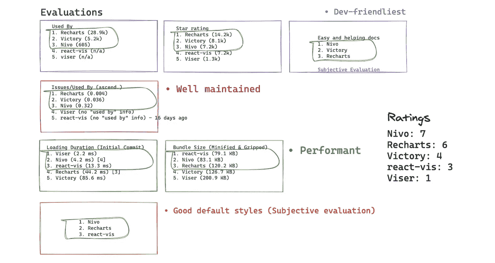

# React 数据可视化库的比较

> 原文：<https://medium.com/capital-one-tech/a-comparison-of-data-visualization-libraries-for-react-27f8fe409934?source=collection_archive---------1----------------------->

## Recharts、Nivo、Victory、react-vis 和 Viser 之间的异同

# TL；速度三角形定位法(dead reckoning)

基于 D3.js(也叫 D3，数据驱动文档的简称)构建的开源数据可视化库那么多；然而，没有一个资源真正全面地比较了专门为 React 提供的所有数据可视化库。

因此，在开始使用图表可视化数据的项目之前，我做了这项研究，以了解哪些 React 数据 viz 库最适合我的团队的需求。如果你知道围绕使用 D3 的问题并一起反应，跳到**数据 Viz 库的一般比较。**

# 黄金标准— D3

在进入我们的五个库之前，我想快速浏览一下 D3，它是数据库的黄金标准。 [D3](https://d3js.org/) 允许您将任意数据绑定到文档对象模型(DOM)，然后将数据驱动的转换应用到文档，以创建具有平滑过渡和交互的交互式 SVG 图表。

所以，等等！D3 听起来很棒，你称之为黄金标准，那么为什么不直接使用 D3 呢？好吧，如果您正在创建一个非常特殊的图表类型，而本文中的某个库没有提供，那么使用 D3 可能是有意义的。否则，使用其中一个库会让你的生活变得更容易，因为在 React 中使用 D3 会有问题！

# 在 React 中使用 D3 的问题

首先，如果你不知道如何使用 D3，学习和实现它将需要相当长的时间。它有数百种功能和自己独特的处理方式。学习如何在 React 中使用 D3 创建图表可能需要花费你数天时间，而使用现有的库可以在几分钟内创建相同的图表。

第二，D3 在 React 中使用时也引入了一些[难点。这些问题源于 React 和 D3 都操纵 DOM 这一事实。如果你使用 React 作为你的框架，很可能你会选择它，因为这个神奇的东西叫做*虚拟 DOM* ，它使 React 应用程序高效快速。这就是 D3 的问题所在。在 React 中编写应用程序的一个经验法则是，不应该直接处理真正的 DOM。当您在 React 中使用 D3 时，如果您利用它的 DOM 操作函数，您将会改变真正的 DOM，这意味着您放弃了 React 在性能和效率方面必须提供的所有功能。](https://www.smashingmagazine.com/2018/02/react-d3-ecosystem)

> React 和 D3 都是两个优秀的工具，它们的设计目标有时会发生冲突。两者都控制用户界面元素，并且以不同的方式控制。”—马科斯·伊格莱西亚斯， [*汇聚起 React，D3，以及他们的生态系统*](https://www.smashingmagazine.com/2018/02/react-d3-ecosystem/) *。*

虽然在 React 中使用 D3 并不是不可能的，并且有很多关于如何正确使用 D3 的讨论( [1](https://oli.me.uk/d3-within-react-the-right-way/) ， [2](https://www.smashingmagazine.com/2018/02/react-d3-ecosystem/#approaches) ， [3](/@tibotiber/react-d3-js-balancing-performance-developer-experience-4da35f912484) )，但是如果你正在创建一个使用通用图表类型的项目，使用普通 D3 之外的库可能是正确的选择。

[这里的](https://codesandbox.io/s/react-data-visualization-comparison-627nq?file=/src/charts/D3AreaChart.js)是我创建的堆叠面积图的代码片段，让你了解普通的 D3 如何在 React 中工作。所有的数学计算都由 D3 子模块完成，React 用于更新 DOM。

请将它与我放在下面的其他库的代码进行比较。请记住，与用下面的库创建的图表相比，这个图表没有工具提示，也没有响应。虽然您可以添加这些元素，甚至提供图表缩放或刷图功能，但这非常耗时，并且需要对 SVG/canvas 元素和 D3 有很好的理解。

# 数据库的一般比较

老实说，我不记得在 JavaScript 世界中遇到过其他有这么多库致力于此的主题。这就是为什么我受到启发去做这项研究。我是这样开始的:

# 我的消除和选择正确库的方法

## 研究

我搜索了许多列出 React 数据可视化库的网站，与正在创建数据可视化的同行进行了交谈，写下了一个长长的选项列表，并挑选了其中的五个进行深入研究。这五个分别是 ***雷查茨、胜利、尼沃、反应-维斯和维瑟。***

**表 1 —本次研究中选择的五个库的比较。** (此表创建于 2020 年 6 月。更新后的对比[见此处](https://www.npmtrends.com/recharts-vs-victory-vs-nivo-vs-react-vis-vs-viser-vs-react-timeseries-charts)。)

Created by author. ***Note:*** *Colors are relative to each library information listed here.* ******* *Recorded in June 2020* ******** *Total size occupied in node_modules directory after installing as a dependency* ********* *BundlePhobia results for minified+gzipped size and download time for 2G edge.*

## 比较

我通过我最关心的一些特征对它们进行了比较。这些特征是:

然后，我根据我想要的功能和使用案例对它们进行了评级:

*- Created by author.*

## 快速项目

我搭建了一个 create-react-app，并为每个库创建了一个堆积面积时间序列图表，来看看与它们一起工作有多难。你可以在这里看到该项目的沙盒。

# 雷查尔兹

[网站](https://recharts.org/en-US) | [Github](https://github.com/recharts/recharts)
SVG 渲染|响应式图表|可用类型|无缩放/画笔

## 突出

我注意到的关于 Recharts 的第一件事是它的简单、流畅的动画和受欢迎程度。我也对它现代的默认风格和流畅的工具提示印象深刻。此外，TypeScript (TS)是使用的主要语言，这意味着它带有类型定义；如果你的应用程序也是用 TS 写的，那就非常方便了。

Recharts 构建于 React 组件之上，React 组件生成 SVG 元素，用于呈现依赖于 D3 子模块的轻量级形状。所以，简单地说: *Recharts 用 D3 函数做一些数学计算，并使用 React 将它们绘制在视图中。*

## 证明文件

Recharts 有一个伟大的，简单的[指南](https://recharts.org/en-US/guide)部分，将带你通过最好的方式利用它所提供的。它还有一个示例页面，您可以在其中找到不同的示例图表、交互式编码框和 jsfiddle 链接，以及关于其组件的详细文档。您可以在 API 文档和示例页面中看到用于生成每个图表的数据形状。

## 编程风格

在这里找到 Github 要点。

*- Created by author.*

数据形状:

- Created by author.

结果:

*- recharts.org*

您在包装器组件中添加您需要的组件，并根据它们的属性对它们进行定制。它提供了一个用于创建响应图的 *ResponsiveContainer* 组件。

请参见比较应用[此处的](https://codesandbox.io/s/react-data-visualization-comparison-627nq)了解真实示例，以及**性能结果**了解该库在真实情况下的性能。

# 获胜

[网站](https://formidable.com/open-source/victory/) | [Github](https://github.com/formidablelabs/victory)
SVG 渲染|响应图表|可用类型|可用缩放/画笔

## 突出

自从我开始搜索 data-viz 库以来，我问的每个人都提到过一次胜利，如果不是两次的话。的确，它如此受欢迎是有原因的。Victory 是来自强大实验室公司的一个开源软件项目。检查他们的其他 [OSS 项目在这里](https://formidable.com/open-source/)。

也许从 Victory 获得的最大好处是它也可以在 React-Native 中使用，如果您的应用程序也可以作为移动应用程序使用，这将非常有用。这是我到目前为止发现的唯一一个对网络和移动应用程序都可用的库。

像大多数其他库一样，Victory 也利用 D3 子模块和 React 来更新视图，生成 SVG 元素来显示图表。

## 证明文件

尽管 Victory 拥有全面的文档，但与本文中的其他文档相比，它的文档还是有点难学。偶尔，我发现自己抓耳挠腮，琢磨着如何按照自己想要的方式创建一个定制的图表。有时，很难从 Victory 文档的不同部分收集我定制图表所需的所有信息。

## 编程风格

然而，Victory 的编码风格非常容易理解和遵循。它的声明性足以理解正在发生的事情，即使你对这个库一无所知。其逻辑是选择一个满足您需要的容器组件，并用所有必要的子组件填充它，以定制您的图表。每个组件还暴露出某些道具来进一步定制细节。

在这里找到 Github 的要点。

- Created by author.

数据形状:

- Created by author.

结果:

*formidable.com/open-source/victory/*

一个很棒的特性是它公开了以下组件，这使得创建刷动或缩放交互就像用这些组件中的一个包装你的图表一样简单:

*   **VictoryZoomContainer:** 为图表添加平移和缩放功能。
*   **victoryveronoicontainer:**将鼠标位置与最近的数据点相关联，对于工具提示和其他悬停交互非常有用。
*   **VictorySelectionContainer:**增加了在一个区域内选择点的功能。
*   **VictoryBrushContainer:** 向图表添加可移动的突出显示区域。
*   **VictoryCursorContainer:**呈现跟随鼠标位置的光标线和标签。

请参见比较应用[此处的](https://codesandbox.io/s/react-data-visualization-comparison-627nq)了解真实示例，以及**性能结果**了解该库在真实情况下的性能。

# Nivo

[网站](https://nivo.rocks/components) | [Github](https://github.com/plouc/nivo)
SVG、画布、服务器渲染|响应图表|部分可用的类型|无缩放/画笔

## 突出

正如它的网址所暗示的，Nivo 摇滚！这是一个健壮的、易于使用的、文档完善的、时尚的、高性能的库。然而，它也有一些缺点，比如没有所有部分的类型定义和缩放/刷功能。然而，这些功能正在积极开发中，这意味着我们应该很快就会拥有它们(见这里的[缩放](https://github.com/plouc/nivo/issues/31)，这里的[笔刷](https://github.com/plouc/nivo/issues/32)，这里的[类型](https://github.com/plouc/nivo/issues/32))。如果您不需要立即缩放或刷，或者如果您可以等待一些类型定义，Nivo 值得一看。

Nivo 再次使用 D3 进行计算，并让 React 更新视图。与其他的相比，它提供了三种不同的渲染选项。你可以选择在 **SVG** s 或 **canvas** 中渲染你的图形——如果你有大量数据的话——或者你可以使用**同构渲染**。服务器端渲染是 Nivo 的独特之处，它甚至为大多数图表提供了一个 **HTTP 渲染 API** 。

## 证明文件

Nivo 有详尽的文档，你可以为所选的图表组件调整所有的道具，并在文档中构建你想要的东西。您还可以清楚地观察特定图表应该使用什么数据形状。作为开发人员，您唯一要做的就是在 component playground 中创建图表后，复制/粘贴您需要的代码，并将您自己的数据传递给应用程序中的代码。在文档示例中找不到您确切需要的内容？嗯，他们也有很多不同情况下的故事书例子，你可以从中获得所需的代码。

## 编程风格

Nivo 的编码风格与众不同。在 Nivo 图表中，你实际上只有一个组件，并有许多道具来调整它的外观，而不是用一个容器组件来包装许多不同的子元素。

在这里找到 Github 的要点。

*- Created by author.*

数据形状:

*- Created by author.*

结果:

*-* [*www.nivo.rocks*](http://www.nivo.rocks)

此外，与其他图表相比，Nivo 图表的初始渲染速度明显更快(参见**性能比较**部分)。

给打算使用 Nivo 的开发人员一个快速提示，[如果您使用的是响应式图表，不要忘记为图表周围的包装元素定义一个高度](https://nivo.rocks/faq)值。

查看对比应用[此处](https://codesandbox.io/s/react-data-visualization-comparison-627nq)获取真实示例，查看**性能结果**获取该库在真实情况下的评测性能。

# 对…做出反应

[网站](https://uber.github.io/react-vis/) | [Github](https://github.com/uber/react-vis)
SVG，画布渲染|响应图表|可用类型|缩放/画笔可用

## 突出

React-vis 是一个简单而强大的库，最初是为了支持优步的内部工具而构建的。登陆 react-vis 网站，它用一组令人印象深刻的交互式图表欢迎你。

## 证明文件

React-vis 有相对较好的文档，可以带您快速完成使用 react-vis 的基本步骤，让您在几分钟内创建一个简单的图表。我认为用 react-vis 搭建一个简单的图表是非常容易的。然而，一旦你深入细节并开始定制它，找到你需要的就有点困难了。令人欣慰的是，他们还分享了一本故事书，这样你就可以找到不同图表示例的代码片段。

React-vis 也是 D3 子模块和后台 React 的组合。

## 编程风格

他们编写组件的方式也很独特。即使你有一个容器和一堆子元素，容器总是 XYPlot。您选择图表组件(他们称之为系列),并将其放入 XYPlot 中。然后，将轴和其他小部件作为子部件添加。

在这里找到 Github 要点。

*- Created by author.*

*- Created by author.*

*- uber.github.io/react-vis/*

请参见比较应用[此处的](https://codesandbox.io/s/react-data-visualization-comparison-627nq)了解真实示例，以及**性能结果**了解该库在真实情况下的性能。

# Viser

[网站](https://viserjs.gitee.io/) | [Github](https://github.com/viserjs/viser)
画布渲染|可用类型|可用缩放/画笔

## 突出

Viser 是一个很有前途的可视化库，支持三个最流行的框架——React、Vue 和 Angular。它的用户群比名单上的其他人要小，我认为它是一个真正有价值的库，有许多有用的特性。

## 证明文件

虽然 Viser 文档的某些部分是用中文写的，这对说英语的读者来说帮助不大，但是它有一个很棒的演示页面，在那里你可以找到大多数问题的答案。演示页面有一个交互式编码框，您可以在其中观察代码以及形成图形的数据。您也可以更改并再次运行代码来查看更改。然后，你所做的就是复制粘贴！

与本文中研究的其他库不同，Viser 构建在 [G2](https://g2.antv.vision/en) 之上——一种高度交互式的数据驱动的统计图表可视化语法——而不是 D3。关于 Viser 需要记住的一点是，它呈现**画布**元素(而不是其他现成的 SVG 元素)。

## 编程风格

在这里找到 Github 要诀[。](https://gist.github.com/eggei/8553e69f20e3d03d3cbff82140c2b5b6)

*- Created by author.*

*- Created by author.*

*- viserjs.github.io/*

查看对比应用[此处的](https://codesandbox.io/s/react-data-visualization-comparison-627nq)了解真实示例，查看**性能结果**了解该库在真实情况下的性能。

# 数据(即库)的性能分析器结果

下面是概要分析器的图表结果。

- *Created by author.*

因为 React Profiler 中有很多信息需要比较，所以我不会详细讨论渲染持续时间。根据第一次渲染的火焰图，图表从最快到最慢的顺序是:

1.  nivo(2.5 毫秒)
2.  viser(3.4 毫秒)
3.  反应-可见(16.4 毫秒)
4.  充电(64.7 毫秒)
5.  胜利(138.5 毫秒)

如果您想在这里深入了解细节并亲自观察分析器，以下是生成此火焰图的步骤:

*   在这里进入对比项目[的分离版本。](https://codesandbox.io/s/react-data-visualization-comparison-627nq)
*   打开 devtools 并导航到 Profiler 选项卡。(如果 Profiler 选项卡不可用，请从 Chrome 扩展商店安装 React dev 工具。)
*   单击“重新加载并开始分析”按钮。这将触发刷新。

*- Created by author.*

*   app **完全**刷新后，点击红色的“停止剖析”按钮。

*- Created by author.*

# 结论

自 2011 年发布以来，D3 已经通过其数百个数学函数和 DOM 操作函数帮助开发人员轻松地可视化数据。不久之后，在 2013 年，React 发布了，使得更新 DOM 变得快速而简单，释放了许多新的可能性。在 React 工作的开发人员很快意识到驯服 D3 并让它与 React 和睦相处并不那么容易。因此，React 数据可视化库生态系统活跃起来，使得通过可重用的 React 组件轻松、快速地创建数据可视化成为可能。

最后，我们来到了 2020 年，对五个伟大的 React 数据可视化库进行了比较。它们都有很棒的文档，有许多可重复使用的图表示例，有一种很棒的反应式编码方式，让你有宾至如归的感觉，还有一个巨大的支持社区，确保你永远不会失望。因此，这些库使得编码数据可视化变得有趣和容易，并且高效、可维护、可重用、一致和易读。

**标题图像:freepik.com*

*披露声明:2020 首创一号。观点是作者个人的观点。除非本帖中另有说明，否则 Capital One 不隶属于所提及的任何公司，也不被这些公司认可。使用或展示的所有商标和其他知识产权是其各自所有者的财产。*

【https://www.capitalone.com】最初发表于**。**