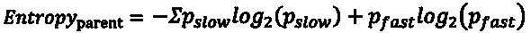

# 探索如何在 R 中实际应用决策树算法

> 原文：<https://medium.com/edureka/a-complete-guide-on-decision-tree-algorithm-3245e269ece?source=collection_archive---------1----------------------->


Decision Tree Algorithm - Edureka

随着解决行业级问题的机器学习算法的实现越来越多，对更复杂的迭代算法的需求已经成为一种需要。决策树算法就是这样一种用于解决回归和分类问题的算法。

在这篇关于决策树算法的文章中，您将学习决策树的工作原理，以及如何实现它来解决现实世界中的问题。本文将涵盖以下主题:

1.  为什么选择决策树？
2.  什么是决策树？
3.  决策树算法是如何工作的？
4.  构建决策树
5.  用 R 语言实现决策树算法

我们都知道有 n 种机器学习算法可以用于分析，那么为什么要选择决策树呢？在下面的部分，我列出了几个原因。

# 为什么选择决策树算法？

决策树被认为是最有用的机器学习算法之一，因为它可以用来解决各种问题。以下是您应该使用决策树的几个原因:

1.  它被认为是最容易理解的机器学习算法，可以很容易地解释。
2.  它可用于分类和回归问题。
3.  与大多数机器学习算法不同，它可以有效地处理非线性数据。
4.  构建决策树是一个非常快速的过程，因为它只使用每个节点一个特征来分割数据。

# 什么是决策树算法？

决策树是一种有监督的机器学习算法，看起来像一棵倒置的树，其中每个节点代表一个**预测变量**(特征)，节点之间的链接代表一个**决策**，每个叶子节点代表一个**结果**(响应变量)。

为了更好地理解决策树，让我们看一个例子:

假设你举办了一个大型聚会，你想知道你的客人中有多少人是非素食者。为了解决这个问题，让我们创建一个简单的决策树。


在上图中，我创建了一个决策树，将客人分为素食者和非素食者。每个节点代表一个预测变量，这将有助于断定一个客人是否是非素食者。当你沿着树向下遍历时，你必须在每个节点做出决定，直到你到达一个死胡同。

现在你知道了决策树的逻辑，让我们定义一组与决策树相关的术语。

# 决策树的结构


决策树具有以下结构:

*   **根节点:**根节点是一棵树的起点。此时，将执行第一次拆分。
*   **内部节点:**每个内部节点代表一个最终导致预测结果的决策点(预测变量)。
*   **叶/终端节点:**叶节点代表结果的最后一类，因此它们也被称为终端节点。
*   **分支:**分支是节点之间的连接，用箭头表示。每个分支代表一个响应，如“是”或“否”

这就是决策树的基本结构。现在让我们试着理解决策树的工作流程。

# 决策树算法是如何工作的？

决策树算法遵循以下步骤:

**步骤 1:** 选择最能把数据集分类到所需类别的特征(预测变量)，并将该特征分配给根节点。
**步骤 2:** 从根节点向下遍历，同时在每个内部节点做出相关决策，使得每个内部节点对数据进行最佳分类。
**第 3 步:**返回第 1 步并重复，直到您为输入数据指定一个类别。

上述步骤代表了用于分类目的的决策树的一般工作流程。

现在让我们试着理解决策树是如何创建的。

# 使用 ID3 算法构建决策树

有许多方法可以建立一个决策树，在这篇文章中，我们将关注如何使用 ID3 算法来创建一个决策树。

## ID3 算法是什么？

ID3 或迭代二分法 3 算法是用于构建决策树的最有效的算法之一。它使用*熵*和*信息增益*的概念为给定的数据集生成决策树。

## **ID3 算法:**

ID3 算法遵循以下工作流程来构建决策树:

1.  选择**最佳属性** (A)
2.  指派一个作为根节点的决策变量。
3.  对于的每个值，生成该节点的后代。
4.  将分类标签分配给叶节点。
5.  如果数据分类正确:停止。
6.  否则:遍历树。

该算法的第一步规定我们必须选择最佳属性。那是什么意思？

*最佳属性(预测变量)是最有效地将数据集分成不同类别的属性，或者是最佳分割数据集的特征。*

现在你脑海中的下一个问题一定是，“我如何决定哪个变量/特征最好地分割数据？”

使用两种方法来确定最佳属性:

1.  信息增益
2.  熵

## 熵是什么？

熵测量数据中存在的杂质或不确定性。它用于决定决策树如何拆分数据。

## **熵的方程式:**


## 什么是信息增益？

信息增益(IG)是用于构建决策树的最重要的度量。它表明一个特定的特征/变量给了我们多少关于最终结果的“信息”。

信息增益很重要，因为它用来选择在决策树的每个节点上最好地分割数据的变量。具有最高 IG 的变量用于在根节点拆分数据。

## **信息增益(IG)方程:**


为了更好地理解如何使用信息增益和熵来创建决策树，让我们看一个例子。下面的数据集代表了基于某些参数的汽车速度。


你的问题陈述是研究这个数据集并创建一个决策树，根据以下预测变量将汽车速度(响应变量)分为慢或快:

*   道路类型
*   障碍
*   速度限制

我们将使用这些变量构建一个决策树，以预测汽车的速度。正如我前面提到的，我们必须首先决定一个能最好地分割数据集的变量，并将该变量分配给根节点，并对其他节点重复同样的操作。

此时，您可能想知道如何知道哪个变量最好地分隔了数据？答案是，具有最高信息增益的变量最好地将数据划分到所需的输出类中。

因此，让我们从计算每个预测变量的熵和信息增益(IG)开始，从“道路类型”开始。

在我们的数据集中，“道路类型”列中有四个观察值，对应于“汽车速度”列中的四个标签。我们将从计算父节点的熵(汽车的速度)开始。

第一步是找出父节点中存在的两个类的比例。我们知道父节点中总共有四个值，其中两个样本属于“慢”类，另外两个属于“快”类，因此:

*   p(慢)->父节点中“慢”结果的分数
*   p(快速)->父节点中“快速”结果的分数

计算 P(慢)的公式为:

*p(慢)=父节点中“慢”结果的数量/结果总数*


同样，计算 P(fast)的公式为:

*p(快速)=父节点中“快速”结果的数量/结果总数*


因此，父节点的熵为:



*熵(父)=—{ 0.5 log2(0.5)+0.5 log2(0.5)} =—{-0.5+(-0.5)} = 1*

现在我们知道父节点的熵是 1，让我们看看如何计算“道路类型”变量的信息增益。请记住，如果“道路类型”变量的信息增益大于所有其他预测变量的信息增益，则只能使用“道路类型”变量来分割根结点。

为了计算“道路类型”变量的信息增益，我们首先需要通过“道路类型”变量来拆分根节点。


在上图中，我们使用“道路类型”变量分割了父节点，子节点表示数据集中显示的相应响应。现在，我们需要测量子节点的熵。

右侧子节点(fast)的熵是 0，因为该节点中的所有结果都属于一个类(fast)。以类似的方式，我们必须找到左手边节点的熵(慢，慢，快)。

在这个节点中，有两种类型的结果(快速和慢速)，因此，我们首先需要计算这个特定节点的慢速和快速结果的比例。

*P(慢)= 2/3 = 0.667*T2*P(快)= 1/3 = 0.334*

因此，熵是:

*熵(左子节点)=-{ 0.667 log2(0.667)+0.334 log2(0.334)} =-{-0.38+(-0.52)}*
*= 0.9*

我们的下一步是用加权平均计算熵(子代):

*   父节点中的结果总数:4
*   左侧子节点中的结果总数:3
*   右子节点中的结果总数:1

***用加权平均值求熵(子代)的公式。:***

> [加权平均]熵(子节点)=(左侧子节点的结果数)/(父节点的结果总数)*(左侧节点的熵)+(右侧子节点的结果数)/(父节点的结果总数)*(右侧节点的熵)

通过使用上面的公式你会发现，熵(儿童)与加权平均。is = 0.675

我们的最后一步是将上述加权平均值代入 IG 公式，以计算“道路类型”变量的最终 IG:


因此，

*信息增益(道路类型)= 1–0.675 = 0.325*

*道路类型特征的信息增益为* 0.325。

就像我前面提到的，决策树算法选择信息增益最高的变量来拆分决策树。因此，通过使用上述方法，您需要计算所有预测变量的信息增益，以检查哪个变量具有最高的 IG。

因此，通过使用上述方法，您必须获得每个预测变量的以下值:

1.  *信息增益(道路类型)= 1–0.675 = 0.325*
2.  *信息增益(阻碍)= 1–1 = 0*
3.  *信息增益(限速)= 1–0 = 1*

因此，这里我们可以看到“速度限制”变量具有最高的信息增益。因此，该数据集的最终决策树是使用“速度限制”变量构建的。


现在您已经知道了决策树是如何创建的，让我们运行一个简短的演示，通过实现决策树来解决一个现实世界中的问题。

# R-决策树算法实例中决策树的实现

## **问题陈述:**

研究蘑菇数据集，以预测给定的蘑菇对人类是可食用的还是有毒的。

## **数据集描述:**

给定的数据集包含总共 8124 个不同种类蘑菇的观察结果及其属性，如气味、栖息地、种群等。下面的演示展示了数据集的更深入的结构。

## **逻辑:**

建立决策树模型，通过研究蘑菇样品的气味、根、栖息地等属性，将蘑菇样品分类为有毒或可食用。

现在你知道了这个演示的目的，让我们开动脑筋，开始编码吧。对于这个演示，我将使用 R 语言来构建模型。

**步骤 1:** 安装并加载库

```
#Installing libraries
install.packages('rpart')
install.packages('caret')
install.packages('rpart.plot')
install.packages('rattle')

#Loading libraries
library(rpart,quietly = TRUE)
library(caret,quietly = TRUE)
library(rpart.plot,quietly = TRUE)
library(rattle)
```

**第二步:**导入数据集

```
#Reading the data set as a dataframe
mushrooms <- read.csv ("/Users/zulaikha/Desktop/decision_tree/mushrooms.csv")
```

现在，要显示数据集的结构，可以使用名为 str()的 R 函数:

```
# structure of the data
> str(mushrooms)
'data.frame': 8124 obs. of 22 variables:
$ class : Factor w/ 2 levels "e","p": 2 1 1 2 1 1 1 1 2 1 ...
$ cap.shape : Factor w/ 6 levels "b","c","f","k",..: 6 6 1 6 6 6 1 1 6 1 ...
$ cap.surface : Factor w/ 4 levels "f","g","s","y": 3 3 3 4 3 4 3 4 4 3 ...
$ cap.color : Factor w/ 10 levels "b","c","e","g",..: 5 10 9 9 4 10 9 9 9 10 ...
$ bruises : Factor w/ 2 levels "f","t": 2 2 2 2 1 2 2 2 2 2 ...
$ odor : Factor w/ 9 levels "a","c","f","l",..: 7 1 4 7 6 1 1 4 7 1 ...
$ gill.attachment : Factor w/ 2 levels "a","f": 2 2 2 2 2 2 2 2 2 2 ...
$ gill.spacing : Factor w/ 2 levels "c","w": 1 1 1 1 2 1 1 1 1 1 ...
$ gill.size : Factor w/ 2 levels "b","n": 2 1 1 2 1 1 1 1 2 1 ...
$ gill.color : Factor w/ 12 levels "b","e","g","h",..: 5 5 6 6 5 6 3 6 8 3 ...
$ stalk.shape : Factor w/ 2 levels "e","t": 1 1 1 1 2 1 1 1 1 1 ...
$ stalk.root : Factor w/ 5 levels "?","b","c","e",..: 4 3 3 4 4 3 3 3 4 3 ...
$ stalk.surface.above.ring: Factor w/ 4 levels "f","k","s","y": 3 3 3 3 3 3 3 3 3 3 ...
$ stalk.surface.below.ring: Factor w/ 4 levels "f","k","s","y": 3 3 3 3 3 3 3 3 3 3 ...
$ stalk.color.above.ring : Factor w/ 9 levels "b","c","e","g",..: 8 8 8 8 8 8 8 8 8 8 ...
$ stalk.color.below.ring : Factor w/ 9 levels "b","c","e","g",..: 8 8 8 8 8 8 8 8 8 8 ...
$ veil.color : Factor w/ 4 levels "n","o","w","y": 3 3 3 3 3 3 3 3 3 3 ...
$ ring.number : Factor w/ 3 levels "n","o","t": 2 2 2 2 2 2 2 2 2 2 ...
$ ring.type : Factor w/ 5 levels "e","f","l","n",..: 5 5 5 5 1 5 5 5 5 5 ...
$ spore.print.color : Factor w/ 9 levels "b","h","k","n",..: 3 4 4 3 4 3 3 4 3 3 ...
$ population : Factor w/ 6 levels "a","c","n","s",..: 4 3 3 4 1 3 3 4 5 4 ...
$ habitat : Factor w/ 7 levels "d","g","l","m",..: 6 2 4 6 2 2 4 4 2 4 ...
```

输出显示了许多用于预测蘑菇输出类别(有毒或可食用)的预测变量。

**第三步:**数据清洗

在这个阶段，我们必须寻找任何空值或缺失值以及不必要的变量，以便我们的预测尽可能准确。在下面的代码片段中，我删除了“veil.type”变量，因为它对结果没有影响。这种不一致和冗余数据必须在这一步得到解决。

```
# number of rows with missing values
nrow(mushrooms) - sum(complete.cases(mushrooms))

# deleting redundant variable `veil.type`
mushrooms$veil.type <- NULL
```

**第四步:**数据探索与分析

为了更好地理解 21 个预测变量，我为每个预测变量与类别类型(响应/结果变量)创建了一个表，以了解特定的预测变量对于检测输出是否重要。

我只显示了“气味”变量的表格，您可以按照下面的代码片段为每个变量创建一个表格:

```
# analyzing the odor variable
> table(mushrooms$class,mushrooms$odor)
a      c      f       l       m       n       p        s      y
e   400     0      0     400     0    3408    0       0      0
p   0      192   2160  0      36     120    256  576  576
```

在上面的片段中，“e”代表可食用类，“p”代表蘑菇的有毒类。

上面的输出显示气味值为' c '，' f '，' m '，' p '，' s '和' y '的蘑菇明显有毒。并且具有杏仁气味(400)的蘑菇是可食用的。这样的观察将帮助我们更准确地预测输出类。

我们在数据探索阶段的下一步是预测哪个变量是分裂决策树的最佳变量。出于这个原因，我绘制了一个图表，表示 21 个变量中每个变量的分割，输出如下所示:

```
number.perfect.splits <- apply(X=mushrooms[-1], MARGIN = 2, FUN = function(col){
t <- table(mushrooms$class,col)
sum(t == 0)
})

# Descending order of perfect splits
order <- order(number.perfect.splits,decreasing = TRUE)
number.perfect.splits <- number.perfect.splits[order]

# Plot graph
par(mar=c(10,2,2,2))
barplot(number.perfect.splits,
main="Number of perfect splits vs feature",
xlab="",ylab="Feature",las=2,col="wheat")
```


输出结果表明,“气味”变量在预测蘑菇的输出类别中起着重要作用。

**第五步:**数据拼接

数据拼接是将数据拆分为训练集和测试集的过程。训练集用于构建决策树模型，测试集用于验证模型的效率。拆分是在下面的代码片段中执行的:

```
#data splicing
set.seed(12345)
train <- sample(1:nrow(mushrooms),size = ceiling(0.80*nrow(mushrooms)),replace = FALSE)
# training set
mushrooms_train <- mushrooms[train,]
# test set
mushrooms_test <- mushrooms[-train,]
```

为了使这个演示更有趣，并尽量减少误分类为可食用的毒蘑菇的数量，我们将指定一个比由于显而易见的原因将可食用蘑菇分类为有毒的惩罚大 10 倍的惩罚。

```
# penalty matrix
penalty.matrix <- matrix(c(0,1,10,0), byrow=TRUE, nrow=2)
```

**第六步:**建立模型

在此阶段，我们将使用 rpart(递归分区和回归树)算法构建一个决策树:

```
# building the classification tree with rpart
tree <- rpart(class~.,
data=mushrooms_train,
parms = list(loss = penalty.matrix),
method = "class")
```

**第七步:**观想树

在这一步中，我们将使用 rpart.plot 库来绘制最终的决策树:

```
# Visualize the decision tree with rpart.plot
rpart.plot(tree, nn=TRUE)
```


**第八步:**测试模型

现在，为了测试我们的决策树模型，我们将对我们的模型应用测试数据集，如下所示:

```
#Testing the model
pred <- predict(object=tree,mushrooms_test[-1],type="class")
```

**第九步:**计算精度

我们将使用混淆矩阵来计算模型的准确性。代码如下:

```
#Calculating accuracy
t <- table(mushrooms_test$class,pred) > confusionMatrix(t)
Confusion Matrix and Statistics

pred
e      p
e  839    0
p  0     785

Accuracy : 1
95% CI : (0.9977, 1)
No Information Rate : 0.5166
P-Value [Acc > NIR] : < 2.2e-16

Kappa : 1
Mcnemar's Test P-Value : NA

Sensitivity : 1.0000
Specificity : 1.0000
Pos Pred Value : 1.0000
Neg Pred Value : 1.0000
Prevalence : 0.5166
Detection Rate : 0.5166
Detection Prevalence : 0.5166
Balanced Accuracy : 1.0000

'Positive' Class : e
```

输出显示测试数据集中的所有样本都已被正确分类，我们在测试数据集上获得了 100%的准确率，置信区间为 95%(0.9977，1)。因此，我们可以使用决策树模型正确地将蘑菇分类为有毒或可食用。

所以，就这样，我们到了这篇文章的结尾。我希望你们都觉得这篇文章内容丰富。

如果你想查看更多关于 Python、DevOps、Ethical Hacking 等市场最热门技术的文章，那么你可以参考 [Edureka 的官方网站。](https://www.edureka.co/blog/?utm_source=medium&utm_medium=content-link&utm_campaign=decision-tree-algorithm)

请留意本系列中的其他文章，它们将解释数据科学的各个方面。

> *1。* [*数据科学教程*](/edureka/data-science-tutorial-484da1ff952b)
> 
> *2。* [*数据科学的数学与统计*](/edureka/math-and-statistics-for-data-science-1152e30cee73)
> 
> *3。*[*R 中的线性回归*](/edureka/linear-regression-in-r-da3e42f16dd3)
> 
> *4。* [*数据科学教程*](/edureka/data-science-tutorial-484da1ff952b)
> 
> *5。*[*R 中的逻辑回归*](/edureka/logistic-regression-in-r-2d08ac51cd4f)
> 
> *6。* [*分类算法*](/edureka/classification-algorithms-ba27044f28f1)
> 
> *7。* [*随机森林中的 R*](/edureka/random-forest-classifier-92123fd2b5f9)
> 
> *8。*[*5 大机器学习算法*](/edureka/machine-learning-algorithms-29eea8b69a54)
> 
> *9。* [*机器学习入门*](/edureka/introduction-to-machine-learning-97973c43e776)
> 
> 10。 [*朴素贝叶斯在 R*](/edureka/naive-bayes-in-r-37ca73f3e85c)
> 
> *11。* [*统计与概率*](/edureka/statistics-and-probability-cf736d703703)
> 
> *12。* [*如何创建一个完美的决策树？*](/edureka/decision-trees-b00348e0ac89)
> 
> 13。 [*关于数据科学家角色的 10 大误区*](/edureka/data-scientists-myths-14acade1f6f7)
> 
> *14。* [*顶级数据科学项目*](/edureka/data-science-projects-b32f1328eed8)
> 
> 15。 [*数据分析师 vs 数据工程师 vs 数据科学家*](/edureka/data-analyst-vs-data-engineer-vs-data-scientist-27aacdcaffa5)
> 
> *16。* [*人工智能的种类*](/edureka/types-of-artificial-intelligence-4c40a35f784)
> 
> *17。*[*R vs Python*](/edureka/r-vs-python-48eb86b7b40f)
> 
> *18。* [*人工智能 vs 机器学习 vs 深度学习*](/edureka/ai-vs-machine-learning-vs-deep-learning-1725e8b30b2e)
> 
> *19。* [*机器学习项目*](/edureka/machine-learning-projects-cb0130d0606f)
> 
> *20。* [*数据分析师面试问答*](/edureka/data-analyst-interview-questions-867756f37e3d)
> 
> *21。* [*面向非程序员的数据科学和机器学习工具*](/edureka/data-science-and-machine-learning-for-non-programmers-c9366f4ac3fb)
> 
> *22。* [*十大机器学习框架*](/edureka/top-10-machine-learning-frameworks-72459e902ebb)
> 
> *23。* [*用于机器学习的统计*](/edureka/statistics-for-machine-learning-c8bc158bb3c8)
> 
> *24。* [*随机森林中的 R*](/edureka/random-forest-classifier-92123fd2b5f9)
> 
> *25。* [*广度优先搜索算法*](/edureka/breadth-first-search-algorithm-17d2c72f0eaa)
> 
> *26。*[*R 中的线性判别分析*](/edureka/linear-discriminant-analysis-88fa8ad59d0f)
> 
> 27。 [*机器学习的先决条件*](/edureka/prerequisites-for-machine-learning-68430f467427)
> 
> 28。 [*互动 WebApps 使用 R 闪亮*](/edureka/r-shiny-tutorial-47b050927bd2)
> 
> *29。* [*十大机器学习书籍*](/edureka/top-10-machine-learning-books-541f011d824e)
> 
> 三十岁。 [*无监督学习*](/edureka/unsupervised-learning-40a82b0bac64)
> 
> *31.1* [*0 最佳数据科学书籍*](/edureka/10-best-books-data-science-9161f8e82aca)
> 
> 32。 [*监督学习*](/edureka/supervised-learning-5a72987484d0)

*原载于 2019 年 3 月 15 日 www.edureka.co*[](https://www.edureka.co/blog/decision-tree-algorithm/)**。**