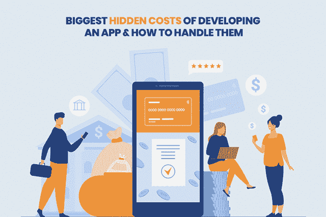
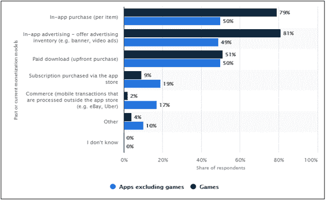
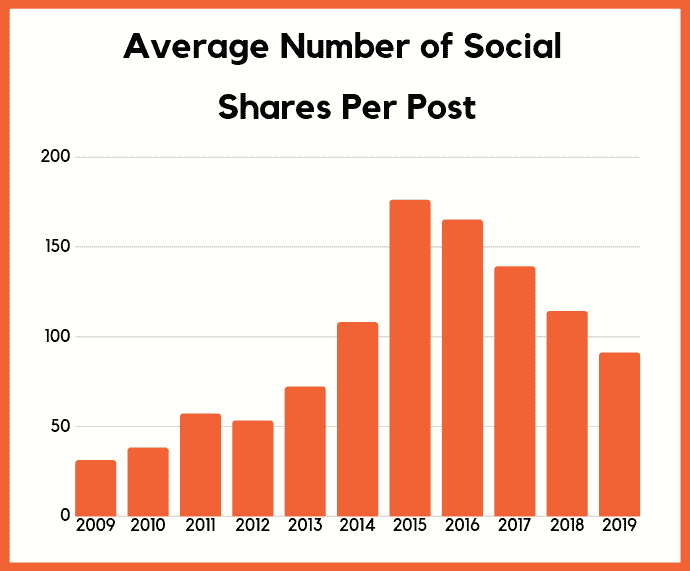
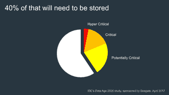
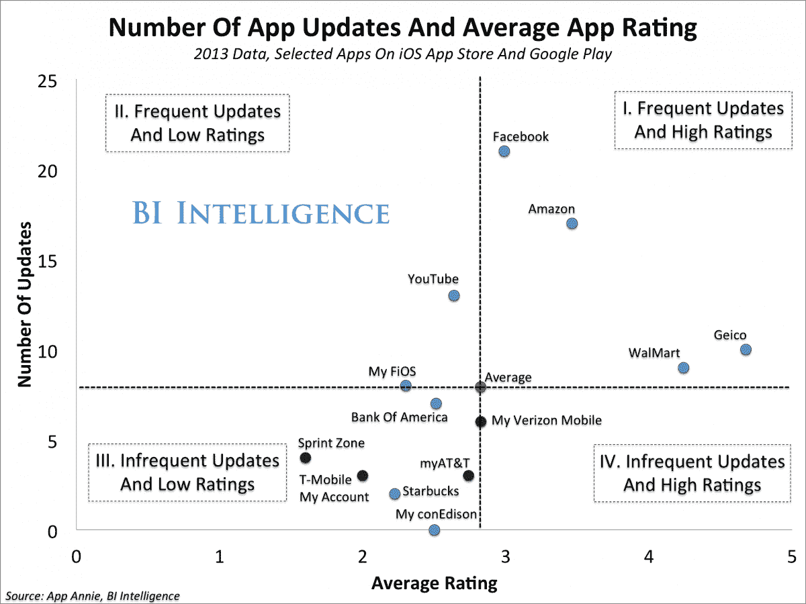
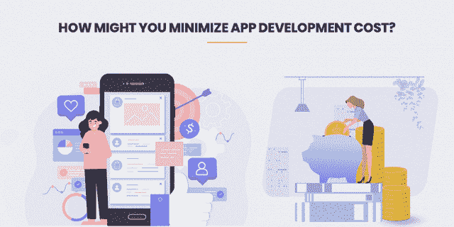
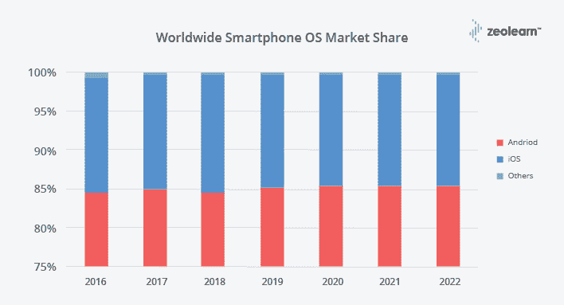
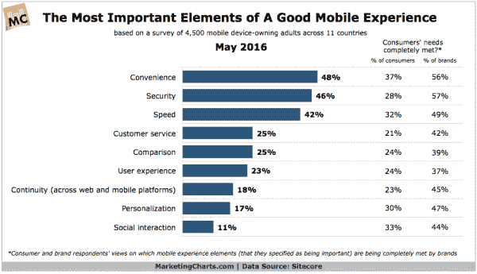

# 开发应用程序时如何处理隐藏成本的完整指南

> 原文：<https://medium.com/quick-code/a-complete-guide-on-how-to-handle-hidden-cost-while-developing-an-app-9881489cd007?source=collection_archive---------1----------------------->

移动应用在商业世界中是众所周知的。随着手机客户端数量的快速增长，许多组织正在构建移动应用程序来支持交易和收入。移动应用程序的改进是为手机构建多功能应用程序的途径。

由于多功能应用风险投资的快速发展，越来越多的商业和应用程序开发公司和组织开始理解应用程序对其业务的重要性。然而，这些组织中有一部分根本不考虑应用程序改进的真正成本。

> 根据福布斯报道 的 [**显示，应用程序开发者对货币化模式的使用大幅上升。去年，在 2017 年，49%的应用程序开发者选择了应用内广告(针对非游戏应用)，79 %的人选择了游戏应用的应用内购买商品。**](https://www.statista.com/statistics/297024/most-popular-mobile-app-monetization-models/)

(Source: [**Statista**](https://www.statista.com/statistics/297024/most-popular-mobile-app-monetization-models/))

开发一个移动应用程序可能成本高昂，雇佣应用程序开发人员的过程也会增加成本。完全可以预计花费会比预期的多。在这篇文章中，我将向您概述移动应用程序发展中可能隐藏的费用。

关键是理解移动应用开发生命周期的各个阶段。许多人忽略了应用程序的改进不仅仅是事件或编码的转变。这只是更大事物的一瞥。

> **整个应用程序生命周期由五个阶段组成——系统/安排、计划、推进、发送和维护，每个阶段都具有重要的进展意义。**

习惯性的移动应用程序改进可能过高、缓慢且令人失望。开发一个应用需要多少钱？一个单独的申请推进和发送可能花费任何地方在$50，000 和$1，000，000 的范围内，并且可能花费一年的大部分时间到一年以上来完成。

> **各种隐性支出**

移动应用程序开发的隐藏费用可以分为四类:

*   **职能费用**
*   **管理费用**
*   **基础设施成本**
*   **IT 支持成本**

## 让我们深入到这些分类中的每一个，看看**构建一个移动应用程序的隐藏成本以及如何防止它们。**

## **1。功能服务**

这些管理帮助您在移动应用程序中执行一些基本功能。

自 2015 年以来，一篇博文从社交网络获得的分享量一直在下降。社交网站压制有机接触的一个重要原因是，这使得你需要花钱来获得你曾经习惯并依赖来产生流量的接触。

**(Source:** [**Neil Patel**](https://neilpatel.com/blog/social-media-trends/)**)**

推进小组将构建这些亮点的大部分，然而你可能同样需要为信息传递工具购买外部管理。

*   **弹出消息:**这些是在终端客户的小工具上弹出的限时消息。消息弹出窗口是令人难以置信的便携式应用程序亮点之一。他们用你的多功能应用程序吸引客户，并敦促他们执行明确的活动，例如，购买。

> 您可以利用 Amazon SNS、OneSignal 或 Urban Airship 等管理工具在应用程序中支持消息弹出。

大多数推送通知管理是免费的，但是如果你需要推送能力，你可能需要额外花费 1000 到 1500 美元。

*   **短信:**如果你需要在应用程序中加入短信通知甚至语音通话功能，你应该购买 Twilio 或 Teli.net 等管理机构的服务。这些管理部门每年的费用可能从 300 美元到 500 美元不等。

社交、聊天或应用程序内消息传递:您可以利用这些管理来允许客户访问不同的个人。这些亮点有助于增强客户之间的社交合作，并改善客户体验。

> 您可以利用 SendBird 这样的管理工具来授权私人或收集谈话要点。每年的费用可达 1200 美元。

## **2。管理费用**

管理应用程序可以为您提供一致的信息访问，因此您可以更新应用程序的内容并监督客户，而无需联系 IT 部门。此类监管管理的费用很难预测，并且主要依赖于您正在创建的移动应用程序的类型。这些费用包括，你需要持续支付这些费用。

这些设备的质量包括给予组织接口以包括新的库存、API 或 SDK、在卡车中存储东西的方法以及比较亮点。这包括开发移动应用程序的一些最高隐藏成本。缺点是你会受到他们的工作流程和定制的限制。

管理应用费用还需要各种管理接口。减少随需应变阶段开销的最佳方式是消除包含的常规功能列表。例如，在做广告审批时，您可以删除应用程序中的部分或监管界面。

> **类型**:按需
> 
> **成本**:10 万美元到 150 万美元
> 
> **车型**:优步，Instacart，Postmates

## **3。基础设施服务**

由于现在有 37 亿人使用互联网，每天都会产生大约 2.5 万亿字节的数据，存储这些数据变得非常重要。

**(Source:** [**Digital Trends**](https://www.digitaltrends.com/cool-tech/dna-data-catalog-startup/)**)**

这些是基本的基础设施部分，它们拥有移动应用程序，并鼓励信息移动。万一您需要存储客户数据或通过您的移动应用程序提供某些数据，您需要一个像样的质量基础管理。

*   **服务器:**服务器是你移动应用便利化的地方，也是信息收起的地方。如果你正在构建一个小型或中等规模的移动应用程序，你可以将促进重新分配给第三方促进供应商，例如亚马逊、Azure 或谷歌。服务器和信息储存每年的成本可能高达 10，000 到 12，000 美元。
*   **CDN(内容交付网络):**如果你在世界各地都有客户，你应该把你的应用和 CDN 结合起来。CDN 也被称为内容分发网络，它是一个地理上循环的服务器系统，根据客户的区域为您的移动应用提供内容。CDN 的目标是为管理部门提供精英和高度的可访问性。一个普通的 CDN 管理可能每年花费你大约 2500 到 3500 美元。

## **4。信息技术支持成本**

构建移动应用程序是一个连续的过程。组织应该应用安全补丁、修复缺陷、随着新操作系统的到来对应用程序进行更改(包括新的亮点),并为客户提供帮助。

> 移动应用程序开发公司在规划移动应用程序改进时，可能需要考虑进行专业帮助的费用:

*   **操作系统更新:**编程更新意义重大，因为它们经常将基本补丁整合到安全漏洞中。他们同样可以提高你的产品的稳定性，并驱逐过时的亮点。这些更新旨在让客户体验更好**。**谷歌和苹果继续改善他们的基础，随着每一次新的更新，他们要求应用程序坚持他们更新的规则。保持应用程序更新的年度费用可能高达 12，000 美元。

**(Source:** [**Hidden Brains**](https://www.hiddenbrains.com/blog/how-frequently-should-you-roll-out-mobile-app-updates.html)**)**

*   **编程接口更新:**应用编程接口(API)是一个处理接口，它表征了众多产品代理之间的连接。它描述了可以打电话或提出要求的种类、如何打电话、应该利用的信息安排、接下来的节目等等。

> 它同样可以提供扩展组件，目标是客户可以以不同的方式和不同的程度扩展现有的有用性。这些更新每年的费用从 2000 美元到 5000 美元不等。

*   **bug:**每个移动应用程序都有 bug，偶尔，在所有应用程序开发公司的测试中，这些 bug 可以被轻松地识别出来；在不同的场合，他们在相当长的一段时间内不被注意，直到有人报告。当考虑到这些问题时，您需要修复您的多功能应用程序中的问题。修复 Bug 可能会花费你全部进步支出计划的 10%到 20%。

# **你如何将应用程序开发成本降至最低？**

> 这里有一些最重要的措施，用户可以在他们最小化成本应用程序之前采用。

## **1。升级和更新**

对于某些个人来说，移动应用程序的进步是破坏性的，因为他们认为应用程序的改进是关于组织的。在任何情况下，它不是那种方式，移动应用程序的改进暗指对应用程序中新亮点的支持和一致刷新。因此，当你 [**雇佣移动应用开发者**](https://www.xicom.biz/offerings/hire-mobile-developers/) 时，要确保预见到这一点。

这些费用远远超过了高管的基本费用、UX、结构费用、晋升费用或任务费用。无论如何，进行更新都需要支出计划，而且可以想象，还会有一些服务器成本。

如果你真的要给你的申请——和你自己——一个可能性，就应该有不同的思考。你必须评估更新的费用。为了服务于您的业务，您应该继续刷新您的应用程序。

## **2。跨平台**

由于市场上有许多可访问的应用程序阶段，Android、iOS 和 Windows 是最广为人知和使用最多的阶段。[根据统计数据](https://www.idc.com/promo/smartphone-market-share/os)，苹果占据了全球市场的大部分份额，安卓位居第二。

**(Source:** [**Zeolearn**](https://www.zeolearn.com/)**)**

由于每个阶段都有一些困难和义务，应用程序开发的费用也随着阶段的变化而波动。

由于本机应用程序的进步，应用程序的运行速度和执行速度都很快。在任何情况下，由于 iOS、Android 和 Windows 等阶段的应用程序改进，应用程序升级成本非常高。在这些情况下，可以利用跨阶段应用程序改进，这无疑从根本上降低了改进成本。你对应用程序改进的主要需求是一个专家和大师级的设计者。

> 例如**颤动**

Flutter 是谷歌制作的免费开源移动 UI 系统，于 2017 年 5 月发布。简而言之，它允许你只用一个代码库就能创建一个本地通用的应用程序。这意味着你可以利用一种编程语言和一个代码库来开发两个不同的应用程序(iOS 和 Android)。我们的组织与这个平台配合得很好，并且碰巧提供了一系列工具来帮助您开发应用程序。这包括将你的代码编译成本机代码(iOS 和 Android 的代码)的工具

## **3。最不可行的产品或 MVP**

在应用程序改进过程中，不应忽视 MVP 的思想。MVP 遵循事件敏捷转变的思想，它暗指物品分派的过程。它围绕项目的中心部分，根据客户的批评，你可以利用它在你的项目中加入更多亮点。MVP 方法通常保证良好的状态，而且节省了应用程序改进成本。

任何人都不应该轻视或忽视 MVP，例如最不可行的产品。与此同时，它以轻盈的步伐前进。它暗指推动一个项目的方式。存在中心效用。您可以利用它来降低成本，并可以选择包括推进的亮点。起初，从各方面来看，这似乎很麻烦。然而，随着时间的推移，你会理解它的想法，并会选择利用它来获得理想的利益。所有的 [**软件开发公司**](https://www.xicom.biz/) 都会感到惊讶，然而这种方法确实节省了应用程序的开发成本并保证了安全性。

## **4。设计和动画**

改进的费用还受到活泼性和结构的影响。它们从根本上增加了费用，并且当与不同的亮点对比时，它们的效果更高。

> 如果没有一个移动响应站点，您的组织可能会失去快速增长的受众。毕竟，根据谷歌的数据，如果用户与企业的移动网站有积极的互动，他们有 67%的可能转化。

**(Source:** [**Ironpaper**](https://www.ironpaper.com/webintel/articles/mobile-marketing/)**)**

在应用程序开发过程中，这些活动和计划需要更多的考虑。在任何情况下，在这两种情况下都有一些不同的基本组件，您可以利用这些组件来提高应用程序。

一般来说，定制客户计划和活动会增加费用。它们的效果高于其他标准高光。这样一来，一个人就应该专注于它。此外，事实上，它值得参考的是，每一个多功能的应用程序不同的亮点。然而与此同时，有一些组件是正常的，这些组件应该被应用程序和 iOS 应用程序开发公司所利用。这将有助于它的合理用途，建议您只在需要时修改它们，而不影响应用程序改进成本。

## **5。安全**

将安全计划融入到您的应用程序中。TechRepublic 报告称，60%的工程师需要信任他们代码的安全性。哇哦。通过筛选任何关于其安全计划的潜在改进公司，保持与此问题的战略距离。

**这里有一些你应该知道的要点，还有一些你的设计师应该记住的事情:**

> 尽量不要指望外人的安全感。许多设计师使用不同来源的代码:你的工程师确认过这些来源吗？

代码调查应该包括寻找可能被滥用方法所花费的时间。你的工程师在你的协议中代表了这个时间吗？限制授权。除非必要，尽量不要让应用程序过多地访问摄像头或联系人。

你的设计者是否同时在每个进程中测试代码的安全漏洞？请记住，大量的上述调查可能需要更长的时间和更昂贵的程序比它将是别的东西。从长远来看，一个安全和安全的应用可能是合理的，尽管所有的麻烦。

## **6。硬件**

后端维护包括所有与整个 web 的新编程接口相关的管理。为了实现和支持您的业务理念，您可以利用当前的服务器，从卖方租赁服务器电源，或者使用云。最后两个选择显然需要额外的成本。此外，您可能需要额外的容量来增强副本，就像不同的数据库服务器一样。

> 还有更多——一旦你在一个水平平面上扩展了你的可移植编程工程，你将需要一个新的、额外的服务器。根据消耗力的不同，应用程序推进的成本约为 1000-15，000 美元。

## **7。服务管理和数据存储**

服务器是任何该死的便携式应用程序都需要的基础。您必须在服务器上安装应用程序。与大型组织相比，您必须为您的多功能应用程序重新分配服务器。这意味着维护成本将包括。这些东西将堆积在隐蔽的成本计算中。

> **不准确的年度成本:**12，000 美元

对于任何应用程序来说，信息都是如此重要。这个多功能应用程序的很大一部分拥有大量的客户信息。这样，他们需要强大的信息储备框架来维持这些东西。这样，毫无疑问，这将绝对包含在您的便携式应用程序开发成本中。！

> **预计年成本:**3600 美元

# **那么创建我的应用程序需要多长时间？**

为了回答这个问题，我必须认识到，并不是所有的通用应用程序都是等效的。此外，这种不平衡不仅仅存在于它被创造出来的阶段。iOS 应用程序改进的内幕就像 Android 一样，与执行某些应用程序亮点的预期时间相吻合。所以我们根据适度的时间需求做个安排怎么样。

一个简单有用的基础应用程序需要大约 500-700 小时来改进和开发 android 应用程序解决方案。中等多面性质的应用需要 700 到 1000 小时。一个复杂繁琐的应用程序，总的来说，超过 1200 小时的进步。

# **总之**

构建一个多功能的应用程序既昂贵又乏味。我相信现在你知道 [**移动应用开发**](https://www.xicom.biz/offerings/mobile-app-development/) 进步的成本有多少了。多功能应用程序的费用在很大程度上取决于它的亮点、结构和风险大小，就像你所在小组的每小时进度一样。无论如何，同样有一些隐藏的成本并不是不言而喻的。因此，我希望这几点已经为你提供了一些后续的努力和特点。

> 如果用户对以下主题有任何疑问，他们可以在下面的评论区给我们写信。