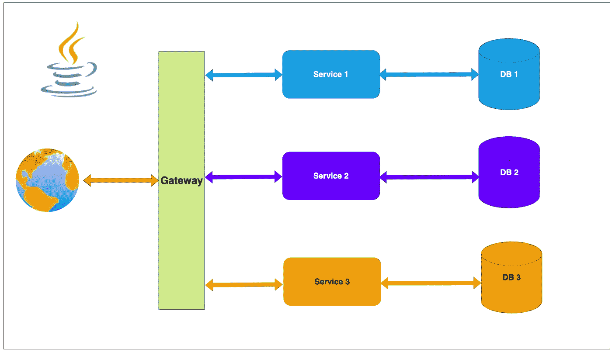

# 完整的 Java 微服务指南—第 1 部分

> 原文：<https://medium.com/bb-tutorials-and-thoughts/a-complete-java-microservices-guide-part-1-499f57ef5bb7?source=collection_archive---------0----------------------->

## 包含示例项目的分步指南

微服务是全球范围内实现良好的架构模式之一，其中一组服务作为一个单元。这些服务具有高度的可维护性和可测试性，松散耦合，独立部署，只专注于一个业务功能，由较小的…