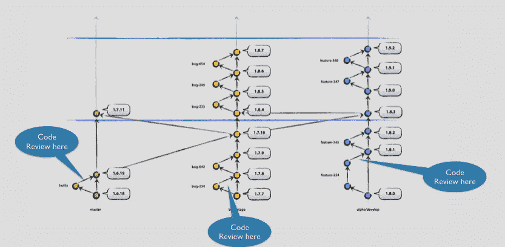
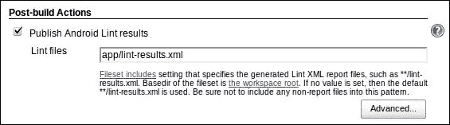

# 执行高效 Android 代码审查的全面介绍

> 原文：<https://medium.com/google-developer-experts/a-comprehensive-introduction-to-perform-an-efficient-android-code-review-75975ccaa20a?source=collection_archive---------3----------------------->

你在一个关心代码质量的团队中工作。你一直在做——或者考虑做——一些代码配对。你的团队定期开展黑客活动来谈论和展示新技术，或者谈论每个成员的个人发现。并且您正试图为您的组织设计完美的代码审查过程。这种情况你熟悉吗？

代码审查很难实现。团队由 N 人组成，每个人都有自己的日程和优先事项。有些人可能更完美，可能对代码审查有不同的接受标准。其他一些人真的相信评论应该在每个新功能或修复的顶部，并且完全是自愿的。和任何团队一样，需要做的是说服，而不是强加于人。

## 代码评审的目的是什么？

在应用它几年后(更具体地说，与我不使用它们的时候相比)，我只能从正面看待代码评审。如果它们得到适当的实施，那么它们就没有单一的不利之处，而都是有益的。这是我曾经写的一个作弊清单，用来说服其他团队成员为什么我们应该应用代码评审:

*   **其他开发者的教育:**软件系统很复杂。你可能会在广泛的平台上工作，知道全球 5%，也许 10%的市场份额。你不知道另一边发生了什么，这是一个很大的限制。时间是有限的，压力通常大到足以阻止你在其他模块中自由漫步。代码审查可以在这里向你介绍平台的另一部分，而不需要花费大量的时间——是的，对于团队中的新成员来说，这是一个令人惊奇的介绍方法。代码评审是*知识转移*的工具。
*   提高代码质量:编程让你置身于一个心流中，远离外部影响，专注于单一目标。这让你有偏见，因为你在想“我如何让这个工作？”。一个外部开发人员会想“*我该怎么破这个，哪里能找到薄弱点？”*。这就是为什么开发人员不应该测试他们的代码，也是为什么我们有专门的 QA 测试人员。引入第三个人来评审很可能会发现那些没有人注意到的错误。
*   **Creating a developing culture:** we all have work with coding guidelines and style. We all have our own oddities and crazes we have acquired during years of development, but in an organisation we want to make all fit in the same developing culture. *“But what happens with our team creativity!”* I have heard many times when exposing this argument. There is a Japanese proverb, 出る釘は打たれる, *“A nail that sticks out will be hammered”*. We do not need to hammer any nail here. We can take the finest from the Western and Eastern philosophies to create a radically cool process, taking the best of each world.
*   自信:如果你独自工作，你就是在为自己编码。你不关心代码是否能被其他人阅读，这将损害你的质量。一个人永远不应该在任何团队中独自工作:他/她会筋疲力尽，代码质量会下降，项目会灭亡)。如果你知道第三个人会阅读和分析你的代码，你的内部代码会额外努力使它清晰、简洁和可读。就像是一个非常便宜的静态代码分析工具。

# Android 应该如何进行代码审查？

这些是支持代码审查的一般理由和论据，但是你已经在本文开头的标题“Android”中读到了。那么如何才能高效的审核 Android 代码呢？嗯，有一些工具和技术，我们可以专门应用在我们的绿色平台。

**免责声明/50%垃圾邮件**:我不久前写了一篇关于[自动化 Android 开发](/google-developer-experts/automating-android-development-6daca3a98396#.njcyjponb)的文章，提供了一个分支和提交到 Git 存储库的模型。为了实现代码评审过程，采用分支和开发模型是至关重要的。所有的代码审查必须在一个分支实际合并到另一个分支之前完成。在我的特定模型中，代码审查在以下部分中完成:

*   当一个特性已经完成，并且需要合并到 alpha 中时。
*   当在 bug 修复冲刺阶段发现了一个 bug，并且需要合并到 beta/alpha 中时。
*   当一个修补程序已经完成，并需要再次合并。



In the model proposed in the previous post, this is where you apply the code reviews

更新:我的同事 [Nick Skelton](https://twitter.com/nshred) ，他在不同的会议上向我提出了这个话题，也在[上发表了他自己的文章](http://www.androidshortcuts.com/a-scaleable-git-branching-strategy-for-android/)，提出了一些想法并进一步扩展了这个模型。我完全可以推荐去看看。

## 入门指南

首先，这是我在之前的公司和现在作为独立承包人使用过的模型。对我很有效。它在 Android 开发中特别有效。但是不要忘记在软件工程中没有任何教条。理论必须适应每个场景，所以从这里选择你喜欢的，并随时修改它。

当我在前面提到的三个案例中有一个需要合并的分支时，我打开一个 Pull 请求，并指派至少一个(最好是两个)其他开发人员来检查代码。令人费解的是，有些环境只允许每个 PR 有一个审核者(早上好 [GitHub](https://github.com) ！)，所以这个过程需要手工完成(当审核人 **A** 完成后，他要把审核分配给审核人 **B** )。最理想的是，一个评审者必须来自开发团队(他们知道项目的限制和状态)，第二个评审者将来自一个外来的团队(我们希望与这个人分享知识)。

审查者有否决权。他们都需要同意合并分支机构。这就产生了团队精神，因为每个人对提交到我们系统中的每个特性都有点反应，即使他们不是直接贡献者。当有不同意见时，需要在我们的公关仪表板上进行讨论和解决，直到我们达成共识。如果绝对需要一名裁判，团队领导或类似的人物应该有决定权——尽管在我多年的经验中，我从未遇到过由于缺乏优秀混蛋的同意而导致公关受阻的问题！

正确的 PR 从本地下载分支并在我们的仿真器或设备中编译它开始。为什么需要这样做？嗯，Android 是一个碎片化的平台，拥有丰富的插件和版本生态系统。99%的问题可以通过在不同的计算机和设备/仿真器上再现环境来避免。

我也主张对新特性或新错误进行非正式测试。由于我们后天的偏见，我们在开发时往往会忽略琐碎的点，因为我们专注于我们的功能。另一个很大比例的错误可以通过这个简单的步骤检测出来:询问功能需求并测试应用程序是否遵循这些需求。

> 为了将功能需求与分支和 PR 容易地联系起来，将我们的分支命名为我们的发行单(例如，PROJECT-123)是一个很好的策略。大多数环境都允许我们将 PR 与包含票据描述和功能需求的票据存储库连接起来，这样审核者就可以更快地访问它。

## 我们应该什么时候做？

我们应该避免被打扰。除非它是一个修补程序，否则我通常会在午休后进行代码审查，或者在 Pomodoro 休息时开始。这样，我确保它们不会干扰我的发展，而是在一个更放松的时刻完成。

代码审查也不应该超过 30 分钟，但这与您正在实现的特性的粒度密切相关。如果您发现自己连续 30 多分钟忙于进行代码评审，这是一个与您的项目经理交谈并讨论您正在实现的特性的维度是否足够的好时机。

# 代码分析

所以我们的电脑里有这个功能。它已经编译好了，满足了功能需求，现在我们要开始分析代码了。我们能从哪里开始？我们可以对代码提出哪些问题？

## 架构模式

*   这段代码是否遵循了我们的架构模式？MVP，MVC，MVVM，事件总线？
*   是否在错误的类中执行了任何操作？(即片段中的数据逻辑)

## 测试

*   是否为特性或缺陷创建了测试？之前的测试有更新吗？
*   所有的测试类型都实现了吗？单元测试、集成测试和 UI 测试。
*   新的测试目前有效吗？

## 静态代码分析

我的最爱之一！在 Android 中，我们可以使用 [Lint](http://developer.android.com/tools/help/lint.html) 对我们的源代码进行静态分析。其中一些评论可能有意义，而另一些则没有意义(例如，我收到了很多“拼写错误”的警告……因为我主要与倾向于使用德语名称的德国团队合作，导致了诸如*datenbankwerbindung*之类的可变名称。如果您有遗留代码并且没有重构资源，您可能希望禁用弃用警告。

根据经验:我在所有新添加的文件和之前修改的文件中应用 Lint。我会手动检查 Lint 警告是否有意义，并在有意义时发出通知，这样代码就可以改进了。

Lint 可能非常方便。它通知可能的错误和内存泄漏。它还通知不推荐使用的代码、样式问题和命名约定。它可以成为一种强有力的教育工具。

## 代码样式

每个组织都应该有自己的编码指南(如果你没有，是时候开始定义一个了)。我在 Sixt 工作期间，我们开源了我们的[编码指南](https://speakerdeck.com/kikoso/android-coding-guidelines)。Android 为贡献者提供了一些[编码指南](https://source.android.com/source/code-style.html)，你可以用它们来启发自己的贡献者。当然, [Clean Code](http://bit.ly/1SNR4Yp) 圣经有一套关于干净编码和代码风格的广泛建议——如果你还没有读过的话，这是一本必读的书。

# 自动化宝贝！

从前面的步骤来看，有几个步骤可以非常容易地自动化。Lint 可以很容易地在 Jenkins 中设置，以便在每次构建时执行。我们首先需要在 Jenkins CI 服务器上安装 [Lint 插件](https://wiki.jenkins-ci.org/display/JENKINS/Android+Lint+Plugin)。然后，我们只需在作业配置中激活它:



Now we are applying and saving our Lint results!

作为一个有用的规则，您应该在 Gradle 文件中停用 Lint，以防止应用程序停止构建。这可以通过下面的代码片段轻松完成:

```
android {
    // ...

    lintOptions {
        // Don't abort if Lint finds an error, otherwise the Jenkins build
        // will be marked as failed, and Jenkins won't analyse the Lint output
        abortOnError false
    }
}
```

我更喜欢将 Lint 构建标记为不稳定而不是失败，并手动检查输出(同样，这将取决于您公司的策略)。詹金斯甚至可以设置运行林特时，公关是开放的！我不停地说使用 Jenkins 让办公室每个人的生活变得更加轻松，但我仍然很惊讶有多少人仍然没有使用它——我在许多会议上问了这个问题后随机猜测可能是三分之一的公司。

编码指南和样式也可以在 Android 中自动检查。您可以使用 [Checkstyle](http://checkstyle.sourceforge.net/) (一种开发工具，用于确保实现编码风格)并针对您的代码运行它。Checkstyle 有针对[安卓工作室](https://plugins.jetbrains.com/plugin/1065)、[詹金斯](https://wiki.jenkins-ci.org/display/JENKINS/Checkstyle+Plugin)以及其他平台的插件。根据您遵循的严格程度，您可能希望构建失败或将其标记为不稳定。我个人喜欢向提交者发送一份自动报告，提及其编码风格中的缺陷。

# 结论

执行代码审查就像烹饪一样:是一个个人的过程，其中只有一个主要的指导方针必须遵循，并且最终的过程往往会出现分支，与最初的种子不同。然而，读完这篇文章后，你应该对如何开始和如何检查有一个更清楚的想法——同样，如果你是一个有经验的开发人员，我希望你能得到一些想法和灵感。

在结束这篇文章之前，我还想提几点:

*   代码评审是关于代码的，而不是关于人的。这必须是每个团队成员都清楚的一点，以避免针对个人。目的是出货一个高质量的代码，而不是增加 ego。
*   好事也要指出来。当我发现一些聪明或优秀的东西时，我从中学习，并让开发者知道。

我总是认为现场演示比理论性的帖子好得多，所以我计划再贴几篇有特殊想法和代码评论的文章。如果你对这个话题感兴趣，欢迎订阅或关注我的 [Twitter](http://twitter.com/eenriquelopez) ！如果你喜欢文章，点击底部的小心脏推荐一下，随时分享:-)吧

感谢你的反馈，你真棒！