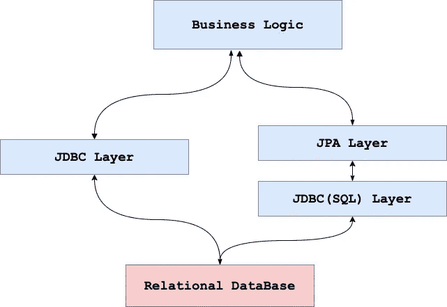
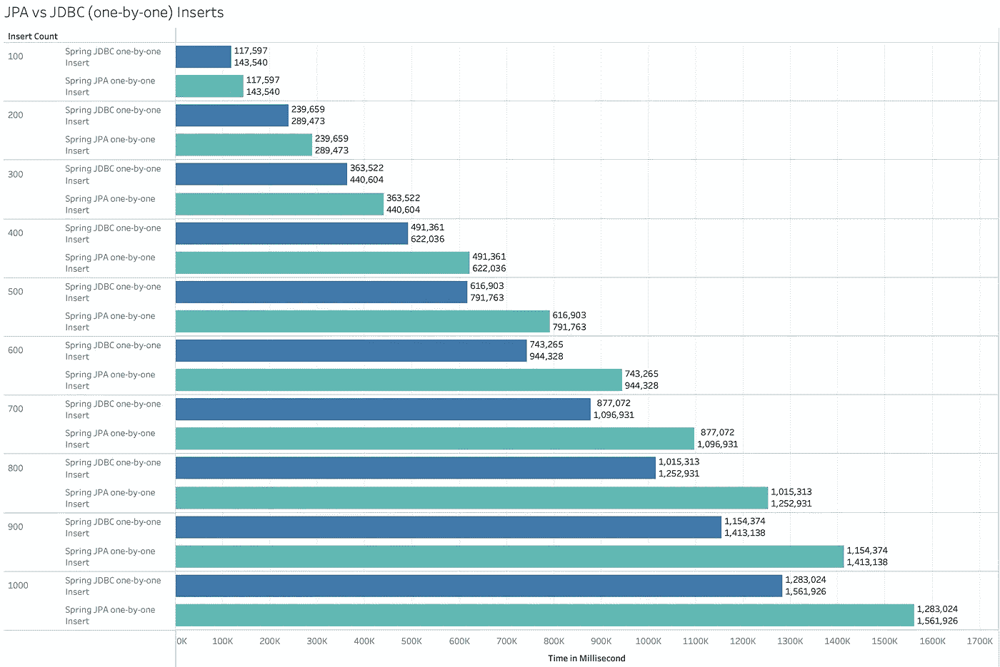
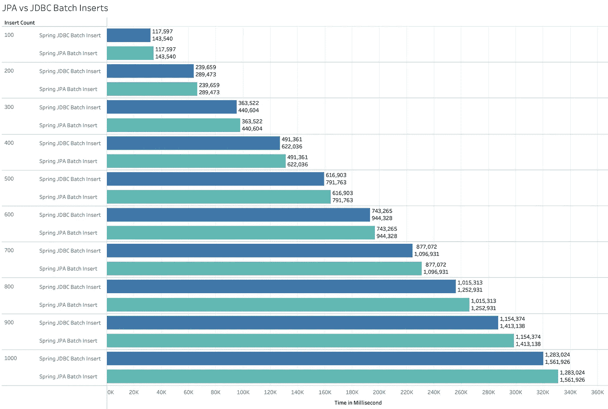

# 克朗彻选择 JPA 或 JDBC

> 原文：<https://medium.com/walmartglobaltech/a-cruncher-choice-jpa-or-jdbc-85c589f584a9?source=collection_archive---------0----------------------->

> 你的系统是你选择的结果。

在开发一个成功的后端时，最重要的一步是选择正确的技术。为什么？因为创造一个产品不仅仅是一个功能性的设计，也是一个安全、稳定、快捷的设计。

*让我们深入研究一下数据库操作的框架……*

# **什么是 JDBC？**

**Java 数据库连接** (JDBC)是 Java 编程语言的应用编程接口(API)，定义了客户端如何访问数据库。

1997 年 2 月，太阳微系统公司发布了 JDBC 作为 JDK 的一部分。程序员可以使用这些标准接口和类来编写连接数据库、发送 SQL 查询和处理结果的应用程序。

我们可以说 JDBC 是 Java 世界和数据库世界之间的桥梁。毕竟，当我们想要将数据库连接到应用程序时，我们首先要寻找的是 JDBC 驱动程序。

**JDBC 的优点**

*   简单的 SQL 处理
*   大型数据的良好性能
*   非常适合分秒必争的应用
*   简单的语法如此容易学习
*   它在需要完全控制执行的应用程序中很有用。

**JDBC 的缺点**

*   大量编程开销
*   没有封装
*   很难实现 MVC 概念
*   查询是特定于 DBMS 的

# **JPA 是什么？**

JPA 是一个 Java 标准，用于将 Java 对象绑定到关系数据库中的记录。我们可以说这是 ORM 可能的解决方案之一，有了它，开发人员可以使用 Java Objects(POJO)在关系数据库上执行 CRUD 操作。

Java 持久性 API 的第一个版本 JPA 1.0 发布于 2006 年，是 EJB 3.0 规范的一部分，目的是减少对象映射的样板代码，并对开发人员隐藏 SQL。

许多供应商都提供了 JPA 规范的实现，比如 Hibernate、Toplink、iBatis、OpenJPA 等。实际上，Hibernate 和大多数其他 JPA 提供者使用 JDBC 来读写数据库。

对于系统架构师来说，选择哪一个来与后端数据库进行通信是一个艰难的决定，因为 JPA 和 JDBC 使用非常不同的方法来处理持久层。

JPA 和 JDBC 的主要区别在于它们的抽象层次。JDBC 是与数据库交互的底层标准。JPA 是用于相同目的的更高级标准。有了 JDBC，你将不得不写所有的 SQL 东西，验证，ORM，事务管理。另一方面，您可以使用 JPA 直接用业务逻辑编码，因为 JPA 将处理所有的 SQL 内容和 ORM 任务。

**JPA 的优点**

*   提供封装，让开发人员专注于业务逻辑。
*   与 java beans 验证集成，简化验证
*   提供数据库独立性
*   单个请求管理单个事务中的所有 SQL。

**JPA 的缺点**

*   不适合批量交易。消耗太多内存。
*   不是线程安全的。
*   需要更好地理解所发生的情况，以指定额外的提取并提高性能。
*   在大批量处理时，JPA 比 JDBC 慢 4 倍。
*   数据库表之间的映射可能有点困难。

# Spring Data-JPA 和 Spring-Data-JDBC 的性能比较…

我创建了演示应用程序来评估和理解由 [Spring Data Framework 提供的两个模块。](https://spring.io/projects/spring-data)

1.  春天-数据-https://github.com/rkDeependra/Spring-JDBC-Demo【JDBC:】
2.  春天-数据-JPA:[https://github.com/rkDeependra/Spring-JPA-Demo](https://github.com/rkDeependra/Spring-JPA-Demo)

通过 Spring-Data 对 JPA 和 JDBC 模块进行了性能分析，我发现在逐个插入和批量插入中，JDBC 的性能明显优于 JPA。

考虑到 JPA 的产品，如果实现时注意流程的细节&根据需要使用，这种差异是相当大的。

JBDC is ~20% faster than JPA

JDBC is ~4% faster than JPA

> 记录被同步插入。
> 
> 分析中使用的批量为 100
> 
> 性能分析中使用的数据库是 Microsoft Azure-SQL。
> 
> SQL 表是用自动递增的 SQL 生成 id 创建的。(身份)

## 总结

*JPA 的 ORM 映射是其相对于 JDBC 的主要优势，因为它将面向对象的 Java 代码转换到后端数据库，而不需要耗时、易错的编码。*

*但是 JDBC 允许你直接用数据库做更多的事情&给予更多的控制。*

*编码时间和细粒度控制之间是有权衡的。*

*在最终确定一个框架之前，必须设计并理解应用程序和用途的未来需求。*

**进一步阅读**

 [## JDBC 春季数据

### Spring 数据存储库的灵感来自 Eric Evans 所著的《领域驱动设计》一书中描述的存储库…

spring.io](https://spring.io/projects/spring-data-jdbc)  [## 春季数据 JPA

### 提高您的 Java 代码水平，探索 Spring 能为您做什么。

spring.io](https://spring.io/projects/spring-data-jpa#overview)