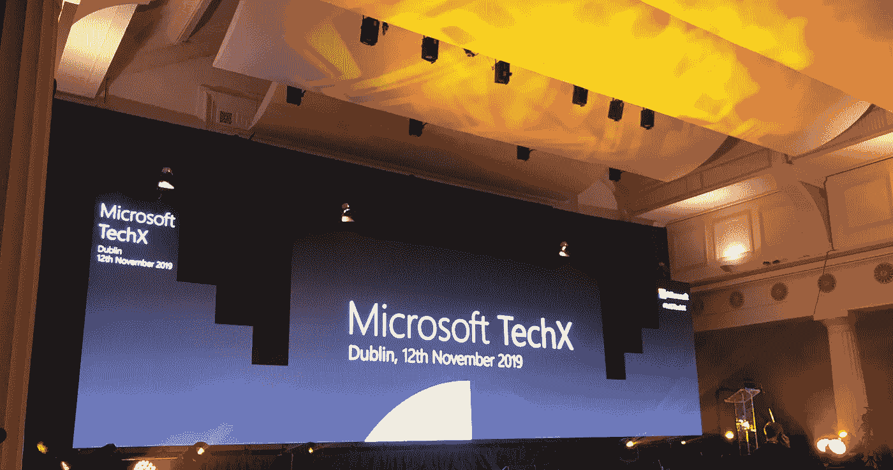
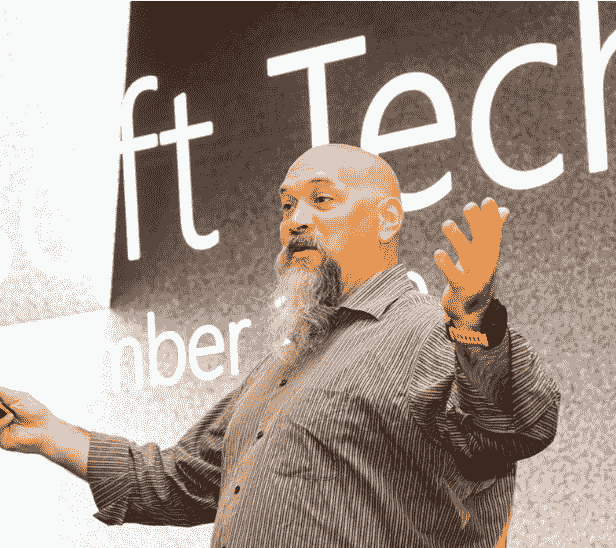
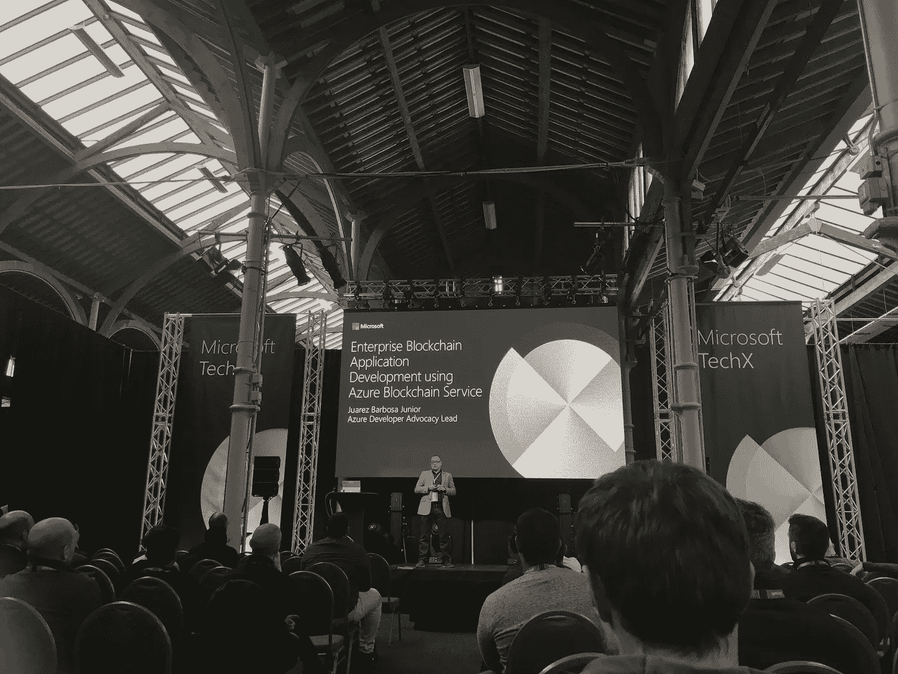
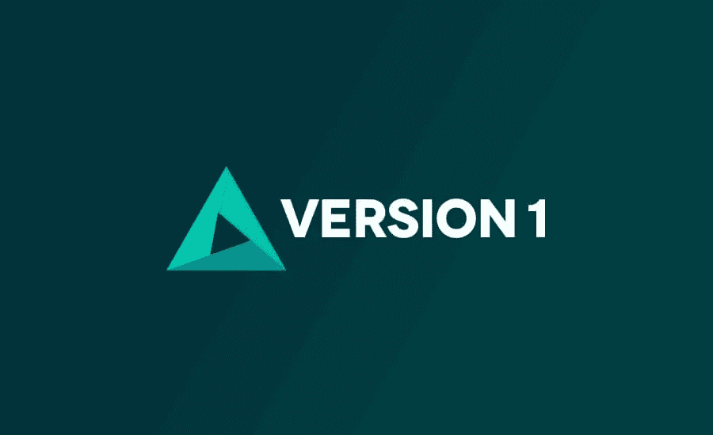

# Microsoft TechX 都柏林的一天

> 原文：<https://medium.com/version-1/a-day-at-microsoft-techx-dublin-28a7abb71c9c?source=collection_archive---------6----------------------->

11 月 12 日，我参加了微软年度最大的开发者和 IT 专业人士活动，在都柏林举行的[微软技术大会](https://www.microsoftevents.com/profile/web/index.cfm?PKwebID=0x1462051abcd&wt.mc_id=AID2451322_QSG_367619)上，我展示了[版本 1](https://www.version1.com/) 。作为营销团队的一员，我在那里帮助建立我们的摊位，因为我们是这次活动的自豪的赞助商。我发现这是一次非常愉快的经历，因为我和其他 700 多名与会者被邀请获得战略见解，并利用微软云的最新技术(如 Azure 和 Power platform)发展我们的技能组合。

这一天是以微软自己的 Cathriona Hallahan 的引人入胜的主题演讲开始的。她的演讲完美地强化了微软的新使命:

> **“让地球上的每一个人和每一个组织获得更多成就”**

Cathriona 谈到技术是一种向善的力量，是与合作伙伴和客户共同创造价值的力量，强调了微软作为一家公司是如何发展的。这加强了技术对我们的个人和职业生活的影响，使我们比以往任何时候都更加联系和强大。微软的愿景专注于提供支持我们这一代人抱负的技术，从气候变化到教育、健康和商业。Hallahan 继续告诉我们，微软已经在项目和创新上投入了超过 120 亿美元。我真的很喜欢她用爱尔兰的创新例子来展示这一点，这些例子包括[都柏林机场管理局一直在使用 bid 数据服务](https://www.irishtimes.com/sponsored/microsoft/how-microsoft-and-daa-use-ai-to-innovate-the-airport-passenger-s-journey-1.3795116)和 AI 来改善航站楼系统的乘客流量。另一个例子是 [Access Earth](https://access.earth/) ，它被称为“无障碍猫途鹰”。

微软首席技术项目经理 Josh Holmes 发表了当天的第二个主题演讲。乔希的演讲被打断成

微软程序的四大主题；

不考虑大小而加粗

乐观包容

基于信任

大规模执行

对我来说最突出的项目是**项目 InnerEye** 。这个项目的灵感来自于核磁共振扫描

观看它们的过程是劳动密集型的。自从“60 岁以上的人有一半会在有生之年患上癌症”以来，微软就非常积极地通过 InnerEye 项目做出改变。该项目见证了为自动描绘肿瘤而开发的机器学习技术。InnerEye 将多维放射图像转化为测量设备。

他关于包容性问题的讨论也吸引了我。在这里，他带我们踏上了一段旅程，讲述了一名微软工程师(Matt Hire)是如何受到启发而加入一个名为**受伤战士**的组织的。受伤的战士参与了为受伤的退伍军人重新设计 Xbox 控制器。霍尔姆斯接着引用了 Xbox 团队的高级包容性设计师拜斯·约翰逊的话:

> **“我们不是在为所有人设计，而是在为我们每个人设计”**

这一天被分成三个不同的轨道；路线 1: IT 管理，路线 2:数据和人工智能，路线 3:开发。我当天的游戏计划是参加每个赛道的讲座。我参加的第一个讲座是**“我的数据仓库不堪重负，救命！”**由微软开源 Azure 高级云专家 EMEA 提供。本课程重点关注 AzureDWH，并参考了迁移到 AzureDWH 的使用案例。Ishan 谈到了 Azure Synapse Analytics，以及它如何为数据准备、数据管理、数据仓库、大数据和人工智能任务提供统一的工作空间。通过 Azure Synapse Analytics，微软利用其 Azure SQL 数据仓库，并打开卷来处理其云中的 Pb 级数据。像 SQL 数据仓库一样，基于云的服务旨在弥合数据仓库和数据湖之间的鸿沟。

从路线 3 开始，我参加了微软 Azure 开发者宣传主管 Juarez Barbosa Junior 发表的**“使用 Azure Blockchain Service 开发企业区块链应用程序”**演讲。本次会议深入探讨了微软的 Azure 区块链服务，这是一种完全托管的分类账服务，使用户能够在 Azure 中发展、扩展和运营区块链网络。Gartner 报告称，到 2026 年，区块链的商业附加值将增长到略高于 3600 亿美元，到 2030 年将飙升至超过 3.1 万亿美元。

Azure 上的区块链服务和工具包括:

Azure 区块链服务和虚拟机模板

区块链工作台

区块链开发工具包

Azure 区块链令牌

Azure 市场

要了解更多关于区块链的信息，请下载第 1 版的[“区块链初学者指南”](https://www.version1.com/wd-dgt-inn-blockchain-whitepaper/)，其中概述了如何在现实世界中利用区块链。

从路线 1 开始，我参加了微软高级安全分析 GBB Alp Babayigit 的讲座**“Azure Sentinel 利用云和人工智能构建下一代安全运营”**。在这里，我们深入了解了如何在威胁对 Azure 造成伤害之前识别和阻止它们，SEIM 软件为现代世界进行了重新设计。一些值得注意的原则侧重于安全性，并减轻了保安人员的 IT 任务负担:

*   没有基础设施成本、设置或维护
*   简单的无服务器集成
*   对计算或存储资源没有限制
*   从单一使用案例自动扩展到完整的 SIEM 和数据湖
*   云级别的 ML/AI

总的来说，我发现微软 TechX 是非常愉快和发人深省的一天。由于全天提供了大量的信息和各种各样的讲座，我能够在我参加的每一次会议上都学到一些新的东西。由于这个活动是一个与其他技术专业人士交流的绝佳机会，我肯定会向任何对微软感兴趣的人推荐 TechX。

**关于版本 1**

Version 1 是数字化转型领域的市场领导者，专注于**企业云、数据资产现代化和应用程序现代化。**凭借 20 多年的应用经验，英国和爱尔兰的主要公共部门组织和企业与第 1 版合作，在云和内部改造、迁移、运行和优化任务关键型应用。访问 www.version1.com/modernise-with-azure 了解更多信息。