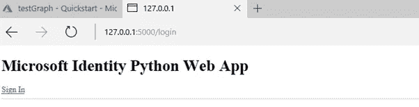
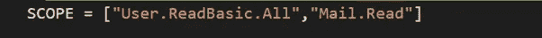
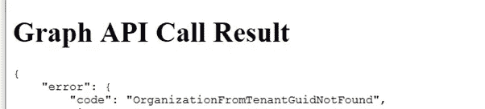

# 版本 1 创新实验室的一天:探索微软图表

> 原文：<https://medium.com/version-1/a-day-in-version-1-innovation-labs-acaf2571ae5d?source=collection_archive---------3----------------------->

**我是一名高级顾问，从 2019 年 9 月开始在版本 1 创新实验室工作。创新实验室为客户开发创新解决方案和价值证明，以确保版本 1 始终处于颠覆性技术的前沿。这篇博客将报道我在版本 1 的创新实验室的一天，在那里我研究了微软的 Graph。**

Photo by [John Adams](https://unsplash.com/@johnladams?utm_source=medium&utm_medium=referral) on [Unsplash](https://unsplash.com?utm_source=medium&utm_medium=referral)

一天从团队会议开始(喝完咖啡，检查邮件，准备会议)。创新实验室的每个成员都会迅速提供他们目前正在做的事情的最新情况。电话中的话题可以从客户问题到团队成员探索新技术/产品并让其他人了解市场上有什么。在会议结束时，会有一个演示会议，团队在会上展示他们正在进行的项目，并向团队的其他成员展示任何演示。

Photo by [Tadas Sar](https://unsplash.com/@stadsa?utm_source=medium&utm_medium=referral) on [Unsplash](https://unsplash.com?utm_source=medium&utm_medium=referral)

今天会议结束后，我的任务是探索微软(Microsoft)的图形。这个需求来自于一个客户的请求，我们客户的员工花了很多时间从他们的电子邮件中读取文档并上传到他们的系统中。对于某些文档，需要提取特定的字段。由实验室开发的 Document Insight 解决方案是一个很好的工具，可以扫描文档，识别需要处理的细节，并通过 API 将字段上传到 case 系统。但是，在使用 Document Insights 之前，需要一个工具来从员工电子邮件中提取附件，并将它们传递给 Document Insights 解决方案。

我开始在网上寻找，看看我能用 MS Graph 做些什么。我从阅读 MS Graph 上的几篇文章开始，看看它能做什么，以及它是否能解决我们的问题。我很想看看它到底能做什么，所以我去试了一下。我用自己的第一版账号打开了[这个链接](https://developer.microsoft.com/en-us/graph/graph-explorer)，试着看看里面有什么功能。我尝试了几个选项(和我在 outlook 中做的一样):

获取电子邮件列表

获取特定电子邮件 id 的详细信息

获取特定电子邮件 id 的附件

搜索包含特定单词和附件的电子邮件。

**下一步是看看 Python Web 应用程序如何与 Microsoft Graph API 集成。**

作为一个起点，我在 GitHub 上搜索一个 Python Web 应用程序，发现了[这个。](https://github.com/microsoftgraph/python-security-rest-sample)现在，随着 git 存储库的克隆，我开始按照 readme.md 中的步骤设置 Python 应用程序。这一切都很好，直到我不得不在[应用注册门户](https://go.microsoft.com/fwlink/?linkid=2083908))上添加一个新的注册。

结果是，我没有使用我的工作帐户执行此操作所需的权限。在与数据保护官(GDPR！)，他建议我创建一个微软虚拟邮箱账户，然后玩玩那个。在 Azure portal 上配置我的应用程序时，我注意到有一个快速启动链接，它提供了一些 Web 应用程序的示例代码。

我决定放弃从 GIT 下载的应用程序，使用 Azure Portal 的示例代码。我从门户网站下载的代码对如何设置应用程序的说明略有不同，所以我遵循了这些说明。

我更改了 app_config.py 中的 CLIENT_ID、CLIENT_SECRET、AUTHORITY，并运行了 Python 应用程序。

登录后，我可以看到我创建的虚拟帐户的详细信息。

下一步是修改代码来阅读电子邮件。

为此，我必须更改我的 Azure API 测试图的权限，然后在 python 代码 app_config.py 中，我更改了范围和端点以获取我的用户的电子邮件。

这一直有效，直到我运行 API 并收到以下错误:

在网上寻找并尝试了不同的建议后，我最终在 MSDN 上发现，要访问用户邮箱，需要订阅 office365。这意味着在我订阅 Office365 之前，我的虚拟账户无法使用。

那么，我今天学到了什么？

在进行原型设计/概念验证时，千万不要使用产品，否则会遇到繁文缛节和访问问题。始终尝试使用独立的测试/虚拟帐户。

Graph APIs 非常棒，它们提供了许多可以使用的功能，并且可以很容易地与 python 或任何其他应用程序集成。即使由于帐户限制，我没有得到我想要的东西，我仍然可以很容易地获得用户的详细信息。

如果一种方法不起作用，继续前进，尝试不同的方法来解决你的问题，例如使用虚拟账户。

试验和尝试新技术是件好事，因为它能让我们做出更好、更明智的决定。

即使我没有设法从我的虚拟帐户中获得电子邮件列表，我也了解了 Graph API 是如何工作的，以及这些如何容易地与应用程序集成。当我设法收到我的虚拟账户的用户详细信息时，这证明了我在 Azure 上创建的集成和 API 是有效的。我希望你喜欢阅读我在创新实验室的一天，并希望这给了我们对技术和领域的深入了解。在下面的版本 1 中找到更多关于创新的信息。

[*创新实验室*](https://www.version1.com/innovation/) *自 2018 年年中开始运营，拥有探索前沿技术的专职团队。我们已经提供了许多成功的 POV，并渴望与我们的客户合作，帮助他们探索可能会改变其业务的下一代技术。点击这里了解更多关于版本 1 的创新。*