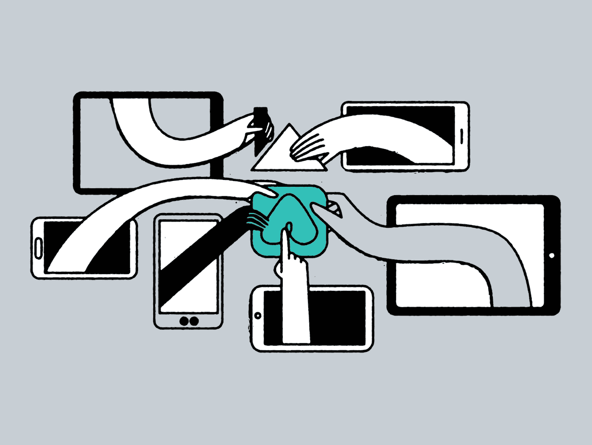
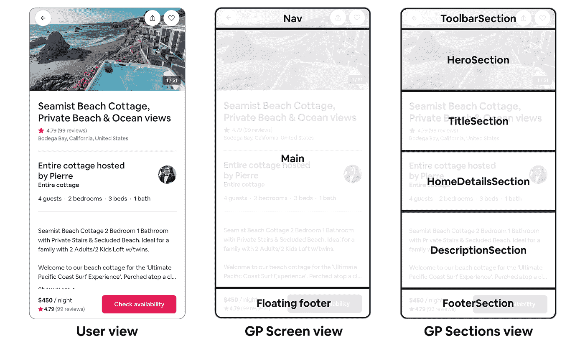
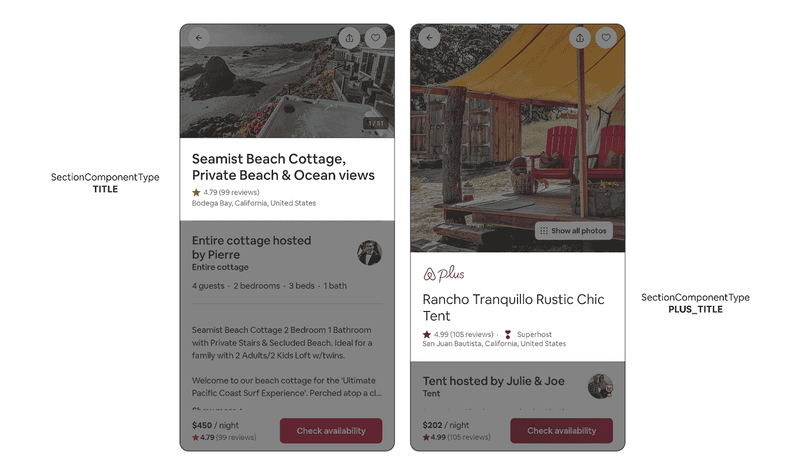
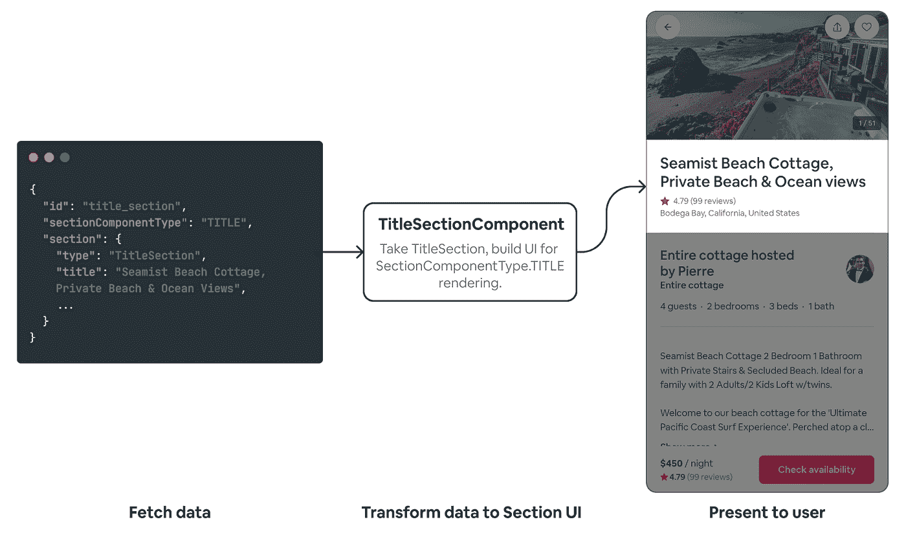
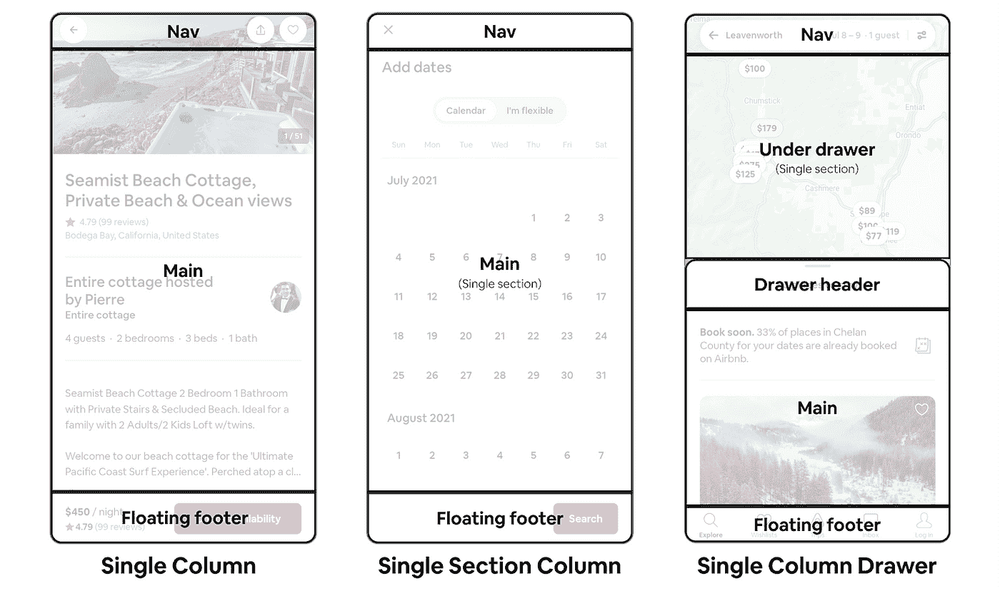
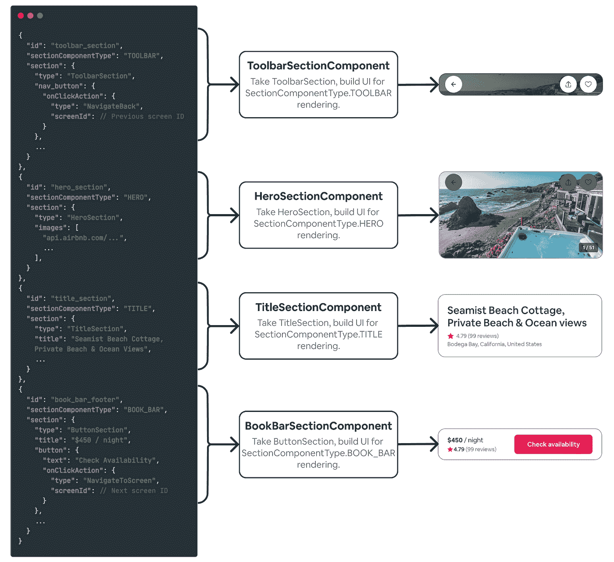
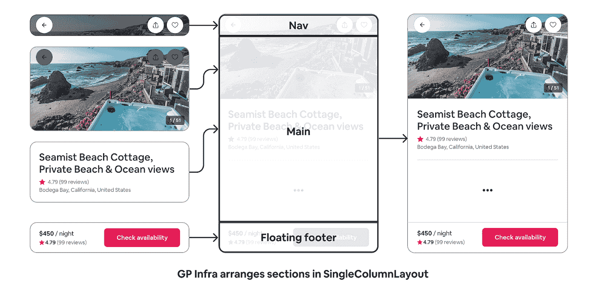

# 深入探究 Airbnb 的服务器驱动的用户界面系统

> 原文：<https://medium.com/airbnb-engineering/a-deep-dive-into-airbnbs-server-driven-ui-system-842244c5f5?source=collection_archive---------0----------------------->

Airbnb 如何使用名为 Ghost Platform 的服务器驱动的用户界面系统在 web、iOS 和 Android 之间更快地发布功能👻。

瑞安·布鲁克斯



## 背景:服务器驱动的用户界面

在我们深入研究 Airbnb 的服务器驱动 UI (SDUI)实现之前，理解 SDUI 的总体思想以及它如何提供优于传统客户端驱动 UI 的优势是很重要的。

在传统世界中，数据由后端驱动，UI 由每个客户端(web、iOS 和 Android)驱动。以 Airbnb 的房源页面为例。为了向用户显示列表，我们可能会从后端请求列表数据。收到这个列表数据后，客户机将该数据转换成 UI。

这带来了一些问题。首先，在每个客户机上构建了特定于列表的逻辑来转换和呈现列表数据。如果我们改变列表的显示方式，这种逻辑会很快变得复杂并且不灵活。

第二，每个客户必须保持对等。如前所述，这个屏幕的逻辑很快变得复杂，每个客户端都有自己的复杂性和处理状态、显示 UI 等的特定实现。客户之间很容易迅速产生分歧。

最后，移动有一个版本问题。每次我们需要向列表页面添加新功能时，我们都需要发布新版本的移动应用程序，以便用户获得最新的体验。在用户更新之前，我们几乎没有办法确定用户是否在使用这些新功能，或者对这些新功能的反应是否良好。

## SDUI 的案例

如果客户不需要知道他们正在展示一个列表，那会怎么样？如果我们可以将 UI 直接传递给客户端，完全跳过列出数据的想法，会怎么样？这基本上就是 SDUI 所做的——我们一起传递 UI 和数据，客户端显示它所包含的数据。

Airbnb 的特定 SDUI 实现使我们的后端能够控制数据以及这些数据如何同时在所有客户端上显示。从屏幕布局、各部分在布局中的排列方式、每个部分中显示的数据，甚至用户与各部分交互时采取的行动，都由我们的 web、iOS 和 Android 应用程序的单一后端响应控制。

# Airbnb 的 SDUI:幽灵平台👻

Ghost Platform (GP)是一个统一的、自以为是的、服务器驱动的 UI 系统，使我们能够快速迭代，并在 web、iOS 和 Android 上安全地推出功能。它之所以被称为 Ghost，是因为我们的主要关注点是围绕' **G** uest '和' **Host** 的功能，这是我们 Airbnb 应用程序的两个方面。

GP 以每个客户端的本地语言(分别是 Typescript、Swift 和 Kotlin)提供 web、iOS 和 Android 框架，使开发人员能够以最少的设置创建服务器驱动的功能。

GP 的核心特性是特性可以共享一个通用部分、布局和动作的库，许多是向后兼容的，使团队能够更快地将复杂的业务逻辑转移到后端的一个中心位置。

## 标准化的模式

Ghost 平台的主干是一个标准化的数据模型，客户端可以使用它来呈现 UI。为了使这成为可能，GP 利用一个统一的数据服务网格，在后端服务之间使用一个共享数据层，这个网格被称为[高架桥](/airbnb-engineering/taming-service-oriented-architecture-using-a-data-oriented-service-mesh-da771a841344)。

帮助我们使我们的服务器驱动的 UI 系统可伸缩的关键决策是为 Web、iOS 和 Android 应用程序使用单个共享的 GraphQL 模式——也就是说，我们在所有平台上使用相同的模式来处理响应和生成强类型数据模型。

我们花时间归纳了不同功能的共同方面，并以一致、周到的方式考虑了每个页面的特性。结果是一个通用模式，能够在 Airbnb 上呈现所有功能。这个模式足够强大，可以考虑可重用的部分、动态布局、子页面、动作等等，我们的客户端应用程序中相应的 GP 框架利用这个通用模式来标准化 UI 呈现。

# 全科医生的反应

政府采购的第一个基本方面是总体反应的结构。有两个主要概念用于描述 GP 响应中的 UI:sections 和 screens。



Figure 1\. *How users see Airbnb features on GP vs. how GP sees those same features as screens and sections.*

*   **切片:**切片是 GP 最原始的积木。一个部分描述一组内聚的 UI 组件的数据，包含要显示的确切数据—已经翻译、本地化和格式化。每个客户端获取部分数据，并将其直接转换为 UI。
*   **屏幕:**任何 GP 响应都可以有任意数量的屏幕。每个屏幕描述了屏幕的布局，并依次描述了来自`sections`数组的部分将出现的位置(称为位置)。它还定义了其他元数据，例如如何呈现部分(例如，作为弹出窗口、模式或全屏)以及记录数据。

Figure 2\. A sample of the GP Response GraphQL schema.

用 GP 构建的特性后端将实现这个`GPResponse`(图 2)，并根据它们的用例填充屏幕和部分。web、iOS 和 Android 上的 GP 客户端框架为开发人员提供了获取`GPResponse`实现并将其转化为 UI 的标准处理方式，他们只需做最少的工作。

# 部分

节是 GP 的最基本的构件。GP 部分的关键特征是它们完全独立于其他部分和显示它们的屏幕。

通过将部分从它们周围的上下文中分离出来，我们获得了重用和重用部分的能力，而不用担心业务逻辑与任何特定功能之间的紧密耦合。

## 区段模式

在 GraphQL 模式中，GP 节是所有可能的节类型的联合。每个部分类型指定它们提供的要呈现的字段。在一个带有一些元数据的`GPResponse`实现中接收节，并通过一个`SectionContainer`包装器提供，该包装器包含关于节的状态、日志数据和实际节数据模型的细节。

*Figure 3\. A snippet of what our section GraphQL schema*

一个需要触及的重要概念是`SectionComponentType`。`SectionComponentType`控制*如何呈现*一个部分的数据模型。这使得一个数据模型可以根据需要以多种不同的方式呈现。

例如，两个`SectionComponentType`的`TITLE`和`PLUS_TITLE`可能使用相同的后台`TitleSection`数据模型，但是`PLUS_TITLE`实现将使用 Airbnb 的特定于 Plus 的徽标和标题样式来呈现`TitleSection`。这为使用 GP 的特性提供了灵活性，同时还提高了模式和数据的可重用性。



Figure 4\. *Example of rendering a TitleSection data model differently using SectionComponentType.*

## 截面组件

截面数据通过“截面组件”转化为 UI。每个 section 组件负责将一个数据模型和一个`SectionComponentType`转换成 UI 组件。抽象节组件由 GP 在每个平台上以其本地语言(即 Typescript、Swift、Kotlin)提供，并且可以由开发者扩展以创建新的节。

截面组件将截面数据模型映射到**一个**唯一的渲染，因此只属于一个`SectionComponentType`。如前所述，部分是在没有它们所在的屏幕或它们周围的部分的任何上下文的情况下呈现的，因此每个部分组件都没有提供特定于功能的业务逻辑。

我是一名 Android 开发人员，所以让我们举一个 Android 的例子(因为 Kotlin 很棒😄).为了构建标题部分，我们有如下所示的代码片段(图 5)。Web 和 iOS 有类似的实现——分别在 Typescript 和 Swift 中——用于构建 section 组件。

Figure 5\. A Kotlin example of a section component.

GP 提供了许多“核心”部分组件，比如我们上面的例子`TitleSectionComponent`(图 5)，它是可配置的、可样式化的，并且从后端向后兼容，因此我们可以适应任何特性的用例。然而，在 GP 上构建新特性的开发人员可以根据需要添加新的 section 组件。



Figure 6\. *GP takes section data, uses a section component to turn it into UI (TitleSectionComponent from fig. 5), and presents the built section UI to the user.*

# 屏幕

屏幕是 GP 的另一个构建块，但与部分不同，屏幕主要由 GP 客户端框架处理，并且在使用中更加固执己见。GP 屏幕负责各部分的布局和组织。

## 屏幕模式

屏幕作为`ScreenContainer`类型接收。根据`screenProperties`字段中包含的值，屏幕可以以模式(弹出)、底部表单或全屏方式启动。

屏幕支持屏幕布局的动态配置，进而通过`LayoutsPerFormFactor`类型安排各部分。`LayoutsPerFormFactor`使用名为`ILayout`的接口指定紧凑和宽断点的布局，这将在下面详述。然后，每个客户端上的 GP 框架使用屏幕密度、旋转和其他因素来确定从`LayoutsPerFormFactor`中呈现哪个`ILayout`。

Figure 7\. A sample of the GP screens schema.

## ILayouts



Figure 8\. *A few examples of ILayout implementations, which are used to specify various placements.*

使屏幕能够根据响应改变布局。在 schema 中，`ILayout`是一个接口，每个`ILayout`实现指定不同的位置。位置包含一个或多个`SectionDetail`类型，指向响应的最外层`sections`数组中的部分。我们指向部分数据模型，而不是内联包含它们。这通过跨布局配置重用部分来缩小响应大小(图 7 中的`LayoutsPerFormFactor`)。

Figure 9\. *A sample of GP’s ILayout schema.*

GP 客户端框架为开发人员膨胀了`ILayout` s，因为`ILayout`类型比部分更固执己见。每个`ILayout`在每个客户端的 GP 框架中都有一个唯一的渲染器。布局呈现器从每个布局中提取每个`SectionDetail`，找到适当的部分组件来呈现该部分，使用该部分组件构建该部分的 UI，最后将构建的 UI 放置到布局中。

# 行动

GP 的最后一个概念是我们的动作和事件处理基础设施。GP 最能改变游戏规则的一个方面是，除了从网络响应中定义屏幕的部分和布局，我们还可以定义用户在屏幕上与 UI 交互时采取的动作，比如点击按钮或刷卡。我们通过模式中的一个`IAction`接口来实现这一点。

*Figure 10\. A sample of the GP IAction schema:*

回想一下前面的内容(图 6 ), section 组件是在每个客户端上将我们的`TitleSection`转换为 UI 的组件。让我们看看同一个 Android 例子，一个动态的`IAction`在点击字幕文本时被触发。

Figure 11\. An example section component with an IAction fired on the click of a subtitle.

当用户点击这个部分的副标题时，它触发为`TitleSection`中的`onSubtitleClickAction`字段传递的`IAction`。GP 负责将这个动作传递给为该特性定义的事件处理程序，它将处理被触发的`IAction`。

GP 有一套通用的标准动作，比如导航到一个屏幕或者滚动到一个部分。特性可以添加自己的`IAction`类型，并使用它们来处理特性的独特动作。由于特定于功能的事件处理程序的作用范围仅限于该功能，因此它们可以包含任意多的特定于功能的业务逻辑，从而在出现特定用例时可以自由地使用自定义操作和业务逻辑。

# 将这一切结合在一起

我们已经讨论了几个概念，所以让我们来看一个完整的 GP 响应，看看它是如何将所有内容联系在一起的。

Figure 12\. An example JSON of a valid GP response.

## 创建剖面组件

使用 GP 的特性将需要获取实现上述`GPResponse` 的响应(图 2)。在接收到`GPResponse`之后，GP infra 处理解析这个响应并为开发人员构建部分。

回想一下，我们的`sections`数组中的每个部分都有一个`SectionComponentType`和一个`section`数据模型。从事 GP 工作的开发人员添加截面组件，使用`SectionComponentType`作为如何呈现截面数据模型的关键。

GP 找到每个 section 组件，并将相应的数据模型传递给它。每个 section 组件为 section 创建 UI 组件，GP 会将这些组件插入到下面布局中的适当位置。



Figure 13\. *Transforming section data to UI.*

## 处理行动

既然已经设置了每个部分组件的 UI 元素，我们需要处理用户与部分的交互。例如，如果他们点击一个按钮，我们需要处理点击时的动作。

回想一下，GP 将路由事件处理到适当的处理程序。上面的示例响应(图 12)包含两个可以触发动作的部分，`toolbar_section`和`book_bar_footer`。构建这两个部分的部分组件只需要获取`IAction`并指定何时触发它，在这两种情况下都是在单击按钮时。

我们可以通过每个客户端上的点击处理程序来实现这一点，它将使用 GP infra 来路由点击事件。

```
button(
  onClickListener = {
    GPActionHandler.handleIAction(section.button.onClickAction)
  }
)
```

## 设置屏幕和布局

为了给我们的用户安排一个完全交互式的屏幕，GP 通过屏幕数组寻找一个带有`“ROOT”` id (GP 的默认屏幕 id)的屏幕。GP 将根据断点和其他与用户使用的特定设备相关的因素找到合适的`ILayout`类型。为了简单起见，我们将使用来自`compact`字段的布局，即`SingleColumnLayout`。

然后 GP 将为`SingleColumnLayout`找到一个布局渲染器，在这里它将膨胀一个带有顶部容器(`nav`位置)、可滚动列表(`main`位置)和浮动页脚(`footer`位置)的布局。

该布局渲染器将获取包含`SectionDetail`对象的放置模型。这些`SectionDetail`包含一些样式信息以及要膨胀部分的`sectionId`。GP 将遍历这些`SectionDetail`对象，并使用我们之前构建的 section 组件将 section 膨胀到它们各自的位置。



Figure 14\. *GP Infra takes built sections with action handlers added, adds sections to ILayout placements.*

# GP 的下一步是什么？

GP 只存在了一年左右，但 Airbnb 大多数最常用的功能(例如，搜索、列表页面、结账)都是基于 GP 的。尽管有大量的应用，GP 仍处于起步阶段，还有很多工作要做。

我们计划通过“嵌套部分”实现更具可组合性的 UI，通过我们的设计工具(如 Figma 和部分和位置的 WYSIWYG 编辑)提高已经存在的元素的可发现性，从而实现无代码功能更改。

如果你热衷于服务器驱动的 UI 或者构建可扩展的 UI 系统，那么还有很多事情要做。我们鼓励您申请我们工程团队的[空缺职位](https://careers.airbnb.com/)。

## 再造旅游科技讲座

服务器驱动的用户界面很复杂。无数的时间投入到创建一个健壮的模式、客户机框架和开发人员文档中，使得 GP 能够成功。

如果你想对 SDUI 和 GP 有一个更高层次的概述，我最近有机会在 Airbnb 举办的[再造旅行技术讲座](https://www.facebook.com/AirbnbTech/videos/1445539065813160/)上发言。我鼓励你去看看它，对服务器驱动的 UI 和 GP 有一个总体的了解(如果你时间不够，可以跳到 31 分钟)。

## 特别感谢

特别感谢[阿布希·沃赫拉](https://www.linkedin.com/in/abhinavvohra/)、[文圣·毛](https://www.linkedin.com/in/wensheng-mao-76ab7142/)、[让-尼古拉斯·沃尔默](https://www.linkedin.com/in/jnvollmer/)、[普拉内·艾兰](https://www.linkedin.com/in/pranayairan/)、[斯蒂芬·赫林](https://www.linkedin.com/in/stephen-herring-00381a6a/)、[刘以豪](https://www.linkedin.com/in/jsperl/)、[凯文·韦伯](https://www.linkedin.com/in/kevinchrisweber/)、[鲁道夫·库蒂](https://www.linkedin.com/in/rodolphe-courtier-97b32610/)、[丹尼尔·加西亚-卡里略](https://www.linkedin.com/in/danielgarciacarrillo/)、[菲德尔·索萨](https://www.linkedin.com/in/fidelsosa/)、 [](https://www.linkedin.com/in/roshan-goli-03977a25/) [Susan Dang](https://www.linkedin.com/in/rsusandang/) 和 [Amity Wang](https://www.linkedin.com/in/amitywang/) 以及更多幕后工作人员，感谢他们不知疲倦地建设和支持 GP。