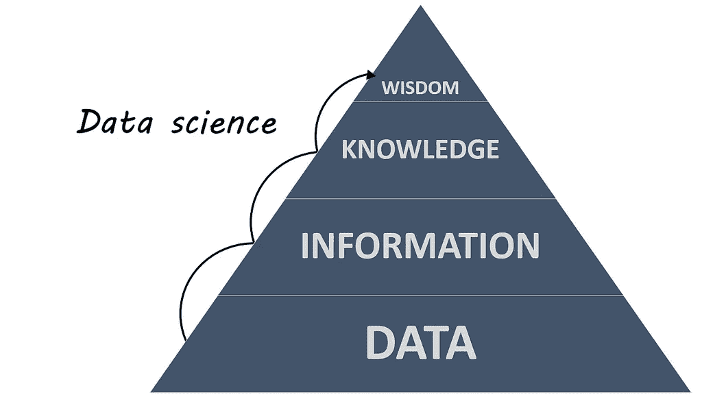

# 一个数据科学学位:来自哈佛博士生的建议

> 原文：<https://medium.com/quick-code/a-degree-in-data-science-advice-from-a-harvard-ph-d-student-6553ccb47e1b?source=collection_archive---------1----------------------->

在这篇文章中，我想分享我在过去 18 个月中从事数据科学研究生涯的经历。

这是我的第一个媒体帖子，所以我想提供一些关于我自己和我以前经历的背景。我是哈佛大学环境工程和计算科学博士生，也是英国人工智能咨询公司 Critical Future 的兼职机器学习和区块链顾问。我的研究重点是将机器学习和人工智能应用于环境科学，使用基于无人机的传感器系统，这些系统能够智能移动，以绘制低层大气的化学成分，主要是在亚马逊雨林(对于对这个项目感兴趣的人，我将在不久的将来就此发表单独的文章)。

我于 2017 年秋季开始在哈佛大学攻读博士学位，直接从伦敦帝国理工学院的机械工程学士和硕士学位课程毕业，最后一年在新加坡国立大学完成。在大学期间，我几乎没有接触过数据科学或统计学，但我接触过 Matlab、C 和 Visual Basic 形式的编码，并且有很强的数学基础。

在哈佛开始之前，我从未用 Python 编程，甚至从未听说过 r。我从未做过任何并行计算，建立过集群，机器学习和人工智能通常只是从反乌托邦小说和电影中听说过。

在哈佛加入一个专注于数据科学和机器学习的项目，背景如此之少，就像爬上悬崖的陡峭面，身体疲惫，而且相当不稳定——尽管这毕竟是哈佛，所以人们很难有更低的期望。哈佛的博士课程要求你修 10 门课，其中 8 门是研究生课程。你可以按照自己的进度自由学习，但必须在毕业前完成，平均需要 5 年时间。建议学生在前两年内完成所有课程，之后允许他们通过考试获得硕士学位(技术上免费)。在 2019 年春季学期结束时，我将满足这些要求，并将获得学位，之后我将专注于研究。

2018 年秋季，哈佛大学录取了数据科学硕士学位项目的第一批学生。这是一个为期两年的项目，包括一门核心数据科学课、一门伦理学课，以及应用数学、计算机科学和统计学/计量经济学选修课。比所有这些学生提前一年到达，我将成为第一批完成该项目主要先决条件的学生之一，这让我对数据科学学位的有效性有了独特的看法。

在过去的 18 个月里，我参加了广泛的课程。第一个是 CS205:并行计算，在那里我第一次学习了在 Linux 上编码，并构建了能够为矩阵计算提供线性加速的计算集群，最终完成了一个最终项目，该项目涉及在 Python 上使用 Dask 在 Kubernetes 集群上进行并行计算。

与此同时，我选了 AM207:高级科学计算，它是由哈佛扩展学校提供的(因此任何人都可以注册这门课)。这门课重点介绍了贝叶斯统计及其在机器学习中的实现，这涉及到无数个小时的运行马尔可夫链蒙特卡罗(MCMC)模拟，使用贝叶斯定理，甚至还涉及到观看超人让时间倒流的短视频，以演示机器学习中的时间可逆性概念。

其他核心课程是 AC209a，它侧重于机器学习和数据科学主题的基础。我会说，当有人说数据科学或机器学习时，大多数人都会想到这一点。它包括学习如何执行探索性数据分析和运行 sklearn 回归器和分类器。本课程的大部分内容侧重于理解这些方法，以及如何针对给定的数据集对它们进行最佳优化(这比做 model.fit(X_train，y_train)…)要多一点)。另一门课是 AC209b:数据科学高级课题，是第一门课的延伸。这本质上是类固醇上的数据科学，最初的几堂课从广义加法模型开始，并创建漂亮的样条来描述数据集。然而，它很快升级为在 Kubernetes 集群上使用 Dask 并行运行 2500 个模型，试图在 100 层人工神经网络上执行超参数优化。实际上，这甚至不是我们所做的最困难的事情，这仅仅发生在课程的第三周。

我在这个过程中参加的其他课程包括 CS181:机器学习，它涉及回归、分类、强化学习的数学，以及使用频率主义和贝叶斯框架的其他领域；AM205:求解微分方程的科学方法，以及 AM225:求解偏微分方程的高级方法。为了加深我的知识，我还可以参加很多其他的课程，我可能会在哈佛的剩余时间里参加，比如 CS207:计算科学的系统开发，AM231:决策理论，或者 AM221:高级优化。我还应该澄清一下，这些课程中的每一门都有一个期末项目，我可以把它添加到我的作品中。

现在让我们进入本文的实际内容——在我花了这么多时间学习如何成为一名优秀的数据科学家之后，这值得吗？或者我可以自己做这件事？更具体地说，对于一个希望以此为职业的人来说，投资 1-2 年时间并投入超过 10 万美元获得数据科学学位是否值得？

我认为，在过去 18 个月的数据科学课程中，我所学到的一切都可以通过阅读书籍、观看在线视频以及仔细阅读不同软件包的文档来学习。然而，在我看来，毫无疑问，获得数据科学学位会加速某人作为数据科学家的职业生涯，还会给他们处理真实数据科学项目的宝贵经验，这些经验可以在面试中讨论并用于文件夹中。就我个人而言，如果我只是坐在家里看 Youtube 视频，我会花数年时间来研究如何优化谷歌云上一个并行集群上运行的 100 层神经网络——我甚至无法想象这样做。

对数据科学感到好奇是一件好事，我希望更多的人会有这种感觉。从信息爆炸的到来来看，数据似乎将在未来十年成为新的世界宗教，因此世界将不可避免地需要更多的数据科学家。然而，好奇心只会让你走得更远，拥有一张表明你花时间投资获得真正熟练的数据科学家的技能和良好习惯的纸，将会让你与众不同。数据科学不仅仅是像一些人想象的那样参加卡格尔竞赛。

对于那些想从事数据科学的人，我的建议是在统计学和数学方面打下良好的基础，并获得一些编码经验——尤其是像 Python、R 这样的语言，以及 Linux。我所看到的数据科学课程中的大多数学生似乎都在与计算机科学相关的方面作斗争，比如运行 Docker 容器以及创建和管理运行在某些云基础设施上的分布式集群。要成为一名熟练的数据科学家，需要掌握许多困难的技能，我当然不会自称是专家。然而，经历了这段经历后，我确实有足够的信心，可以离开并继续发展我自己的数据科学和机器学习技能，并将它们应用到与行业相关的项目和研究中，而不用担心做“糟糕的科学”。

如果你有兴趣了解数据科学课程是什么样的，我建议你看看大学提供的在线课程，这些课程通常可以用来获得获得学位的学分。现在，哈佛有一名学生在扩展学校学习了 3 门数据科学课程，他现在拥有计算科学和工程学位，是高级数据科学课程的助教之一。一切皆有可能！