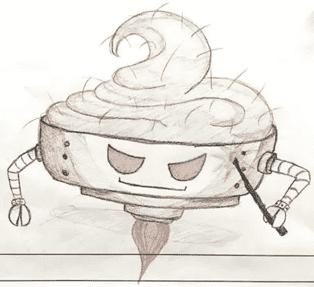

# 儿童设计工作室

> 原文：<https://medium.com/walmartglobaltech/a-design-studio-for-kids-12fbc1343605?source=collection_archive---------1----------------------->

# 背景

这是沃尔玛超市的[带孩子(任)上班日。所以，我们需要想出一些活动来娱乐我们的迷你客人，因此决定为孩子们开办一个指导设计工作室。那天，我们接管了我们的大会议室，并给每位与会者配备了一个装有记号笔、彩色铅笔和糖的礼品袋。很多糖。](http://www.walmartlabs.com/)

# 计划

正如任何有孩子的人或像我这样的退休夏令营辅导员可以证明的那样，让 10 个孩子都吃糖来专注于一个工作流程并不容易。正因为如此，工作室本身的设计需要有一个开放的流程，允许儿童设计团队完全发挥想象力，有一个多峰的参与拱，并提供一个他们可以握在手中的最终结果。

我们决定让他们从头开始创作一款 iPad 游戏。

但诀窍是:

*他们一开始并不知道他们在做一个游戏。那是留到最后的，最后的延伸，大揭露。*

> “今天我们要一起创造一个虚构的故事。听起来是不是很有趣！？！(茫然凝视)那么，一个真正伟大的故事是由什么组成的呢？所有的故事有什么共同点？”

# 过程

我们希望通过活动传达的主题是协作、团队合作和创意。我们想说明的是，通过共同努力，我们可以创造出比任何一个人的想象都要伟大的东西，一个其独创性大于其组成部分之和的最终产品。

我们要以小组为单位写一个故事。首先，通过识别每个故事的共同组成部分(谁，何时/何地，什么，为什么，如何——这显然需要一些指导，但它是联系在一起的。)

*   谁:角色
*   时间/地点:设置
*   什么:任务/剧情
*   原因:动机
*   如何:故事情节

接下来，我们将通过在便利贴上画出个人想法，并将它们放在每个标题下的白板上，来探索每个组件。当每个便条都包含一个想法的草图时，便条练习通常会更有成效，但便条上的一句话也很有用。

# 创造角色

在“人物”的标题下，我们通过分组回顾我们的个人便利贴创造了 4 个主要人物，让每个设计师逐一描述他们的想法。我们将相似的想法组合在一起，决定保留、删除或扩展哪些特征。

## 会见演员

*   **鲁珀特:**一个喜欢冒险的 15 岁男孩，他喜欢苹果。他骑着摩托车，挥舞着某种半自动武器，留着棕色短发，穿着运动服。
*   毛茸茸的布丁:一碗有感知能力、有毛发的机器人布丁。他有喷气推进装置，这使他能够飞来飞去，找到一个“宿主身体”他停靠在受害者的头顶，用魔杖控制他们的思想。他已经 112 岁了，受到所有人的崇拜(很可能是通过精神控制)。他也“非常专注于所有的事情。”
*   **菲奥娜:**聪明的那个。她 13 岁，戴着贝雷帽，有法国口音。她穿着鳄鱼皮鞋和袜子，留着长发，是双胞胎。奇怪的是，她的双胞胎姐妹没有出现在演员表中。
*   **奥莱娜:**13 岁，会说英语和俄语的双语孩子。她是个孤儿，但很强大。她留着短发，穿着背心、裙子、靴子和无指手套。

# 记事板制作

我们制作了一些简单的 iPad 模板，并打印在 11 x 17”的纸上。这些帮助我们构建了独立的场景，然后我们用这些场景将情节串连起来。

# 故事情节

今年是 2048 年。背景是美国阿肯色州的一座后世界末日城市。我们的英雄站在布满高楼和闪电的风景前。还有水…在某个地方。故事开始于鲁珀特被毛茸茸的布丁(贴在他头上)附身，变得邪恶！

鲁珀特骑着摩托车来到废弃的 7-11，他计划在那里与好友菲奥娜和奥莱娜见面。他们一直在阿肯色州寻找治愈困扰世界的所有疾病的神奇原料:布丁中毒、僵尸化和兽人。

他们在一个饼干盒的底部找到了魔法药水的最后一种成分——一个镜子玩具。药水完成了！就在关键时刻，鲁珀特来了，他们骗他喝下了药水，把毛茸茸的布丁变成了一个很好的机器人布丁碗，并一直保持着朋友关系。

# 产品开发

我们用 iPad 应用程序 [Bloxels](https://itunes.apple.com/us/app/bloxels-build-play-share-your/id1041528293?mt=8) 构建了我们的精灵角色鲁珀特，并让他在反乌托邦的未来阿肯色州自由自在。

Building the main character Rupert (in throes of Hairy Pudding possession) into our iPad game using the app “Bloxels”.

# 结尾…

多好玩啊！初级设计团队能够看到最终产品是如何通过合作制成的，我也能够愉快地“浪费”几个小时的工作时间来绘制一个有知觉的机器人布丁碗，它有喷气推进动力。