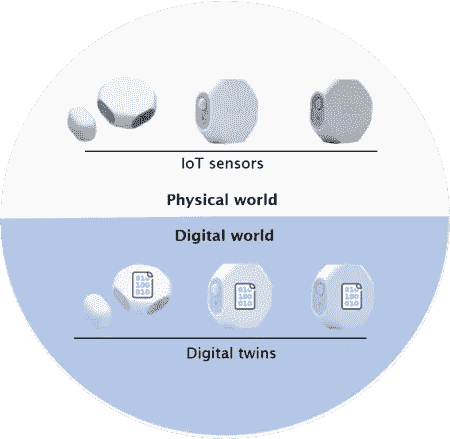
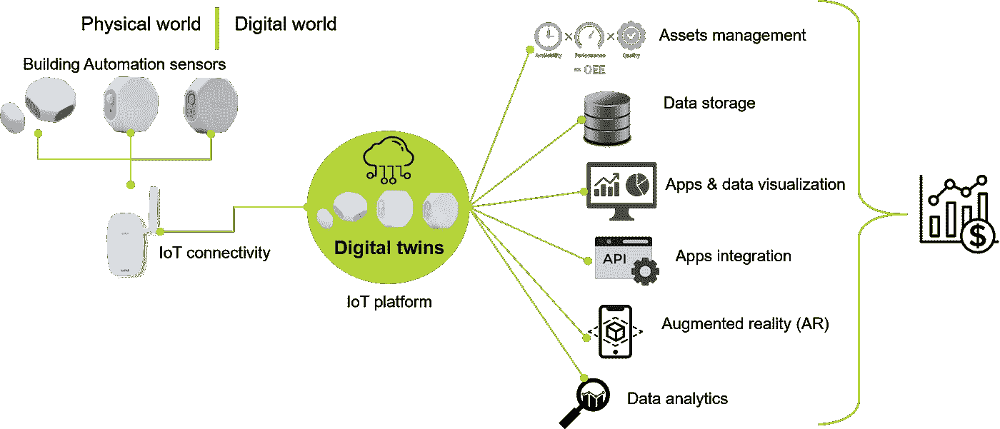
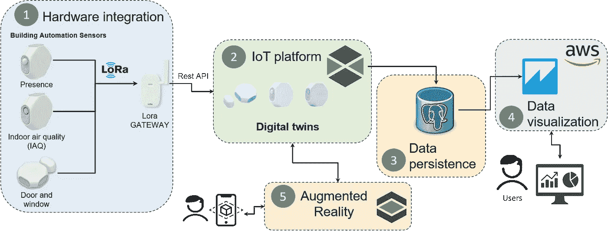
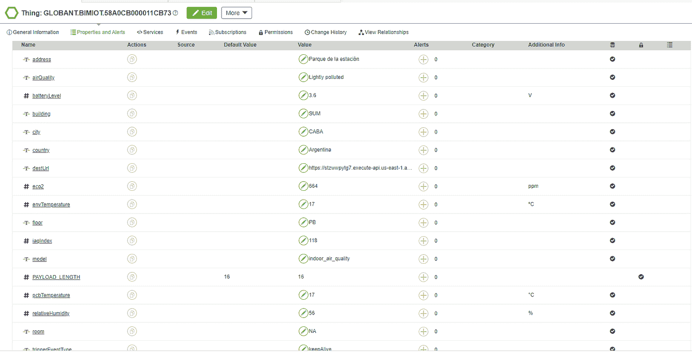
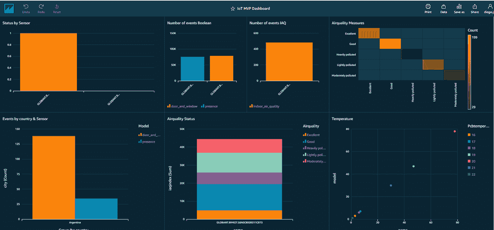
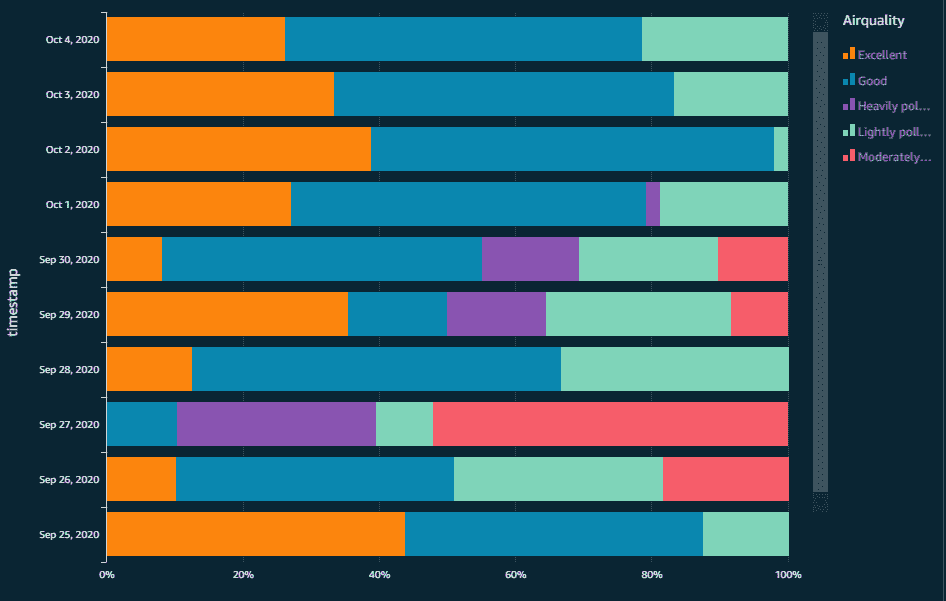
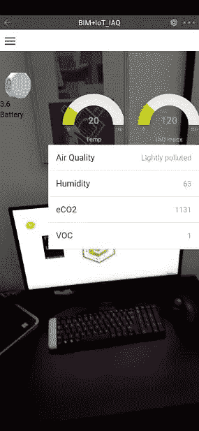

# 数字双胞胎概念验证

> 原文：<https://medium.com/globant/a-digital-twins-poc-b68c633aaeb9?source=collection_archive---------0----------------------->

> 对与物理世界交互的物联网设备进行建模。

# 介绍

本文介绍了 Globant 的物联网工作室和 Data Analytics Studio 之间的合作，旨在实现基于楼宇自动化传感器作为物联网设备的数字孪生概念验证(PoC)。但在深入研究实施的技术方面之前，让我们先从物联网工作室对什么是数字孪生的愿景和理解开始。

下图展示了物理世界和数字世界之间的混合，从中我们可以将数字孪生定义为物联网资产平台(物联网设备)内的数字表示，该平台通过数字解决方案实现旨在积极影响 KPI 和运营效率指标的战略。

Digital twins reference diagram

现在，在接下来的部分中，我们将解释如何实现这种类型的实施，以便部署基于数字双胞胎的解决方案，为楼宇自动化传感器集成物联网平台、数据可视化和增强现实体验。

# PoC 开发组件

下图显示了 PoC 架构和执行期间涵盖的开发阶段，从硬件组件开始，通过用于物联网平台开发的基于云的应用程序的集成、数据可视化、物联网数据的持久性提供者，最后是增强现实(AR)体验开发。

Architecture and development phases

现在让我们看看每个组件:

**1。** **硬件集成**:基于 [LoRa](https://www.semtech.com/lora/what-is-lora) 的楼宇自动化传感器集成，其中三种传感器连接到一个 [Kerlink Wirnet](https://www.kerlink.com/iot-portfolio-and-technologies/connectivity-management/wirnet-indoor-lorawan-gateways/) 网关。本次 PoC 使用的传感器为来自 [Browan](https://www.browan.com/) 的 LoRa [末端节点](https://www.browan.com/product/XP/Rd)的三个参考:[门窗](https://www.browan.com/product/door-window-sensor/detail)传感器、[室内空气质量](https://www.browan.com/product/healthy-home-sensor-iaq/detail) (IAQ)传感器和[存在](https://www.browan.com/product/motion-sensor-pir/detail)传感器。

**2。** **物联网平台**:[ThingWorx](https://www.ptc.com/en/resources/iiot/product-brief/thingworx-platform#:~:text=The%20ThingWorx%20platform%20is%20a,augmented%20reality%20(AR)%20experiences.)平台是一个完整的端到端技术平台，专为工业物联网(IIoT)而设计。它提供工具和技术，使企业能够快速开发和部署应用程序和增强现实(AR)体验。在 ThingWorx 中，进行数字双胞胎建模是为了实时获取基于事件的传感器属性(变量)的更新。下图展示了室内空气质量传感器(IAQ)的数字双图像。

Thingworx IAQ sensor digital twin model

**3。数据持久化:**本 PoC 使用的物联网平台和数据可视化工具的共同点是持久化提供者；在这种情况下，是一个 PostgreSQL 数据库，ThingWorx 在其中存储传感器数据，数据可视化工具从其中连接以获取数据集。

**4。数据可视化** : Amazon [QuickSight](https://aws.amazon.com/quicksight/) 是一个云原生的、无服务器的商业智能，具有原生的 ML 集成和基于使用的定价。这是通过仪表板和报告可视化传感器数据的工具。

Sensors dashboard

根据最终用户的需求，可以基于传感器数据和数据可视化工具的功能实现多种分析和图表。例如，下图显示了一个传感器每天提供的空气质量状况。

IAQ sensor data by day

**5。增强现实(AR)** : 如前所述，所选物联网平台支持快速开发增强现实体验，将物联网数据与图像或 3D CAD 文件等其他资源相集成，以将数字内容覆盖在移动设备捕捉的真实世界图像上。在用于 AR 开发的 PoC 期间使用的工具是 [Vuforia](https://www.ptc.com/en/products/vuforia) ，在下面的屏幕截图中，显示了通过扫描[事物标记](http://support.ptc.com/help/vuforia/studio/en/index.html#page/Studio_Help_Center/GalleryThingMark.html)(类似于 QR 码)触发的 AR 体验，带有传感器、仪表和标签的图像，数据取自数字孪生的属性。

IAQ sensor AR experience

# 结论

我们从数字孪生的定义开始这篇文章，并从那里开始，我们讨论了如何实现一个实施，将物联网平台作为对正在运行并与物理世界交互的资产进行建模的起点。通过物联网平台，可以实现多个应用程序与资产数据的交互，范围从数据存储到增强现实体验，通过数据可视化，在某些情况下还可以与业务应用程序交互，为决策过程添加更多上下文。

在这个概念验证的情况下，想法是扩大到物联网建筑自动化用例，其中传感器和建筑设备将被建模为数字双胞胎，以实现空间分析、资产管理和能效解决方案。

# 承认

我要感谢物联网工作室 Nahuel Carducci、数据和分析工作室 Christian Castiblanco 和 Oscar Gonzalez 在本次概念验证执行期间所做的所有工作和提供的支持。