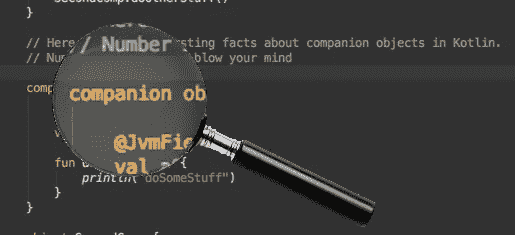

# 关于伴随物体的一些事实

> 原文：<https://blog.kotlin-academy.com/a-few-facts-about-companion-objects-37e18429b725?source=collection_archive---------1----------------------->

Kotlin 给 Java 开发人员带来的最大变化之一是没有了 *static* 修饰符。与 Java 相反，Kotlin 类并不真正允许你声明静态字段或方法。相反，您必须在您的类中添加一个*伴随对象*来包装所有这些静态引用:这种差异可能看起来很小，但是它有一些值得注意的含义。



首先，伴随对象是实际对象的单一实例。实际上，你可以在你的类中声明一个 singleton，并像处理同伴一样处理它。**这意味着在实践中，你并不局限于用一个静态对象来收集你所有的静态属性！**伴随的*关键字*只不过是一个快捷方式，允许您通过类名访问该对象的内容(或者，如果您在特定的类中，则完全删除类名，只使用方法或属性名)。就编译而言，下面的 *testCompanion()* 方法里面的三行都是有效语句。

```
class TopLevelClass {

    companion object {
        fun doSomeStuff() {
            ...
        }
    }

    object FakeCompanion {
        fun doOtherStuff() {
            ...
        }
    }
}

fun testCompanion() {
    **TopLevelClass.doSomeStuff()
    TopLevelClass.Companion.doSomeStuff()
    TopLevelClass.FakeCompanion.doOtherStuff()**
}
```

公平地说，*伴随的*关键字也提供了更多的选项，尤其是与 Java 互操作性相关的选项。如果您尝试在 Java 类中编写相同的测试代码，结果会略有不同:

```
public void testCompanion() {
    TopLevelClass.*Companion*.doSomeStuff();
    TopLevelClass.FakeCompanion.*INSTANCE*.doOtherStuff();
}
```

区别在于:*同伴*在 Java 代码中作为静态成员公开(它是一个对象实例，尽管大写字母 C 容易让人误解),而 *FakeCompanion* 是指我们的第二个单例对象的类名。在第二种情况下，我们需要使用它的 *INSTANCE* 属性来实际访问 Java 中的实例(您可以通过使用 IntelliJ 或 Android Studio 中的*“Show Kotlin Bytecode”*菜单来轻松检查这一点，并点击“反编译”按钮来比较相应的 Java 代码)。

在这两种情况下(来自 Kotlin 或 Java)，使用 companion 对象比使用 fake 对象允许更短的语法。此外，由于一些注释，您可以让编译器生成一些快捷方式，以便于在 Java 代码中使用 Kotlin companion 的内容。

例如，告诉编译器不要生成 getters 和 setters，而是使用 Java 字段。在伴随对象的上下文中，副作用是您所标记的字段将不在该伴随对象中，而是封闭 Java 类的静态字段。从 Kotlin 的角度来看，这没有任何区别，但是如果您查看生成的字节码，您会注意到 companion 对象及其成员都是在与封闭类的静态成员相同的级别上声明的。

另一个有用的注释是 *@JvmStatic。这个注释允许你访问你的同伴对象中声明的方法，作为你的封闭类的静态方法。但是要小心:在这种情况下，方法不会移出伴随对象。编译器只是添加了一个**额外的静态方法**到类中，这个类又委托给了*的同伴*对象(如果你在属性上使用注释，额外的静态 getters 和 setters 将在封闭类中生成)。*

以这个简单的 Kotlin 类为例:

```
class MyClass {
    companion object {
        **@JvmStatic**
        fun aStaticFunction() {}
    }
}
```

下面是相应的 Java 代码(简化的摘录，完整的反编译代码要冗长得多):

```
public class MyClass { public static final MyClass.Companion *Companion* = new MyClass.Companion(); **fun aStaticFunction() {
        Companion.aStaticFunction();
    }** public static final class Companion {
         public final void aStaticFunction() {}
    }
}
```

这是一个非常细微的差别，但在某些特殊情况下可能是个问题。以 Dagger 模块为例。当定义一个 Dagger 模块时，[你可以使用静态方法来提高性能](https://medium.com/square-corner-blog/keeping-the-daggers-sharp-%EF%B8%8F-230b3191c3f#792c)，但是如果你选择这样做，如果你的模块包含静态方法之外的任何东西，编译将会失败。由于 Kotlin 在您的类中包含了静态方法，但也保留了静态伴随对象，因此您无法以这种方式编写只包含静态方法的 Kotlin 类。

但是不要太快放弃！这并不意味着您不能这样做，只是它采用了一种稍微不同的方法:在这种特殊的情况下，**您可以用 Kotlin singleton 的静态方法替换 Java 类(使用*对象*而不是*类*，并在每个方法上使用 *@JvmStatic* 注释**，如下例所示:在这种情况下，生成的字节码不再显示任何伴随对象，静态方法被附加到该类。

```
@Module
**object** MyModule {

    @Provides
    @Singleton
    **@JvmStatic**
    fun provideSomething(anObject: MyObject): MyInterface {
        return myObject
    }
}
```

当你意识到一个伴随对象只是单例对象的一个特例时，这又一次变得有意义了。适用于一方的往往也适用于另一方，反之亦然。但是这至少表明，与许多人认为的相反，**你不一定需要一个伴随对象来拥有静态方法或字段**。你甚至根本不需要一个对象！只需考虑顶级函数或常量:它们将编译为生成类的静态成员(默认情况下，文件名为 *MyFile.kt* ，文件名为 *MyFileKt* )。

我们开始偏离本帖最初的主题，所以让我们回到伴侣对象。既然您已经理解了伴随对象本身就是对象，那么您应该意识到它提供了更多的可能性，比如继承和多态。

这意味着您的伴随对象不必是没有类型或父对象的匿名对象。它不仅可以有父类，甚至可以实现接口并有名字！不需要叫陪伴。这就是为什么你可以这样写一个*可打包的*类:

```
class ParcelableClass() : Parcelable {

    constructor(parcel: Parcel) : this()

    override fun writeToParcel(parcel: Parcel, flags: Int) {}

    override fun describeContents() = 0

    **companion object CREATOR : Parcelable.Creator<ParcelableClass>** {
        override fun createFromParcel(parcel: Parcel): ParcelableClass = ParcelableClass(parcel)

        override fun newArray(size: Int): Array<ParcelableClass?> = *arrayOfNulls*(size)
    }
}
```

这里，伴随对象被命名为*创建者*，它实现了 Android *Parcelable。Creator* 接口，它允许遵守 *Parcelable* 约定，同时比在带有 *@JvmField* 注释的伴随对象中添加 Creator 对象更加清晰(您保存了一个注释和一个缩进级别)。诚然，Kotlin 引入了 *@Parcelize* 注释来省去那些样板代码，但这不是本文的重点…

为了更简洁，如果你的伙伴对象可以实现接口，它甚至可以使用委托来实现:

```
class MyObject {

    companion object : **Runnable by MyRunnable()**}
```

这将允许您同时向几个对象添加静态方法！注意，在这种情况下，伴随对象甚至不需要主体，因为它是由委托提供的(它从来不需要，但是一个完全空的伴随对象有什么意义呢？)…

最后但同样重要的是，您可以为同伴对象创建扩展！这意味着您可以向现有类添加静态方法或属性，如下例所示:

```
class MyObject {

    companion object

    fun useCompanionExtension() {
        *someExtension*()
    }

}

fun MyObject.Companion.someExtension() {}
```

这种事有什么意义？我真的不知道。虽然 [Marcin Moskala](https://medium.com/@marcinmoskala?source=user_popover) 建议使用这个特性来[向类](/effective-java-in-kotlin-item-1-consider-static-factory-methods-instead-of-constructors-8d0d7b5814b2#6985)添加工厂扩展。

总而言之，伴随对象不仅仅是缺少静态修饰符的人的一种变通方法:

*   它们是真正的 Kotlin 对象，具有完整的名称和类型，以及一些额外的功能。
*   它们甚至不需要静态成员或方法。单例对象或顶级函数还有其他选项。

和大多数事情一样，Kotlin 意味着你的设计过程有一点点改变，但是与 Java 相比，它并没有真正限制你的选择。如果说有什么不同的话，那就是通过提供一些新的、更干净的选择，让它们变得开放了一些。

了解卡帕头最新的重大新闻。学院，[订阅时事通讯](https://kotlin-academy.us17.list-manage.com/subscribe?u=5d3a48e1893758cb5be5c2919&id=d2ba84960a)，[观察 Twitter](https://twitter.com/ktdotacademy) 并在媒体上关注我们。

[](http://eepurl.com/diMmGv)

喜欢的话记得**拍**。请注意，如果您按住鼓掌按钮，您可以留下更多的掌声。