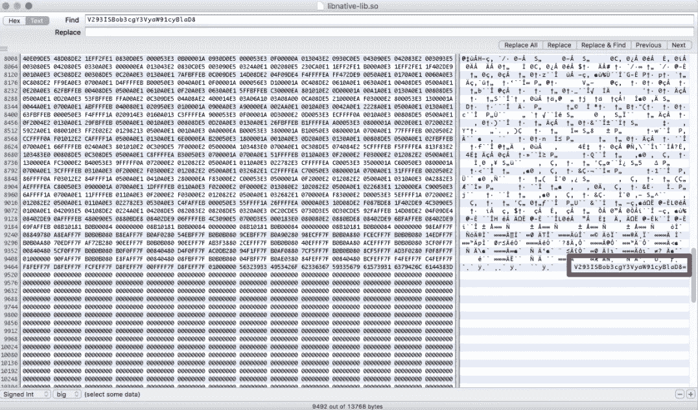

# 关于如何在 Android 中安全存储令牌的后续文章

> 原文：<https://medium.com/google-developer-experts/a-follow-up-on-how-to-store-tokens-securely-in-android-e84ac5f15f17?source=collection_archive---------0----------------------->


作为这篇文章的序言，我想为名义上的读者提一个简短的句子。这句话在我们前进的过程中非常重要。

> 绝对安全是不存在的。安全是一套措施，被堆积和组合，试图减缓不可避免的。

大约三年前，我写了一篇文章,给出了一些保护字符串令牌免受一个假想的攻击者反编译我们的 Android 应用的想法。为了纪念，也为了避开互联网不可避免的死亡，我在这里复制一些章节。

最常见的一个用例发生在我们的应用程序需要与 web 服务通信以交换数据的时候。这种数据交换可以从不太敏感到更敏感，并且在登录请求、用户数据变更请求等之间变化。

首先要应用的措施是在客户端和服务器之间使用一个 [SSL](http://info.ssl.com/article.aspx?id=10241) (安全套接字层)连接。再次回到最初的报价。这并不能确保绝对的隐私和安全，尽管这是一个很好的开始。

当您使用 SSL 连接时(就像您在浏览器中看到的锁)，这表明您和服务器之间的连接是加密的。在理论层面上，没有任何东西可以访问此请求中包含的信息 **(*)**

**(*)** 我有没有说过绝对的安全是不存在的？SSL 连接仍然可能受到威胁。本文并不打算提供所有可能的攻击的详细列表，但是我想让您知道一些可能性。可以使用伪造的 SSL 证书，以及中间人攻击。

让我们继续前进。我们假设我们的客户端通过一个加密的 SSL 通道与我们的后端进行通信。他们在交换有用的数据，做生意，开心。但是我们想提供一个额外的安全层。

现今使用的下一个逻辑步骤是提供将在通信中使用的认证令牌或 API 密钥。它是这样工作的。我们的后台收到一份请愿书。我们怎么知道这个请求来自我们的一个经过验证的客户，而不是一个试图访问我们 API 的普通人呢？后端将检查客户端是否提供了有效的 API 密钥。如果前面的陈述恰好是真的，那么我们继续请求。否则，我们否认它，并根据我们业务的性质采取一些纠正措施(当这种情况发生时，我特别喜欢存储来自客户端的 IP 和 id，以查看这种情况发生的频率。当频率膨胀超过我的品味所期望的时候，我确实会考虑禁止或者密切观察这个不礼貌的互联网人想要达到的目的。

让我们从地面开始建造我们的城堡。在我们的应用程序中，我们可能会添加一个名为 API_KEY 的变量，该变量会在每个请求中自动注入(如果您使用的是 Android，可能会在您的改型客户端中)。

```
private final static String API_KEY = “67a5af7f89ah3katf7m20fdj202”
```

这很棒，如果我们想验证我们的客户，这很有用。问题是它本身并不能提供一个非常有效的层。

如果您使用 [apktool](https://ibotpeaches.github.io/Apktool/) 来反编译应用程序并执行查找字符串的搜索，您将在结果中找到一个。smali 提交了以下文件:

```
const-string v1, “67a5af7f89ah3katf7m20fdj202”
```

是啊，当然。它没有说这是一个验证令牌，所以我们仍然需要进行细致的验证，以决定如何到达这个字符串，以及它是否可以用于身份验证目的。但是你知道我要去哪里:这主要是时间和资源的问题。

Proguard 能帮助我们保护这个字符串吗，这样我们就不用担心了？不完全是。Proguard 在[的 FAQ](http://proguard.sourceforge.net/FAQ.html#encrypt) 中声明字符串加密并不是完全可能的。

如何将这个字符串保存在 Android 提供的其他机制中，比如 SharedPreferences？这几乎不是一个好主意。SharedPreferences 可以从模拟器或任何根设备轻松访问。几年前，一个叫[斯里尼瓦斯](http://resources.infosecinstitute.com/android-hacking-security-part-9-insecure-local-storage-shared-preferences/)的家伙证明了分数可以在电子游戏中被改变。我们已经别无选择了！

## 本地开发工具包(NDK)

我将在这里更新我提出的初始模型，以及我们如何迭代它以提供更安全的替代方案。让我们想象两个可以用来加密和解密数据的函数:

这里没什么特别的。这两个函数将接受一个键值和一个要编码或解码的字符串。它们将分别返回加密或解密的令牌。我们将调用如下函数:

你在猜测方向吗？没错。我们可以按需加密和解密我们的令牌。这提供了额外的安全层:当代码变得模糊时，它不再像执行字符串搜索和检查该字符串周围的环境那样简单。但是你还能想出一个需要解决的问题吗？

可以吗？

如果你还没想出来，多给它几秒钟。

是的，你是对的。我们有一个也以字符串形式存储的加密密钥。这通过模糊性增加了更多的安全层，但是我们仍然有一个明文令牌，不管这个令牌是用于加密还是令牌本身。

让我们现在使用 NDK，并不断迭代我们的安全机制。

NDK 允许我们从我们的 Android 代码中访问 C++代码库。作为第一种方法，让我们花一分钟时间想想该做什么。我们可以有一个原生的 C++函数来存储一个 API 键或者我们试图存储的任何敏感数据。这个函数以后可以从代码中调用，任何 Java 文件中都不会存储任何字符串。这将提供针对反编译技术的自动保护。

我们的 C++函数如下所示:

在 Java 代码中很容易调用它:

加密/解密函数将在下一个代码片段中调用:

如果我们知道生成一个 APK，混淆它，反编译它，并试图访问包含在本机函数 getSecretKey()中的字符串，我们将无法找到它！胜利？

不完全是。NDK 代码实际上可以被分解和检查。这变得越来越困难，你开始需要更先进的工具和技术。您摆脱了 95%的脚本小子，但是一个拥有足够资源和动力的团队仍然能够访问令牌。还记得这句话吗？

> 绝对安全是不存在的。安全是一套措施，被堆积和组合，试图减缓不可避免的。



You can still access in disassembled code String literals!

例如，Hex Rays 在反编译原生文件方面做得非常好。我相信也有很多工具可以解构 Android 生成的任何本机代码(我与 Hex Rays 没有任何关系，也没有从他们那里获得任何形式的金钱补偿)。

那么，我们可以使用哪种解决方案在后端和客户端之间进行通信而不被标记呢？

**在设备上实时生成密钥。**

您的设备不需要存储任何类型的密钥，也不需要处理保护字符串文字的所有麻烦！这是远程密钥验证等服务使用的一种非常古老的技术。

1.  客户端知道一个返回密钥的函数()。
2.  后端知道客户机中实现的函数()
3.  客户端通过函数()生成一个密钥，并将其传递给服务器。
4.  服务器验证它，并继续处理请求。

你把这些点联系起来了吗？与其有一个返回字符串(容易识别)的原生函数，为什么没有一个返回 1 到 100 之间三个随机素数之和的函数呢？或者是一个用 unixtime 表示的当前日期并在每个不同的数字上加 1 的函数？如何从设备中获取一些上下文信息，例如正在使用的内存量，以提供更高程度的熵呢？

最后一段包括了一系列的想法，但是我们假设的读者希望已经抓住了要点。

# **总结**

1.  绝对安全是不存在的。
2.  组合一套保护措施是实现高度安全性的关键。
3.  不要在代码中存储字符串。
4.  使用 NDK 创建一个自己生成的密钥。

还记得第一句话吗？

> 绝对安全是不存在的。安全是一套措施，被堆积和组合，试图减缓不可避免的。

我想再次指出，你的目标是尽可能多地保护你的代码，同时不要忘记 100%的安全性是无法实现的。但是，如果您能够以一种需要大量资源来解密您拥有的任何敏感信息的方式来保护您的代码，您将能够睡得安稳。

# 一个小小的免责声明

我知道。直到这里，你一直在思考整篇文章“这家伙怎么不提[德克斯加德](https://www.guardsquare.com/en/dexguard)，还经历了这么多麻烦？”。你是对的。Dexguard 实际上可以混淆字符串，他们在这方面做得非常好。然而，Dexguard 的定价[可能会令人望而却步](http://thinkdiff.net/mobile/dexguard-480-eur-to-10313-eur-the-worst-software-do-not-use/)。我在以前的公司使用过 Dexguard 的关键安全系统，但这可能不是每个人的选择。而且，在软件开发和生活中，你拥有的选择越多，世界就越丰富。

编码快乐！

我在我的 [Twitter 账户](https://twitter.com/eenriquelopez)中写下我对软件工程和生活的想法。如果你喜欢这篇文章或者它确实帮助了你，请随意分享它，♥它和/或留下评论。这是给业余作家加油的货币。