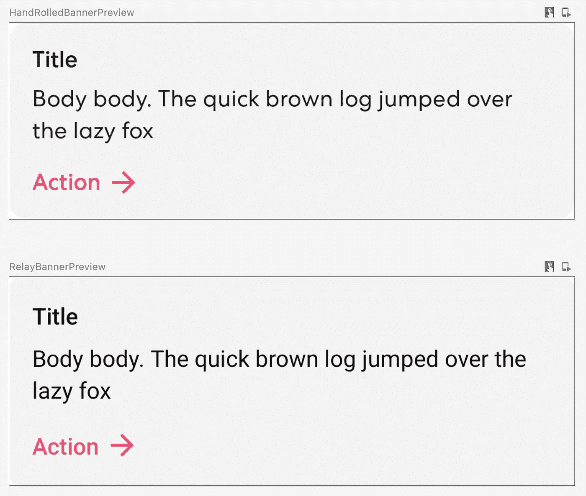

# 对接力赛的尝试

> 原文：<https://medium.com/google-developer-experts/a-foray-into-relay-a95a899fb85f?source=collection_archive---------1----------------------->


Source: [Android Developers documentation](https://developer.android.com/jetpack/compose/tooling/relay)

在 2022 年的 [Android Dev Summit 的第一场会议中，我们听说了重新命名和打扮的](https://www.youtube.com/watch?v=6PgzGXZt5Fg)[材料设计代码](https://material.io/blog/designtocode)，现在被称为 [**继电器**](https://relay.material.io/) 。Relay 提供了设计人员和开发人员之间的 Android UI 组件的即时传递，从 Figma 获取打包的组件，并生成 Android Compose 代码供您的应用程序使用！

近年来，设计到开发者的交接一直是人们热议的话题，这一声明在网上引发了一系列问题。从实现细节开始，比如“*这是如何与 X 一起工作的？*"，到类似于"*的架构关注点，这是否引入了耦合灾难？*"和"*iOS 呢？*”，所有人都沸腾到了“*这是为了谁？*”。我与 Sharesies 的设计师本·怀特合作，对接力进行实验，并得出了一些答案！

elay 由一个面向设计师的 Figma 插件、一个 Android Studio 插件以及一个面向开发者的 Gradle 插件组成。一旦设置好了，将 UI 从设计者移交给开发人员的工作流程就非常简单了:

1.  在 Figma 中打包一个组件，指定参数
2.  使用 Figma 文件的链接，在 Android Studio 中导入 UI 包
3.  构建您的项目，并开始使用生成的代码

这三个步骤看起来很简单，根据我们的经验，它确实做到了罐头上所说的。我们来看一个例子！

注意，我们将跳过设置这一步，直接使用它，但是为了便于参考，[下面是如何设置](https://developer.android.com/jetpack/compose/tooling/relay/install-relay)。

# 用继电器实现一个简单的组件

在 Sharesies 应用程序中，我们的设计系统中有一个横幅组件，用于向用户展示重要、简洁和可操作的信息。例如，在我们的通知设置屏幕中，如果通知在系统级别被禁用，我们会显示一个横幅。


“Your push notifications are off” banner, from the Sharesies app

这个组件已经存在于我们的设计系统中，并且相对简单，同时允许我们使用 Relay 的所有功能，所以这是一个很好的尝试。

我们从 Figma 开始，将组件打包成亮暗模式变体，并为我们希望开发人员能够控制的东西分配参数。我们发现很多参数已经被填充了一半，Figma 中的字段类型被用来推测参数应该是哪种类型。整洁！


Bundling up a UI component with Figma

从这里，我们完成了 Figma，可以转移到 Android Studio。

## 投入我们的接力横幅

然后我们继续将组件作为 UI 包导入到我们的项目中。按照[代码](https://developer.android.com/jetpack/compose/tooling/relay/convert-designs-android-studio#import-design)导入设计的基础教程，这也很容易解决。我们按照步骤，点击 build，找到了一堆生成的代码。大获成功！

通读这段代码时，生成的代码有点冗长，但是它生成的开发人员 API 非常简洁，与打包的组件非常匹配。

```
Banner( 
  title = “Title”, 
  body = “Body body. The quick brown log jumped over the lazy fox”, 
  action = “Action”, 
  onAction = {} 
)
```

然后，我们将生成的横幅放到一个`@Preview`中，并在手工实现的旁边检查它。



Comparing a hand-rolled UI component to a Relay-generated one

这里有一些差异，这就说得通了！我们在 Sharesies 应用中使用了完全自定义的主题实现，使用了谷歌字体中没有的字体。这在很大程度上遵循了与`MaterialTheme`相同的结构，但它不是一个实质性的主题，所以我们的样式不会自动向下流动到横幅中的可组合组件。

## 主题映射

为了解决我们的主题问题，我们查看了 Relay 的一个实验性特性，[将样式映射到一个撰写主题](https://developer.android.com/jetpack/compose/tooling/relay/mapping-styles-to-compose-theme)。这个特性允许我们将 Figma 中的命名样式映射到标记，然后从标记组合主题属性。我们能够覆盖生成的代码指向的主题的类型和包，这允许我们将 Figma 样式直接指向它们的 Compose 等价物！

映射在`json`中定义，并在导入组件时提供给中继。映射文件看起来有点像这样:

```
{  
  "figma": {  
    "colors": {  
      "Label/Light/Primary": "sh.sys.color.label-primary",  
      ...
    },  
    "typography": {  
      "symbols": {  
        "android/label": "sh.sys.typescale.label",  
      },  
      "subproperties": {  
       // Omitted for brevity
      }  
    }  
  },  
  "compose": {  
    "colors": {  
      "sh.sys.color.label-primary": "Theme.color.label", 
      ...
    },  
    "typography": {  
      "symbols": {  
        "sh.sys.typescale.label": "Theme.text.label",  
      },  
      "subproperties": {  
       // Omitted for brevity
      }  
    },  
    "options": {  
      "packages": {  
        "Theme": "nz.sharesies.core.ui.theme"  
      }  
    }  
  }  
}
```

如您所见，这里有两种不同的映射。我们首先从 Figma 定义的样式转换为“figma”对象中的通用标记。然后，我们从标记映射到“组合”对象中的组合主题引用，指定一些附加选项以允许中继编译器导入和引用正确的类。注意，为了简洁起见，我们在这里省略了一些排版子属性映射。如需完整的示例，请查看用于材料设计套件的[映射文件。](https://relay.material.io/static/assets/tutorial-files/MaterialStyleTranslations.zip)

重新导入我们的组件并构建应用程序并没有改变我们的代码，但是我们的预览现在看起来像我们期望的那样！


Comparing a hand-rolled UI component to a Relay-generated one, now with Theme Mapping

随着主题映射的工作，我们的组件现在在我们基于 Figma 的设计系统中有了真实的来源。从这里开始，当系统改变时更新我们的组件就像在 Android Studio 中点击一个按钮一样简单。

# 《接力回顾:回答的问题》

总而言之，使用中继是非常无缝的。在 alpha 中，Android 中的库和工具可能会被随意使用，但是考虑到作为编码材料设计的继电器历史，很多工具都感觉稳定和实用。

整体接力感觉像是一个经过深思熟虑的工具。它允许您使用 Figma 中的版本化设计系统组件作为事实的来源，这从设计系统的角度来看非常好。这需要一个非常严格的设计过程，根据你的环境，这个过程是非常容易管理的。

使用 Relay 肯定比手工构建组件要快，但是，您确实错过了手工构建的一些好处，比如非常谨慎地处理交互和可访问性。它确实需要设计和开发之间更多的沟通来解决诸如参数命名之类的问题，但是不必编写代码所节省的时间超过了它。

## iOS 呢？

中继不支持 iOS。然而，如果我们看看主题映射系统的平台无关性，想象在未来的某个版本中会有 Swift UI 支持并不疯狂。即使没有 iOS 支持，在 Figma 中打包 Relay 的组件也很容易，只在一个平台上完成也是可行的。如果您的环境允许，没有 iOS 支持不应该成为一个障碍。

## 耦合和锁定

这种方法的一些巨大缺点是耦合和锁定。将一个真实的来源转移到代码库之外的系统会有一系列与之相关的内在风险，尤其是在兼容性方面，这也是耦合负面影响的来源。例如，如果 Figma 更改并破坏了 Relay 插件，您将无法更新组件，直到 Relay 更新。同样，如果你让你的代码库过时了，很有可能你需要做些工作来恢复它与 Relay Figma 插件的兼容性。

锁定是这种方法的另一个明显的缺点。Relay 依赖 Figma 作为设计者设计和维护设计系统的首选工具。如果由于其他地方发布了更新、更好的工具，这种情况在几年后会发生变化，您应该:

*   必须运行两套独立的设计工具，或者
*   手动重新实现您的 Android UI 组件，或者
*   希望 Relay 得到维护，并支持新的设计工具套件

如果你有专门的时间花在设计系统工作上，并且设计系统足够全面以保证这种处理，这些缺点可以减轻，但是这将是相当主观的。这让我们进入下一个也是最后一个问题:**这是给谁的？**

# 这是给谁的？

所以——Relay 只支持 Android，相当健壮且经过深思熟虑，需要一个基于 Figma、版本完善的设计系统。并非每家公司都处于使该解决方案物有所值的适当扩展阶段，让我们看一些例子。

## 小团队或单人开发

在 Sharesies，我们是一个相当小的移动团队。总的来说，我们由八个人组成，其中四个是开发人员 Android 和 iOS 各两个。我们正在尽可能快地构建原生功能，同时花一些时间努力确保我们所构建的是为未来建立共享。其中一部分包括一个设计系统，这个系统目前主要由团队所有。

考虑到我们是一个小团队，行动迅速，变化频繁，我们的设计系统相当灵活。随着我们对应用程序如何融入 Sharesies 品牌的理解越来越多，我们会改变组件和风格，这可能非常频繁。最大限度地减少我们工作中的流程可以让我们更快地工作，而不是依靠团队内部的良好沟通来保持事情的一致性。

对于像我们这样的小团队，或者单独的开发人员来说，接力感觉是不值得的。当然，它会为您编写代码，但是 Compose 让您自己编写代码变得如此容易，以至于使用它所需的额外工作流实际上会使事情变得更慢。

## 大中型组织

随着组织规模的扩大，情况会发生变化，良好的流程和明确的沟通途径会使事情变得更容易。如果你在一个有不止两个移动团队的公司里建立一个设计系统，很有可能你已经遵循了一个适合接力工作方式的过程。在这种情况下，Relay 几乎是显而易见的——它节省了开发人员的时间，几乎不需要额外的设计工作，同时还将系统的真实来源转移到更规范的地方。

当你到达天平的较大一端时，接力可能又开始提供较少的好处。在世界上一些较大的移动开发公司中，你会发现一些团队致力于为其他团队提供完善的、完全可访问的设计系统。这些团队已经有了根深蒂固的从设计到开发的交接流程，并且可能会花额外的时间来微调他们的 UI 组件，以提供最佳的用户和开发人员体验。Relay 的[将组件映射到现有的代码](https://developer.android.com/jetpack/compose/tooling/relay/mapping-components-to-existing-code)功能可能会为这些组织提供一点额外的价值，但除此之外，我可以看到它是一个硬推销。

# 结论和估计

总结一下，这是我的估计。Relay 是一个漂亮的工具，它有可能节省开发人员编写和设计系统的大量时间。限制肯定是存在的，主要是因为它还处于早期阶段，但是根据您的移动团队的规模和形式，已经存在的东西可能是有益的。如果你太小或太大，Relay 可能不适合你，但如果你适合“一个团队”和“成千上万的移动开发者”之间的某个地方，你会在其中找到有价值的东西。

如果我必须推测接力赛的走向，我认为有两条路。一种途径是 Relay 继续做它所做的事情，而且做得非常好——包括对高级交互功能进行建模的功能，以及 Figma 中定义的可访问性行为。沿着这条路，我们可能也会看到 iOS 支持。另一条路是走向通用化——允许 Relay 生产整个屏幕而不是组件，并将其用于*的一切*。后一条路让我有点害怕，因为软件的一般化延伸了抛光薄，主要导致边缘案例和缺失特性。我希望并期待接力走第一条路。

接力是一个有趣的解决方案——不要只相信我的话，试试看！如果你喜欢这个帖子并想看更多，请关注我的[媒体](/@jamiesanson)。或者，我会交叉发布到我自己的个人博客上，我偶尔会发微博。

*本页部分内容转载自 Android 开源项目* *创作的作品* [*，并根据*](http://code.google.com/policies.html) [*知识共享 2.5 归属许可*](http://creativecommons.org/licenses/by/2.5/) *中描述的条款使用。*