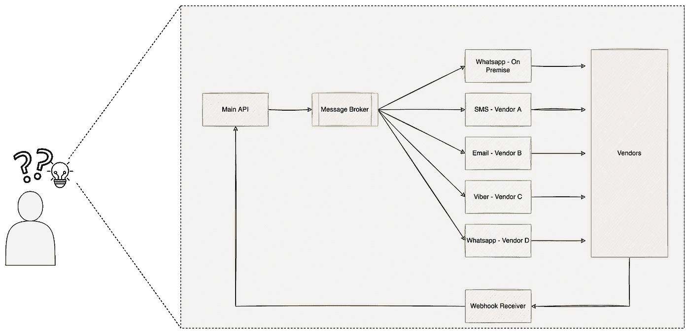
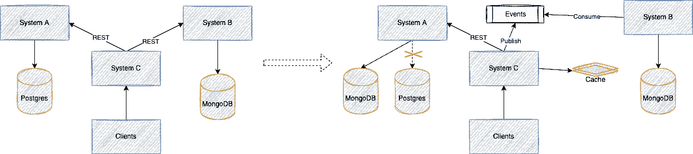
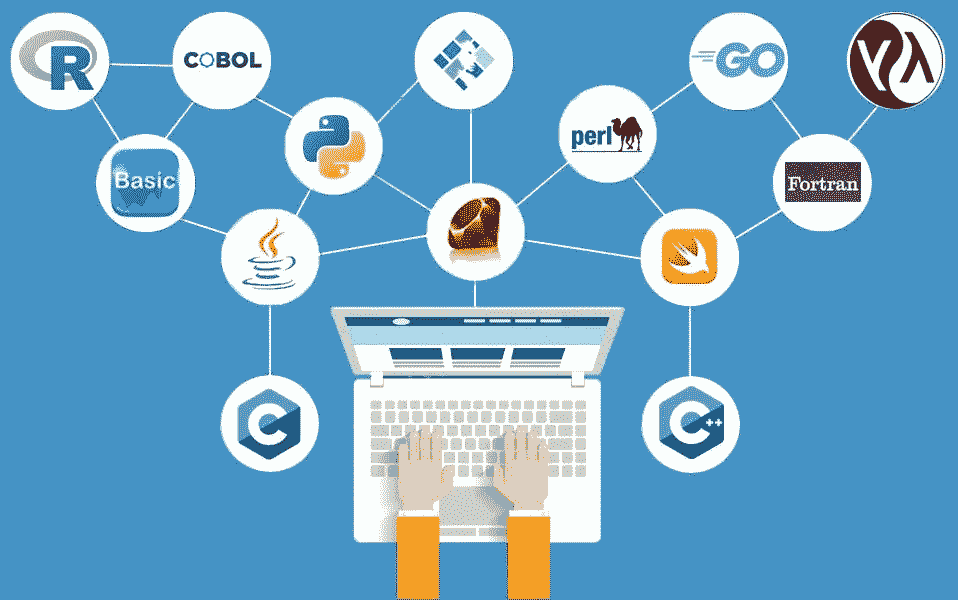
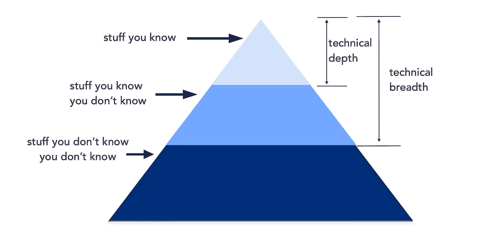
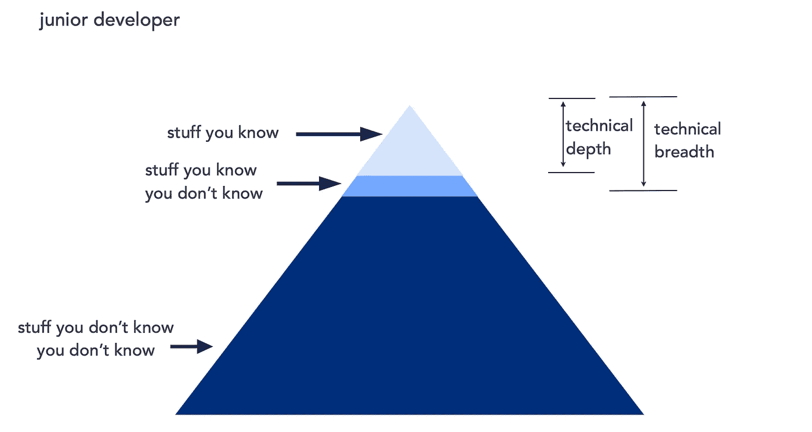
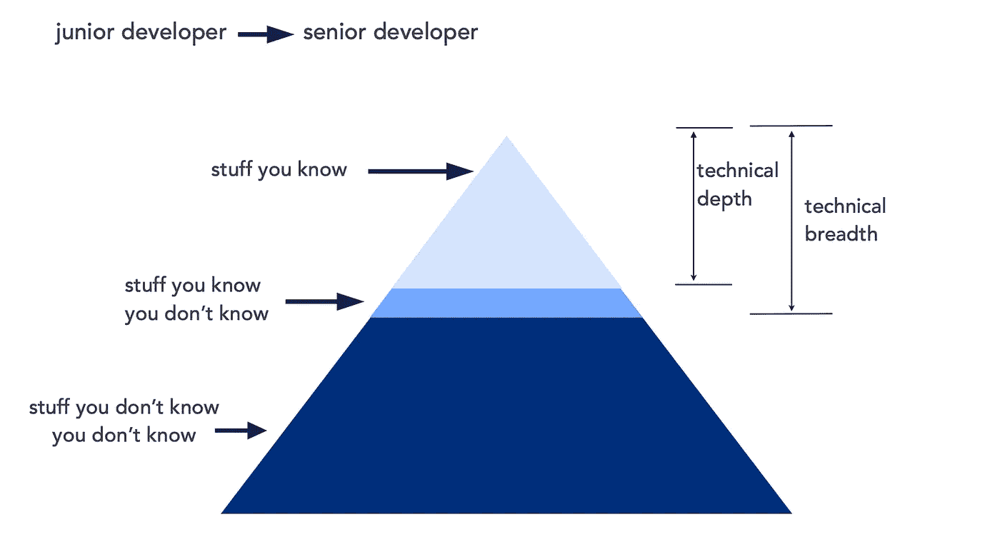
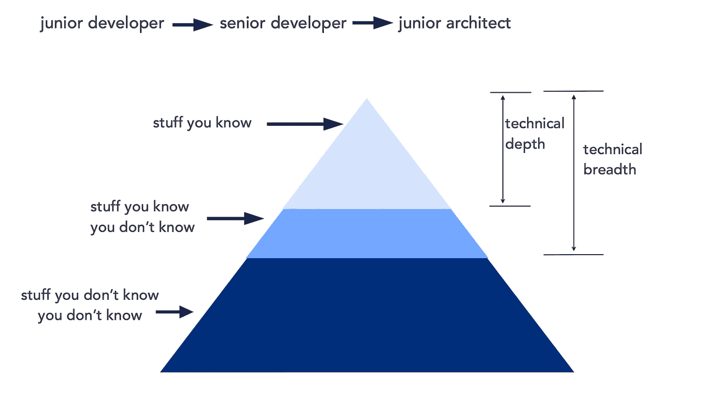
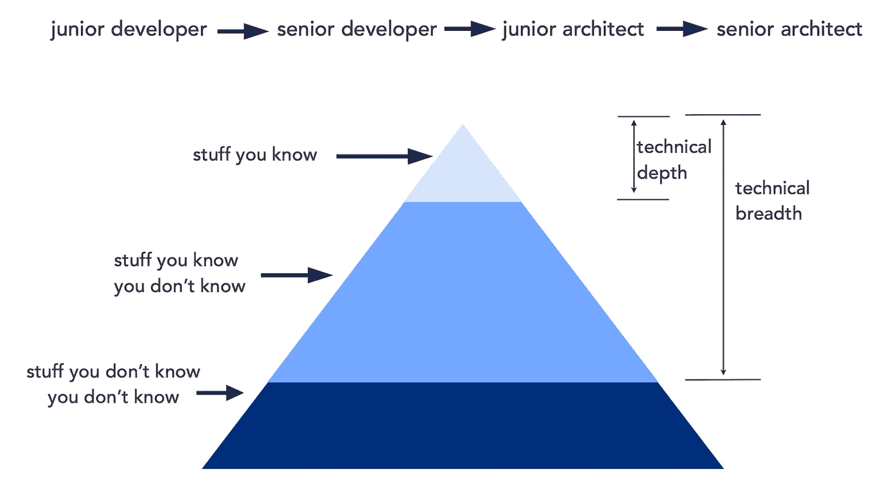
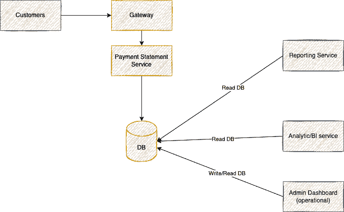
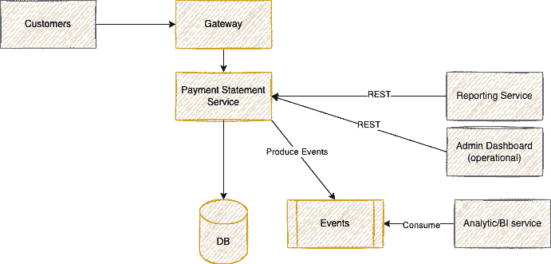

# A Glimpse of how to Striving to be A Full-Fledged Software Architect

> 原文：<https://medium.easyread.co/a-glimpse-of-how-to-striving-to-be-a-full-fledged-software-architect-b27f75b66294?source=collection_archive---------1----------------------->

## Mengenal ekspektasi yang diharapkan dari Seorang Software Architect dan memenuhi ekspektasi tersebut untuk pertumbuhan pribadi, perusahaan dan ekosistem.

Photo by [Daniel McCullough](https://unsplash.com/@d_mccullough?utm_source=medium&utm_medium=referral) on [Unsplash](https://unsplash.com?utm_source=medium&utm_medium=referral)

Beberapa hari terakhir, saya baru belajar sedikit tentang Software Architect. Karna hal tersebut, saya pun menulis ini bertujuan agar saya tidak lupa dengan apa yang telah saya pelajari + mungkin bisa berguna kepada orang lain juga.

Nah di catatan kali ini, saya akan membahas tentang ekspektasi yang diharapkan dari seorang Software Architect, atau setidaknya berdasarkan dari hal yang saya pelajari beberapa minggu belakangan ini.

Sebagai konteks, saya baru saja belajar tentang Software Architect, dari Mark Richards, merupakan penulis buku dari [**Fundamentals of Software Architecture: An Engineering Approach**](https://www.amazon.com/gp/product/1492043451) dan [**Software Architecture: The Hard Parts: Modern Trade-Off Analyses for Distributed Architectures**](https://www.amazon.com/Software-Architecture-Tradeoff-Distributed-Architectures/dp/1492086894/)

Beliau menyatakan, terdapat beberapa ekspektasi yang diharapkan dari seorang Software Architect, yang dimana setelah mendengarkan hal tersebut, saya pun semakin terbuka dan terbebani termotivasi dengan role yang saya emban saat ini.

Adapun ekspektasi yang diharapkan adalah sebagai berikut,

*   Menentukan keputusan terkait Architecture dan Design Principles
*   Menganalisa dan meningkatkan ekosistem teknologi yang dipakai di perusahaan secara berkelanjutan
*   Menganalisa tren teknologi yang terbaru yang ada dipasaran dan tetap update dengan tren tersebut.
*   Memastikan semua tim yang terlibat mengikuti rule/prinsip architecture yang telah disepakati
*   Memiliki pengetahuan dengan beragam jenis teknologi tidak terbatas pada platforms, programming language, dan sebagainya
*   Memiliki pengetahuan yang cukup dengan domain bisnis perusahaan
*   Memiliki skill interpersonal yang baik, termasuk pada kerja-sama, negoisasi, fasilitator dan sebagainya
*   Mengetahaui iklim politik yang ada dan harus mampu menjadi navigator iklim tersebut.

Ya demikianlah list ekspektasi yang diharapkan dari seorang Software Architect menurut Mark Richards. Saya akan coba jelaskan maksud dari hal tersebut secara detail dengan bahasa saya sendiri. Saya tidak akan menjelaskan semua, karna menurut saya beberapa point tersebut masih saling bersinggungan.

Dari beberapa point diatas, dapat saya simpulkan beberapa hal yang diharapkan dari seorang software architects, yang akan saya jelaskan berikut.

# 1\. Menjadi Pawang Architecture Decision dan Design Principles

Berbicara tentang “pawang”, kita mungkin sudah cukup familiar. Beberapa minggu yang lalu, pawang hujan lumayan terkenal karena aksinya di sirkuit Mandalika, Lombok. Pawang dapat diartikan sebagai orang yang memiliki keahlian terhadap suatu bidang. Orang yang memiliki kontrol terhadap *flow* dibidang tersebut. Pawang hujan juga dapat diartikan sebagai orang yang mengontrol *flow-* nya hujan.

Demikian juga seorang Software Architect, mereka diharapkan mampu menjadi pawang, driver, dan pemandu kepada semua orang terhadap kebutuhan arsitektur sistem yang ada.

Dimulai dari mendefinisikan solusi yang disepakati, desain arsitektur, *design principles* , dan rule-rule lainnya terkait dengan Software Architecture.

Maka untuk itu, seorang Software Architect diharapkan mampu membuat sebuah keputusan yang akan menjadi acuan atau dasar terhadap software developer dan stakeholders lainnya. Keputusan yang dibuat tentu saja tidak melulu dari si Software Architect sendiri, bisa saja dari tim secara konsensus. Namun, sebagai Software Architect, dia/mereka harus menjadi *driver* dan *rule enforcer* saat keputusan itu disepakati oleh setiap tim. Dalam artian menjadi pawangnya arsitektur dan *principle* di semua tim yang terlibat.

# 2\. Menganalisa dan Meningkatkan System di Perusahaan Secara Terus Menerus Mejadi Lebih Baik

Suatu hari, sebut saja si John Snow. Merupakan seorang Software Architect di perusahaan Tumorang Finance. Tumorang Finance merupakan perusahaan bonafit dan multinasional di bidang Digital Insurance. Saat ini Tumorang Finance, sedang gencar-gencarnya ekspansi ke multinasional dan sedang mencoba memasuki pasarnya Indonesia

Karena beberapa *constraint* , ekspansi ke tiap negara mungkin berbeda-beda secara sistem dan aplikasi, sehingga John Snow sebagai Software Architect di Tumorang Finance diharapkan membuat desain arsitektur untuk sistem Tumorang Finance di Indonesia.

Lalu singakat cerita, John Snow pun berhasil membuat semua *design principles* dan desain arsitektur untuk sistem Tumorang Finance yang baru di Indonesia. Lalu kemudian saat sistem tersebut dijalankan, sistem itu berjalan dengan baik. Atas kinerja John Snow, semua pihak senang, pihak executive senang karena bisnis Tumorang Finance berhasil berjalan dengan baik di Indonesia, tim product, sales, marketing, dan bahkan engineer juga senang , semua orang yang terlibat senang.

Lalu John Snow pun ditarik dari medan perang, dan di *assign* dengan projek baru lainnya di Tumorang Finance. Dan John Snow pun melupakan semua keputusan arsitektur dan desain serta *principles* yang pernah dia buat sebelumnya untuk sistem tersebut.

Ini bukanlah hal yang baik. Seharusnya seorang Software Architect, bertanggung jawab terhadap sistem yang dia buat. Bisnis mungkin bisa berubah (pivot) seiring waktu berjalan, atau *compliance* dan regulasi di Indonesia mungkin berubah. Sehingga arsitektur pun harus berubah mengikuti permintaan bisnis atau regulasi yang berjalan. Sehingga jika Software Architect langsung lepas tangan terhadap perubahan(pivot) tersebut, maka desain dan keputusan arsitektur serta *principles* yang pernah dia buat akan menjadi *blocker* dan *bottleneck* untuk perkembangan bisnis.

Dari sini, dapat disimpulkan, Software Architect harus terus menganalisa proses serta mengembangkan proses ataupun sistem pada perusahaan (product/bisnis unit) yang dia kerjakan. Tidak hanya proses, bahkan mungkin teknologi yang mereka pakai juga akan menjadi usang atau tidak relevan sesuai kebutuhan bisnis lagi, maka si Software Architect harus tetap memperbaharui desain dan keputusan arsitektur serta *principles* yang dia buat terhadap sistem tersebut.

# 3\. Update dengan Trend Teknologi, dan Tetap Belajar Terhadap Ekosistem Teknologi di Pasaran

Seorang Software Architect, diharapkan terbuka dan update dengan teknologi yang ada dipasaran. Tidak harus spesifik terhadap suatu brand, namun setidaknya mengetahui fungsi yang ditawarkan oleh brand-brand tersebut di pasaran. Contohnya, Messaging Queue, merupakan sebuah platform yang menawarkan fungsi untuk menangani antrian *request/messages* dalam skala besar. Brand yang tersedia dipasaran mungkin banyak, seperti RabbitMQ, SQS, NSQ, dan sebagainya. Cara penggunaan semua brand tersebut pun berbeda satu sama lain. Kita tidak perlu mengetahui semua cara menggunakan brand tersebut, namun satu hal yang pasti, kita tahu bahwa semua brand tersebut menawarkan fungsi yang hampir mirip untuk menangani antrian *request/messages* dalam sekala besar.

Software architect (tidak) harus menjadi ekspert di *brand* *platform* tersebut, namun memiliki pengetahuan dasar yang cukup membuat Software Architect dapat menggunakannya pada kebutuhan sistem yang akan dirancang dan dibangun nantinya.

Untuk mengikuti tren dan tetap belajar, ada 2 istilah yang perlu kita pahami. Yakni *Technical Depth* dan *Technical Breadth* . Keduanya ini akan sangat penting sebagai tolak ukur kita untuk memilih hal apa yang perlu dipelajari, dan sejauh apa hal tersebut dipelajari. Apakah hanya sekedar kulit-kulitnya saja, atau sampai sedetail mungkin sampai *core* nya?

## Technical Depth dan Technical Breadth

Pada gambar diatas terdapat 3 lapisan penting.

*   ***stuff you know***
    Merupakan hal yang kita kuasai secara mendalam, yang dimana kita percaya diri ketika ditanya atau melakukan hal tersebut. Misal, membangun REST API dengan mengunakan JavaScript
*   **stuff you know you don’t know**
    Merupakan hal yang kita sadari, bahwa kita tidak tahu hal tersebut secara mendalam. Misal, saya tahu tentang Clojure saya pernah baca tentang Clojure, tetapi saya tidak tahu cara menulis kodingan Clojure, dan bagaimana mendeploy Clojure di production. Nah Clojure disini menjadi “stuff you know you don’t know” Saya tidak harus tahu *banget* tentang Clojure sampai sedetail mungkin, namun setidaknya saya tahu Clojure itu apa, dan kegunannya untuk apa. Sehingga jika suatu saat saya dihadapkan dengan project yang membutuhkan teknologi Clojure, saya bisa memfokuskan belajar Clojure dan menjadikannya menjadi “stuff you know”.
*   **stuff you don’t know you don’t know**
    Merupakan area yang tidak pernah kita ketahui jika tidak diberitahu oleh orang, media, atau pun secara tidak sengaja menemukannya. Misal ini saya analogikan seperti ketika saya masih baru lulus SMA, saya tidak tahu seperti apa itu jurusan Teknik Informatika. Saya tidak pernah tahu, kalau ada yang disebut dengan bahasa programming C, C++, Java, dsb. Kalau saya tidak kuliah, mungkin saya tidak akan pernah mengetahui ini. Maka **ketika saya masih SMA** , bahasa programming bisa dikategorikan sebagai “stuff you don’t know you don’t know”.

Nah dari 3 lapisan tersebut, kita pun bisa menyebut lapisan ter-atas adalah Technical Depth, lalu 2 lapisan teratas adalah Technical Breadht

**Technical depth** adalah kemampuan/pengetahuan kita terhadap hal yang kita ketahui secara kuat dan mendalam, semua hal yang ada dalam lapisan tersebut merupakan hal yang memang kita kuasai secara detail dan mendalam.

Sementara **Technical breadth** adalah pengetahuan kita terhadap semua hal dari yang kita *expert* dibidangnya sampai hanya tahu sedikit saja (stuff you know you don’t know).

Nah, yang membedakan dari Junior Developer, Senior Developer, Junior Software Architect dan Senior Software Architect adalah *technical breadth* dan *technical depth* yang mereka kuasai. Junior Developer akan memimiliki *technical breadth* lebih sedikit dari pada Senior Developer, begitu juga Junior Software Architect akan memiliki lebih sedikit *technical breadth* dibanding Senior Software Architect namun memiliki lebih banyak *technical breadth* dibanding Senior Software Developer. Jelasnya dapat dilihat pada diagram berikut dibawah.

## Junior Developer

Junior developer cukup simple, sebagai junior developer, ekspektasinya mungkin hanya mengetahui sedikit hal, mungkin saat baru lulus kuliah kita hanya tahu tentang bahasa programming PHP, dan sedikit framework PHP.

Misal kita memiliki *inventory* “stuff you know”: PHP Language, Mysql, Laravel.
Lalu kita juga memiliki *inventory* “stuff you know you don’t know”, misal CodeIgniter, Java, C++.

Nah, *Technical Depth* kita adalah PHP Language, Mysql, Laravel.
Dan *Technical Breadth* ( “stuff you know” + “stuff you know you don’t know”) kita adalah PHP Language, Mysql, Laravel, **CodeIgniter, Java, C++ *(**** *tambahan dari technical depth* ***)***

## Senior Developer

Lalu saat kita mencapai *senior level* , banyak asam garam dunia pun semakin terasa. Kita pun mulai menambah *inventory* *knowledge* kita. Yang sebelumnya hanya PHP dan Laravel, kini kita makin banyak *expertise list* .

Technical Depth(“stuff you know”) kita misal, PHP Language, Mysql, Laravel, Redis, MongoDB, RabbitMQ, Microservices.

Lalu kita juga memiliki *inventory* “stuff you know you don’t know”, seperti CodeIgniter, Java, C++, Kafka, Google Pubsub.

Maka Technical Breadth kita menjadi, PHP Language, Mysql, Laravel, Redis, MongoDB, RabbitMQ, Microservices, CodeIgniter, Java, C++, Kafka, Google Pubsub.

## Junior Architect

Begitu pula selanjutnya dengan Junior architect, pada tahap ini, kita diharapkan makin banyak menambah *inventory* “stuff you know you don’t know”. Dan menggunakan *inventory* tersebut dan memindahkannya menjadi “stuff you know” sesuai kebutuhan.

Contohnya mungkin. Sebut saja John Snow, memiliki *inventory* “stuff you don’t know” salah satunya adalah MongoDB. Dia sadar dia kurang paham tentang MongoDB, tetapi dia menyedari bahwa ada teknologi NoSQL yang bisa membantu *development* yang menggunakan *document based data* . Dan suatu kesempatan, John Snow ada projek dan butuh akan penggunaan MongoDB untuk mempermudah penyimpanan *document-based data* di sistemnya. Nah dari sini, karena MongoDB sudah ada dalam radar “stuff you know you don’t know”, dia bisa pelajarin MongoDB sampai dia yakin untuk meng-implementasikannya di *production* . Mungkin dengan *Proof of Concept (POC* ), dan *testing* skala kecil.

Dan pada akhirnya, saat dia menggunakan MonngoDB di *production* dan berjalan dengan baik, maka MongoDB akan bergeser dari “stuff you know you don’t know” = > “stuff you know”. Saat ditahap ini, maka John Snow sudah membuat MongoDB menjadi *technical depth* nya dia. Selanjutnya adalah untuk John Snow untuk tetap me-maintain knowledge MongoDB dan tetap mengasah seiring dengan perkembangannya teknologi.

## Senior Architect

Lalu di level Senior Architect, akan lebih abstract lagi. Harus memiliki segala inventori yang bisa dipelajari suatu saat nanti **saat akan butuh terhadap teknologi** tersebut. Namun hal menarik di tahap ini, kita juga harus merelakan kemampuan spesialis kita sebelumnya, karena *mind mental* kita sudah termakan penuh dengan hal-hal baru dari “stuff you know you don’t know’, sehingga mau tidak mau, kita harus *learn to unlearn* apa yang sudah kita pahami. Saat ditahap ini orang-orang yang *resistance* dan telah terjebak di zona nyaman akan kesusahan karena mereka sudah nyaman dengan hal yang mereka ketahui. Saya sendiri juga sedang mengalaminya. Saya sudah lama bekerja menggunakan Golang, sehingga saya sedikit kesusahan untuk mempelajari teknologi baru seperti JavaScript, Rust, dsb. Satu satunya cara untuk lepas dari jebakan ini tentunya memaksa diri dan membuat pikiran menjadi flexible, tanpa harus terpaku pada satu bidang teknologi.

## Keep Adding List “stuff you know you don’t know”

Lalu mungkin ada muncul pertanyaan,

> *Bagaimana cara menambah list “stuff you know you don’t know”?*

Salah satu langkah paling sederhana tentunya membaca, atau tetap update dengan teknologi melalui konfrensi online/offline yang ada di dunia. Mungkin dari sana kita nanti dapat belajar hal baru ataupun teknologi baru yang sedang di adopsi oleh para *experts* lainnya.

Referensi yang bisa dicoba diataranya adalah,

*   InfoQ
*   Radar by Thoughtworks
*   DZone
*   Engineering Blogs dari perusahaan teknologi lainnya seperti, Gojek Enginneering Blog, Xendit Engineering Blog, Grab Engineering Blog, dsb
*   dan banyak lainnya mungkin dengan follow akun-akun *experts* lainnya di Linkedin ataupun Twitter.

# 4\. Menjadi Domain Experts / Memiliki Pengetahuan yang Mencukupi terhadap Bisnis Perusahaan (product)

Selanjutnya, tidak kalah penting adalah, Software Architect diharapkan memiliki pengetahuan yang mencukupi terhadap domain bisnis dia bekerja.

Software architect memiliki banyak stakeholders, Executive, Managers, Software Engineers, Sales/Products, tim Infrastructure, tim Security dan sebagainya. Selain memahami masalah teknis, Software architect juga harus memahami bagaimana bisnis bekerja. *Compliance* yang berlaku, regulator (jika finance misal, OJK, Bank Indonesia), Enteprises dan partner policies, dan sebagainya.

Semua hal yang berhubungan dengan berjalannya bisnis tersebut, domain dari bisnis tersebut haruslah diketahui oleh Software Architect. Mungkin tidak secara detail, namun secara *high-level view* , bagaimana semua proses bekerja harus lah dipahami seorang software architect.

Saya tidak ada penjelasan banyak tentang bagian ini, karena setiap bisnis memiliki domain yang berbeda-beda. Sehingga sebagai Software Architect, diharapkan mencari sendiri jalan yang terbaik menurut dia untuk mempelajari domain bisnis yang dia miliki.

# 5\. Memiliki Skill Interpersonal yang Baik, dan Mampu Navigate Iklim Politik yang Ada di Perusahaan

Berbicara tentang politik, mungkin kesannya sedikit negatif. Terlebih didunia pekerjaan, saat kita sebut “office politic”, tentu kesannya sudah sangat buruk ( *toxic culture)* . Namun yang dimaksud dengan iklim politik disini adalah, “ *the art of Negotiation and Convincing people* ”.

Jika diberikan contoh mungkin, sebut saja ada 2 orang architects. Saya dan John Snow.

**#kasus 1**

Saya sedang melihat *repository* dari notification service, dari struktur kode, tersebut sangat kompleks, dan tidak *clean* , banyak fungsi yang *redundant* , tidak *loosely coupled* yang mengakibatkan *developement time* jadi lama karena banyaknya *tech-debt* di service tersebut . Lalu saya pun membuat proposal untuk *refactor* dan mungkin *re-write* sistem dari awal dengan *practice* yang benar, rapi, *clean* dan *loosely coupling* yang memudahkan untuk pengembangan fitur fitur baru nantinya.

**#kasus 2**

Di sisi lain, John Snow. Melihat suatu sistem *payment statement* . Dimana fungsinya adalah untuk menyimpan *history* pembayaran.

Namun, ada keanehan pada architecture sistem ini menurut John Snow.

Bisa dilihat, terdapat shared DB terhadap banyak services/component. John Snow, selaku Software Architect membuat **pernyataan** , “DB should be isolated to its service, and no shared DB allowed. All data access should be only through interfaces like REST, gRPC and Events/Messaging”. Mungkin proposal John Snow, adalah sebagai berikut.

Nah dari kasus 1 dan kasus 2, yang manakah yang paling sulit dilakukan (mungkin impossible)? **Ya tentu saja, kasus 2\.**

Pada kasus 1, Saya hanya mengubah struktur kode. Dan ini bisa dilakukan sendiri/team tersebut. Dan tidak perlu banyak drama.

Namun untuk kondisi kasus 2, akan sangat dibutuhkan *interpersonal skills* , komunikasi, negosiasi, dan *convincing* tim yang lain. Mungkin reporting service, admin dashboard, dan analitical team memberikan respon:
“Kenapa tidak buat Read Only DB replication saja?”
“Kenapa harus mengubah flow?”
“Ini sepertinya terlalu besar, harus butuh decision dari pihak management”

Semua komentar ini akan datang dari semua sisi. Karena dengan memberikan proposal tersebut, maka banyak pekerjaan akan tertunda, banyak tim harus memikirkan *roadmap* kembali. *Priority management* harus di *restructure* lagi.

Sehingga, untuk menghadapi kasus seperti ini, Software Architect harus memiliki *interpersonal skills* yang baik. Harus mampu meyakinkan semua tim, *products, engineer* bahkan eksekutif bahwa proposal ini harus dilakukan.

# Kesimpulan

Saya merangkum ada 5 ekspektasi umum yang diharapkan dari software architect, dari 8 ekspektasi yang disebutkan oleh Mark Richards. Ke 5 ekspektasi itu adalah,

*   Menjadi Pawang Architecture Decision dan Design Principles
*   Menganalisa dan Meningkatkan System di Perusahaan Secara Terus Menerus Mejadi Lebih Baik
*   Update dengan Trend Teknologi, dan Tetap Belajar Terhadap Ekosistem Teknologi di Pasaran
*   Menjadi Domain Experts / Memiliki Pengetahuan yang Mencukupi terhadap Bisnis Perusahaan (product)
*   Memiliki Skill Interpersonal yang Baik, dan Mampu Navigate Iklim Politik yang Ada di Perusahaan

Dari semua ekspektasi yang diharapkan dari seorang software architect, saya sadari saya masih banyak kurangnya. Namun demikian saya belajar hal banyak dari topik ini. Saya akan mencoba meng-aplikasikan ini dan membuat ekspektasi sendiri agar saya bisa menjadi Software Architect yang benar.

*Hey! Jangan lupa share ya! Bantu saya untuk membagikan artikel ini agar teman-teman kamu juga dapat membacanya ^_^*

*Artikel ini sebelumnya saya publish di* [*https://notes.softwarearchitect.id*](https://notes.softwarearchitect.id/) *follow untuk dapat artikel terupdate setiap saya publish artikel baru.*

