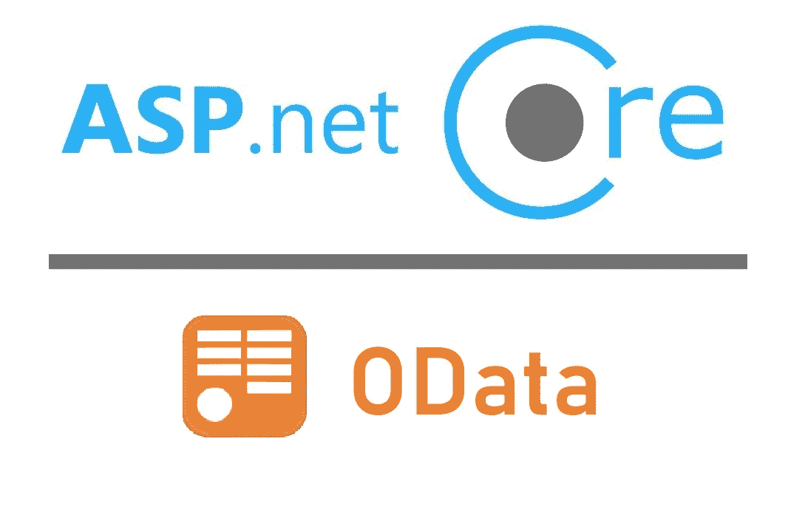
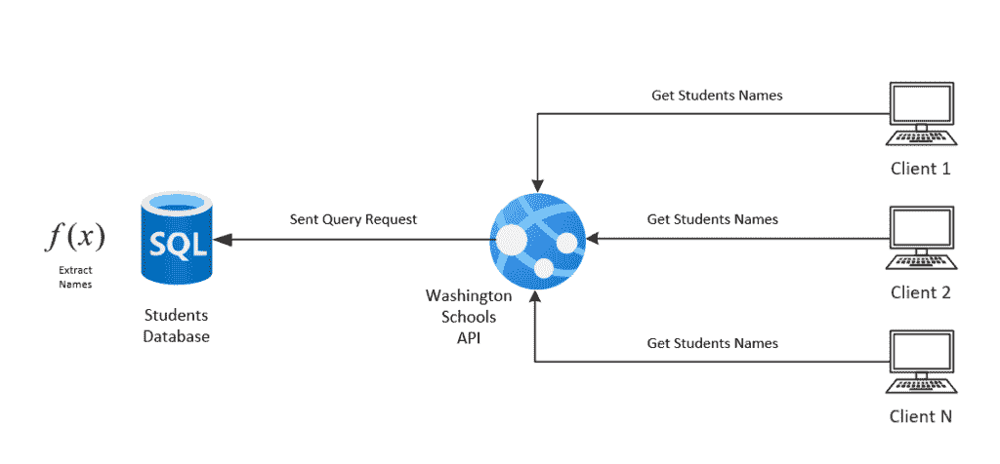
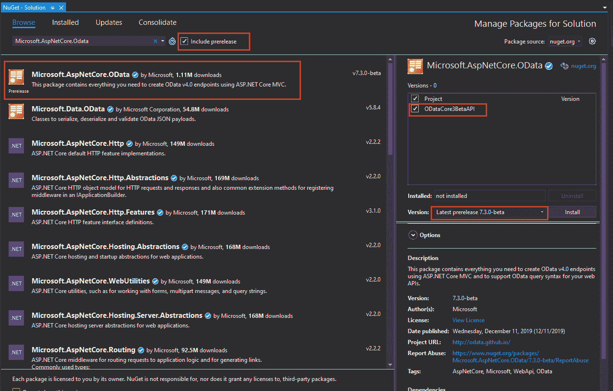

# 中创建 OData 服务的指南。Net Web 开发

> 原文：<https://medium.com/quick-code/a-guide-to-create-an-odata-service-in-net-web-development-c4cd059fe299?source=collection_archive---------5----------------------->

## 在中创建打开的数据。净发展

## 创建 OData 服务使应用程序开发中的数据访问变得容易，让我们在。网络开发。

[**图片来源**](https://devblogs.microsoft.com/odata/asp-net-odata-8-0-preview-for-net-5/)

。Net 是世界上最流行的技术之一。还有！微软每年都会发布大量的更新和新特性，使得用. Net 开发应用程序变得更加容易。

当然，这些天你会听到很多关于 OData 的事情。它在 20 世纪 60 年代受欢迎的主要原因。Net web 开发空间是执行凝乳操作的方便之处。让我们知道什么是 OData？

# 什么是 oData？

据制作 oData 的专家说，这是最好的休息方式。

众所周知，REST 是一种架构风格，它提供了一组约束和子约束。您已经意识到客户端-服务器交互应该是无状态的，每条消息都应该是描述消息处理方式的丰富信息，等等。

但是休息根本不是标准。然而，它为开发人员打开了一扇大门，让他们自己做决定。总有一些关于资源的指导方针，你会看到类似“api/product/1”或“api/products/1”的资源。这些都是可以参考的例子，same.Asp.Net 的开发者称之为最大的开发便利，

(OData 架构)

但是尽管它们与 REST 兼容，其中许多对开发人员并不友好。当您正在处理的项目包含所有这些不同的资源命名风格时，这一点至关重要。HATEOAS 是实现 RESTful 系统的另一个外来约束。它阻碍了对合同的定义，因为这留下了更多的解释空间。

现在 OData 出现了，因为它是一种标准化 REST 的机制。OData 被证明是一个开放的协议，它使你以一种标准的方式创建和使用可查询和可互操作的 RESTful APIs 变得简单。它作为一座桥梁，描述使用 HTTP 方法的请求类型。

此外，有关过滤和分页的查询数据的信息也是主要内容。不仅如此，调用定制函数和动作、处理批处理请求也是这个过程的主要部分。

如果您想在您的。net 应用程序开发，你可以连接一个[认证。net 开发者](https://www.valuecoders.com/hire-developers/hire-dotnet-developers)。

现在您可能想知道如何在 API 中实现 OData。我们来看一步一步的流程。

# 先决条件—集成正确的 NuGet 包

一旦开始一个新的 API 项目，添加 OData Nuget 包是您必须做的第一件事。你需要一个微软的 AspNetCore.OData。网芯和。净 5。7.x 版本。

对于 OData Nuget，我们还需要核心的 NewtonsoftJson 来输入和输出格式参数。右键单击解决方案资源管理器中的“项目”,然后单击 Manage NuGet 您可以在浏览器部分找到这些包。

[**图片来源**](https://devblogs.microsoft.com/odata/experimenting-with-odata-in-asp-net-core-3-1/)

**集成模型类/定义和实体数据模型**

什么是数据模型？它实际上是一个抽象的数据模型，描述了 OData 服务器使用(公开)的数据。它也可以被称为您的 OData 服务的中心单元。引入这个概念的主要目的是描述数据的结构，不管它的存储形式是什么。

EDM(实体数据模型)使得存储的数据形式无用，对应用程序的设计和开发意义不大。此外，实体和关系描述了应用程序中使用的数据结构。此外，这种数据格式的发展也随着应用程序的发展而发展。

她的例子显示 ED 公开了一组人员和产品记录。

让我们看看如何创建一个模型类。

在这里，您需要在解决方案资源管理器中右键单击解决方案项目，从弹出菜单中选择 Add，选择 NewFolder，将新文件夹命名为 Models。

现在是时候将类添加到模型中了。这里我们使用 POCOs 类(普通的旧 CLR 对象)来表示模型产品。

> 使用系统；
> 
> 使用系统。集合。泛型；
> 
> 使用系统。Linq
> 
> 使用系统。线程。任务；
> 
> 命名空间 OData_API。模型
> 
> {
> 
> 公共类产品
> 
> {
> 
> public int productId { get 设置；}
> 
> 公共字符串 productName { get 设置；}
> 
> 公共字符串 productCategory { get 设置；}
> 
> 公共字符串 prodcutPrice { get 设置；}
> 
> public int productDesc { get 设置；}
> 
> }
> 
> }

# **制作 OData 服务**

您必须从 ODataController 获取数据；定义 OData 服务是必不可少的。ODataController 是支持通过 OData 格式读写数据的基类。ControllerBase 是整个数据处理的来源，它支持在创建 API 时或在 [**中使用的大多数动作(相关控制器)。net web app 开发**](https://www.valuecoders.com/aspdotnet-development-company-india) **。**

然而，它是基于 OData 路由原则的，尽管是在默认路由基础上工作的。类似的情况也适用于序列化，因为它避免了默认的[ASP.Net](http://asp.net)核心格式，并且支持特定于 OData 的格式化程序。此外，还集成了另外两种方法来创建响应 POST 的动作结果和响应操纵器的动作结果。

让我们看看如何为产品记录创建一个 OData 服务。

> 公共类 product controller:odata controller
> 
> {
> 
> private 只读 company recordsdbcontext _ company recordsdbcontext；
> 
> 公共产品控制器(ConpanyRecordsDbContext company recordsdbcontext)
> 
> {
> 
> _ companyRecordsDbContext = companyRecordsDbContext
> 
> ？？抛出新的 ArgumentNullException(name of(companyRecordsDbContext))；
> 
> }
> 
> [HttpGet]
> 
> [ODataRoute("产品")]
> 
> public IActionResult Get()
> 
> {
> 
> 返回 Ok(_companyRecordsDbContext。产品)；
> 
> }
> 
> [HttpGet]
> 
> [ODataRoute("Product/({key})")
> 
> public IActionResult Get(int key)
> 
> {
> 
> var people = _ company recordsdbcontext。product . Where(p = > p . product id = = key)；
> 
> 如果(！产品。Any())
> 
> {
> 
> 返回 not found()；
> 
> }
> 
> 返回 Ok(SingleResult。创建(产品))；
> 
> }
> 
> }

上面的代码是为执行两个主要操作而编写的——一个是获取特定的产品名称，另一个是获取所有产品。可以看到，前面已经提到，当 HttpGet 属性利用 GET 函数时，这些将被路由到。

然而，没有累积的必要性，但传统。实际上,“Get”函数会自动映射到 Http get 方法。控制器的“产品”部分将被视为路线的一部分。

这意味着 ODataRoute 不是 100%必要的。此外，微软还提供了一种符号来避免 API 基于约定的路由，尽管使用了基于属性的路由，但大多数情况下还是依赖于约束。

此外，如果你[聘请全栈。net 应用开发者](https://www.valuecoders.com/hire-developers/hire-dotnet-developers)，你可以充分利用 OData 的潜力。

> **要获取所有产品，可以向**scheme://host:port/odata/Products 发送获取请求。
> 
> 获取方案://host:port/odata/Products

**使用 Json 查询数据**

***接受*** *:申请/json*

看一下 OData 返回产品的方式。要获取特定产品的数据，应将 get 请求发送到

> scheme://host:port/odata/Product(1)

这里“1”是产品的 Id。您也可以在这里查看 URL 语法指南。标识符在括号内给出，在 URL 片段中不可用。

> GET scheme://host:port/odata/Product(1)

***接受*** :申请/json

> {
> 
> " @ odata . context ":"[https://localhost:44376/odata/$ metadata # Product/$ entity](https://localhost:44376/odata/%24metadata#People/%24entity)"，
> 
> “PersonId”:1，
> 
> 【名称】:【运动鞋 PoloX】，
> 
> 【尺寸】:28 寸，
> 
> 【价格】:“50 美元”，
> 
> 【订单数量】:30 个，
> 
> " totalproductavailable ":60
> 
> }

这将返回一个特定的产品详细信息。从 OData 获取数据不是一个很容易的过程吗？

嗯！到目前为止，您应该已经理解了 OData 的重要性以及如何使用它从数据源获取数据。创建 OData APIs 很简单，一点也不麻烦。net 开发人员在应用程序中实现和流式传输大量数据时。

# **最终文本**

OData 在。Net 开发；这就是为什么每一家在印度的[Asp.net 开发公司](https://www.valuecoders.com/aspdotnet-development-company-india)都确保在他们的发展中利用它。创建 OData RESTful APIs 可以提高应用程序的性能，并使开发更加容易。更多关于现代科技的见解，请继续关注我。