# 将 Oracle 分析嵌入 Oracle Application Express (APEX)的指南

> 原文：<https://medium.com/oracledevs/a-guide-to-embedding-oracle-analytics-into-oracle-application-express-apex-1799f6ba4626?source=collection_archive---------0----------------------->

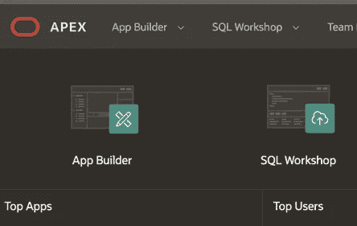

Oracle Application Express (APEX)

Oracle Application Express，即 [APEX](https://apex.oracle.com/en/) ，是一个低代码开发环境，可以轻松创建自己的应用程序。在最近的甲骨文云世界活动(' 22)上，APEX 被用于快速创建应用以帮助全球疫情，并在一个[主题演讲](https://youtu.be/MDGyUe7UVeQ?t=1552)中得到强调。

如果你已经登陆这个页面，你可能已经知道 APEX，你可能想知道为什么你想要嵌入[甲骨文分析](https://www.oracle.com/business-analytics/)云(OAC)到 APEX。事实上，在 2019 年的一次会议上，我被问及了这个问题，因为 APEX 已经拥有一套丰富的报告和[可视化](https://apex.oracle.com/pls/apex/r/apex_pm/a10800/home)功能，其中许多都基于 [Oracle JET](https://www.oracle.com/application-development/technologies/jet/oracle-jet.html) (在两款产品中)。

我的回应？APEX 和 OAC 是互补产品，在可用的可视化类型方面有一些重叠，但也为其他产品提供了额外的功能，从而为数据工程师和企业最终用户带来更全面的用户体验。

以下是我稍后将详细描述的一些例子:

*   将 OAC 自然语言生成或标签云添加到 APEX 应用程序中。
*   能够使用 APEX 刻面搜索来定义嵌入式 OAC 画布的过滤器。
*   OAC 的自助式[数据准备](https://www.oracle.com/explore/analytics-platform-capabilities/capabilities-explorer-prepare-and-enrich?topic=scenario%20Planning&lb-mode=overlay&source=:ow:o:h:mt::RC_WWMK210902P00063:ICOcom&intcmp=:ow:o:h:mt::RC_WWMK210902P00063:ICOcom)、丰富和 ML 集成可以增强 APEX 内置应用的分析能力。

我可以列出更多，但总的来说，我认为这两种产品的结合使用是值得你考虑的，本博客将提供如何从这种结合中获得最佳效果的详细信息。

# 为什么产品版本很重要

我在这篇博客的介绍中提到了 Oracle JET。这是整合 APEX 和 OAC 的一个重要方面。以下是如何找出每个产品使用的 JET 版本。

对于 APEX，这通常在产品文档中描述。我用来创建这个博客的版本有 [21.2](https://docs.oracle.com/en/database/oracle/application-express/21.2/htmrn/index.html#HTMRN-GUID-175489FB-CC24-40F6-89EF-A4A7AAFD7770) (JET 11)和 [22.1](https://docs.oracle.com/en/database/oracle/apex/22.1/htmrn/index.html#HTMRN-GUID-175489FB-CC24-40F6-89EF-A4A7AAFD7770) (JET 12)。APEX [文档](https://docs.oracle.com/en/database/oracle/apex/22.1/htmdb/Understanding-Oracle-JET-Integration-with-Oracle-Application-Express.html#GUID-FD5B3839-EBB2-4C5C-984F-4C90BE46684B)也描述了如何使用 JET，22.1 版列出了“图表”区域类型以及“带自动完成功能的文本字段”项目类型。这将影响用于将 OAC 内容嵌入 APEX 的方法，因为在同一应用程序页面上混合不同版本的 JET 可能会导致不可预测的结果。

为了找出 Oracle Analytics 正在使用的 JET 版本，在登录到 Analytics 时，打开 browser developer tools 控制台并执行以下操作:

```
requirejs('ojs/ojcore').version
```

写这篇博客时，我一直在使用 9 月 22 日和 11 月 22 日版本的 Oracle 分析云，而使用的 JET 版本是 11.1.0。

# Oracle 分析嵌入脚本

在 OAC 启用“开发人员”选项后(在配置文件|高级菜单选项中设置)，您可以在 OAC 查看包含“嵌入”部分的开发人员区域。

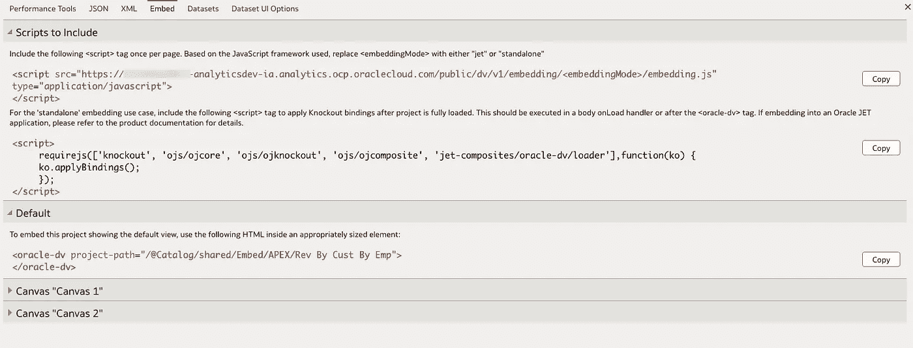

Oracle Analytics Developer Embed Section

embedding.js 的链接提供了两个选项,/standalone/用于嵌入到不使用 Oracle JET 的应用程序中，或者/jet/正如我们从 APEX 文档中看到的，APEX 的某些方面使用 JET，而有些方面不使用。稍后，我们将了解在开发 APEX 应用程序时如何考虑这一点，以及如何选择嵌入 OAC 画布。

# 证明

APEX 使用身份验证方案来保护应用程序，默认使用 [Oracle APEX 帐户](https://docs.oracle.com/en/database/oracle/apex/22.1/htmdb/apex-accounts.html)。Oracle 分析云使用 Oracle 身份云服务(IDCS)身份认证。

在这一阶段，您可以选择让您的最终用户登录 APEX 应用程序，然后要求他们也登录嵌入式分析内容(如果您希望在 APEX 应用程序中限制对嵌入式分析的访问，则可能需要*或*),或者，您更有可能想要无缝的身份验证体验，即登录 APEX 应用程序的用户也将通过身份验证访问分析内容。这是通过在 APEX 内创建“Web 凭据”和“身份验证方案”来实现的，它们使用相同的 Oracle IDCS 作为分析工具。这里有一些链接( [1](https://www.youtube.com/watch?v=25BhU1QQ5Jk&t=4s) )( [2](https://www.vastedge.com/oracle-apex-oac-integration/) )( [3](https://www.ateam-oracle.com/post/integrating-sso-between-apex-cloud-and-identity-cloud-service-the-easy-way) )指向描述如何为 IDCS 认证配置 APEX 的文章。

如果您仍然在嵌入了分析的区域看到登录提示，并且您正在使用 <oracle-dv>HTML 嵌入方法，那么您可能需要[将以下](https://docs.oracle.com/en/cloud/paas/analytics-cloud/acubi/embed-javascript.html#GUID-1AD7A912-690E-48C8-B245-EA77C23EEEA7)添加到 embedding.js 的链接中:</oracle-dv>

```
<script src=""https://<instance>.analytics.ocp.oraclecloud.com/public/dv/v1/embedding/standalone/embedding.js?IDCS_OAUTH3LEGGED=true" type="application/javascript">
</script>
```

# 嵌入指向 Oracle Analytics 工作簿的 URL 链接

将 Oracle Analytics 内容添加到 APEX 应用程序的最简单方法是引用工作簿 URL，如下所示:

*   在 OAC 时，打开您想要嵌入的画布，复制 URL。
*   在 APEX 中，创建新的静态内容区域，选择 URL 作为类型，单击“属性”,然后选择“iFrame”作为“包含模式”。
*   将您从 OAC 复制的 URL 粘贴到“URL”字段中，并可选地设置任何 iFrame 属性，例如宽度和高度。

您在 APEX 中看到的画布视图将取决于许多可根据您的需求定制的因素。

*   如果您已将 APEX 配置为使用 IDCS 身份验证，然后以具有 OAC 作者应用程序角色的用户身份登录 APEX 应用程序，您可能会看到嵌入 APEX 的完整创作 UI。可以通过在嵌入式 OAC URL 中添加以下内容来改变这一点:

```
&viewermode=true
```

*   如果您以拥有 OAC 查看器应用程序角色的用户身份登录 APEX，您将看到查看器体验。

在 9 月 22 日和 11 月 22 日发行的《OAC》中引入了一些设置，可以进一步定制这种体验:

*   在 OAC 配置文件设置的“高级”菜单选项中，“以查看者身份打开工作簿”切换。默认情况下，这是启用的，因此如果您有 DV 作者角色，那么您将在 APEX 中看到“查看者”模式的内容。这为嵌入式内容提供了更好的用户体验。
*   您是否在 OAC 用户界面的“当前”部分定义了任何故事页面。
*   如果您有故事页面，那么您可以更改交互性设置、上下文菜单操作以及是否显示标题栏。

不显示标题栏而显示查看器用户视图提供了最无缝的嵌入体验。

# 使用 Oracle Analytics JavaScript 嵌入

使用 Oracle Analytics JavaScript [嵌入框架](https://docs.oracle.com/en/cloud/paas/analytics-cloud/acubi/embed-javascript.html)可以为 APEX 应用程序中的分析内容提供更加集成的用户体验。这就是 APEX 和 OAC 使用的 Oracle JET 版本的重要性，此外，您是否有任何 APEX 组件在应用程序页面上使用 JET(例如 APEX 图表)可能会导致意外行为(例如，一些 OAC 可视化可能无法完全呈现或可能存在 CSS 冲突，尤其是在使用/standalone/ path 时)。

# OAC 和 APEX 采用同一款喷气式飞机

在这种情况下，在 APEX 页面级别的“JavaScript”字段中设置以下内容，注意除了使用到 embedding.js 的 **/jet/** 路径之外的**【要求 jet】**:

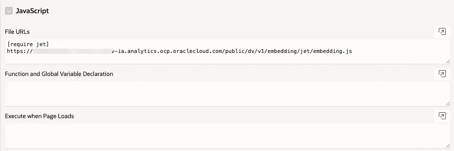

请注意，要查看嵌入的分析，可能不需要通常的 requirejs 依赖关系和 knockout apply 绑定。

然后，您将在 APEX 静态内容区域的“源”字段中添加<oracle-dv>标记:</oracle-dv>

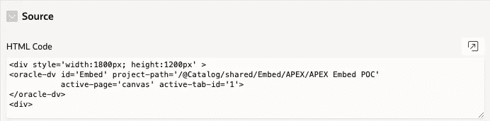

如果使用 embedding.js 的/standalone/路径，那么就不需要在 JavaScript 部分使用[require jet]。

# 不同喷气版本的 OAC 和 APEX

如果存在不同的 JET 版本，则取决于与您希望嵌入 OAC 内容的项目在同一应用程序页面上的其他 APEX 项目。如果应用程序页面上的 APEX 项目不使用 JET，那么您可以使用/jet/ path，但是仍然可能不是所有的 OAC 可视化类型都会呈现。

一般来说，考虑到存在不同 JET 版本的可能性，嵌入分析的最可靠方法是使用 iFrame。我在这个博客中写过这个方法，包括如何从 APEX UI 控件(如选择器和分面搜索)使用 windows 消息传递将参数传递到 iFrame，这是一起使用 OAC 和 APEX 的真正好处可以实现的地方。

# 数据源

理想情况下，OAC 和 APEX 应该使用相同的数据源。将数据导入 OAC 和 APEX 很容易，要么使用上传到 DB 表的 XLS 文件，在 APEX 的情况下，要么通过从上传的 XLS 在 OAC 创建数据源，要么通过创建到 DB 的连接，然后创建合适的数据源。

使用相同的数据源很可能需要从 OAC 连接到 APEX 用来存储应用程序数据的模式。对于我的示例，我将使用 APEX 应用程序，该应用程序使用来自这个 [live lab](https://apexapps.oracle.com/pls/apex/r/dbpm/livelabs/run-workshop?p210_wid=631&p210_wec=&session=6827204128045) 的纽约市学校的数据构建。

我将假设数据已经根据实时实验上传，并且 APEX 应用程序已经创建。您还需要在 OAC 创建一个连接和数据源，连接到 APEX 为应用程序使用的模式。您将能够使用 APEX 中的 SQL Workshop 来发现这一点。如果您无法获得 APEX 使用的数据库的连接钱包，那么您可以将纽约市学校数据直接上传到 OAC。

关键要求是 OAC 和 APEX 都能够访问相同的数据集，无论该数据集是否存储在相同的位置。

# 创造增值的用户体验

在这一部分，我将描述 OAC 和 APEX 的结合如何增加用户体验的价值。我将“价值”定义为 OAC 做一些 APEX 可能无法现成可用的事情(例如，添加自然语言叙述)，反之亦然(例如，使用带有嵌入式分析的 APEX 分面搜索)。

# 将 OAC 标签云和 NLG 添加到 APEX 应用程序

这个动画展示了我们将要构建的用户体验，包括使用 iFrame 和不使用 iFrame 的情况。

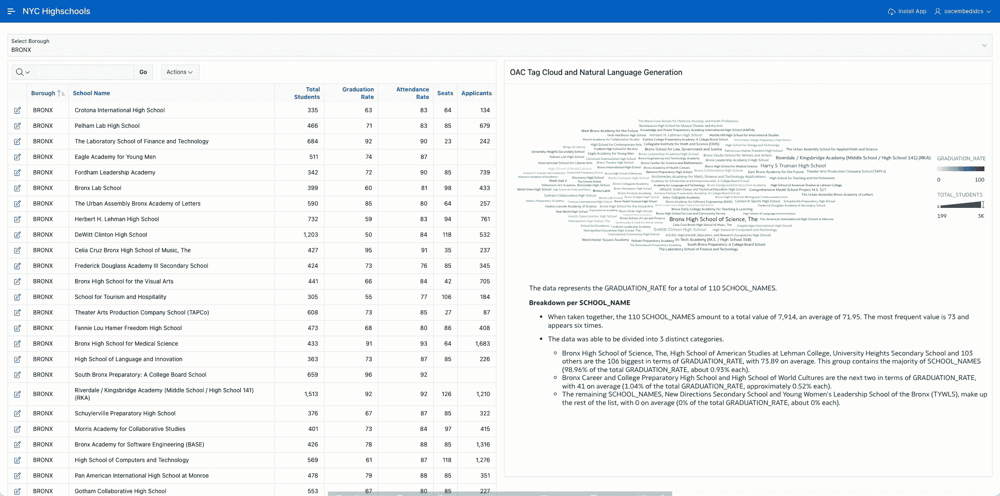

作为先决条件，我将假设您已经在 OAC 创建了一个数据源，它使用与 APEX 应用程序相同的数据，并且您已经在 OAC 创建了一个工作簿，其中显示了标签云和自然语言生成(NLG)可视化。我已经从 live lab APEX 应用程序复制了应用程序页面“NYC Highschools Report ”,我们将向该页面添加 OAC 标签云和 NLG 可视化。

# 不使用 iFrame 嵌入

将选择列表项添加到应用程序页面。这将从一个 SQL 语句中获取一个值列表，选择将存储在 P7_SELECT_BOROUGH 中(您可能有一个不同的项目名称) :

```
select distinct BOROUGH d, BOROUGH r
from NYC_HIGHSCHOOLS
order by 1
```

*   在选择列表的设置中，为“选择时的页面操作”选择“提交页面”。
*   向应用程序页面添加一个静态区域来承载嵌入的 OAC 内容:

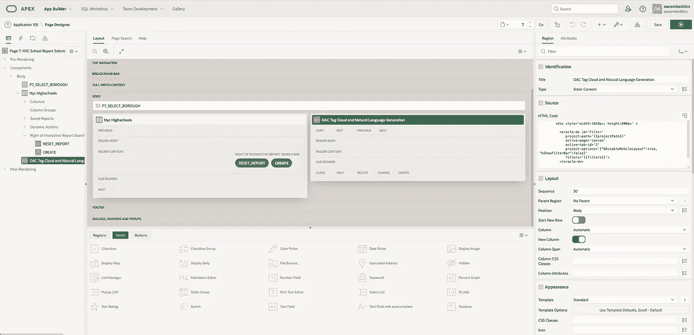

在这个静态区域中使用下面的 HTML 代码，注意 active-tab-id 号是从我的工作簿中用于嵌入的 OAC 开发者|嵌入菜单中获得的。{{ }}中的项目称为可观察项，将使用在应用程序页面级别定义的代码来填充:

```
<div style='width:1024px; height:800px' ><oracle-dv id='Filter'
             project-path='{{projectPath}}'
             active-page='canvas'
             active-tab-id='2'
             project-options='{"bDisableMobileLayout":true, "bShowFilterBar":false}'
             filters='{{filters}}'>
          </oracle-dv>
```

在应用程序页面级别，添加类似以下内容的代码(适用于您的实例和拥有数据集的 OAC 用户(在“sColFormula”的路径中)):

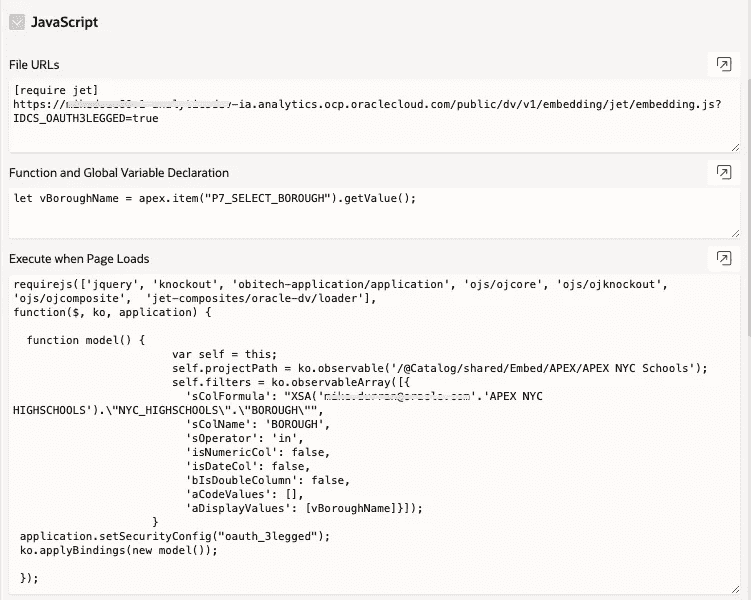

在文件 URL 中，是指向 OAC 实例的 embedding.js 的链接(/jet/),以及参数[require jet]。此示例使用三脚身份验证参数，但请参考本博客前面关于配置 APEX 实例以使用 IDCS 身份验证的内容:

```
[require jet]
[https://<OAC-instance>-ia.analytics.ocp.oraclecloud.com/public/dv/v1/embedding/jet/embedding.js?IDCS_OAUTH3LEGGED=true](https://mikedoac60v1-analyticsdev-ia.analytics.ocp.oraclecloud.com/public/dv/v1/embedding/jet/embedding.js?IDCS_OAUTH3LEGGED=true)
```

在“函数和全局变量声明”部分，有代码将前面定义的 P7_SELECT_BOROUGH 的值赋给一个 JavaScript 变量:

```
let vBoroughName = apex.item("P7_SELECT_BOROUGH").getValue();
```

在“页面加载时执行”部分，为<oracle-dv>标签以及嵌入式 OAC 画布使用的过滤器 JSON 定义了观察值。“sColFormula”可从 OAC 工作簿开发人员| JSON 菜单选项中获得:</oracle-dv>

```
requirejs(['jquery', 'knockout', 'obitech-application/application', 'ojs/ojcore', 'ojs/ojknockout', 'ojs/ojcomposite',  'jet-composites/oracle-dv/loader'],
function($, ko, application) {function model() {
                        var self = this;
                        self.projectPath = ko.observable('/@Catalog/shared/Embed/APEX/APEX NYC Schools');
                        self.filters = ko.observableArray([{
                          'sColFormula': "XSA('[<](mailto:mike.durran@oracle.com)data-set-owner>'.'APEX NYC HIGHSCHOOLS').\"NYC_HIGHSCHOOLS\".\"BOROUGH\"",
                          'sColName': 'BOROUGH',
                          'sOperator': 'in',
                          'isNumericCol': false,
                          'isDateCol': false,
                          'bIsDoubleColumn': false,
                          'aCodeValues': [],
                          'aDisplayValues': [vBoroughName]}]);
                     }
 application.setSecurityConfig("oauth_3legged");
 ko.applyBindings(new model());});
```

这是在使用 P7_SELECT_BOROUGH 的选择器时执行的(由于“页面提交”选项)，将值获取到变量 vBoroughName 中，然后将其传递到过滤器 JSON 以用于嵌入的 OAC 画布。“aDisplayValues”需要一个数组，因此传递的值(vBoroughName)需要用[ ]括号括起来。

此时，运行应用程序并测试更改选择器值是否会更改 APEX 表报告和嵌入式 OAC 内容中显示的区。

# 使用 iFrame 嵌入

如果您正在使用不同版本的 JET(如前所述)，那么您很可能需要使用 iFrame 将 OAC 画布嵌入到 APEX 应用程序中。下面说明了这种类型的应用程序页面部署:

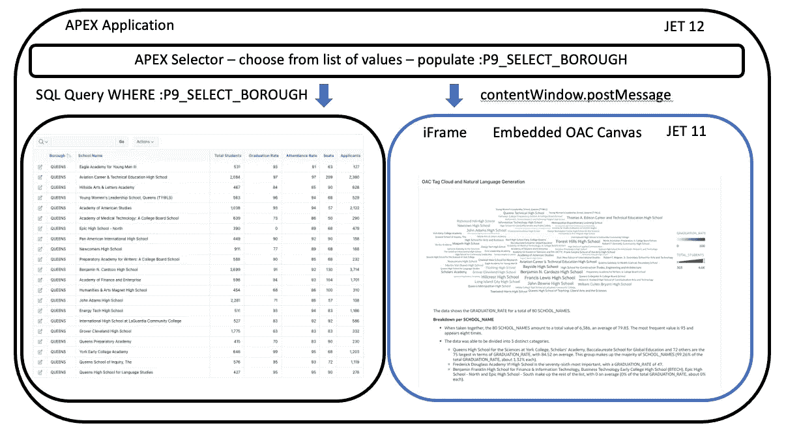

使用 iFrame 的关键区别在于，所有 OAC 嵌入代码，即 link /standalone/ to embedding.js、<oracle-dv>标记、requirejs 依赖项和 knockout applybindings 都包含在 iFrame 中。然后，iFrame 充当一个可重用的块，可以嵌入到多个应用程序页面中，如果需要的话，只需进行微小的更改，如本博客后面所述。将过滤器值传递到 iFrame 的[机制](/oracledevs/how-to-embed-oracle-analytics-anywhere-43233e9f7830)是[content window . postmessage](https://developer.mozilla.org/en-US/docs/Web/API/Window/postMessage)。</oracle-dv>

包含 OAC 嵌入内容的 APEX 静态区域包含使用 [srcdoc](https://www.w3schools.com/tags/att_iframe_srcdoc.asp) 参数定义 iFrame 的 HTML 代码:

```
<iframe  id='OACiFrameEmbed' width="1024" height="800" srcdoc="<!DOCTYPE HTML><html dir='ltr'><head><meta http-equiv='Content-Type' content='text/html; charset=utf-8'><script src='https://<OAC-INSTANCE>-ia.analytics.ocp.oraclecloud.com/public/dv/v1/embedding/standalone/embedding.js' type='application/javascript'></script></head><body><div style='width:1024px; height:800px' ><oracle-dv id='Filter'project-path='<PATH-TO-EMBEDDED-WORKBOOK'active-page='canvas'active-tab-id='1'project-options='{&quot;bDisableMobileLayout&quot;:true, &quot;bShowFilterBar&quot;:false}'filters='{{filters}}'></oracle-dv></div><script>requirejs(['jquery','knockout','ojs/ojcore', 'ojs/ojknockout', 'ojs/ojcomposite', 'obitech-application/application', 'jet-composites/oracle-dv/loader'],function($, ko, application) {function model() {var self = this;self.filters = ko.observableArray([{'sColFormula': &quot;XSA('<OAC-USER-ID>'.'APEX NYC HIGHSCHOOLS').\&quot;NYC_HIGHSCHOOLS\&quot;.\&quot;BOROUGH\&quot;&quot;,'sColName': 'BOROUGH','sOperator': 'in','isNumericCol': false,'isDateCol': false,'bIsDoubleColumn': false,'aCodeValues': [],'aDisplayValues': ['Select Borough']}]);window.addEventListener('message', (event) => {if ((typeof event.data === 'string' || event.data instanceof String) && event.origin == 'https://<APEX-DOMAIN>') {self.filters([{'sColFormula': &quot;XSA('<OAC-USER-ID>'.'APEX NYC HIGHSCHOOLS').\&quot;NYC_HIGHSCHOOLS\&quot;.\&quot;BOROUGH\&quot;&quot;,'sColName': 'BOROUGH','sOperator': 'in','isNumericCol': false,'isDateCol': false,'bIsDoubleColumn': false,'aCodeValues': [],'aDisplayValues': [event.data]}]);}}, false);}ko.applyBindings(new model);});</script></body></html>"></iframe>
```

由于 srcdoc 参数值包含在双引号中，因此在 srcdoc 代码中使用的任何双引号都需要转义为&quot；

这是**项目选项**和**公式**所必需的。此外，除了 iFrame 中的侦听器之外，还需要在传递消息时指定将消息传递到 iFrame 中的域。对于这些示例，该域是 APEX 实例。

APEX 选择器将“提交页面”作为“选择时的页面操作”。为了将选定的值传递到 iFrame 中，请为“页面加载时执行”页面级别属性设置如下代码。设置超时是为了避免可能发生的任何竞争情况:

```
vBoroughName = apex.item("P9_SELECT_BOROUGH").getValue();
setTimeout(() => { document.getElementById(‘OACiFrameEmbed’).contentWindow.postMessage(vBoroughName, ‘[https://<APEX-INSTANCE>.adb.us-ashburn-1.oracl](https://o8z08rvxuv4ut3a-apexpmidcsdb.adb.us-ashburn-1.oraclecloudapps.com')ecloudapps.com’); }, 2500);
```

# 启用多选所需的更改

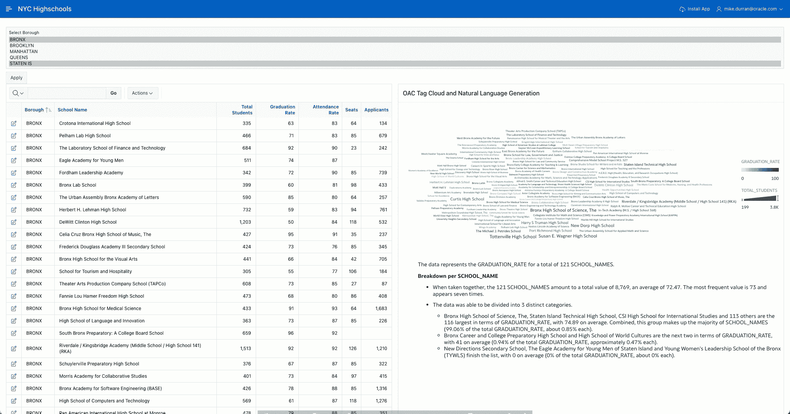

如果您想让用户能够选择多个区，下面是您需要进行的更改。

修改选择器 P9 _ 选择 _ 自治市，使“选择页面操作”为“无”。

在页面上添加一个按钮，我已经把它放在了我的应用程序页面上的选择器项本身的下面。

*   将此按钮命名为“应用”。
*   将“行为”设置为“提交页面”。

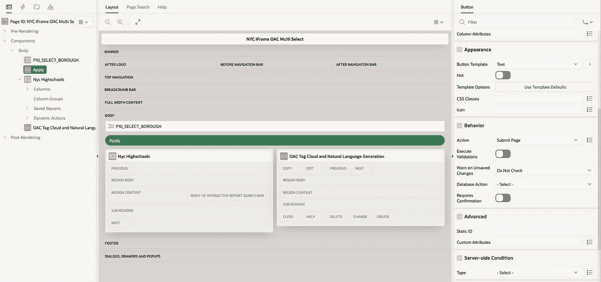

处理多重选择的一个关键区别是，现在它是一个数组对象，被传递到嵌入式 Oracle Analytics 画布。因此，与单一选择用例相比，iFrame 中的代码需要做一些更改。

*   因为现在传递给 iFrame 的是选定值的数组，而不是单个值。这导致对“if”语句的更改，以检查 event.data 是否为数组。
*   因为 event.data 是一个数组，所以传递给' aDisplayValues '的值(与 single select 相比)不再需要[ ]了。

```
if ((Array.isArray(event.data)) && event.origin == 'https://<APEX-INSTANCE>.adb.us-ashburn-1.oraclecloudapps.com') {self.filters([{'sColFormula': &quot;XSA('<USER>'.'APEX NYC HIGHSCHOOLS').\&quot;NYC_HIGHSCHOOLS\&quot;.\&quot;BOROUGH\&quot;&quot;,'sColName': 'BOROUGH','sOperator': 'in','isNumericCol': false,'isDateCol': false,'bIsDoubleColumn': false,'aCodeValues': [],'aDisplayValues': event.data}]);}}, false);
```

# 使用 APEX 分面搜索过滤嵌入式分析

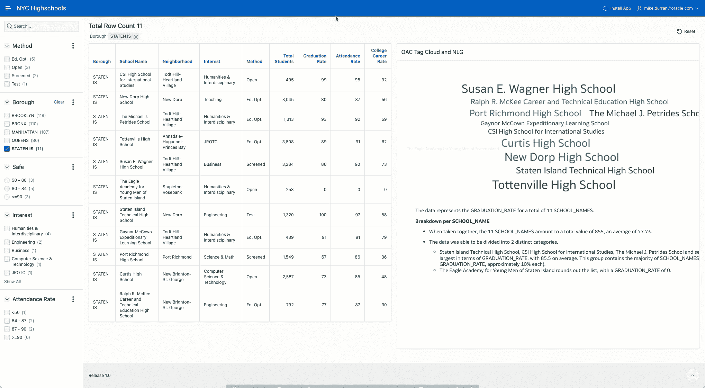

向包含分面搜索的 APEX 页面添加嵌入式分析(在 iFrame 中)与前面的嵌入场景非常相似。

*   向应用程序页面添加一个静态区域。
*   用于静态区域的 iFrame 代码与用于多选用例的相同，因为分面搜索也将传递一个数组。
*   将搜索项的“属性”从“批量刻面更改”更改为“开”。这将为用户提供一个“应用”按钮。
*   将“动态操作”添加到 APEX 页面上的“搜索”项目，并将事件设置为“分面更改[分面搜索]”。
*   对于“True”情况，将“Action”设置为“Execute JavaScript Code ”,并使用此示例，根据您自己的用例进行修改。在这个示例中，P8_BOROUGH 是从分面搜索中获得的，因为输出的形式为 <item>: <item>: <item>等。，有一行代码将输出拆分成一个数组。然后使用“postMessage”将该数组传递给 iFrame。</item></item></item>

```
vBoroughName = apex.item("P8_BOROUGH").getValue();aBoroughArray = vBoroughName.split(":");setTimeout(() => { document.getElementById('OACiFrameEmbed').contentWindow.postMessage(aBoroughArray, 'https://<APEX-INSTANCE>.adb.us-ashburn-1.oraclecloudapps.com'); }, 2000);
```

# 摘要

将 Oracle Analytics (OAC)与 APEX 结合使用可以为您的应用程序增加价值。在这篇博客中，我描述了 JET 版本的重要性，并提供了一些链接，介绍如何配置 APEX 以使用与 OAC 相同的 Oracle 身份云服务来提供无缝体验。

使用 iFrames(特别是“srcdoc”参数)来嵌入分析内容，通过沙盒化分析内容，提供了一种处理存在不同 JET 版本的可能性的方法。

仍然可以使用“postMessage”方法将参数传递给嵌入的 iFrame。一般的方法是 iFrame 包含自含式分析嵌入代码——嵌入框架的链接、<oracle-dv>嵌入标签的 HTML、requirejs 依赖管理和可观察定义。</oracle-dv>

应用于嵌入内容的过滤器的定义被定义为可观察的数组，并且根据用例是单选(在 event.data 周围添加[ ]括号)还是多选/分面搜索(不需要[ ]括号，因为 event.data 是数组)，需要有所不同。

这种类型的嵌入的另一个关键方面是，当最终用户选择参数值时，需要有一种方法将这些值发送到 iFrame，方法是使用 APEX 页面级别的“页面加载时执行”参数，或者使用在分面搜索值改变时调用的动态操作。

# 承认

感谢您的阅读，我希望这篇博客对您有所帮助，并为您如何在自己的项目中嵌入 Oracle Analytics 提供一些思路。我要感谢 Arun、Matt、Lior、Jackie 和 Roel 对 APEX 的帮助和支持。

如果你对甲骨文开发人员在他们的自然栖息地发生的事情感到好奇，来[加入我们的公共休闲频道](https://bit.ly/odevrel_slack)！我们不介意成为你的鱼缸🐠