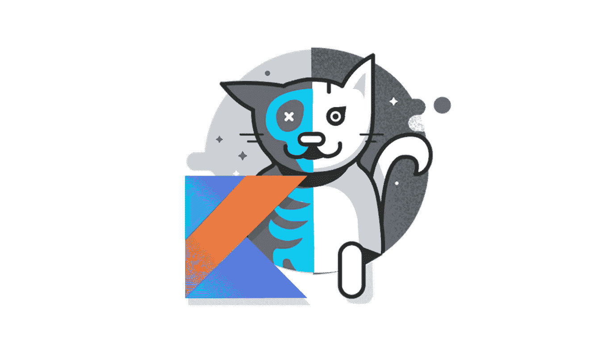
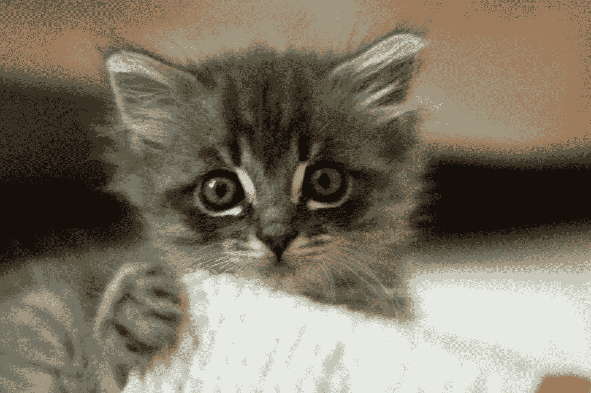

# 一只科特林·薛定谔猫

> 原文：<https://blog.kotlin-academy.com/a-kotlin-schr%C3%B6dinger-cat-c0aeee5e7443?source=collection_archive---------4----------------------->

## K 语言是如何编译那些让你大吃一惊的东西的。



每个人都知道科特林。我的意思是，如果你在 IT 界，至少你听过它的名字。

如果你听过它的名字，你就会知道它是一种基于 JVM 的语言，由 JetBrains 于 2011 年开发，现在它正在成为 J̶a̶v̶a 世界使用最多的语言之一。或者至少现在你知道了。

今天我想写一下 Kotlin“在幕后”做的可空性检查，为什么有时我们心爱的语言值得一点点关注以避免错误，以及 big-K 如何将我们漂亮的代码翻译成 JVM 字节码。

特别是，当我们在 Kotlin 上强制使用非空对象时，我们必须给予极大的关注，因为一切都可能——真的！—以 NPE 结束(也称为空指针异常，也称为“死”)。

# Meowww？🐱

我们开始吧。我们有一个装着一只猫的盒子，然后我们杀了那只猫。

不，我是在开玩笑，但是如果你感兴趣的话，这里有一个解释[薛定谔的猫悖论](https://en.wikipedia.org/wiki/Schrödinger%27s_cat)的链接。总之**如果你不拍这篇文章，一只可爱的小猫就会死去。**也可能不是。或者两者都有。

首先，我们定义我们的`Cat`对象

```
class Cat {
    val meow = "Meowww...? :3"
}
```

从我们的猫的一个无聊的例子开始:

```
val aBoringCatInstance: Cat? = Cat()
aBoringCatInstance!!
```

> IntelliJ(Android Studio 也是如此)允许我们随时检查生成的 JVM 字节码，还可以用 Java 代码反编译它。Svyatoslav Chatchenko 的一篇文章解释了如何做到这一点。

查看这段代码，我们可以看到，在第二行中，我们只是强制我们的`Cat`实例(定义为可空)为非空。下面是用 JVM 编译的代码和用 Java 反编译的代码的结果:

```
new Cat();
```

还有…什么？没什么。我们没有在应用程序的任何其他部分使用`aBoringCatInstance`，Kotlin 很聪明，知道这一点，所以优化了我们的代码，调用构造函数而没有创建变量，因此没有在堆栈上分配它(注意，对象无论如何都会在堆栈上分配，但它将能够尽快被垃圾收集，因为堆栈上没有指针“指向”该对象)。

在接下来的两行代码中，我们感觉有点自虐:

```
val sureNullCat: Cat? = null
sureNullCat!!
```

可以想象，当我们试图将我们的 null cat“强制转换”为非 null 类型时，代码自然会爆炸。或者至少抛出一个**空指针异常！**

```
Cat sureNullCat = null;
Intrinsics.throwNpe();
```

这是从我们刚刚看到的 Kotlin 代码反编译而来的 Java。我们可以想象`throwNpe()`会做什么，但是有些奇怪:为什么我们不做任何检查就抛出一个空指针异常？因为科特林是 smar…好吧我不能再说一遍，但你知道。

我们的 badass 编译器知道，在这一点上，该变量肯定是空的，因为我们正在强制一个空指针异常，它只是让我们满意我们想要的(和应得的)。所以**优化**就是这个词。如果你喜欢的话，可以选择 T21 或者优化。

# 让我们打开盒子📦

最后，我们在这里，观察猫走出我们的盒子，死或活。

让我们定义一个抛硬币的方法——咳咳……函数。根据结果，它将返回一个`Cat`实例或一个`null`值:

```
fun openBox(): Cat? {
    return if (Random().nextInt(2) == 0) Cat() else null
}
```

光靠这个函数什么也做不了，所以我们要**打开那个盒子**，做一些我们永远不应该做的事情:

```
val maybeACat = *openBox*()
val meow = maybeACat?.meow!!
```

让我们分析一下为什么我们在这里做的事情是极其错误的。

最初我们可能认为`meow!!`不会触发空指针异常，因为`meow`是`Cat`的不可空属性。而关于这一点我们是对的，**但是**在 Kotlin 中，一个可空对象的每个子对象都会“继承”那个可空性(可空性并不是真的被继承，但是你明白这个意思)。

因此，如果祖先是可空类型，并且在我们的`Cat`对象中被定义为`String`，那么`meow`属性将有效地变成一个`String?`。

这将使`meow!!`成为一个潜在的核弹，因为如果`maybeACat`将导致*空*值，`meow`也将是*空*，并且将它强制为非空值将导致[我们非常了解的](https://docs.oracle.com/javase/9/docs/api/java/lang/NullPointerException.html)。

让我们看看可爱的 Kotlin 编译器将在 JVM 中生成什么，并将其翻译成 Java:

```
Cat maybeACat = *openBox*();
if ((maybeACat != null ? maybeACat.getMeow() : null) == null) {
   Intrinsics.throwNpe();
}
```

在这段代码中没有什么特别需要解释的:我们只是创建了一个`maybeACat`变量，如果这个变量或者它的 getter`getMeow()` (kot Lin 中我们的`meow`属性的对应物)的结果为 null，我们将抛出一个 NPE。

下面是完整的代码，仅供参考。

我希望能消除对科特林内在行为的一些疑虑。**记住按下和不按下👏🏻按钮，如果你喜欢(或不喜欢)这个职位！**



Sorry for the long post, here’s a photo of a kitten! :3 (photo by [Nicolas Suzor](https://www.flickr.com/people/85603833@N00) from Brisbane, Australia)

了解卡帕头最新的重大新闻。学院、[订阅时事通讯](https://kotlin-academy.us17.list-manage.com/subscribe?u=5d3a48e1893758cb5be5c2919&id=d2ba84960a)、[观察 Twitter](https://twitter.com/ktdotacademy) 并在 medium 上关注我们。

[](https://kotlin-academy.us17.list-manage.com/subscribe?u=5d3a48e1893758cb5be5c2919&id=d2ba84960a)