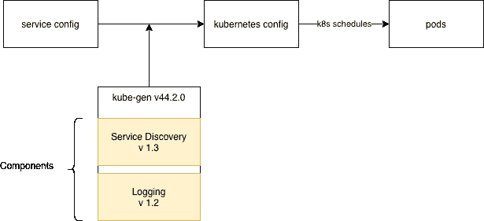
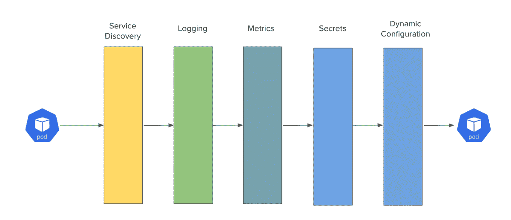

# Kubernetes 基础设施的“Krispr”方法

> 原文：<https://medium.com/airbnb-engineering/a-krispr-approach-to-kubernetes-infrastructure-a0741cff4e0c?source=collection_archive---------3----------------------->

## 利用变异准入控制器 webhook 保持豆荚新鲜

## 介绍

Airbnb 建立在面向服务的架构(SOA)之上。在我们的生产基础设施中，我们运行数百项服务，从计算价格到返回搜索结果到向用户发送消息，无所不包。为了统一和扩展我们的基础设施，我们使用开源容器编排引擎 Kubernetes 来定义和管理我们的工作负载。我们目前在 Kubernetes 上运行数百个工作负载，跨越数十个集群和数千个节点。在本帖中，我们将讨论如何使用 Krispr 将基础设施组件注入到 pods 中。“Krispr”这个名字是一个文字游戏，有两个不同的指代:1)用于突变活生物体基因组的 [CRISPR 基因编辑](https://en.wikipedia.org/wiki/CRISPR_gene_editing)技术，以及 2)冰箱中用于保持蔬菜新鲜的保鲜盒抽屉。Krispr 的目标之一是保持我们的基础设施组件是最新的。

## Airbnb 和 Kubernetes

Airbnb 为简化在 Kubernetes 上构建和运行服务的流程付出了巨大努力。这种简化的主要贡献者是 kube-gen 的开发，这是一种内部工具，旨在允许工程师保持各种环境(如生产、试运行和 canary)的配置同步。Kube-gen 还为服务所有者提供了一个简化的界面。我们没有公开 Kubernetes 的所有功能，而是提供了标准的默认值、自以为是的配置和验证。Kube-gen 实际上是一个编译器，运行在每个服务的预构建阶段。它采用内部定义的格式作为输入，输出 Kubernetes 清单。像编译器一样，kube-gen 二进制文件是显式版本化的。为了获得新的功能和设置，服务需要升级他们的 kube-gen 版本。

## 共享基础架构组件

随着 kube-gen 变得越来越复杂，越来越多的特性被添加到其中。一个称为“组件”的特性允许基础设施工程师创建共享的基础设施组件，这些组件可以被注入到服务的定义中。这是一个非常强大的概念，因为它允许像日志记录、度量和服务发现这样的核心基础设施关注点在单独的 sidecars 中运行，并且彼此独立地发展。

鉴于 kube-gen 二进制文件是显式版本化的，新共享组件的推出依赖于 kube-gen 版本升级。因此，如果服务发现组件被更改，它不会被服务获取，直到服务所有者将其服务升级到最新版本的 kube-gen。

其核心是，在推出共享基础设施组件时，这种模式将产品工程师而不是基础设施工程师放在了驾驶座上。这给下游带来了不利影响。其中最大的问题之一是，很难知道共享组件何时会完全推出。

许多不同的团队拥有数百个服务，这成为了一个后勤挑战。每当一个共享的基础设施组件需要更新时，我们必须召集所有的服务所有者，用最新的 kube-gen 版本升级和部署他们的服务。我们的基础设施组件最终会出现严重的版本碎片，这增加了维护的复杂性和成本。

其他缺点包括，基础设施工程师在推出变更时缺乏针对特定服务或环境的能力，产品工程师在升级 kube-gen 版本时缺乏充分监控推出的必要环境。总而言之，没有人对目前的状况感到完全满意。

## 潜在解决方案

当我们寻找解决这些问题的方法时，我们遇到了 Kubernetes 的[变异准入控制器 webhook](https://kubernetes.io/docs/reference/access-authn-authz/extensible-admission-controllers/) 。简而言之，准入控制器 webhook 是一个 HTTP 回调，它拦截 API 调用，并且可以在对象存储到 Kubernetes API 之前对其进行修改。我们意识到，我们可以使用变异的准入控制器来注入和/或修改集群中创建的 pod。我们可以利用这样的控制器来注入像服务发现这样的组件。当服务发现团队想要发布他们的组件的新版本时，他们只需要更新他们的 webhook，所有新的 pods 将开始获取他们的更改。

我们已经有了在集群中运行验证准入控制器来执行安全策略的经验，但是我们对变异的 webhooks 有所保留。我们最担心的是，我们添加的每个 webhook 都将成为创建新 pod 的关键路径的一部分，这意味着我们将引入新的潜在故障点。尽管许多基础设施团队想要一个新的解决方案，但他们对维护这些 webhooks 并随叫随到的想法并不感到兴奋。

## 变异体

为了在不产生维护开销的情况下利用变异的 webhooks，我们决定将关于 pod 规范的“什么”被改变的关注点与改变“如何”发生的关注点分开。我们提出了一种新的方法，使用我们称之为“变异体”的东西来定义“什么”要改变。mutator 是一个纯函数，它接受 Kubernetes 清单字节流作为输入，并返回 Kubernetes 清单字节流作为输出。

随着我们看到越来越多的例子，我们意识到几乎所有的共享组件都在做同样的事情:将 init 容器或 sidecar 注入到 pod 中。为了让其他基础设施开发人员更容易构建 mutator，我们构建了一个更高级别的“容器 mutator”。container mutator 只需要一个配置文件，它定义了要注入到 pod 中的容器。

基础设施工程师现在只需要提供一个 Docker 映像和一个配置文件，而不是编写一个知道如何操作 Kubernetes 清单字节流的函数。我们将这个框架命名为“Krispr”。

## 克里斯普

在其核心，Krispr 是一个命令行工具，负责查找所有需要应用的变异器，并将这些变异器一次一个地应用到 Kubernetes 清单字节流。这也使得 Krispr 本身成为一个变异函数，因为 Krispr 应用的变异函数集完全定义了一个结果 pod 的输出。

我们已经建立了一个变异的准入控制器，将所有的豆荚传递给克里斯普。Krispr 知道如何找到所有的 mutator 配置文件，并将这些更改应用于 pod。然后，变异准入控制器获取最终的 pod 定义并计算 JSON 补丁， [AdmissionReview API](https://godoc.org/k8s.io/api/admission/v1#AdmissionResponse) 使用该补丁将原始的传入 pod 定义转换为最终的定义。

由于 Krispr 提供了一个抽象层来描述变异函数是如何运行的，所以除了许可控制器之外，我们还可以在其他上下文中运行这些变异函数。事实上，我们也在构建时运行 Krispr，就在 kube-gen 生成最初的一组 Kubernetes 清单之后。这为我们提供了两个非常有用的属性。首先，它允许我们放松变异准入控制器的运行时要求。如果超时，或者暂时关闭，*我们仍然可以允许 pod 进入集群*，因为我们知道在构建时已经运行了 Krispr 和它的所有变异器至少一次。从可靠性和操作角度来看，这是巨大的，因为我们现在可以容忍准入控制器中的临时停机时间。第二，它让我们更早地看到 Krispr 中的错误和问题。如果我们在 Krispr 中检测到一个导致构建失败的 bug，我们可以在 Krispr 部署到准入控制器之前回滚那些更改。

如果现在基础设施组件的首次展示很糟糕，会发生什么？以前，服务所有者可以中止和回滚部署，以便撤销基础架构组件更改。然而，现在情况并非如此。回滚单元将注入新的、坏的基础设施组件。我们已经在 Krispr 中通过实施突变暂停期解决了这个问题。如果我们检测到一个 pod 在过去两周内发生了变异，我们将不会重新变异它。这允许服务所有者确定性地回滚到最近两周内的构建。

## 结论

以前，共享基础设施组件的推出与 kube-gen 新版本的推出紧密结合。这使得服务所有者可以完全控制何时进行升级，但代价是减缓了基础设施的变化。此外，由此产生的碎片和复杂性使得我们的系统不太稳定和可靠。我们引入了 mutators 的概念，使其他基础设施开发人员更容易构建和推出新的基础设施组件。我们构建了 Krispr 来聚合和运行 mutator，既作为预构建步骤，也在变异准入控制器中运行，以确保基础架构组件始终保持最新，同时将这些 mutator 排除在创建新 pod 的关键路径之外。最后，我们添加了一个为期两周的突变暂停期，以允许服务所有者确定性地回滚到两周前的构建，同时为基础架构开发人员提供一个上限，说明他们的组件需要多长时间才能推出。我们认为这种方法在基础设施稳定性和开发速度之间取得了恰当的平衡。

Krispr 是许多不同合作者的作品，没有 Laurent Charignon、Bruce Sherrod、Evan Sherrod、、Jian Cheung、Joseph Kim、、、Brian Wolfe、Rushy Panchal、、、Juwan Yoo、Daniel Evans、、Johannes Ziemeke、Jason Jian、Liuyang Li 和 Sunil Shah 的贡献和支持是不可能的。