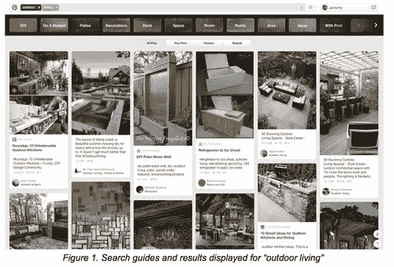
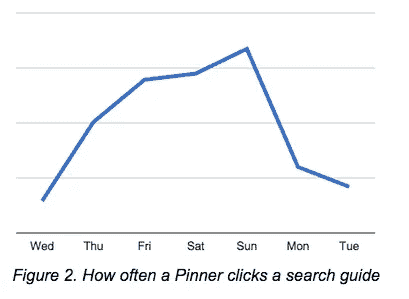
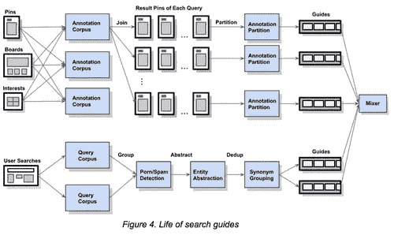
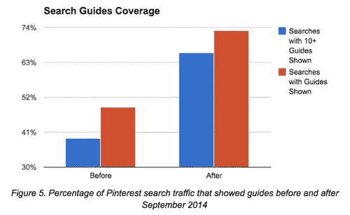
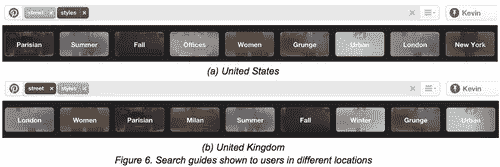

# 搜索指南背后的一瞥

> 原文：<https://medium.com/pinterest-engineering/a-look-behind-search-guides-74bff56b3398?source=collection_archive---------1----------------------->

Kevin Ma |发现网站 Pinterest 工程师

我们去年推出了[导向搜索](https://blog.pinterest.com/post/83772264616/guided-search-a-new-way-to-find-what-youre)，为 Pinners 提供探索性搜索，他们可以通过点击不同的指南来筛选结果，从而发现最佳创意。我们将继续进行更新，例如[最近的改进](https://blog.pinterest.com/post/108932651209/search-is-getting-smarter)根据谁在搜索显示更个性化的结果，以及[建立一个更智能的平台](https://engineering.pinterest.com/post/107907658519/building-a-platform-to-understand-search-queries)来理解查询。今天，来自指南点击的搜索是我们搜索流量的主要来源之一。事实上，在过去的六个月里，每天点击指南的数量已经增加了两倍，我们看到了它的发展势头。指南根据参与度而变化，所以越多人搜索和锁定，体验就越好。在本帖中，您将了解我们如何创建指南并对其进行排名，以及深入了解每天如何使用引导式搜索进行发现的趋势。

## 谁在点击指南？

当一个 Pinner 使用引导式搜索时，他们平均每天点击 3.6 个指南。至于地理位置，美国以外的 Pinners 比美国 Pinners 更经常点击指南。例如，阿根廷、澳大利亚、巴西、加拿大、法国、德国、意大利、日本、墨西哥、荷兰、菲律宾和英国的 Pinners 比美国的 Pinners 更有可能点击搜索指南。在这些国家中，墨西哥的指南点击率最高，用户点击指南的可能性高出 46%。

搜索的主题也在是否点击指南中发挥作用。例如，搜索名人、健身、健康、家居装饰、幽默、男性时尚、摄影或女性时尚相关话题的 Pinners 比搜索园艺或历史的 Pinners 更有可能点击指南。与园艺相关的搜索相比，健身相关的搜索出现指南点击的可能性要高 56%。

一般来说，男性比女性更有可能点击指南。我们发现男性在搜索艺术、汽车、健身、健康、男性时尚、户外和购物等主题时最常点击指南。女性 Pinners 在搜索食物和饮料、家居装饰和技术等主题时，倾向于点击指南。

## **指南在何时何地被点击？**

向导式搜索首先在手机上推出，设计时考虑到了小屏幕，并针对点击而不是打字进行了优化，因此毫不奇怪，向导在手机上比在网络上更常被点击。iPhone 的指南点击率最高，其次是 Android 手机和 iPad。事实上，iPhone 用户点击指南的可能性比桌面用户高 50%。

此外，Pinners 在周末比平日更有可能点击指南。

## 如何创建搜索指南？

当我们第一次推出引导式搜索时，我们从有机搜索日志开始。由于 Pinners 通常通过添加或更改单词来改进他们的搜索查询，我们希望找到一种方法来从搜索查询中提取这些改进。

我们建立了一个在语料库中收集搜索查询的模型。使用 TF/IDF 算法处理查询，以获得最独特的查询。然后，将实体提取模型应用于查询语料库。查询被划分为实体和指南。例如，查询“红色耐克鞋”被提取为实体“鞋”，并引导“红色”和“耐克”我们建立了一个系统来分组同义词，检测错别字并删除色情或垃圾术语。指南和实体都在系统中进行处理，以避免显示不适当的文字。

以这种方式生成的搜索指南可以覆盖 49%的 Pinterest 搜索流量。大多数显示指南的搜索查询是流行的查询。这是很好的覆盖，但我们想推动它的边界。因此，在 9 月份，我们开始寻找一种更好的方法来为长尾查询生成指南。如果你垂直绘制搜索管道，你可以想象我们的第一种方法是自上而下的，从顶部的用户查询生成指南。相反，我们挑战自己，试图自下而上地解决问题。

这是我们从搜索结果 pin 生成指南的第二种方法。在 Pinterest 上，每个 Pin 都是由 Pinners 手工挑选并标记到板上的，因此与 Pin 相关的元信息是高质量的。我们用从元信息生成的注释来标记图钉，这些元信息包括容器板的数据、图钉描述、兴趣类别、链接的第三方网页文本和相似外观图钉的元信息。图 3 显示了搜索查询“Outdoor Living”的结果中的一个大头针，以及为这个大头针生成的注释。对于我们看到的每个搜索查询，我们将搜索结果 pin 的注释聚合到注释语料库中。我们构建了一个系统来划分每个搜索查询的 Pin 注释，以便每个划分代表查询的搜索结果的一个有意义的子集。例如，查询“户外生活”具有从注释“DIY”、“甲板”、“露台”、“想法”等生成的指南。以这种方式生成的指南可以保证合成的查询(例如“户外生活 DIY”)具有足够高质量的搜索结果。图 4 描述了指南生成的架构。

发布后，搜索指南的覆盖率提高到了 73%(如图 5 所示)。每个搜索指南基于来自撰写的查询搜索结果的 Pin 与封面图像相关联。例如，用于查询“食谱”的指南“鸡肉”的封面图像是“鸡肉食谱”的搜索结果中的大头针我们使用“最有趣的”大头针作为封面图像，这是基于几个因素选择的，包括大头针被搜索、被钉住和被点击的次数，以及色调。每个指南都与一个候选封面图片列表相关联，我们会为每个查询动态删除这些候选封面图片，因此 Pinners 不太可能看到同一张图片用于查询的不同指南。

我们将查询和指南的元数据存储在 [QueryJoin](https://engineering.pinterest.com/post/107907658519/building-a-platform-to-understand-search-queries) 中，以提供其他功能，如搜索查询扩展和重写。

## **搜索指南是如何排名的？**

我们在搜索指南的排名上已经走了很长的路。今天，我们有一个复杂的评分和排名系统来订购指南，每个查询的指南排名是根据以下分数计算的:

*   *以利益为指南。*Pinners 如何点击一个查询的各个指南？品酒师对导游越感兴趣，导游的级别就越高。
*   *合成查询结果的质量。用户点击指南后，我们对搜索结果的信心如何？置信度得分是根据 Pinners 点击结果图钉的方式以及他们将结果图钉添加到其图板的频率来计算的。分数还考虑了结果链接的第三方网页的质量。换句话说，越多的 Pinners 喜欢搜索结果，指南的排名就越高。*
*   *地点。*去年 12 月，我们开始按本地化对指南进行排名，此后，在许多治疗国家，指南点击量增加了 5-10 %,这表明搜索指南对全球用户来说更相关、更有用。作为本地化工作的一部分，我们还根据各个国家的 Pinners 对每个指南的兴趣程度来计算指南位置分数。图 6 显示了美国和英国用户对指南的不同排序。例如，英国的 Pinners 对“伦敦街头风格”比对“巴黎街头风格”更感兴趣

*   *性别。*一般来说，男性 Pinners 对指南的兴趣不同于女性，因此我们根据每个群体的趋势对指南进行不同的排名。性别分数与排名中的位置分数正交。例如，墨西哥的男性用户会看到专门针对他们的人口统计进行排名的指南。
*   *当前趋势。*我们构建了一个时间敏感的评分函数来检测用户对指南的兴趣的当前趋势。该功能对具有排名动力的指南应用新近提升。如果大量 Pinners 在短时间内对某个指南感兴趣，该指南就会成为受欢迎的指南。受欢迎的导游可以在几天内提升到更高的等级。一旦他们失去了动力，意味着更少的人参与到该指南中，该功能会迅速将该指南排到后面的位置。
*   *垃圾邮件检测。*我们检测垃圾 pin、搜索查询和用户，并将其从指南排名中删除。

自推出以来，引导式搜索已经成为 Pinterest 搜索流量和 Pinner 互动的重要驱动力。Pinterest 上的每日搜索次数也大幅增加，人均搜索次数增加了 25%。我们将继续对向导式搜索进行更新，使向导和结果更加个性化和本地化，质量越来越高。请随时回来查看这些更新的更多信息。

如果你对构建搜索和发现产品感兴趣，比如引导式搜索，[加入我们](https://about.pinterest.com/en/careers/engineering-product)！

Kevin Ma 是 Pinterest 探索团队的一名软件工程师。

***鸣谢:*** *这项技术是由芮江、、尹、裴、鲍力宏、、胡宁宁合作完成的。全公司的人通过他们的见解和反馈帮助推出了这些功能。*

*获取 Pinterest 工程新闻和更新，关注我们的工程*[*Pinterest*](https://www.pinterest.com/engineering/)*[*脸书*](https://www.facebook.com/pinterestengineering) *和* [*推特*](https://twitter.com/PinterestEng) *。有兴趣加入团队吗？查看我们的* [*招聘网站*](https://about.pinterest.com/en/careers/engineering-product) *。**