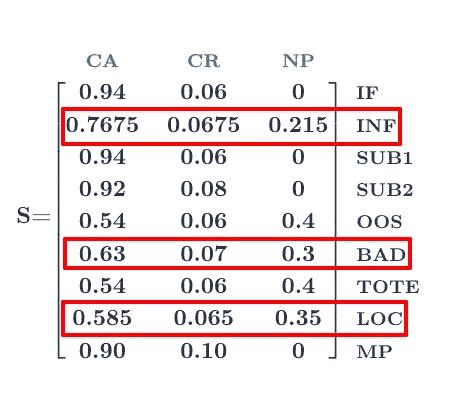

# 食品杂货拣选过程的马尔可夫链公式

> 原文：<https://medium.com/walmartglobaltech/a-markov-chain-formulation-of-grocery-item-picking-process-54c65a3ec5b5?source=collection_archive---------0----------------------->

Typical Grocery store in Walmart. Photo Courtesy — [corporate.walmart.com](https://corporate.walmart.com/)

沃尔玛的大部分业务(以及美国以外的大部分市场)来自杂货。顾客在网上下订单，然后订单被送到送货地址或由顾客从商店(CnC)领取。

> 履行订单的两种模式有什么共同之处？

这是商场员工挑选商品的过程。而实际过程具有许多复杂性，如将在线订单下载到商店中、计算出商店中物品的位置、生成替代品、生成满足订单的优化数量的容器、为整个商店的员工生成优化的提货区等。，员工执行的基本操作是查看订单中的不同商品(通常在 50-70 件商品之间),并将它们添加到容器中。

# 用例 1 —提货流程

让我们以挑选商品的各个步骤为例

## 挑选步骤

物品提货流程的各个步骤如下

*   检查下一件物品的位置和数量。
*   转到该位置并检查项目是否存在。
*   如果物品存在(在订购数量中)，选择它并移动到下一个物品位置。
*   如果订购的商品不存在，寻找 1-2 个替代品(在手持设备上向员工展示)。
*   如果替代品存在，并且是好的(由提货助理进行人工判断)，则提货并移动到下一个商品位置。
*   如果替代品不可用、看起来不合适或不适合容器，则挑选看起来接近订购商品的商品，或者不挑选任何商品，继续下一个商品。

## 提货步骤可视化

Typical pick process Flow Chart for an item in the store.

订单/商品交付后，客户可以选择接受或拒绝。拒绝可能有各种原因，即

> 受损项目。
> 
> 客户认为不合适的替代品。

根据上图，一个项目可能有 3 种状态

> 客户接受
> 
> 客户拒绝
> 
> 无物料挑库(无挑库)

## 业务指标

基于这个过程，我们能回答这样的问题吗

*   每天挑选的商品中，人工挑选并被顾客接受的占多少百分比？
*   当替代品缺货时，客户接受的产品百分比是多少？
*   对于特定的商品类别(比如可乐)，当商品不适合容器时，被拒绝的替代商品的百分比是多少？
*   由于原始商品不可用而导致*零拣选*的商品百分比是多少？

对这些问题的回答可以帮助企业识别导致较低接受度、较高零拣选率等的项目/项目类别。

为了实现这一点，我们提出了一个状态转换模型，该模型基于可用数据捕获转换的概率。

## 模型

我们试图正式规定现实世界的拣选过程。正式规范有助于消除歧义，并提供一致的流程表达形式(通常通过易于理解的数学模型和语言)

挑选过程非常适合于[马尔可夫链](https://en.wikipedia.org/wiki/Markov_chain)模型。挑选过程可以被建模为一组状态和状态转换，并带有概率。

此外，挑选过程中到下一个状态的转换仅取决于当前状态，而不取决于过去的状态，这使得它可以表示为马尔可夫链。

A Markov state transition diagram.

带缩写的提货流程中的各种状态有

*   找到订购(基本)物料(如果)。
*   未找到订购(基本)项目(INF)。
*   选择替代 1(排名最高/最相关)(SUB1)。
*   替换 2 picked(排名稍低)(SUB2)。
*   替代品缺货(OOS)。
*   替代不合适(不好)。
*   替代品不适合容器。(手提包)
*   替代品不在指定位置(LOC)。
*   替代人工提货(MP)。
*   客户接受的项目(CA)。
*   客户拒绝的项目(CR)。
*   物料无领料(NP)。

这看起来像任何其他有限状态机(FSM ),在各种状态之间转换，除了转换有概率。例如，在上面的图表中，有 0.3 的概率表明拣选过程将从 *INF* 状态移动到 *SUB1* 状态。

> 跃迁的概率是经验概率。即:基于历史证据。然而，概率的计算方法对该过程没有影响。

还要注意蓝色的州。(CA、CR、NP)。这些状态的自转移概率为 1.0。这清楚地表明，当选择项进入这些状态中的任何一个时，都没有以非零概率离开它们的路径。

在马尔可夫链模型中，这样的状态被称为吸收状态，并且上述链可以被称为[吸收马尔可夫链](https://en.wikipedia.org/wiki/Absorbing_Markov_chain)，因为每个过渡非终止状态最终以一定概率进入 3 个吸收状态之一

其中 Abs 是任何吸收态，而 NT 是非终止态。

## 制定

现在我们已经定义了状态和概率，让我们将它们表示为一个*转移矩阵 T*

Transition Matrix showing the probabilities.

蓝色的列表示开始状态，而绿色的行表示结束状态。

> 而不是每行中的值。它们总和都为 1，说明这个矩阵是一个*行随机矩阵或者是一个* [*右随机矩阵*](https://en.wikipedia.org/wiki/Stochastic_matrix) 。
> 
> 还应该注意，最后 3 行只有 1 个值为 1 的条目，表明这些是吸收状态的自跃迁。

上面的 **t** 跃迁态和 **a** 吸收态的跃迁矩阵 T 可以改写为

其中 Q 是一个 *t * t* 矩阵，R 是 *t * a* 矩阵，O 是 *a * t* 零矩阵，Ia 是 *a *a* 单位矩阵。

这种整体跃迁矩阵的分解可以让我们进行某些运算，得到最终的稳定矩阵，它给出了从上述每个跃迁态到达一个或另一个吸收态的概率。

稳定矩阵 **S** 由以下公式给出

其中 N 是基本矩阵，表示进入吸收态的概率

也就是说

这个公式可以用矩阵方程的形式表示如下

其中 I *t* 是与 Q (t * t)大小相同的单位矩阵。对转移矩阵进行同样的计算

最后计算稳定矩阵

Fig 1\. Final State Stable Matrix.

## 从稳定矩阵中我们可以推断出什么？

第 I 行和第 j 列中的条目给出了从瞬态转变到吸收态的最终概率。

*   它表明，当没有找到订购的商品(INF)时，客户接受的概率(CA)是 0.7675，而没有商品提货的概率(NP)是 0.215，这表明，根据提货过程中发生的所有事情，客户接受率为 77%，而零提货率接近 22%。
*   零选择是业务的直接损失，因此该流程会立即突出效率低下和业务需要关注的地方。此外，它还会导致糟糕的客户体验。
*   我们可以看到，如果替代产品位置不正确，由于零提货的可能性很高(35% NP)，总体客户接受度会下降到近 59%。

## 我们能改善这一点吗？

杂货替代品生成过程发生在提货开始之前。这使得提货人只能使用几个小时前生成的任何替代品。这种替代可能出现在任何州(OOS、巴德、托特、洛克等)。)强制手动或无选择。

如果我们增加了提货人要求替代品的可能性，会怎么样？假设生成并发送了一个新的替代，可能会解决上述一个或多个问题。

这在拣选过程中引入了一个新的状态(用绿色标记),如下所示。

往返于新状态“新子挑选”(ns)的新状态转换被添加到原始转换矩阵中。

Transition matrix with new state.

Fig 2\. Final Stable Matrix with a new state added.

注意图 1 和图 2 中的稳定矩阵。

接受度似乎进一步下降了。除了对托特不匹配情况的接受，所有其他接受概率都恶化了。

## 为什么？

这是因为我们假设的数字引入了一个新的状态，与接受概率更高(0.9)的人工选择相比，它本身降低了接受概率(0.88)。此外，先前进入 MP 状态的所有路径现在都降低了概率。自始至终，我们的零选择没有改变。

一个分析家可以很容易地得出结论:

> 任何按需替代必须是极其相关的替代，并且必须有助于至少匹配 SUB1 接受率。
> 
> 任何新的状态添加不仅必须减少 OOS、坏货、总货、LOC 状态的人工提货概率，还必须减少转换进入 NP 的概率(这与替代产品的相关性和可用性成反比)。

## 效用

*   虽然这是整个挑选过程中相对较小的一部分，但当目标也以数字形式明确定义时，像吸收马尔可夫链这样的数学模型可以清楚地帮助企业确定需要改进的领域。
*   上述公式显然有助于得出两个结论，即

> 减少人工挑选不足以提高客户接受度，但按需替换必须非常相关，并且接受率必须几乎等于 SUB1 的接受率。
> 
> 零拣货必须通过人工拣货或按需拣货来实现，这强调了对更好的库存管理的需求，以及可以近乎实时地生成替代品的解决方案。

*   它不仅可以帮助企业创建所有产品的模型(如上图所示)，还可以创建单个项目类别甚至单个项目级别的模型。

> 冷冻物品。
> 
> 冷冻食品。
> 
> 蔬菜。
> 
> 青苹果等。

# 用例 2——交付过程中冷藏物品的变质

Delivery workflow — Chilled Items. Photo Courtesy — [corporate.walmart.com](https://corporate.walmart.com/)

与任何物品一样，冷藏物品也要经过如上所述的递送工作流程。

> 冷却器中的物品。
> 
> 在手推车中挑选的物品。
> 
> 存储在提货区的项目。
> 
> 装载到货车冷藏区的物品。
> 
> 交付给客户的项目。

步骤 2 和步骤 3 是该工作流程中的步骤，其中冷藏物品可能暴露于环境温度/光线下。

正如我们所知，将某些易腐物品暴露在光线和室温下会导致产品发生某些生化反应，使其变质。对感兴趣的读者来说，有详细的材料讨论产品新鲜度的衰减。

为了便于讨论，我们将重点讨论暴露于环境温度时的衰变率概率。概率值是假设的，但被创建来说明随后的模型及其用法。

## 模型

如前所述，我们将衰减率及其客户接受/拒绝建模为每个转换的概率状态。

> **下面陈述的数字是假设的，仅用于说明概念。**

带缩写的提货流程中的各种状态有

*   摘到卡车< 15 min (PT15)
*   Picking To Truck < 25 min (PT25)
*   Deterioration Rate UPTO 2% (DR2)
*   Deterioration Rate UPTO 5% (DR5)
*   Good (GOOD)
*   Customer Accepted (CA) — **吸收状态**
*   客户拒绝(CR) — **吸收状态**

一旦物品被装载到卡车/货车上，它们就被冷藏在货车的特殊冷藏区。冷藏通常会减缓大多数物品的腐烂率，这就是当物品从较高的腐烂率过渡到较低的腐烂率时所看到的情况。

上图的转换矩阵可以表示为

我们能回答这样的问题吗

> 如果货车提货时间为 10 分钟，即:冷藏物品暴露在环境温度下 10 分钟，客户接受的最终概率是多少？
> 
> 如果提货时间为 20 分钟，客户拒绝的最终概率是多少？

按照上面计算稳定矩阵的过程，我们得到下面的结果

Fig 3\. Final Stable Matrix.

正如所料，我们看到

*   当物品暴露在环境温度下的时间较短时，接受率较高(82.5%)。
*   随着持续时间增加到 25 分钟，接受概率下降到 78%，拒绝率上升。

## 效用

*   这种分析可以帮助商店管理层决定采取何种措施来减少腐烂，尤其是在无法避免暴露于环境中的情况下。
*   可以考虑选择顺序，以确保风险最小化。

# 其他马尔可夫链的例子

*   提货时间影响马尔可夫链(根据吸收状态增加或减少提货时间)。
*   杂货库存马尔可夫链。

# 结论

马尔可夫链模型是一个很好的数学模型，用于表示这样的工作流过程，其中转移到一个状态的概率完全取决于当前状态，如上面的例子所示。一个过程的这种*无记忆*特性使得它非常适合建模为马尔可夫链来估计最终的概率分布。

在使用经验概率模型的实践中，转移概率可能会随着时间的推移而改变，增加新的项目，或者改变导致完全不同的稳定概率分布的过程，从而得出新的结论。

最好是根据物品类型、物品类别等将这些自动机分开，以消除嘈杂的离群值。如果概率方差很高。

# 参考

*   吸收马尔可夫链—【https://en.wikipedia.org/wiki/Absorbing_Markov_chain 
*   随机矩阵——https://en.wikipedia.org/wiki/Stochastic_matrix
*   经验概率—[https://en.wikipedia.org/wiki/Empirical_probability](https://en.wikipedia.org/wiki/Empirical_probability)