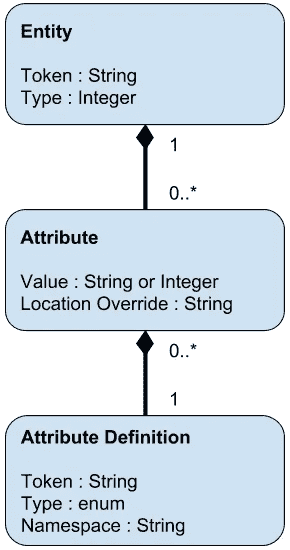

# 与移动客户端同步的大型多用户数据存储

> 原文：<https://medium.com/square-corner-blog/a-massively-multi-user-datastore-synced-with-mobile-clients-a9ce0b5e5260?source=collection_archive---------3----------------------->

> 注意，我们已经行动了！如果您想继续了解 Square 的最新技术内容，请访问我们的新家[https://developer.squareup.com/blog](https://developer.squareup.com/blog)

在 Square，我们为商家管理大量信息。这包括围绕商家销售的数据——他们的产品、价格、税收以及与这些实体相关的配置。我们将这个数据集称为商家的*目录*。

管理这些数据可能很有挑战性。商家的目录可能相当大。它们必须与可能长时间离线的移动设备同步，从而允许目录的两个版本不同。目录需要一个复杂的查询接口来支持响应迅速的 web UI，但是它们还需要通过 API 支持大量操作，包括重写整个数据集。此外，数据需要能够跨各种服务和移动客户端正常显示和运行的结构，但它还需要足够的灵活性，以允许快速开发新功能，并使商家和第三方能够创建特定于其业务或集成的自定义数据。

我们最近重新设计了用于存储目录数据的系统，并撰写本文来分享我们的一些经验。我们需要传统数据库提供的许多功能。例如，我们需要在不影响读取的情况下写入数据，直到整个操作完成(甚至跨多个 API 调用)。我们希望能够一致地翻阅数据，即使其他客户端正在写入目录。这些功能需要针对每个用户，这样一个用户的活动就不会影响到另一个用户。与此同时，我们需要比传统数据库所能提供的更多的结构，同时仍然允许添加新元素，而无需更改模式、重新部署或迁移。

我们通过使用*实体-属性-值*数据模型来实现这一点，其中实体具有可以由系统定义的类型和遵循特定属性定义的属性，这些属性可以由系统或用户定义。通过使用仅附加数据模型，我们能够实现我们需要的事务性属性，而不依赖于底层分片 MySql 数据库中的事务，由于强大的机构支持，我们选择 MySql 数据库作为存储基础架构。

# 商家数据存储设计

# 结构化，但灵活

我们需要一个对象模型，它的结构足以允许客户以可预测的格式处理数据，但又有足够的灵活性，允许客户、集成商甚至最终用户为他们自己的用例扩展数据模型。我们选定了一个具有一些特征的实体-属性-值存储。该模型可以表示如下:

每个对象都有一个唯一的令牌和一个预定义的类型。它有一组属性，必须使用预定义的定义。属性定义指定属性的类型，并由客户端用来验证和解释属性数据。它以识别其所有者的方式命名。定义和(最终)类型可以通过 API 创建。同一个定义可以出现在多个属性中，允许表示多组值。属性可以通过其标记引用其他对象，从而允许通过相关对象来表示更复杂的数据。我们将在下面讨论位置覆盖。

# 特征

该模型的一个关键价值是，它允许客户操作他们理解的结构化数据，同时允许无限的可扩展性。可以轻松添加新的对象类型，包括允许客户端通过 API 创建新的对象类型。同样，可以通过 API 添加新的属性定义。给属性定义命名空间(根据 Java 包约定)使得区分属性定义的所有者变得容易，并且可以用来防止非所有者覆盖定义。为了提高效率和一致性，所有用户共享标准类型和定义，而用户创建的类型仅对单个用户可见。

我们希望以一流的方式支持的一个特定于领域的行为是位置的概念。在我们的用户模型中，商家可能有多个开展业务的物理或虚拟位置。一些客户是位置感知的，这意味着他们只需要特定位置的特定数据，而其他客户是商家感知的，这意味着他们需要所有位置的可见性。同一对象的价值也可能因地点而异，例如，同一产品在不同的地点可能有不同的价格。我们通过给每个属性一个位置值来支持这一点，默认情况下这个值是全局的。当位置感知客户端请求数据时，我们只发送全局属性和客户端位置的属性，允许客户端操作更小更简单的数据集。商户感知客户必须处理复杂的值，这些值在不同的位置可能具有不同的值。还可以通过一个特殊的“enabled”属性从单个位置完全删除对象，该属性可以切换可用性。

# 可同步约束

我们的数据存储库的一个更有趣的特性是它使用了可同步的约束。拥有具有恒定结构的数据是构建能够理解并正确使用数据的客户机的关键。约束确保客户端可以预期数据具有给定的格式，并防止其他客户端以意外的方式创建或修改数据。

我们不依赖于需要更改模式的数据库级约束，而是希望约束易于引入，同时在核心数据存储和移动客户端之间保持一致的行为。出于这个原因，我们将约束建模为目录对象本身，这允许它们通过 API 创建并与移动客户端同步。这样，创建新的对象类型或属性定义的客户机可以创建新的约束，确保它具有指定的结构。

约束建立在特殊的全局属性上，这些属性触发必须建立在移动客户端和核心服务上的软件验证。它们提供的验证范围从要求属性，到指定有效的整数范围，到正则表达式匹配，到要求引用不被破坏，到删除被引用对象时的级联删除。总的来说，它们创建了一个大的选项板，使对象结构能够被严格约束。

允许将这些约束同步到客户端使客户端能够在违规发生时立即实施约束，而不是等待无效对象被发送到服务器以接收错误消息。这加快了调试的速度，并且在发布创建无效对象的代码的不幸情况下，限制了该错误对客户的潜在影响。

# 回滚和历史

商家目录的核心是一个只附加的数据模型。当接收到删除或修改对象的请求时，实体被标记为已被正在讨论的请求删除，并且在将来的请求中不会被返回。通过在属性级别创建删除来处理修改，这变得相对高效。因此，修改单个属性的请求只创建一个新的属性条目，而不是整个新对象。

这个数据模型允许许多有用的特性。例如，对浏览商家数据的查询的响应包括编码当前目录版本的分页标记。对具有相同令牌的额外页面的请求将忽略在该版本之后发生的删除和创建，从而允许一致的分页。

这个工具很容易扩展，可以根据特定请求对目录进行历史回顾。提供一个特定的目录版本(随着每个写请求而递增)可以查看当时存在的整个目录。它还使查询该时间点之后的更改集成为可能，这使得恢复这些更改以及将目录恢复到以前的版本变得很简单。因为回滚本身是对数据存储区的仅附加更改，所以可以依次恢复。

这个相同的功能使得公开用户级事务成为可能。作为一个可选参数，put 请求可以请求打开一个事务。如果交易被打开，商家的目录被返回给客户端的令牌锁定。当目录被锁定时，其他写入目录的尝试将被阻止，并且读取请求将从锁定版本开始接收该目录，而没有任何增量更改。使用令牌的额外写入会更新锁版本，从而允许在不影响其他用户的情况下，在事务内部继续进行必要的更改。当事务完成时，锁被移除，并且所有操作使用来自事务的修改来访问目录。

如果收到回滚事务的请求，则在锁版本之后所做的所有更改都将被删除，并且中止的事务不会产生任何副作用。同样，如果打开事务的客户端在超时时间内没有进行任何写调用，则该事务会自动回滚。这允许长时间运行的操作(比如导入新的目录数据)以原子方式执行，并允许客户端总是从干净版本读取目录。

最后，这个模型提供了可审计性。因为每一个写操作都标记有关于调用者的信息，所以不仅可以查看某个时间段的目录，还可以将特定的更改归因于特定的调用者。这对于调试对目录进行意外更改的客户端非常有帮助，并且还使用户能够知道负责特定修改的个人。

# 结论

虽然 merchant catalog 数据存储是为我们的特定需求而设计的，但它有许多行为可能对其他应用程序有用。具体来说，使用只附加的数据存储支持许多有用的行为，这些行为极大地增加了平台的灵活性。用于创建属性定义和可同步约束的 API 允许对数据进行结构化和验证，同时允许多方独立地迭代他们自己的模型部分。我们希望我们的学习能对其他面临类似问题的人有所帮助。