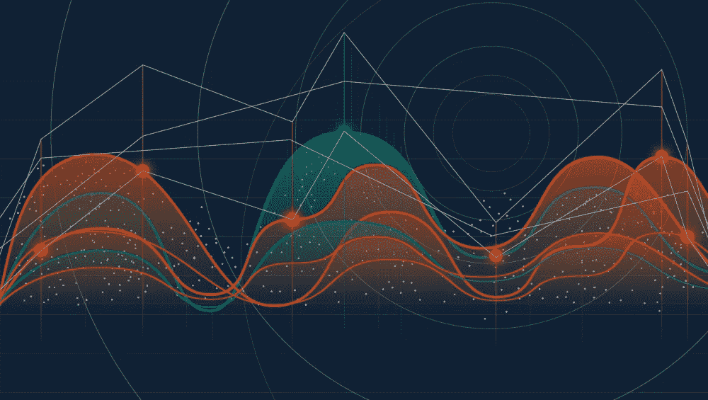

# 数据的最大列表法

> 原文：<https://medium.com/capital-one-tech/a-maximalist-approach-to-data-6e0f21529689?source=collection_archive---------0----------------------->

## 为什么所有数据和大部分数据之间会有巨大的差异

数据的重要性被强调得如此频繁，几乎已经成为一种陈词滥调。经济学家引人注目的标题“ [*的变体世界上最重要的资源不再是石油，而是数据“*](https://www.economist.com/leaders/2017/05/06/the-worlds-most-valuable-resource-is-no-longer-oil-but-data) 似乎随处可见，在技术专家和消费者中引发了等量的兴奋和恐惧。然而，尽管新的数据用例像植物细胞一样成倍增长，但对于系统开发团队来说，将生产数据优先于其他能力构建却异常困难。

我当然经历过这种动态。今年夏天早些时候，我从数据工程师转型为后端平台产品经理。亲眼目睹了数据的力量之后，我认为我可以毫不费力地帮助我的团队成为一流的数据制作者。但是，一旦我跟上了业务需求和时间表的速度，我就得出结论，生成我们的数据必须放在次要位置。

在重新安排数据生产开始的时间后的几周里，我试图更好地理解导致我做出决定的因素，并围绕数据生产建立一个更具弹性的内部神话。我选定了三个关键途径来理解保存数据为何如此重要，同时又如此难以实现。

# **#1 数据模型的隐性影响**

首先要记住的是，数据中未被注意到的差距会在多大程度上扭曲分析。假设您经营一家便利店，您的收银机捕获了购买数据。每当扫描一个商品时，您的收银机会将该商品的价格存储在一列表格中。出于对销售情况的好奇，您对该表运行了一个查询，并获得了一个简单、有指导意义的发现:价格低于 5 美元的商品比价格高于 5 美元的商品更赚钱。作为一名全面的数据驱动型决策者，你得出的结论是，你需要以顾客期望的价格为商店储备更多商品。

但是，如果你一直在追踪一个不同的领域呢？想象一下，不是收银机，而是条形码扫描仪来捕获数据，一列表中的字段显示正在销售的商品类型。出于对销售情况的好奇，您对该表运行了一个查询，并获得了一个简单的、指导性的发现:冰激凌品脱的销售一飞冲天！作为一个全面的、数据驱动的决策者，你得出的结论是，你需要利用这个需求高峰，将冰淇淋的价格从 4.50 美元提高到 5.50 美元。

> 在数据有限的情况下，数据模型成为你的分析背后的编剧；除非你在寻找它，否则你看不到它，它经常尽最大努力待在阴影里。

两个不同的领域，两条相互冲突的行动路线。在这两种情况下，数据的性质已经预先确定了杠杆点。第一个表捕获并累积价格数据—这样做，它将您的操作过程限制为响应价格和数量之间的关系。在数据有限的情况下，数据模型成为你的分析背后的编剧；除非你在寻找它，否则你看不到它，它经常尽最大努力待在阴影里。

# **#2 真正的采购之路**

上面的例子是一些系统保存数据和每个系统保存数据之间的区别。系统是在筒仓中构建的，对于它们来说，留在合理专门化的领域内是架构上健康的。当只有其中一些系统发出数据时，分析会不知不觉地被这些系统所在的孤岛所吸引，从而可能错过更大的图景。

解决这个问题对于进入第二步至关重要:*真正的采购。*系统之间相互通信，每个 API 调用都包含某种程度的数据交换。如果两个系统高度相互依赖并产生它们所知道的一切，那么很可能会有一定程度的场冗余。如果一个系统从另一个系统获取一个字段，然后在其日志中生成该字段，那么强调从第一个系统而不是第二个系统获取数据的重要性似乎是吹毛求疵。

> 一个系统的时间戳是另一个系统的日期，前导零有消失的习惯。

传递的场越多，变异就越多。一个系统的时间戳是另一个系统的日期，前导零有消失的习惯。术语“原始数据”和“真实源”数据经常互换使用，但是它们之间的差异非常有意义。数据可以是原始的，而不是真正的来源，如果一个系统不产生自己的数据，其他系统就会代表它说话。

如果你曾经玩过电话游戏，那么你就会知道当数据随着时间传递时，不一致性会变得多么巨大。

# **#3 新数据用例的不可预测性**

我在这里说了所有这些，事实仍然是:在添加功能和产生数据之间进行选择，我选择了前者。在思考为什么的时候，我的思绪不断回到我当数据工程师的时候。我的团队运行着一个非常有价值的流处理平台，几乎每次我接触一个新团队，询问他们如何访问他们的数据，得到的回答都是一样的:*“你想用它做什么？”*

我觉得那次经历非常有教育意义。我一次也没有走进任何类似“*的房间，我们一直在等待这样的用例。”制片人总是对我们提出的建议感到惊讶。*

> 强大的数据用例往往来自意想不到的角度，生产系统本身不知道它涵盖的角度。此外，如果没有数据的启发，就无法发现数据的用例，所以从数据第一次可用到用例成熟之间的周期时间很长。

我这么说的原因并不是要表达我和一群混蛋一起工作——相反，我很确定我和世界上最好的人一起工作。他们的怀疑说明了一个事实，即强大的数据用例往往来自意想不到的角度，生产系统本身并不知道它涵盖的角度。如果你对小苏打的唯一体验来自做蛋糕，那么看到它和醋混在一起大概会让你大吃一惊。此外，如果没有数据的启发，就无法发现数据的用例，所以从数据第一次可用到用例成熟之间的周期时间很长。在有人发现它的用例之前，我的团队中的一个流已经存在了一年，但是这个用例被证明是非常有价值的。

将“未知用例”的浪漫观点内化是成为伟大的数据制作者的关键。编写数据质量检查、记录元数据和构建管道既困难又耗时。你必须天生对信息的价值有信心，并耐心等待投资回报。如果没有工程文化的强化，这些品质是很难实现的。产生数据必须被视为一种需求，而不是一种奖励。

# **结论**

维护一个延伸到业务各个部分的数据环境，以多种节奏运行，并使其广泛可用，同时维护安全标准是非常困难的。在单个团队的层面上，它可能感觉像一个远离平台核心功能的西西弗任务，而在企业层面上，它可能感觉脆弱。您变得非常依赖访问控制、元数据和数据生产者监控。

缩减数据量看起来很容易，但这种思考过程最终会消除数据推动行动的力量。在不断寻找杠杆的过程中，丰富和多方面的数据是您最有价值的资产。

## 有关系的

*   [CICD 和数据](/capital-one-tech/cicd-pipelines-and-data-platforms-758b074b38b1)
*   [思考流媒体的三种方式](/capital-one-tech/three-ways-to-think-about-streaming-6cc39b99a56e)

*披露声明:这些观点是作者的观点。除非本帖中另有说明，否则 Capital One 不属于所提及的任何公司，也不被其认可。使用或展示的所有商标和其他知识产权都是其各自所有者的所有权。本文为 Capital One 2018。*