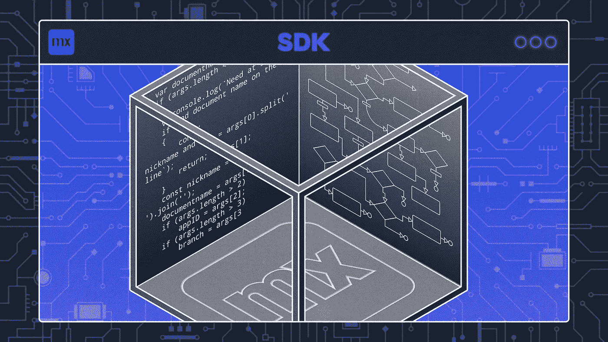
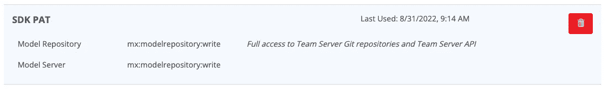

# Mendix SDK 入门—第 1 部分

> 原文：<https://medium.com/mendix/a-mendix-sdk-primer-part-1-90c75f81d9b6?source=collection_archive---------1----------------------->

## 由 Mendix Platform SDK 支持的 Mendix Model SDK 是一个已经存在多年的工具。其目的是为开发人员提供对 Mendix 应用程序模型的编程访问，而无需使用 Studio 或 Studio Pro。



A Mendix SDK Primer — Part 1

在这个简短的系列中，我将说明如何使用 SDK 对应用程序执行有用的操作。第一篇文章是让你从使用 NodeJS 建立一个开发环境开始，创建一个类型脚本**来使用 SDK** 并执行那个脚本。

我不打算把这作为一个 TypeScript/JavaScript 教程(我很难做到这一点，网上有很多很好的资源可用)和**我将重点关注 SDK** 的各个方面，而不是代码细节。


# 为什么您可能想要使用 SDK？

Mendix 模型 SDK 可以支持大量用例，仅举几个例子:

**提取全部或部分应用程序模型的详细信息，以翻译成不同的媒体。** 例如，您可能希望从模型中提取信息以生成您自己的文档，或者您可能希望提取微流**中的逻辑以用另一种语言**如 JavaScript 或 C#构建等效的内容。

**自动更新应用程序，以确保符合开发或安全标准。**例如，您可能希望实施通用微流/纳流命名标准，或者要求实体应用适当的最低访问权限。

**代码、页面、实体等的自动创建。来自参数化输入的应用程序。**例如，您可能想要自动复制数据源的结构或模式，并将其构建到 Mendix 应用程序中。

# 发展环境

谈到工具，开发人员有他们自己的偏好。你至少需要 NodeJS 和一个脚本编辑器——我使用 Visual Studio 代码进行编辑，可以从 [Visual Studio Code](https://code.visualstudio.com/) 获得，因为我喜欢它的类型脚本支持。我不会建议对环境进行任何花哨的设置和配置，只是保持简单——用一个文件夹保存我构建的脚本。

下面的文档页面上有许多与平台和模型 SDK 相关的文档。

 [## Mendix 平台 SDK

### 1 介绍和常见问题在 Mendix Platform SDK 可以让您的生活变得更轻松之前，您应该了解 Mendix…

docs.mendix.com](https://docs.mendix.com/apidocs-mxsdk/mxsdk/) 

## NodeJS 安装

下载并安装 NodeJS 的最新稳定版本，可以在 [NodeJS](https://nodejs.org/) 找到，英文下载页面在 [NodeJS 英文下载](https://nodejs.org/en/download/releases/)。

[](https://nodejs.org/) [## 节点. js

### Node.js 是基于 Chrome 的 V8 JavaScript 引擎构建的 JavaScript 运行时。

nodejs.org](https://nodejs.org/) 

*如果您已经安装了 NodeJS 的早期版本并希望保留它，那么您可以使用一个工具，如 NodeJS 版本管理器“nvm ”,它将允许您安装和管理 NodeJS 的多个版本并在它们之间切换。包管理器的选择在* [*节点包管理器*](https://nodejs.org/en/download/package-manager) *中描述。*

## 创建一个工作文件夹并初始化它

接下来，我需要一个地方来放我的作品，所以我创建了一个文件夹来工作。然后我用 NodeJS 包管理器初始化它，并确保安装了 TypeScript 包。

```
**mkdir SDKBlog
cd SDKBlog
npm init --yes
npm install -g typescript**
```

接下来切换到您的编辑器，在名为 **package.json** 的文件夹中创建或编辑一个文件，并更改该文件以包含 SDK 包的依赖项。它应该是这样的:

```
{
    "name": "sdkblog",
    "version": "1.0.0",
    "main": "index.js",
    "scripts": {
        "test": "echo \"Error: no test specified\" && exit 1"
    },
    "keywords": [],
    "author": "",
    "license": "ISC",
    "dependencies": {
        "mendixmodelsdk": "^4.56.0",
        "mendixplatformsdk": "^5.0.0"
    },
    "devDependencies": {},
    "description": ""
}
```

**使用 npm install** 下载 SDK 包。这将创建一个名为' **node_modules** '的子文件夹，其中将存储各种包文件的层次结构。

```
**npm install**
```

最后，**创建或编辑一个 tsconfig.json** **文件**来指定编译器选项和正在创建的类型脚本文件的名称。每次向文件夹中添加新的 TypeScript 文件时，您都可以将其添加到 tsconfig.json 文件中，然后当您运行 TypeScript 编译器命令“tsc”时，它会将所有文件编译成 JavaScript，以便可以执行它们。

```
{
    "compilerOptions" : {
        "module" : "commonjs",
        "target" : "es2020",
        "strict": true
    },
    "files" : [
        "showdocument.ts"
    ]
}
```

## 获取个人访问令牌

您需要前往位于 [Mendix Warden](https://warden.mendix.com) 的 Mendix Warden 站点。在那里，您将需要使用您的 Mendix 开发人员门户凭据登录。

创建个人访问令牌以访问存储库功能，例如:



将生成的令牌保存在名为 **MENDIX_TOKEN** 的环境变量中。关于如何操作的说明可在 [Mendix PAT 设置页面](https://docs.mendix.com/apidocs-mxsdk/mxsdk/setup-your-pat/#3-saving-the-personal-access-token-as-an-environment-variable)上找到。

完成这个**之后，你现在应该准备好使用 SDK 了。**

# 应用程序到 JavaScript 脚本

我将在这里编写的脚本是一个有用的工具，当您在做任何 Mendix SDK 工作时都可以使用它。

> 它将从现有的 Mendix 应用程序中下拉模型，并在您指定的模型中找到一个文档，并将该文档的定义作为 JavaScript 代码输出。

相信我，当你开始使用 Mendix SDK 时，你可能会一次又一次地使用它，因为没有什么比目测一个现有的例子更好的方法来增强你对如何使用 SDK 和应用程序模型的理解。

这个脚本在 Github 上，Github 项目的链接在这篇博文的末尾。

## 预赛

该脚本通过期望命令行保存项目昵称(您想要的任何名称)和 Mendix 文档的限定名(微流/表单/枚举)来打开，因此如果您想要提取域模型，这将只是模块名，或者模块名加上一个句点加上文档名。如果您是第一次访问不同的项目，您需要将应用 ID 添加到命令行(从该应用的 Mendix 开发人员门户页面上的常规选项卡中获取)，如果您不想使用默认分支，则需要添加分支名称。

```
import { JavaScriptSerializer } from "mendixmodelsdk";
import { MendixPlatformClient, OnlineWorkingCopy } from "mendixplatformsdk";
import * as fs from "fs";// Usage: node showdocument.js nickname documentname appID branch
//   nickname is your own name for the app
//   documentname if the qualified name (module.document) of the document to serialize
//   appID is the appID for the app (taken from the Mendix developer portal page)
//   branch is the name of the branch to use
//
// The appID and branch are only needed when setting up a new working copy
//
// The appID, branch name and working copy ID are saved in a file called nickname.workingcopy in the
// current folder so they can be used next time if possible
//
const args = process.argv.slice(2);main(args);async function main(args: string[])
{
    var appID = "";
    var branch = "";
    var documentname = ""; if (args.length < 1)
    {
        console.log(`Need at least a nickname and document name on the command line`);
        return;
    } const nickname = args[0].split(' ').join('');
    documentname = args[1];
    if (args.length > 2)
        appID = args[2];
    if (args.length > 3)
        branch = args[3]; const workingCopyFile = nickname + '.workingcopy'; var wcFile;
    var wcID; try
    {
        wcFile = fs.readFileSync(workingCopyFile).toString();
        appID = wcFile.split(':')[0];
        branch = wcFile.split(':')[1];
        wcID = wcFile.split(':')[2];
    }
    catch
    {
        wcFile = "";
        wcID = ""; if (appID === "")
        {
            console.log("Need an appID on the command line if no workingcopy file is present for the nickname");
            return;
        }
    }
```

当脚本运行时，它将创建一个以您给的昵称+'命名的文件。“workingcopy ”,其中将存储应用程序 id、分支名称和生成的工作副本 ID。这样，下次您运行相同应用程序(昵称)的脚本时，它将读取您上次创建的工作副本 id，并再次使用它。这使得过程更快。

```
 const client = new MendixPlatformClient();
    var workingCopy:OnlineWorkingCopy; const app = client.getApp(appID); var useBranch = branch; if (wcID != "")
    {
        try
        {
            console.log("Opening existing working copy");
            workingCopy = app.getOnlineWorkingCopy(wcID);
        }
        catch (e)
        {
            console.log(`Failed to get existing working copy ${wcID}: ${e}`);
            wcID = ""
        }
    } if (wcID === "")
    {
        const repository = app.getRepository(); if ((branch === "") || (branch === "trunk") || (branch === "main"))
        {
            const repositoryInfo = await repository.getInfo();
            if (repositoryInfo.type === "svn")
                useBranch = "trunk";
            else
                useBranch = "main";
        } try
        {
            workingCopy = await app.createTemporaryWorkingCopy(useBranch);
            wcID = workingCopy.workingCopyId;
        }
        catch (e)
        {
            console.log(`Failed to create new working copy for app ${appID}, branch ${useBranch}: ${e}`);
            return;
        }
    } fs.writeFileSync(workingCopyFile, `${appID}:${useBranch}:${wcID}`);
```

## 使用 SDK

创建/打开工作副本后，脚本现在打开应用程序的模型，找到指定的域模型或文档，调用 JavaScript 反序列化器，并将输出写入控制台。

> 请注意，该脚本假设不带句点字符的文档名是一个模块名，并且您希望提取该模块的域模型。否则，提供的名称将被视为合格的文档名(module.document)。

```
 const model = await workingCopy!.openModel(); console.log(`Opening ${documentname}`); if (documentname.split(".").length <= 1)
    {
        const domainmodelinterfaces = model.allDomainModels().filter(dm => dm.containerAsModule.name === documentname);
        if (domainmodelinterfaces.length < 1)
            console.log(`Cannot find domain model for ${document}`);
        else
        {
            try
            {
                const domainmodelinterface = domainmodelinterfaces[0];
                const domainmodel = await domainmodelinterface.load();
                 console.log(JavaScriptSerializer.serializeToJs(domainmodel));
            }
            catch(e)
            {
                console.log(`Error occured: ${e}`);
            }
        }
    }
    else
    {
        const documentinterfaces = model.allDocuments().filter(doc => doc.qualifiedName === documentname);
        if (documentinterfaces.length < 1)
            console.log(`Cannot find document for ${document}`);
        else
        {
            try
            {
                const documentinterface = documentinterfaces[0];
                const document = await documentinterface.load();
                console.log(JavaScriptSerializer.serializeToJs(document));
            }
            catch(e)
            {
                console.log(`Error occured: ${e}`);
            }
        } }}
```

## 例子

在运行脚本之前，或者在修改脚本之后，您应该使用“tsc”命令将其从 TypeScript 编译成 JavaScript。如前所述，如果 tsconfig.json 中包含 TypeScript 文件名，这就可以工作。

```
**tsc**
```

否则，您可以使用如下命令编译特定的 TypeScript 文件:

```
**tsc showdocument.ts**
```

首先，我使用下面的命令下拉管理模型的域模型。我选择“弗雷德”作为这个应用程序的昵称。

```
**node showdocument.js fred Administration 8252db0e-6235-40a5-9502-36e324c618d7**
```

输出可能很长，所以我只展示其中的一部分。

```
 var generalization1 = domainmodels.Generalization.create(model);
    // Note: this is an unsupported internal property of the Model SDK which is subject to change.
     generalization1.__generalization.updateWithRawValue("System.User"); var stringAttributeType1 = domainmodels.StringAttributeType.create(model); var storedValue1 = domainmodels.StoredValue.create(model); var fullName1 = domainmodels.Attribute.create(model);
    fullName1.name = "FullName";
    fullName1.type = stringAttributeType1;   // Note: for this property a default value is defined.
    fullName1.value = storedValue1;   // Note: for this property a default value is defined. var stringAttributeType2 = domainmodels.StringAttributeType.create(model); var storedValue2 = domainmodels.StoredValue.create(model); var email1 = domainmodels.Attribute.create(model);
    email1.name = "Email";
    email1.type = stringAttributeType2;   // Note: for this property a default value is defined.
    email1.value = storedValue2;   // Note: for this property a default value is defined. var booleanAttributeType1 = domainmodels.BooleanAttributeType.create(model); var storedValue3 = domainmodels.StoredValue.create(model);
    storedValue3.defaultValue = "true"; var isLocalUser1 = domainmodels.Attribute.create(model);
    isLocalUser1.name = "IsLocalUser";
    isLocalUser1.type = booleanAttributeType1;   // Note: for this property a default value is defined.
    isLocalUser1.value = storedValue3;   // Note: for this property a default value is defined. var memberAccess1 = domainmodels.MemberAccess.create(model);
    memberAccess1.attribute = model.findAttributeByQualifiedName("Administration.Account.FullName");
    memberAccess1.accessRights = domainmodels.MemberAccessRights.ReadWrite; var memberAccess2 = domainmodels.MemberAccess.create(model);
    memberAccess2.attribute = model.findAttributeByQualifiedName("Administration.Account.Email");
    memberAccess2.accessRights = domainmodels.MemberAccessRights.ReadWrite; var memberAccess3 = domainmodels.MemberAccess.create(model);
    memberAccess3.attribute = model.findAttributeByQualifiedName("Administration.Account.IsLocalUser");
    memberAccess3.accessRights = domainmodels.MemberAccessRights.ReadOnly; var accessRule1 = domainmodels.AccessRule.create(model);
    accessRule1.memberAccesses.push(memberAccess1);
    accessRule1.memberAccesses.push(memberAccess2);
    accessRule1.memberAccesses.push(memberAccess3);
    accessRule1.moduleRoles.push(model.findModuleRoleByQualifiedName("Administration.Administrator"));
    accessRule1.allowCreate = true;
    accessRule1.allowDelete = true; var memberAccess4 = domainmodels.MemberAccess.create(model);
    memberAccess4.attribute = model.findAttributeByQualifiedName("Administration.Account.FullName");
    memberAccess4.accessRights = domainmodels.MemberAccessRights.ReadOnly; var memberAccess5 = domainmodels.MemberAccess.create(model);
    memberAccess5.attribute = model.findAttributeByQualifiedName("Administration.Account.Email");
    memberAccess5.accessRights = domainmodels.MemberAccessRights.ReadOnly; var memberAccess6 = domainmodels.MemberAccess.create(model);
    memberAccess6.attribute = model.findAttributeByQualifiedName("Administration.Account.IsLocalUser"); var accessRule2 = domainmodels.AccessRule.create(model);
    accessRule2.memberAccesses.push(memberAccess4);
    accessRule2.memberAccesses.push(memberAccess5);
    accessRule2.memberAccesses.push(memberAccess6);
    accessRule2.moduleRoles.push(model.findModuleRoleByQualifiedName("Administration.User"));
    accessRule2.defaultMemberAccessRights = domainmodels.MemberAccessRights.ReadOnly; var memberAccess7 = domainmodels.MemberAccess.create(model);
    memberAccess7.attribute = model.findAttributeByQualifiedName("Administration.Account.FullName");
    memberAccess7.accessRights = domainmodels.MemberAccessRights.ReadWrite; var memberAccess8 = domainmodels.MemberAccess.create(model);
    memberAccess8.attribute = model.findAttributeByQualifiedName("Administration.Account.Email"); var memberAccess9 = domainmodels.MemberAccess.create(model);
    memberAccess9.attribute = model.findAttributeByQualifiedName("Administration.Account.IsLocalUser"); var accessRule3 = domainmodels.AccessRule.create(model);
    accessRule3.memberAccesses.push(memberAccess7);
    accessRule3.memberAccesses.push(memberAccess8);
    accessRule3.memberAccesses.push(memberAccess9);
    accessRule3.moduleRoles.push(model.findModuleRoleByQualifiedName("Administration.User"));
    accessRule3.xPathConstraint = "[id='[%CurrentUser%]']"; var account1 = domainmodels.Entity.create(model);
    account1.name = "Account";
    account1.location = {"x":220,"y":140};
    account1.generalization = generalization1;   // Note: for this property a default value is defined.
    account1.attributes.push(fullName1);
    account1.attributes.push(email1);
    account1.attributes.push(isLocalUser1);
    account1.accessRules.push(accessRule1);
    account1.accessRules.push(accessRule2);
    account1.accessRules.push(accessRule3);
```

然后，我通过运行以下命令从模型中拉出 ChangeMyPassword 微流。请注意，不需要应用程序 ID，因为它可以使用刚刚创建的现有工作副本。

```
**node showdocument.js fred Administration.ChangeMyPassword**
```

这个输出甚至更长，所以我将只删除一部分结果。

```
 var expressionSplitCondition1 = microflows.ExpressionSplitCondition.create(model);
    expressionSplitCondition1.expression = "$AccountPasswordData/NewPassword = $AccountPasswordData/ConfirmPassword"; var exclusiveSplit1 = microflows.ExclusiveSplit.create(model);
    exclusiveSplit1.relativeMiddlePoint = {"x":430,"y":200};
    exclusiveSplit1.size = {"width":130,"height":80};
    exclusiveSplit1.splitCondition = expressionSplitCondition1;   // Note: for this property a default value is defined.
    exclusiveSplit1.caption = "Passwords equal?"; var translation1 = texts.Translation.create(model);
    translation1.languageCode = "en_US";
    translation1.text = "The new passwords do not match."; var translation2 = texts.Translation.create(model);
    translation2.languageCode = "nl_NL";
    translation2.text = "De nieuwe wachtwoorden komen niet overeen."; var text1 = texts.Text.create(model);
    text1.translations.push(translation1);
    text1.translations.push(translation2); var textTemplate1 = microflows.TextTemplate.create(model);
    textTemplate1.text = text1;   // Note: for this property a default value is defined. var showMessageAction1 = microflows.ShowMessageAction.create(model);
    showMessageAction1.template = textTemplate1;   // Note: for this property a default value is defined.
    showMessageAction1.type = microflows.ShowMessageType.Error; var actionActivity1 = microflows.ActionActivity.create(model);
    actionActivity1.relativeMiddlePoint = {"x":430,"y":75};
    actionActivity1.size = {"width":120,"height":60};
    actionActivity1.action = showMessageAction1; var endEvent1 = microflows.EndEvent.create(model);
    endEvent1.relativeMiddlePoint = {"x":430,"y":-20};
    endEvent1.size = {"width":20,"height":20}; var startEvent1 = microflows.StartEvent.create(model);
    startEvent1.relativeMiddlePoint = {"x":-220,"y":200};
    startEvent1.size = {"width":20,"height":20}; var closeFormAction1 = microflows.CloseFormAction.create(model); var actionActivity2 = microflows.ActionActivity.create(model);
    actionActivity2.relativeMiddlePoint = {"x":1110,"y":200};
    actionActivity2.size = {"width":120,"height":60};
    actionActivity2.action = closeFormAction1; var endEvent2 = microflows.EndEvent.create(model);
    endEvent2.relativeMiddlePoint = {"x":1230,"y":200};
    endEvent2.size = {"width":20,"height":20}; var memberChange1 = microflows.MemberChange.create(model);
    // Note: this is an unsupported internal property of the Model SDK which is subject to change.
    memberChange1.__attribute.updateWithRawValue("System.User.Password");
    memberChange1.value = "$AccountPasswordData/NewPassword"; var changeObjectAction1 = microflows.ChangeObjectAction.create(model);
    changeObjectAction1.items.push(memberChange1);
    changeObjectAction1.refreshInClient = true;
    changeObjectAction1.commit = microflows.CommitEnum.Yes;
    changeObjectAction1.changeVariableName = "Account"; var actionActivity3 = microflows.ActionActivity.create(model);
    actionActivity3.relativeMiddlePoint = {"x":620,"y":200};
    actionActivity3.size = {"width":120,"height":60};
    actionActivity3.action = changeObjectAction1;
    actionActivity3.caption = "Save password";
    actionActivity3.autoGenerateCaption = false; var expressionSplitCondition2 = microflows.ExpressionSplitCondition.create(model);
    expressionSplitCondition2.expression = "$OldPasswordOkay"; var exclusiveSplit2 = microflows.ExclusiveSplit.create(model);
    exclusiveSplit2.relativeMiddlePoint = {"x":230,"y":200};
    exclusiveSplit2.size = {"width":120,"height":80};
    exclusiveSplit2.splitCondition = expressionSplitCondition2;   // Note: for this property a default value is defined.
    exclusiveSplit2.caption = "Old password okay?"; var endEvent3 = microflows.EndEvent.create(model);
    endEvent3.relativeMiddlePoint = {"x":230,"y":-20};
    endEvent3.size = {"width":20,"height":20}; var basicCodeActionParameterValue1 = microflows.BasicCodeActionParameterValue.create(model);
    basicCodeActionParameterValue1.argument = "$Account/Name"; var javaActionParameterMapping1 = microflows.JavaActionParameterMapping.create(model);
    // Note: this is an unsupported internal property of the Model SDK which is subject to change.
    javaActionParameterMapping1.__parameter.updateWithRawValue("System.VerifyPassword.userName");
    javaActionParameterMapping1.parameterValue = basicCodeActionParameterValue1;   // Note: for this property a default value is defined. var basicCodeActionParameterValue2 = microflows.BasicCodeActionParameterValue.create(model);
    basicCodeActionParameterValue2.argument = "$AccountPasswordData/OldPassword"; var javaActionParameterMapping2 = microflows.JavaActionParameterMapping.create(model);
    // Note: this is an unsupported internal property of the Model SDK which is subject to change.
    javaActionParameterMapping2.__parameter.updateWithRawValue("System.VerifyPassword.password");
    javaActionParameterMapping2.parameterValue = basicCodeActionParameterValue2;   // Note: for this property a default value is defined.
```

好了，这些片段显示了输出可能相当广泛，并且它可能暗示了使用 SDK 可能带来的一些复杂性，尽管如果您熟悉使用 JavaScript/TypeScript，那么您可能会感觉舒服得多。

类似的命令可用于提取 Mendix 应用程序中各种文档类型的定义。JavaScriptSerializer 可以为您提供可能直接使用(或修改后使用)的代码来更新这个或另一个应用程序，这非常有用。但是…

## 一丝谨慎

使用 JavaScriptSerializer 提取模型的一部分，并将其转换成 JavaScript，这非常有助于向您展示如何对模型执行类似的操作。对吗？差不多吧。

生成的代码几乎可以一直工作，但是有些动作不会完全按照您必须编写更新模型的脚本的方式来呈现。例如，我发现生成的代码**无法在模型**上执行，因为脚本使用了**系统**模块。

SDK 不能用来访问**系统**模块进行读写，这很复杂。有一些变通方法允许你引用系统模块中的一些东西，例如在上面脚本顶部的管理域模型中的一个域模型。创建引用系统的一般化。用户，稍后在脚本底部创建专门化命名帐户时会用到它。脚本中给出的语法是正确的，但是如果您尝试运行它，当前将被拒绝。您需要更换:

```
generalization1.__generalization.updateWithRawValue("System.User");
```

使用:

```
(generalization1 as any)["_generalization"].updateWithRawValue("System.User");
```

设置微流调用参数和通过专门化引用系统实体中的属性也有类似的情况。我想还有其他地方可能会出现这种问题。这些问题正在等待解决，但是目前你需要使用一个变通方法，比如上面的这个👆。

# 摘要

我希望这篇博文和脚本对你有用。在我的下一篇 SDK 文章中，**我将编写一个脚本来创建一个全新的应用程序**，并且**向它添加一个模块**以及**一个域模型**和一些简单的支持文档。

GitHub 上提供了用于生成这篇博文的文件夹和脚本，以及示例命令的输出。

[](https://github.com/Adrian-Preston/SDKBlog1) [## GitHub-Adrian-Preston/SDK blog 1:SDK 初级博客 1 的支持库

### 此时您不能执行该操作。您已使用另一个标签页或窗口登录。您已在另一个选项卡中注销，或者…

github.com](https://github.com/Adrian-Preston/SDKBlog1) 

## 阅读更多

 [## Mendix 平台 SDK

### 1 介绍和常见问题在 Mendix Platform SDK 可以让您的生活变得更轻松之前，您应该了解 Mendix…

docs.mendix.com](https://docs.mendix.com/apidocs-mxsdk/mxsdk/) [](/mendix/hidden-power-of-the-mendix-model-sdk-ebd6cbca9c7) [## Mendix 模型 SDK 的隐藏功能

### 虽然 Mendix SDK 已经存在很多年了，但是你并不经常听说它。这很可能是因为…

medium.com](/mendix/hidden-power-of-the-mendix-model-sdk-ebd6cbca9c7)  [## Mendix 模型 SDK - v4.68.0

### Mendix 模型 SDK - v4.68.0 的文档

apidocs.rnd.mendix.com](https://apidocs.rnd.mendix.com/modelsdk/latest/index.html)  [## Mendix 平台 SDK - v5.1.1

### Mendix 平台 SDK 可用于调用 Mendix 平台 API。它还与 Mendix Model SDK 集成，用于…

apidocs.rnd.mendix.com](https://apidocs.rnd.mendix.com/platformsdk/latest/index.html) 

*来自发布者-*

*如果你喜欢这篇文章，你可以在我们的* [*中页*](https://medium.com/mendix) *找到更多喜欢的。对于精彩的视频和直播会话，您可以前往*[*MxLive*](https://www.mendix.com/live/)*或我们的社区*[*Youtube PAG*](https://www.youtube.com/c/MendixCommunity/community)*e .*

*希望入门的创客，可以注册一个* [*免费账号*](https://signup.mendix.com/link/signup/?source=direct) *，通过我们的* [*学苑*](https://academy.mendix.com/link/home) *获得即时学习。*

有兴趣加入我们的社区吗？加入我们的 [*松弛社区频道*](https://join.slack.com/t/mendixcommunity/shared_invite/zt-hwhwkcxu-~59ywyjqHlUHXmrw5heqpQ) *。*