# 现代困境:何时使用规则与机器学习

> 原文：<https://medium.com/capital-one-tech/a-modern-dilemma-when-to-use-rules-vs-machine-learning-61cc908769b0?source=collection_archive---------1----------------------->

## 如何识别用例的正确解决方案


机器学习正在席卷全球，许多使用规则引擎进行商业决策的公司开始利用它。然而，这两种技术面向不同的问题。规则引擎用于执行需要 100%精确的离散逻辑。另一方面，机器学习专注于获取大量输入并试图预测结果。了解这两种技术的优势非常重要，这样您就可以针对问题找到正确的解决方案。在某些情况下，这不是一个或另一个，而是你如何一起使用两者来获得最大价值。

# 业务逻辑、计算和工作流

我们先从理解业务逻辑开始。这些年来，我在系统中与各种类型的逻辑打交道，理解上下文很重要。

什么是商业逻辑？最简单的形式，它的逻辑包含管理业务流程的决策。这些决策是商业决策。这种逻辑往往会随着市场的变化而变化，并且可能会根据特定行业的驱动因素而经常变化。逻辑关注于*为什么和什么时候*。最终，在采取行动之前，条件必须为真。

业务逻辑通常利用业务计算。与业务逻辑不同，业务计算往往保持不变。他们关注*什么和如何*。将这两者从部署方面分离很重要，因为它们以不同的速度变化。一般来说，任何可重用的逻辑都应该是可独立部署的。如果可重用逻辑与应用程序部署相关联，那么它就不能单独重用，而是与其他组件相关联。理想情况下，我们希望将应用程序的可重用部分分解成微服务，以便它们可以独立地重用和部署。例如，参见马丁·福勒在“图 1:单片和微服务”下的[插图](https://martinfowler.com/articles/microservices.html#CharacteristicsOfAMicroserviceArchitecture)。

我们如何将业务逻辑的不同步骤连接在一起？ ***工作流程*** 。

它们是业务流程中工作任务的结构化流程或序列。工作流可以是基于人的、基于系统的(例如编排)，也可以是两者的混合。在之前的[博客](/capital-one-tech/microservices-when-to-react-vs-orchestrate-c6b18308a14c)中，我讨论了什么时候反应，什么时候配合。

# 实现业务逻辑的方法

现在我们已经了解了这些部分是如何组合在一起的，让我们讨论一些构建业务逻辑的方法。一般来说，实现业务逻辑有三种不同的方法:*应用程序代码、决策表和规则引擎*。在我的经验中，我已经使用了这三种方法中的每一种，确定决定哪一种最适合的标准很重要。

## 应用代码

当逻辑变化不大并且相当简单时，应用程序是一个很好的选择。

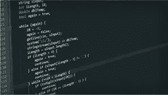

example code

## 决策表

决策表非常适合经常变化的逻辑，并且有大量的条件，这些条件在表中比在代码中更容易管理

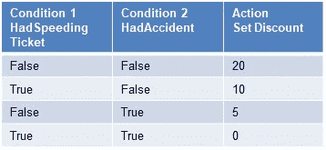

example decision tree

## 规则引擎

规则引擎非常适合经常变化且高度复杂的逻辑，涉及许多逻辑层次。规则引擎通常是业务规则管理系统(BRMS)的一部分，它提供了管理复杂性的广泛功能。

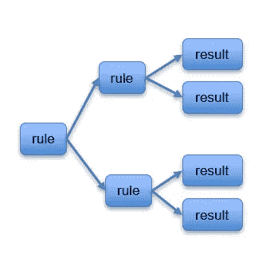

example rules engine flow

如果我们将此指导放入象限，它看起来会像下面这样:

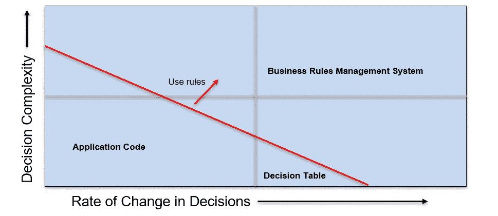

business logic usage graph

随着复杂性和变化率的增加，应用程序代码不再适合业务逻辑。随着变化率的增加，决策表提供了一些缓解，但最终 BRMS 提供了最适合高变化率和高复杂性的方法。

# **业务规则管理系统(BRMS)**

让我们通过查看下面的功能参考视图来更深入地了解 BRMS 的功能。

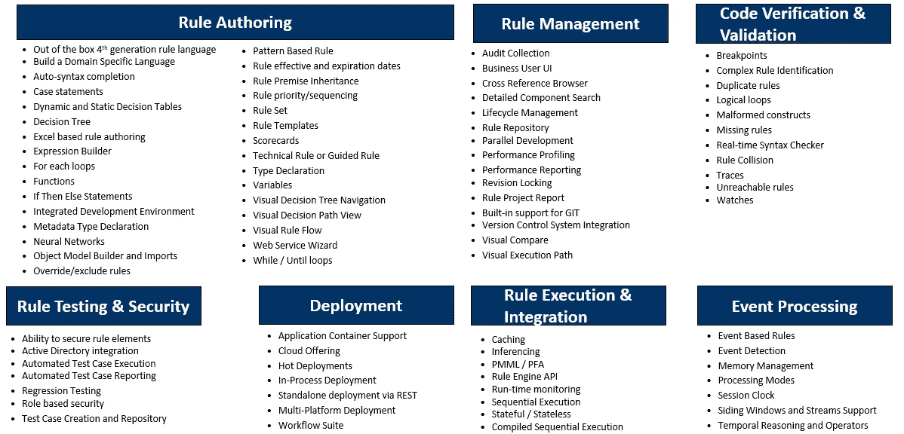

BRMS capability reference view

让我们接触一下这个参考视图中的几个关键功能，并强调一些与机器学习功能重叠的功能。

## **规则创作**

*   技术规则或指导性规则提供了两种不同的方式来创作适合不同最终用户的规则。技术规则更适合您的开发人员，而指导性规则由点击式方法组成，可能更适合技术水平较低的用户。
*   领域特定语言(DSL)是另一种能力，它可以使非技术用户用更容易使用的语言编写规则。
*   神经网络是机器学习中使用的一种算法形式，有趣的是看到一些 BRMS 与此相结合。

## **规则管理**

规则库是 BRMS 最强大的功能之一。它是一种机制，开发人员可以在其中发现已经构建了什么，以及他们可能能够重用什么。规则元数据存储在这里，这对于理解底层意图至关重要。

## **部署**

通常，可以通过两种方式部署规则——作为通过 REST API 调用调用的独立服务的一部分，或者作为应用程序的一部分嵌入(进程内)。在本文稍后，我们将看到机器学习平台共享类似的模型。

## **规则执行&部署**

[预测模型标记语言(PMML)](https://en.wikipedia.org/wiki/Predictive_Model_Markup_Language) 或[可移植分析格式(PFA)](https://en.wikipedia.org/wiki/Portable_Format_for_Analytics) ，都是使模型可互换的行业标准格式。它们使您能够用一种语言或平台构建模型，并将其移植到另一种支持 PMML 或 PFA 的语言或平台中。

BRMS 的一个例子是[流口水](https://www.drools.org/)。Drools 是一个开源的 Apache 许可的、基于 Java 的规则引擎。它支持利用 PHREAK 算法的正向和反向链接推理引擎。如果您希望规则引擎决定规则的顺序，这个推理引擎就派上了用场。Drools 提供了指导性规则、技术规则 DRL 语法和对领域特定语言(DSL)的支持。Drools 还支持进程内和独立部署模型。一个名为 [Kogito](https://kogito.kie.org/) 的新社区项目构建在 Drools 7 之上，为您创建 rest 可部署 Drools 服务。我经常发现自己在 Java 微服务中部署 drools 规则，然后将它们作为 restful APIs 公开。科吉托为你做这个。

# 机器学习平台

现在我们对规则引擎有了很好的了解，让我们将它们与机器学习平台进行比较。在[之前的一篇文章](/capital-one-tech/using-machine-learning-and-open-source-bpm-in-a-reactive-microservices-architecture-96bb8dc9e962)中，我概述了什么是机器学习，以及如何在[开源 BPM](/capital-one-tech/comparing-and-contrasting-open-source-bpm-projects-196833f23391) 中使用它。在一篇类似的帖子中，我解释了如何通过 [Akka](/capital-one-tech/leveraging-akka-and-machine-learning-in-a-reactive-microservices-architecture-57b2da0c949e) 使用机器学习。现在让我们来看看机器学习平台的能力参考视图。

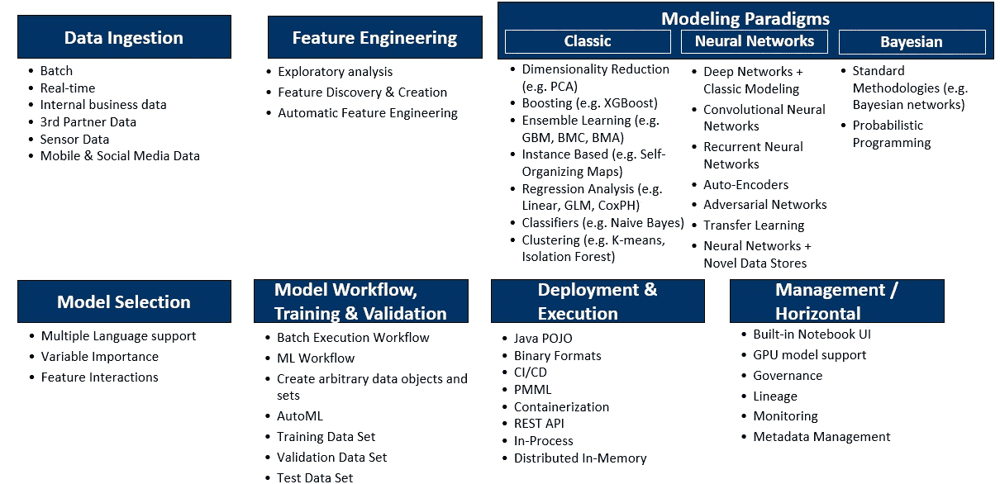

Machine Learning Platform Capability Reference View

让我们触及一些关键功能，并再次联系到与 BRMS 视图的类似重叠。

## **数据摄取**

数据是机器学习中最重要的东西。你的模型和你的数据一样好。您需要尽可能多的数据，这可能包括批处理和实时数据源。

## **特征工程**

特征是模型的输入，一些 ML 平台提供了创建这些特征的能力。其他软件提供了自动生成特性的功能。

## **建模范例**

这些是可以在机器学习模型中使用的不同算法。这里需要注意的重要一点是，它们并不局限于[有监督的](https://en.wikipedia.org/wiki/Supervised_learning#:~:text=Supervised%20learning%20is%20the%20machine,a%20set%20of%20training%20examples.)、[无监督的](https://en.wikipedia.org/wiki/Unsupervised_learning)或[强化学习](https://en.wikipedia.org/wiki/Reinforcement_learning#:~:text=Reinforcement%20learning%20(RL)%20is%20an,supervised%20learning%20and%20unsupervised%20learning.)类别，而是可以在所有三个类别中使用。

## **部署&执行**

您会注意到这方面与 BRMS 功能的一些相似之处，特别是进程内和独立的 REST API 部署以及对 PMML 的支持。

## **管理**

管理机器学习模型的一个最重要的方面是监控它的准确性。机器学习的一个常见谬误是，ML 模型永远不需要重新训练，因为它可以自我学习。事实并非如此，因为机器学习模型必须经常重新训练，因为它们训练的数据开始偏离它们在生产中执行的数据。

[H2O](https://www.h2o.ai/) 就是这样一个开源内存机器学习平台的例子。它提供了多种算法(例如[广义线性模型](https://en.wikipedia.org/wiki/Generalized_linear_model)、[随机森林](https://en.wikipedia.org/wiki/Random_forest)、[梯度推进机](https://en.wikipedia.org/wiki/Gradient_boosting)、[主成分分析](https://en.wikipedia.org/wiki/Principal_component_analysis)等)。)用于训练机器学习模型以及生成显示所生成模型的准确性和性能的度量。H2O 还将生成一个可部署的工件，您可以将它包含在您的项目中，比如 POJO (Plain Old Java Object)或者 MOJO ( Model ObJect，Optimized)工件。当 POJO 达到大小限制或需要更高的性能时，通常会使用 MOJO。

通过比较机器学习平台和规则引擎的能力，我们现在可以看到在能力水平上的相似性和差异。鉴于这些领域的产品越来越接近，在这两者之间做出选择是很困难的，这是可以理解的。

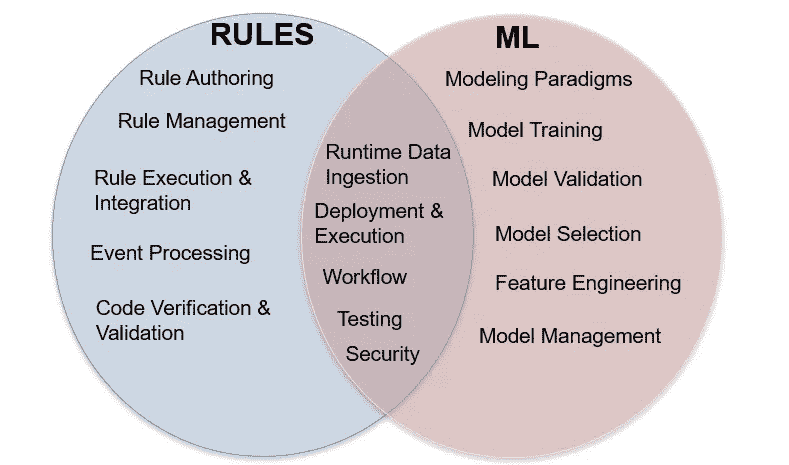

Comparison between rules engines and machine learning platforms

# 指导何时使用规则引擎与机器学习

那么，我们如何决定何时使用规则引擎或机器学习呢？要回答这个，我们先从*逻辑、逻辑类型、什么创建了逻辑、数据*这些维度来回答这个问题。规则非常适合以下情况:

*   **逻辑:**确切的逻辑是已知的。有了规则，你就能提前知道你想要执行的逻辑。
*   **逻辑类型:**精密基础。如果商业逻辑是精确的，并且不涉及任何预测。它基于对事实的评估产生布尔型结果。
*   **逻辑创建:**由人工完成。软件工程师或业务用户创建表示业务逻辑的规则。
*   **数据:**不需要从数据中自动推导出逻辑。分析通常在数据上预先发生，以确定确切的逻辑应该是什么。

现在，让我们用同样的维度来看机器学习:

*   **逻辑:**确切的逻辑不得而知。相反，在创建预测中有意义的输入/特征可能是已知的。
*   **逻辑类型:**基于使用算法的预测。
*   **逻辑创建:**由通过训练运行算法的机器学习软件创建。
*   **数据:**用于最终生成模型逻辑。是机器学习中最重要的。你希望使用尽可能多的数据，并确保数据是公正的。如果数据有偏差，那么模型也会变得有偏差。

总的来说，当你需要精确并且知道逻辑的时候，利用规则。当你想预测某事但不知道具体如何预测时，利用机器学习。

但是它总是那样清晰吗？如果你想同时利用两者的力量呢？答案是可以。有许多混合模式，您可以结合使用机器学习和规则来确定结果。让我们看一个示例用例。

# 一起使用机器学习和规则引擎的模式

想象一下这样一个用例，你是一名房地产经纪人，想要为你的客户提供最佳的购房指导。也许有几个他们感兴趣，但不确定他们应该多快行动。让我们通过三种不同的模式来实现机器学习和规则的结合。

## ***模式 1:利用机器学习输出作为规则的输入***

在这种模式中，执行两种不同的机器学习模型。一个确定 10 天内房子卖出的概率。另一个因素决定了卖家降低要价的概率。这两种预测都是对规则的输入。然后，规则评估模型的输出，并最终向房地产经纪人提供建议。具体来说，如果房子在 10 天内卖出的概率大于 50%，而卖家降价的概率小于 50%，那么这个模式会为房地产经纪人做出具体的推荐。

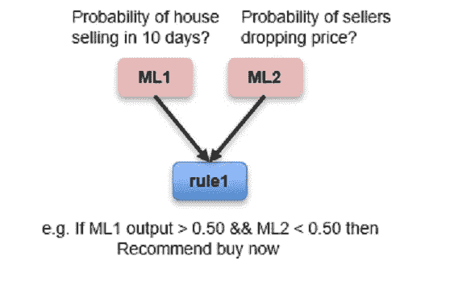

Pattern 1: leverage machine learning output as an input into rules

## ***模式 2:利用规则输出作为机器学习模型的特征输入***

在这种模式中，我们从作为机器学习模型输入的规则开始。规则执行业务逻辑来确定基于布尔值。这房子需要修理吗？是卖盘淡季吗？卖家现在想脱手卖掉房子吗？然后，这些规则的输出成为机器学习模型的特征。然后，机器学习模型向房地产经纪人提供 10 天内房屋出售的概率，以及卖家降价的概率。请注意，在这种模式中，没有给房地产经纪人的建议，而是提供了可能性，最后的建议留给房地产经纪人。

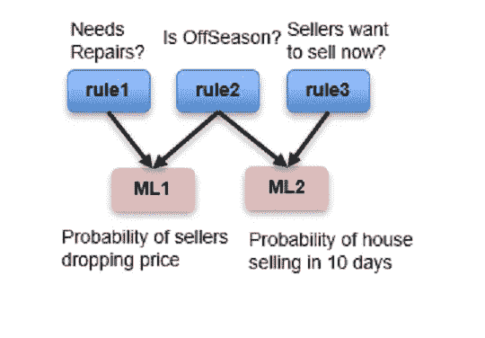

Pattern 2: Leverage rule outputs as a feature input into machine learning models

## ***模式 3:利用规则和机器学习输出作为输入***

在这种模式中，它混合了前两种模式。规则和机器学习输出都是机器学习模型的输入。在这种情况下，卖家降价的概率是 10 天内房子出售概率的输入。这种模式也把最终的建议留给了房地产经纪人。

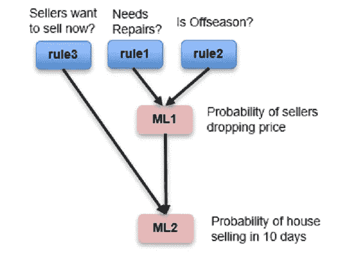

Pattern 3: Leverage both rule and machine learning outputs as inputs

# 一个示例实现

现在让我们将这些模式应用到一个实际的概念证明中。我将基于我在之前的[帖子](/capital-one-tech/leveraging-akka-and-machine-learning-in-a-reactive-microservices-architecture-57b2da0c949e)中构建的之前的反应式微服务机器学习概念验证。我们将对其进行增强，使其包含一个规则服务，机器学习模型将该服务作为输入。它将使用上面的模式 1，利用机器学习输出作为规则的输入。

让我们从我们在概念证明中改变什么来支持规则与机器学习的集成开始。下图说明了该架构:

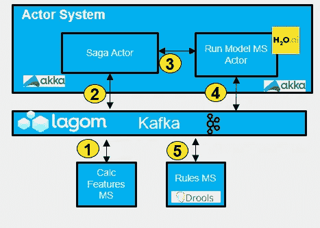

Architecture for example proof of concept

之前的[概念验证](/capital-one-tech/leveraging-akka-and-machine-learning-in-a-reactive-microservices-architecture-57b2da0c949e)的所有组成部分都是正确的，(详情请见之前的博客，我在此不再赘述)。我们引入的一个新东西是基于 Java 的 Rules MS。这是一个 Rules 微服务，将评估机器学习模型概率的输出。H20 输出置信度值作为其预测的一部分。对于机器学习模型确定为 OK/非欺诈的交易，规则服务将检查该置信度值。如果置信度值小于 50%，那么它将评估一些额外的欺诈检查的输出，在这种情况下是姓名和地址。如果其中任何一个失败，规则将建议该交易是欺诈性的。

下面是一个循序渐进的流程图:

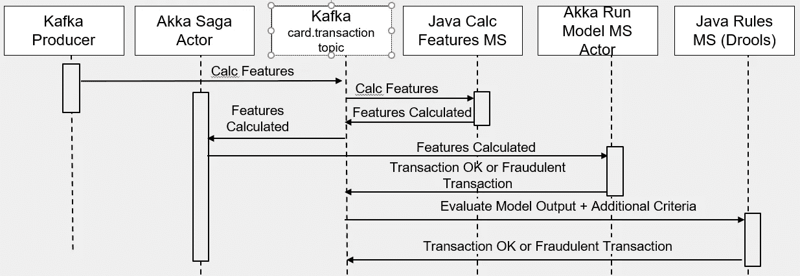

overall flow for proof of concept

现在让我们看一下 Java Rules MS 代码，看看 drools 规则是如何运行的。

```
rule “Trans OK and Prob < 0.50 and name check fail”
   when
      m : RulesData( modelProb <= 0.50, mymodelProb : modelProb)
      RulesData( status == “Transaction OK” )
      RulesData( nameCheck <= 0 )
   then
      m.setStatus(“Fraudulent Transaction from Rules, name check    
      failed”);
endrule “Trans OK and Prob < 0.50 and address check fail”
   when
      m : RulesData( modelProb <= 0.50, mymodelProb : modelProb)
      RulesData( status == “Transaction OK” )
      RulesData( addressCheck <= 0 )
   then
      m.setStatus(“Fraudulent Transaction from Rules, address check 
      failed”);
end
```

我们可以看到这是使用 Drools drl 语法，这是一种编写技术规则的方法。有两个规则都检查交易是否 OK，以及机器学习输出是否小于 50%。第一个规则还检查名称检查是否失败，第二个规则检查地址检查是否失败。您会注意到 Drools 中没有任何 else 子句。这是由设计和规则根据您指定的条件触发的。在每个规则中，您会注意到一个 RulesData 函数正在检查几个变量的状态。为了根据数据评估 Drools 规则，您必须创建一个表示数据模型的 POJO。这将包括 getters 和 setters。请参见下面的示例:

```
public static class RulesData {
   private int nameCheck=0, addressCheck=0;
   private String status=null;
   private double modelProb=0; public String getStatus() {
      return this.status;
   } public int getNameCheck() {
      return this.nameCheck;
   } public int getAddressCheck() {
      return this.addressCheck;
   } public double getModelProb() {
      return this.modelProb;
   } public void setNameCheck(int nameCheck) {
      this.nameCheck = nameCheck;
   } public void setAddressCheck(int addressCheck) {
      this.addressCheck = addressCheck;
   } public void setModelProb(double modelProb) {
      this.modelProb = modelProb;
   } public void setStatus(String status) {
      this.status = status;
   }
}
```

让我们来看一段调用 Drools 规则的 Java 代码，如下所示:

```
//run drools rules
KieServices ks = KieServices.Factory.get();
KieContainer kContainer = ks.getKieClasspathContainer();
KieSession kSession = kContainer.newKieSession("ksession-rules");// go !
kSession.insert(applicant);
kSession.fireAllRules();
kSession.destroy();
```

这段代码创建了一个 KieSession，然后将我们希望规则执行的数据插入到 KieSession 中。FireAllRules()告诉 Drools 这样做，触发所有规则。然后使用 Destroy()进行清理。基于 Java 的规则 MS 获取 drools 规则的输出，并最终将其写入 Kafka，在那里可以使用它。

# **总结**

规则和机器学习各有所长，结合使用更是如虎添翼。使用正确的解决方案是关键。当你需要精确并知道逻辑时，利用规则；当你想预测某事但不知道具体如何预测时，利用机器学习。两者都可以在反应式微服务架构风格中使用，这种架构风格提供了更易维护、更易扩展且交付速度更快的架构。

我希望你觉得这个博客很有价值，感谢你的时间！

*披露声明:2020 首创一号。观点是作者个人的观点。除非本帖中另有说明，否则 Capital One 不隶属于所提及的任何公司，也不被这些公司认可。使用或展示的所有商标和其他知识产权是其各自所有者的财产。*