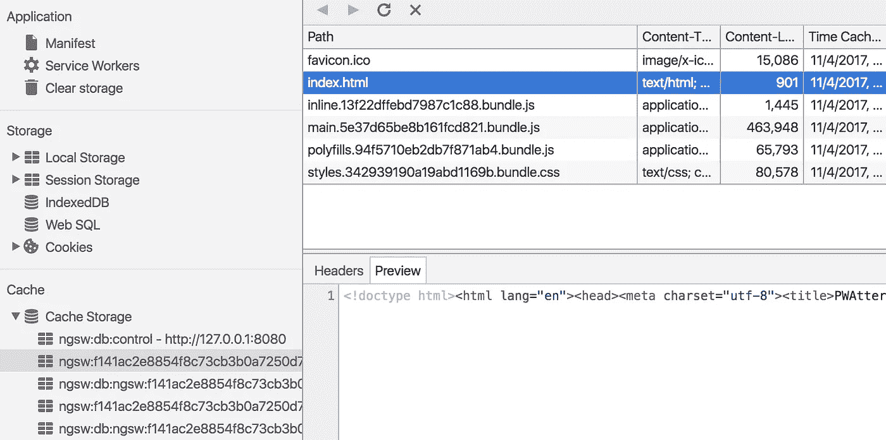
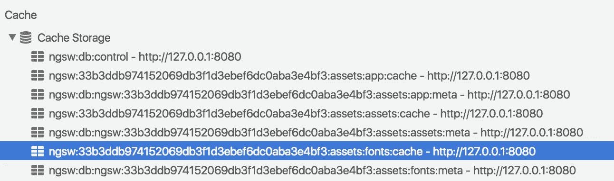

# 一个新的角度服务工作者——创建自动渐进式 web 应用程序。第 2 部分:实践

> 原文：<https://medium.com/google-developer-experts/a-new-angular-service-worker-creating-automatic-progressive-web-apps-part-2-practice-3221471269a1?source=collection_archive---------0----------------------->

> 公告:[我将于 11 月 7 日星期二在伦敦 AngularConnect 会议上介绍 Angular 服务人员](https://www.angularconnect.com/2017/sessions/#s-662)。如果你想在现场视频流中跟随我，请在你的日历上标记:格林威治时间上午 11:20(紧接主题演讲之后)，主舞台。

距离[这篇文章的第一部分](/@webmaxru/a-new-angular-service-worker-creating-automatic-progressive-web-apps-part-1-theory-37d7d7647cc7)发表还有一段时间，这种停顿是有意的——在最初出现之后，只有在几个候选版本发布之后，该功能才可以投入实际使用。现在 Angular 5 发布了，Angular Service Worker(以下简称 NGSW)已经准备好接受探索了。

我们将再次使用我们的**p water**——微型 Twitter 客户端。源代码在 GitHub (分支`ngsw`)上可用[。此外，我们需要一个简单的后端来提供 tweet feed 和处理推送通知。GitHub](https://github.com/webmaxru/pwatter) 上也有源代码和详细的设置说明[。](https://github.com/webmaxru/pwa-workshop-api)

因为这是一种实用的方法，所以让我们为 PWA 定义一些要求:

*   离线和在线模式下立即启动:我们需要一个**应用程序外壳**来实现这一点。
*   我们有一些**外部文件**(带有材质图标的网络字体)作为应用程序外壳的一部分。“外部”是指这些资源不是我们的`dist`文件夹的一部分。
*   API 调用的优化网络(**运行时缓存**):我们可以在离线期间提供一些早期访问的数据，也可以通过提供这些缓存数据而不是网络往返来加速在线模式。
*   **推送通知**:订阅通知并显示通知。客户端应用程序必须提供启动订阅流的功能，并将订阅对象传递到后端(我们总是将订阅存储在后端)。另外，我们的后端会在每次有人发关于“javascript”的推文时生成一条推送消息，所以 Angular Service Worker 应该会得到这个事件并显示一条消息。让我们也添加一些额外的功能。首先，让我们给用户取消订阅 web 推送通知的可能性。其次，让我们演示一下，除了将通知显示为通知弹出窗口之外，我们还可以将通知传播到客户端应用程序。
*   应用程序外壳应该有常规的 PWAs“stale-while-re validate”**更新流程**:如果可能的话，我们总是提供最新的缓存版本(几乎立即显示*)。同时，服务人员检查是否有更新版本的应用程序外壳。如果是，我们下载并缓存这个版本，以便在下一次应用程序运行时使用。此外，我们可能希望询问用户是否希望立即用应用程序重新加载当前选项卡。*

*让我们一点一点来，但首先，我们必须做一些关于角 CLI 状态的笔记。*

# *Angular 服务人员的 Angular CLI 支持(即将推出)*

*目前，我们发布了 Angular CLI 1.5。不幸的是，目前还没有 NGSW 支持，计划在 1.6 中推出。但是通过探索相应的拉请求([到 CLI](https://github.com/angular/angular-cli/pull/8080) 和[到 DevKit](https://github.com/angular/devkit/pull/235) )，我们可以很容易地理解它的外观和主要功能的再现。让我们看看最近的未来。*

## *服务人员的新应用*

*该命令将如下所示:*

*`ng new myApp --service-worker`(或使用别名— `-sw`)*

*有了这个服务工作者标志，Angular CLI 1.6 将为我们实现一些自动化:*

1.  *将安装角度服务人员包*
2.  *将启用对 NGSW 的构建支持*
3.  *NGSW 将为您的申请注册*
4.  *将使用一些智能默认值创建 NGSW 配置文件*

*无论如何，即使在 CLI 1.6 发布之后，知道如何重现这些步骤也是很好的，因为我们必须手动执行它们来为现有的应用程序添加 NGSW 支持。我们去给 PWAtter 添加 Angular Service Worker 吧。*

## *将 Angular Service Worker 添加到现有应用程序*

*让我们从上面手动执行同样的 4 个步骤:*

1.  ***安装 NGSW***

*`npm install @angular/service-worker --save`*

***2。启用构建支持(仅适用于 Angular CLI 1.6，请参见下面的通知)***

*`ng set apps.0.serviceWorker=true`*

*或者在`.angular-cli.json`文件中手动添加/编辑该参数。*

> *重要！目前，当我们使用 Angular CLI 1.5 时，请确保`.angular-cli.json`中的**没有**这个属性，这会导致构建错误。请参阅下面的如何在 Angular CLI 1.5 中模拟此步骤。*

***3。在您的`AppModule`中注册 NGSW** 。这是它在 Angular CLI 1.6 中的外观:*

***4。创建 NGSW 配置文件**(默认名称为`src/ngsw-config.json`)。以下是 Angular CLI 1.6 将生成的默认内容(您可以在[上一篇文章](/@webmaxru/a-new-angular-service-worker-creating-automatic-progressive-web-apps-part-1-theory-37d7d7647cc7)中找到关于该配置文件格式的更多详细信息):*

*目前，在使用 Angular CLI 1.5 时，我们还必须模拟来自步骤 2 的构建支持。实际上，除了`ng build --prod`命令之外，还有 2 个额外的动作需要执行(为了使用 NGSW，使用生产版本是很重要的！):*

*使用 NGSW CLI `ngsw-config`基于 NGSW 配置文件`src/ngsw-config.json`生成 NGSW 控制(清单)文件 `ngsw.json`。你可以在[之前的文章](/@webmaxru/a-new-angular-service-worker-creating-automatic-progressive-web-apps-part-1-theory-37d7d7647cc7)中找到这个小工具的更多细节。*

***2.2 将 NGSW 本身**从`npm_modules`包文件夹复制到我们的`dist`文件夹。*

*要使用一个简单的命令来生成支持 NGSW 的生产版本，让我们添加一些 npm 脚本:*

*现在，如果我们运行`npm run build-prod-ngsw`，我们将在`dist`文件夹中拥有 Angular PWA。可选地，我们可以通过运行`npm run serve-prod-ngsw`使用最简单的`http-server`来服务它。*

> *重要！不要使用`ng serve`来测试您的角度维修工人。此开发服务器不是为与 PWA 流协作而设计的。始终构建应用程序的生产版本，并使用任何静态 web 服务器从您的分布式文件夹中提供它。*

# *应用程序外壳*

*如果我们执行上述动作并运行`npm run build-prod-ngsw`——默认形式的角度 PWA 已经准备好了！部署应用程序或者使用任何静态 web 服务器在本地运行它(在我的例子中是`http-server`包，您运行`npm run serve-prod-ngsw`来构建和服务)。你会看到下图:*

**

*PWAtter — tiny Angular 5 app*

*现在该检查离线模式了！为此，我们将使用 Chrome DevTools:*

**

*Emulating offline mode using Chrome DevTools*

> *重要通知:Chrome v62 和早期版本可能会错误地处理离线切换，从而允许服务人员向网络发送一些请求。为了模拟更接近真实的离线模式，我推荐使用 Chrome Canary(目前是 v64)。Chrome Canary 也有更好的缓存用户界面，允许我们看到存储的 HTTP 响应的内容。*

*在我们离线后，应用程序还在工作。为什么？因为 NGSW 缓存了配置文件的`assetGroups`部分中列出的所有资源，现在它负责从缓存存储中为这些资源提供服务，缓存存储现在充满了记录:*

**

*Service Worker is registered and active*

**

*We can view the content of cached response (available only in Chrome Canary at the moment)*

*NGSW 使用高速缓存存储 HTTP 响应数据和一些元数据来处理版本控制:*

**

*Types of the storages by NGSW*

*   *后缀为`:cache`的条目—实际的 HTTP 响应。*
*   *带后缀`:meta`的条目——存储版本元信息。以后这种存储的数据可能会被移动到`indexedDB`。*

> *提示:如果让 DevTools 保持打开状态，那么在服务工作者端的每个操作之后，缓存存储部分中的条目很可能不会自动更新。如果您希望查看实际数据，请右键单击并选择刷新缓存。*

*但是这个应用程序看起来很奇怪:*

**

*No webfont icons*

*没错。NGSW 配置文件的默认形式对于我们的例子来说是不够的，因为我们使用了材料图标 webfont。显然，这些资源(对应的 CSS 和 WOFF2 文件)没有被 NGSW 缓存，但是我们可以通过在默认的`app`和`assets`组之外再给`assetGroups`添加一个组来轻松修复它。姑且称之为`fonts`:*

*使用 globs 语法指定这些资源是有意义的，因为字体文件的确切 URL 可能会随时间而改变，以支持 webfont 版本控制。另外，您可能会注意到，一方面我们既没有指定`installMode`也没有指定`updateMode.`，因为这是默认值，所以在生成的 NGSW 控制文件中两者都将被设置为`prefetch` 。另一方面，它们只有在被请求后才会被缓存，因为`urls`的细节——列出资源的方式。*

*在我们重建、运行并切换到离线模式后，我们将看到应用程序的正常状态，所有图标都在原位。*

*在缓存存储中，我们将看到两个新条目:*

**

*Storages generated by NGSW*

*我们甚至可以预览缓存的字体:*

**

*Preview of the cached resource*

*太棒了，我们有了完整的应用程序外壳，并且可以在离线模式下运行。我们的应用程序发送给 API 的请求(数据请求)呢？显然，我们不能预先缓存它们，因为我们不知道 URL 的确切列表。您可能会问:但是我们可以在 globs 上使用相同的思想，就像我们申请外部资源缓存一样:`assetGroups / resources / urls / { https://our-backend.com/api/** }`。从技术上讲，这将缓存这些响应，但这会破坏应用程序外壳的更新流程。NGSW 配置文件的`assetGroups`和`dataGroups`(来自下一章)部分有一个基本的区别:*

*   *`assetGroups`正在跟踪 app [shell]版本。如果这些组中的一个或多个资源被更新，我们认为有一个新版本的应用程序可用，相应的更新流程开始(我们将很快看到这一点)*
*   *`dataGroups`独立于 app 版本。它们使用自己的缓存策略进行缓存，这是处理我们的 API 响应的适当部分。*

*让我们缓存我们的 tweet feeds，以便离线访问和优化在线体验。*

# *运行时缓存*

*我决定对我的`/timeline` API 端点使用网络优先策略，对`/favorites`端点使用缓存优先策略。`src/ngsw-config.json`中相应的设置如下所示:*

*有一个定义 NGSW 行为的主开关:`cacheConfig / strategy`。对于网络优先战略，是`freshness`，对于缓存优先战略，是`performance`。你可以在我的[上一篇文章](/@webmaxru/a-new-angular-service-worker-creating-automatic-progressive-web-apps-part-1-theory-37d7d7647cc7)中获得关于其余参数的更多细节。*

*现在构建，服务，点击*加载我的时间线*和*加载我的收藏夹*按钮获取并缓存 API 响应，切换到离线。你会看到推文也显示在那里！*

**

*Runtime caching in offline demo*

*您可能会注意到，对于*时间线*来说，NGSW 正试图到达网络(日志中的红线)——这就是网络优先战略的工作方式。相比之下，通过点击*收藏夹*，我们只需从缓存中抓取数据。*

*我们提到的在线模式的优化呢？返回在线状态，点击*时间线* / *收藏夹*一次或两次。可以清楚地看到，*收藏夹*被立即加载，因为我们跳过了整个网络行程，从缓存中获取数据。如何指定缓存多长时间？使用`cacheConfig`部分中的设置——我们在那里有细粒度控制！*

*太好了。NGSW 在一些真正智能的网络优化方面帮了我们很多，只需要我们做一些 JSON 配置。像推送通知这样更复杂的 PWA 功能呢？*

# *推送通知*

*它们只是在 NGSW 中工作，不需要在配置文件中设置任何东西。我们只需在后端遵循一些简单的惯例来显示通知。但是让我们从头开始——用户对通知的订阅。我们可以在这里自由选择两个选项:*

*   *使用与 Web Push API 相关的 JavaScript native `navigator['serviceWorker']`对象方法*
*   *或者用`ServiceWorkerModule`的`SwPush`级。如果我们打开 [SwPush API 文档](https://angular.io/api/service-worker/SwPush)，就有我们需要的`requestSubscription()`方法。*

*当然，我们选择第二种方案。那么订阅流程将如下所示:*

*关于此代码的一些说明:*

*   *我假设我们在应用程序配置中的某个地方有 [VAPID](https://developers.google.com/web/updates/2016/07/web-push-interop-wins) 公钥(我为此创建了一个简单的`ConfigService`)。您可以在这里生成一个乏味的密钥对[。](https://web-push-codelab.glitch.me/)*
*   *为了简化代码，我将与后端的协商转移到另一个名为`pushService`的小服务中。你会在我的[回购](https://github.com/webmaxru/pwatter)(分支`ngsw`)中找到完整的工作源代码。*

*让我们来看看结果:*

**

*Push subscription + notifications*

*厉害！订阅后我们收到了一堆通知(是的，人们在推特上非常活跃地谈论 JavaScript)。*

*重要的是要知道，要让 NGSW 正确处理和显示通知，我们必须在后端遵循一些简单的**约定**:*

*   *我们直接发送通知数据，将 send notification 请求作为有效负载(NGSW 不能稍后请求这个有效负载，这在一般情况下是可能的)。*
*   *我们在有效载荷的`notification`属性中发送这个数据对象。可能包含以下字段:`title` —通知标题(*必选*)，以及[通知对象规格](https://developer.mozilla.org/en-US/docs/Web/API/Notification/Notification)的`options`中的所有字段(但未被`options`容器包装)。这种物体的例子:*

*用`SwPush`类的方法我们还能实现什么？我们可以使用`subscription` observable 获得有效订阅(例如开始退订流程):*

*此外，我们可以订阅`messages` observable，并在我们的应用程序中接收通知数据:*

*然后我们可以再填充一个 tweet feed:*

**

*底线:使用 Angular Service Worker 实现推送通知非常简单。*

# *更新流程*

*现在让我们回到我们的应用程序外壳及其版本。NGSW 到底是如何处理我们应用的更新的？*

*NGSW 应用程序更新实施有两个核心原则:*

*   *用户工作流不应被意外更新的应用程序中断。打开的浏览器标签中的应用程序版本将保持不变，直到标签关闭。*
*   *NGSW 应该保持应用程序的完整性。如果应用程序分布式中的任何单个文件被更新，我们会将整个相应的版本视为一个新版本。这样，我们可以确保我们的应用程序总是有一组一致的文件。*

*我们如何实现这些目标？*

*让我们探索 NGSW 版本化的概念。所谓版本，我们指的是一组代表我们的应用程序的特定版本的资源。如果任何应用程序文件在构建过程中发生变化，NGSW 控制(清单)文件`ngsw.json`将会不同(因为`assetGroups / resources / files`部分的计算散列和/或`assetGroups / resources / versionedFiles`部分的不同文件名)。基于此`ngsw.json`文件内容计算的应用版本的唯一标识符，我们将此哈希作为缓存存储名称的一部分。*

*好了，我们用更新的 NGSW 清单文件部署了应用程序的新版本。在其启动期间，Angular Service Worker 试图在查询字符串中使用缓存破坏者下载此`ngsw.json`,在 DevTools 的 network 选项卡中，它看起来像这样:*

*[/ngsw.json？ngsw-cache-bust = 0.36217997891166953](http://127.0.0.1:8080/ngsw.json?ngsw-cache-bust=0.36217997891166953)*

*如果这个文件与以前的不同，NGSW 会处理它，并根据更新的配置预缓存资源。都是后台做的。*

*但是这个新版本不会立即被激活，这意味着用户仍然会看到旧版本，直到他们重新加载下一页。这是一个众所周知的 PWAs 权衡。感谢服务人员，我们可以立即从缓存加载应用程序，但网络上可能有更新的版本…很可能你已经看到许多网站显示类似于"*的弹出窗口，有更新的版本可用，你想刷新吗？*”*

*我们能使用 NGSW 组织同样的流程吗？是啊！在`ServiceWorkerModule`的`SwUpdate`类中，我们有这方面的一切。[根据文档](https://angular.io/api/service-worker/SwUpdate)，我们有一个可观察的`available`来满足我们的需求:*

*结果是:*

**

*Update app version promt*

> *重要通知:当 DevTools 打开时，service worker 从不停止/启动，而是一直在后台运行。由于 NGSW 在其启动时检查更新的控制文件，这种行为可能会中断 NGSW 更新流程。在测试这个特性之前，只需关闭 DevTools。*

*如果我们希望组织自定义更新流程(如定期检查和/或强制激活)，在`SwUpdate`中有两种有用的方法:`checkForUpdate()`和`activateUpdate()`。您可以在 PWAtter 的*更新流程*选项卡中查看它们是如何工作的。代码如下:*

# *下一步是什么？*

*让我们在现实世界的应用程序中测试这个伟大的新特性！欢迎您申请新功能，并将 bug 提交到 GitHub 上的主要 Angular repo。迟早我们会默认创建角 PWA，就像[发生在`create-react-app`启动器的](https://github.com/facebookincubator/create-react-app/issues/2398)一样。*

*如果您希望加入关于 PWA 的讨论，欢迎您参加有 800 多名开发人员参加的 [open PWA slack](https://join.slack.com/t/progressive-web-apps/shared_invite/enQtMjY0NDI2MjAxNTc1LWM4ZWYyNDZhNDRlZDUyNTk5YThhZGQwOWRhZTkwZjAwNTlhNzA3MzY0ZWM0NWQxZmVkZjJhNWEzNTZkYmQ3ZTY) 。*

*我愿意为您在世界任何地方的会议、meeetup 或公司举办渐进式网络应用/ Angular / Angular 服务人员研讨会和/或会议，请通过[salnikov@gmail.com](mailto:salnikov@gmail.com)联系我。*