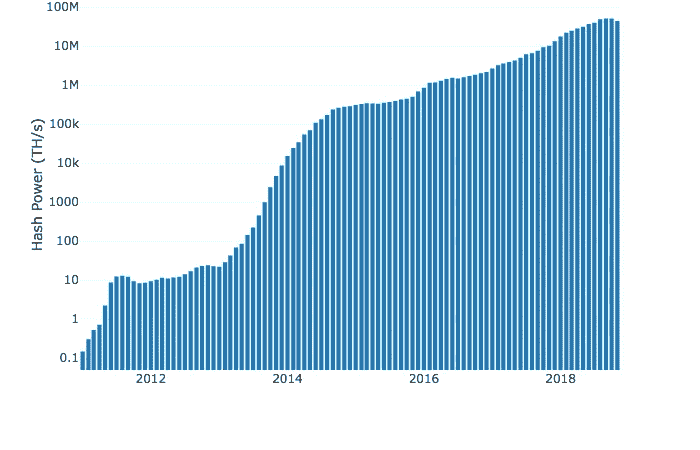
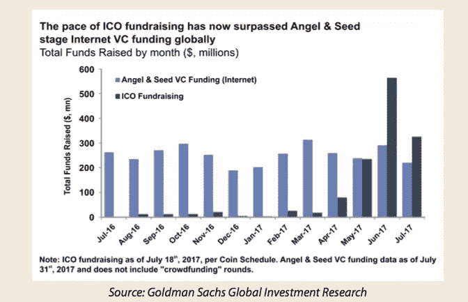

# 新的希望

> 原文：<https://medium.com/javascript-scene/a-new-hope-e2021fce7c7b?source=collection_archive---------1----------------------->

## 应用平台的未来

Image: Mr Hasgaha (CC BY-NC 2.0)

我们现在住在一个集中控制的监狱里。这座监狱以牺牲其他人的利益为代价，为少数人提供了特权。但是技术有潜力改变这一点。

如果你是一名生活在当今世界的软件开发人员，你有潜力成为这个世界有史以来最大的全球性革命的一部分。这场革命将改变数十亿人的生活，创造新的经济机会，拯救生命，并将数十亿人纳入数字经济。

## 集中式平台

2011 年，我是一个创业团队的成员，开发脸书最受欢迎的音乐应用，每月活跃用户超过 3000 万。我们像疯了一样成长，整合了其他优秀的音乐服务，如 Spotify、城里的乐队、谷歌搜索和 Billboard 杂志。50 万支乐队使用该平台管理他们的个人资料、巡演日期、音乐流和购物。

后来有一天，脸书关掉了艺术家档案的“默认登陆页面”设置。一夜之间，交通大受影响。那一天，数百家其他公司被这个单一的技术选择搞得焦头烂额。脸书改变了一个功能，结果导致数百名开发人员失业。数百个有用、有趣的应用不复存在。一个激动人心的创造可能性的生态系统被扼杀了。

但是脸书并不是唯一一家肆无忌惮地使用这种破坏力的公司。谷歌搜索因给依赖搜索流量的公司带来大生意而臭名昭著，然后通过搜索算法更新来摧毁这些公司。

问题不在于脸书、谷歌或苹果是邪恶的。问题在于，如此多的权力一开始就集中在少数几家大公司的控制之下。你未来应用的健康状况可能超出你的控制。掌控你命运的人可能会是别人。

如果我们可以在由社区控制和管理的架构之上构建应用程序，而不是由自私的大公司突发奇想来构建应用程序，会怎么样？想象一个全球计算机网络，所有计算机都连接在一起，开发人员合作构建一个更具包容性、分散化的应用平台。

当网络诞生时，它的理念是让任何人、任何地方都可以发布可以自由链接的文档。它建立在一个没有中央实体控制的网络之上。在 20 世纪 90 年代，出现了几种相互竞争的专有服务。像 AOL 和 Compuserve 这样的公司推出了他们自己的内容网络，与万维网直接竞争:但是网络赢了。

微软和苹果也在争夺移动设备平台的所有权。如果我们让时间停在 2010 年，你可能会认为苹果赢得了那场战争。但是今天，开源的 Linux 操作系统驱动着安卓设备，占据了全球移动智能手机市场 86%的份额。

在 20 世纪 90 年代，收取许可费(有时是版税)的商业软件库统治了图书馆界。今天，如果有人创建了一个闭源 GUI 工具包并试图收取许可费，很少有人会被迫放弃开源的 React 生态系统。

但是我们仍然编写依赖像脸书、谷歌或推特这样的中央实体生存的应用程序。即将到来的海啸将会改变这一切。

在 20 世纪 90 年代后期，人们开始在互联网上共享 MP3 文件，首先是通过位于中央服务器上的文件传输协议(FTP)。但是很快，中央服务器受到了唱片公司的攻击。社区对 Napster 进行了反击，Napster 是第一个受欢迎的分散音乐共享服务，但唱片公司认为，尽管 Napster 没有直接托管音乐，但它使人们能够违反法律。

Napster 是一家由中央集权公司拥有和运营的公司，在 2000 年， [Metallica 起诉 Napster 并使他们关闭](https://en.wikipedia.org/wiki/Metallica_v._Napster,_Inc.)。

但是如果你认为点对点(P2P)的故事就此结束，那你就大错特错了。从 Napster 的灰烬中升起了 [Gnutella](https://en.wikipedia.org/wiki/Gnutella) 、 [Bittorrent](https://en.wikipedia.org/wiki/BitTorrent) 和 [IPFS](https://en.wikipedia.org/wiki/InterPlanetary_File_System) 。所有带有开源实现的开放协议。所有这些都是分散的，没有控制公司可以起诉，到目前为止，没有人能够关闭它们。

## 集中资本

2008 年，房地产市场崩盘。过多的无担保抵押贷款债务集中在少数几家非常大的银行。当贷款违约率开始赶上他们时，多米诺骨牌开始倒下，导致多家银行倒闭，仅在美国就有超过 7.7 万亿美元的紧急援助。类似的崩溃和救助在整个欧洲回荡，威胁着整个全球经济，并使世界陷入自大萧条以来最严重的衰退。

2009 年 1 月 9 日，[比特币区块链上的创世纪区块](https://en.bitcoin.it/wiki/Genesis_block)被开采。块中嵌入了以下消息:

> 《泰晤士报》03/1/2009 财政大臣濒临第二轮银行救助

世界对银行机构的信任度跌至引发危机的低点，经历了两年金融危机、失业和房屋止赎的公众聚集在一起，形成了 2011 年蔓延全球的[占领华尔街示威](https://en.wikipedia.org/wiki/Occupy_Wall_Street)。当中产阶级蒸发时，引发危机的银行家乘着金色降落伞飘走了。公众被激怒了。

从那以后，银行又开始玩同样的游戏，脸书、谷歌和苹果拥有了更大的权力，我们的自由受到了越来越多的攻击。

## 我们唯一的希望

分散式架构已经爆炸式增长。比特币是点燃投资者想象力的火花，随着资金为加密货币注入火箭燃料，开发者社区开始形成并增长，增长，再增长。

自 2011 年以来，比特币网络哈希功率增长了 8 个数量级，价格也随之增长。

Bitcoin Hash Power graph by Hans HODL: 2011–2018

比特币交易之所以可行，是因为比特币区块链:数字稀缺性和去中心化共识的首次大规模展示。到 2013 年，大量开发人员都在想，利用数字稀缺和分散式账本技术(DLT)，还能完成什么。

事实证明，答案是“很多”。一位名为[的开发者维塔利克·布特林](https://en.wikipedia.org/wiki/Vitalik_Buterin)在他投入 3 年时间玩的《魔兽世界》游戏改变了规则后感到沮丧。布特林涉足比特币，想探索区块链还能做什么。分散式世界计算机的想法开始在他的脑海中形成。

2015 年，Vitalik Buterin、Gavin Wood 和 Joseph Lubin 推出了[以太坊](https://www.ethereum.org/)，一个大型的开发者社区聚集在它的周围。到 2017 年，ICO big-bang 推出了数以千计的替代加密资产，大多位于以太坊之上，提供了传统风险投资的替代选择，并在此过程中创造了一些新的亿万富翁。

到 2017 年底，投资狂潮达到顶峰，在 2018 年的大部分时间里，价格一直在回落到现实。2018 年的价格下跌是一种现象，每次比特币价格达到另一个数量级的增长时，这种现象都会在历史上重现。相信我，前方的成长远比身后的多。

与此同时，第一代可扩展的 dApps 开始到来，包括[Sliver . TV](https://www.sliver.tv/)与腾讯游戏的[合作，该合作用加密货币奖励电子竞技观众和流媒体，这些加密货币可以在 silver 平台上消费并用于游戏内购买。](https://www.ccn.com/tencent-games-forms-partnership-with-blockchain-esports-platform/)

与此同时，[Waves 平台](https://wavesplatform.com/)让任何人都可以轻松创建一种加密货币。它基于租赁股权证明(LPoS)共识运行自己的区块链，这是一种比比特币和以太坊使用的工作证明(PoW)模型更快的基础层扩展解决方案。钱包软件具有内置的分散式交易所(DEX ),用户可以在那里交易代币。Waves wallet 在 Android 商店的下载量超过 10 万次。

如果你对加入这场革命感到好奇，大多数加密应用程序都是在前端使用 JavaScript 构建的。区块链节点实现(与区块链本身通信的软件)建立在广泛的技术之上，包括 C++(比特币核心)、Go(以太坊)和 JavaScript ( [Lisk](https://lisk.io/) )。

区块链应用通常依赖于智能合约，智能合约不仅为账本中记录的数据提供共识，还为处理这些数据的算法提供共识。

目前大多数以太坊开发都是在 **Solidity** 中完成的，它是迄今为止使用最多的智能合约编程语言。

比特币有**比特币脚本**。Waves 有一种故意图灵不完整的函数式编程语言，叫做 **RIDE** ，而 [Cardano](https://www.cardano.org/en/home/) 有 [**普路托斯**](https://cardanodocs.com/technical/plutus/introduction/) ，这是一种受 Haskell 启发的函数式编程语言，设计者不是别人，正是 [Philip Wadler](https://en.wikipedia.org/wiki/Philip_Wadler) ，他将单子带到了 Haskell，并启发了跨越所有现代编程语言的一代函数式程序员。

但是，尽管有这些区块链编程语言，世界上大多数加密和区块链编程都是用 JavaScript 进行的。JavaScript 是推动加密革命的用户界面的事实标准。

> "世界上大多数加密和区块链编程都是用 JavaScript 完成的."

## 一个新博客

在我写第一篇关于 JavaScript 的文章之前，我已经用 JavaScript 专业编程超过 10 年了。

在我写第一篇关于 crypto 的博客文章之前，我已经使用、构建和遵循去中心化架构超过 10 年了。

我一直在观察，学习，建设，领导团队，等待合适的时机。技术通常不会在任何人第一次听说它的时候爆炸。它起初构建缓慢，然后到达一个拐点，真正开始爆发成为主流采用。

加密即将爆发。2019 年将是第一批数百万用户 dApps 上市的一年，非区块链极客将首次开始使用加密货币进行交易。

偶尔，如果 JavaScript 开发人员特别感兴趣的话，我会在 JavaScript scene 上写关于分散架构的博客。然而，我的大部分密码写作将在一个名为“挑战”的新博客上找到归宿。

关于这项挑战的第一篇博客文章是由有影响力的加密资产分析师汉斯·HODL 撰写的。我很荣幸把你介绍给他。

如果你想更多地了解为什么加密如此重要，请深呼吸，吃点零食，然后阅读我们的“走出去”战斗歌曲，[《挑战》](/the-challenge/the-challenge-7d502f0dfc3c)。

***Eric Elliott*** *是分布式系统专家，著有* [*【编程 JavaScript 应用】*](https://ericelliottjs.com/product/programming-javascript-applications-ebook/) *。作为*[*devanywhere . io*](https://devanywhere.io/)*的联合创始人，他教授开发人员远程工作和拥抱工作/生活平衡所需的技能。他为加密项目建立开发团队并提供建议，并为 Adobe Systems、Zumba Fitness、华尔街日报、ESPN、BBC 以及包括 Usher、弗兰克·奥申、Metallica 等在内的顶级唱片艺术家提供软件体验。*

他和世界上最美丽的女人享受着与世隔绝的生活方式。