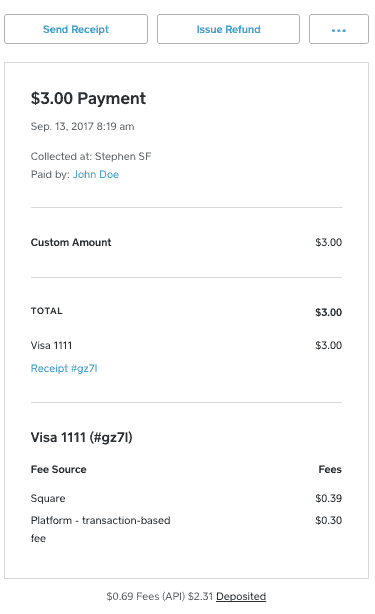

# 开发者在 Square 平台上赚钱的新方式

> 原文：<https://medium.com/square-corner-blog/a-new-way-for-developers-to-monetize-on-squares-platform-5186a8109b9e?source=collection_archive---------3----------------------->

> 注意，我们已经行动了！如果您想继续了解 Square 的最新技术内容，请访问我们的新家[https://developer.squareup.com/blog](https://developer.squareup.com/blog)

继我们 9 月份在[宣布](/square-corner-blog/a-new-partnership-with-eventbrite-and-the-future-of-squares-commerce-platform-3397c7ea2b3d)我们正在与 Eventbrite 合作扩展我们的市场产品后，我们很高兴地分享，现在使用我们的电子商务 API 或 Square Checkout 的市场和平台可以支付他们的商户并获得他们自己的支付。

在过去的几个月里，我们与包括 [Weebly](https://www.weebly.com/square) 和[schedulity](https://essentials.schedulicity.com/payment-square/)在内的几个开发者和合作伙伴密切合作，对产品进行测试、改进并提供反馈。使用 Square 多方交易，Weebly 能够将 Square 的产品扩展到其所有计划:

> “拥有一家小企业是一项巨大的成就，但扩大和发展电子商务可能是一项财务挑战。Weebly 希望让企业家的生活更轻松，并让他们对我们的产品和集成感到满意。通过在 Weebly 的所有定价计划中提供 Square，我们为创业者打开了市场，让他们可以开始使用科技行业中最好的金融服务，而且使用方便，价格合理。”Weebly 业务发展副总裁 Nick Dellis

另一方面，Schedulicity 使用该产品来解决复杂的支付问题:

> “Square Multi-Party transactions 允许企业使用 Schedulicity 的 Fill My Book 功能，这样他们就可以获得报酬，服务费也会自动收取。对于复杂的支付问题，这是一个无缝、优雅的解决方案。”—迈克尔·威尔逊，营销和业务发展高级副总裁

类似地，基于这些 API 构建解决方案的开发人员现在有了一种方法，可以从他们处理的交易中抽取一部分来赚钱。Square 为开发人员提供了一些方法来实现这一点:

*固定费用:一项产品或服务的成本为 100 美元，外加 10 美元的费用。在这种情况下，平台将向购买者收取 110 美元，同时使用额外的接收者对象将 10 美元转给他们自己:*

```
*curl -X POST \
    [https://connect.squareup.com/v2/locations/location_id/transactions](https://connect.squareup.com/v2/locations/location_id/transactions) \
    -H 'authorization: Bearer REPLACE ME' \
    -H 'content-type: application/json' \
    -H 'origin: [https://connect.squareup.com'](https://connect.squareup.com') \
    -d '{
          "idempotency_key": "SOME_ID",
          "amount_money": {
            "amount": 11000,
            "currency": "USD"
          },
          "additional_recipients":[
            {
              "location_id":  "platform_location_id",
              "description":  "Platform - flat fee",
              "amount_money": { 
                  "amount": 1000,
                  "currency": "USD"
              }
            }
          ] 
          "card_nonce": "card_nonnce",
          "reference_id": "some optional reference id",
          "note": "some optional note",
          "delay_capture": false
        }'*
```

**:100 美元的产品或服务，收取 10%的费用。您必须显式计算百分比的数量，并在请求中发送它。如果我们为您计算百分比，我们这样做是为了防止舍入的任何歧义。在这种情况下，平台将向买方收取 111.11 美元，同时使用额外的接收者对象将 11.11 美元(10%)转给他们自己:**

```
**curl -X POST \
    [https://connect.squareup.com/v2/locations/location_id/transactions](https://connect.squareup.com/v2/locations/location_id/transactions) \
    -H 'authorization: Bearer REPLACE ME' \
    -H 'content-type: application/json' \
    -H 'origin: [https://connect.squareup.com'](https://connect.squareup.com') \
    -d '{
          "idempotency_key": "SOME_ID",
          "amount_money": {
            "amount": 11111,
            "currency": "USD"
          },
          "additional_recipients":[
            {
              "location_id":  "platform_location_id",
              "description":  Platform - percent-based fee",
              "amount_money": { 
                  "amount": 1111,
                  "currency": "USD"
              }
            }
          ] 
          "card_nonce": "card_nonnce",
          "reference_id": "some optional reference id",
          "note": "some optional note",
          "delay_capture": false
        }'**
```

*****基于交易的费用***:100 美元的产品或服务，收取 10%的费用。在这种情况下，平台将向购买者收取 100 美元，同时使用额外的接收者对象将 10 美元转给他们自己:**

```
**curl -X POST \
    [https://connect.squareup.com/v2/locations/location_id/transactions](https://connect.squareup.com/v2/locations/location_id/transactions) \
    -H 'authorization: Bearer REPLACE ME' \
    -H 'content-type: application/json' \
    -H 'origin: [https://connect.squareup.com'](https://connect.squareup.com') \
    -d '{
          "idempotency_key": "SOME_ID",
          "amount_money": {
            "amount": 10000,
            "currency": "USD"
          },
          "additional_recipients":[
            {
              "location_id":  "platform_location_id",
              "description":  Platform - transaction-based fee",
              "amount_money": { 
                  "amount": 1000,
                  "currency": "USD"
              }
            }
          ] 
          "card_nonce": "card_nonnce",
          "reference_id": "some optional reference id",
          "note": "some optional note",
          "delay_capture": false
        }'**
```

**在所有这些情况下，Square 将继续收取其标准处理费(Square 的费用因[地理位置](https://docs.connect.squareup.com/payments/take-payments#pricing-for-payment-handling)而异)，然后在双方之间分配款项。**

**在 Square，我们一直致力于让更多的卖家和开发者获得他们需要的经济和金融工具。我们很高兴能采取措施帮助开发者在我们的平台上取得财务上的成功。**

**该特性适用于为加拿大、英国和美国的商家构建解决方案的开发人员。**

# **平台报告**

**我们还引入了一组端点，使平台能够报告它们收到的资金。这些终点是:**

*   **listatadditionalcrecipientrecevables-查看您平台上所有卖家位置收到的额外应收款项。**
*   **listaladditionalcrecipientreceivablerefunds-查看在您平台上所有卖家地点退款的额外应收款项。**

# **商户报告**

**Square 建立在简单透明的定价基础上。我们在 Square seller 仪表板上清楚地显示了从给定商家获得的额外收款资金。**

****

**如您所见，交易窗口将包括一个新的*“平台-基于交易的费用”*行项目，指示额外收款人收取的资金(本例中为 10%)。作为开发人员，您可以使用附加收件人对象中的描述字段来自定义商家将在仪表板上看到的消息。**

**首先，进入 Square 的[开发者门户](http://connect.squareup.com/apps)创建一个账户(如果你还没有的话)并获得你的 API 证书，要求你的卖家批准一个额外的 oAuth 权限*PAYMENTS _ WRITE _ ADDITIONAL _ RECIPIENTS*，选择上面哪个场景最适合你，并将 *additional recipient* 对象添加到你的收费请求中。**

**这是更好地支持我们的开发人员社区的一步，通过这种方式可以将他们在 Square 生态系统上构建的解决方案货币化。**

# **附加阅读**

*   **要阅读更多关于我们的电子商务 API，请参见[嵌入支付表单](https://docs.connect.squareup.com/payments/sqpaymentform/sqpaymentform-overview)**
*   **要了解我们多方交易的更多信息，请查看我们的[交易 API](https://docs.connect.squareup.com/payments/transactions/overview)**
*   **应用实例: [C#](https://github.com/square/connect-csharp-sdk) ， [Java](https://github.com/square/connect-java-sdk) ， [PHP](https://github.com/square/connect-php-sdk) ， [Python](https://github.com/square/connect-python-sdk) ， [Ruby](https://github.com/square/connect-ruby-sdk)**