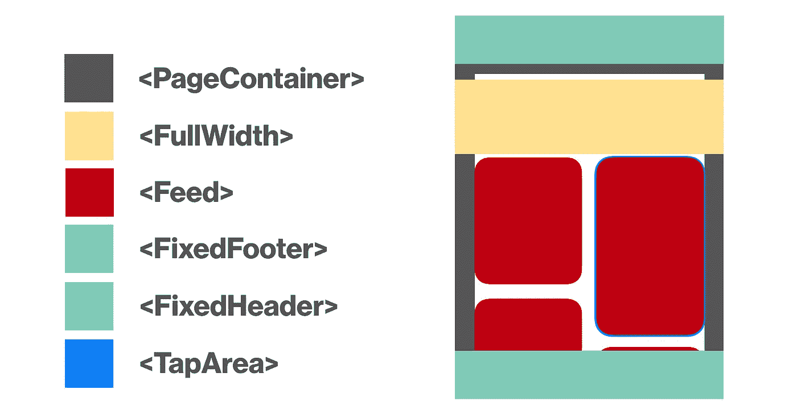

# 为期一年的 PWA 回顾展

> 原文：<https://medium.com/pinterest-engineering/a-one-year-pwa-retrospective-f4a2f4129e05?source=collection_archive---------0----------------------->

[Zack Argyle](https://www.pinterest.com/zackargyle/) |工程经理，核心经验

构建“渐进式 Web 应用程序”(PWA)的想法并不新鲜，但随着服务工作者等关键技术的出现，它的定义已经发生了变化。现在终于有可能在手机浏览器中构建出色的体验了。作为早期采用者可能会令人害怕，所以我们想分享一下我们构建世界上最大的渐进式网络应用之一的经历。

三年前，我们在移动浏览器上查看我们网站的状态，并抱怨明显的不足。指标显示，我们的原生应用的参与率提高了 80%，因此我们决定全力以赴开发 iOS 和 Android 应用。尽管我们的应用下载量大幅增加，但也有一些明显的负面影响。

艾米莉。欧文。我们想借此机会向您道歉。你是对的。太可怕了。

一年前(2017 年 7 月)，我们召集了一个团队，将我们的移动网站从零开始重写为 PWA。这是几年的对话、几个月的指标调查和一个大假设的高潮:移动网络可以像本地应用一样好。结果相当…有趣。

# **我们为什么要这么做？**

我们如此大力投资移动网络有两个主要原因。首先是我们的用户。我们在低带宽环境和有限数据计划中的移动网络体验并不好。由于超过一半的 Pinners 位于美国以外，建立一流的移动网站是一个机会，可以让 Pinterest 在全球范围内更容易访问，并最终改善每个人的体验。

第二个原因是数据驱动的。因为体验不太好，登陆我们移动网站的未认证用户中只有很小一部分安装了应用程序，注册或登录了。这不是一个好的漏斗。即使我们更看重本地应用用户的参与度，而不是移动网络用户，这也不是任何人都努力追求的转化率。我们认为我们可以做得更好。

# **我们是怎么做到的？**

2017 年 7 月，我们组建了一个团队，将我们网络平台和增长团队的工程师结合在一起。在内部，我们称之为“Project Duplo”，灵感来自简单性和可访问性。当时，移动网站占我们总注册量的不到 10%(举例来说，桌面网站占了 5 倍)。

## **时间线**

2017 年 7 月:开始“Project Duplo”
2017 年 8 月:针对登录用户百分比推出新的移动网站
2017 年 9 月:针对登录用户发布新的移动网站
2018 年 1 月:针对注销用户百分比推出新的移动网站
2018 年 2 月:针对注销用户发布新的移动网站

我们能够在三个月内创建并发布全功能重写的部分原因是由于我们的开源 UI 库， [Gestalt](https://github.com/pinterest/gestalt) 。在 Pinterest，我们使用 React 16 进行所有的 web 开发。格式塔的组件套件是为了包含我们的设计语言而构建的，这使得创建一致的漂亮页面变得非常容易，而不用担心 CSS。我们创建了一套特定于移动网站的布局组件，用于在整个网站中创建间距一致的页面。FullWidth 脱离 PageContainer 的默认边界，page container 脱离 FixedHeader 的边界。这种组合布局导致了快速、无 bug 的 UI 开发。

除了格式塔，我们还使用了 [react](https://github.com/facebook/react) 、 [react-router v4](https://github.com/ReactTraining/react-router) 、 [redux](https://github.com/reactjs/redux) 、 [redux-thunk](https://github.com/gaearon/redux-thunk) 、 [react-redux](https://github.com/reactjs/react-redux) 、 [normalizr](https://github.com/paularmstrong/normalizr) 、 [reselect](https://github.com/reactjs/reselect) 、 [flow](https://github.com/facebook/flow) 和[beauty](https://github.com/prettier/prettier)。

# 我们是如何快速完成的！

绩效被融入到目标和过程中，因为它与参与度紧密相关，并且在移动连接中非常敏感。事实上，我们的主页 Javascript 负载从大约 490kb 增加到大约 190kb。默认情况下，这是通过路由级别的代码分割实现的，鼓励使用<loader>组件进行组件级别的代码分割。我们的客户端路由器内置了一个易于使用的路由预加载系统，这为初始页面加载和客户端路由更改提供了快速体验。关于我们如何快速实现的更多细节，请查看我们与 Addy Osmani 进行的案例研究。</loader>

一年后，我们的移动 web 代码库中有大约 600 个 Javascript 文件，而这一切只需要一个错误选择的导入就可以让你的包膨胀起来。保持性能真的很难！我们在*.pinterest.com 的子网站之间广泛共享代码，因此我们制定了一些措施来确保移动网络的依赖关系保持干净。首先是一组报告构建规模的图表，当捆绑包超过允许的增长率时会发出警报。第二个是一个定制的 eslint 规则，它不允许从我们知道的依赖度很高的文件和目录中导入，这会使包膨胀。例如，移动 web 不能从桌面 web 代码库导入，但是我们有一个可以在两者之间共享的“安全”包目录。仍然有工作要做，但是我们为我们的现状感到骄傲。

虽然案例研究主要涉及页面加载，但我们也非常关心快速、类似本机的浏览体验。客户端性能的最大驱动力是我们的标准化 redux 存储，它允许近乎即时的路线更改。由于模型只有一个真实的来源，比如一个 Pin 或一个用户，所以在等待加载更多信息的时候显示您所拥有的信息变得很简单。例如，如果您浏览 Pin 的提要，我们会有关于每个 Pin 的信息。当你点击一个，它会带你到一个详细的视图。因为 Pin 数据是规范化的，所以我们可以很容易地从提要视图中显示有限的细节，直到从服务器中获取完整的细节。当您点击用户头像时，我们会显示该用户的个人资料以及我们所拥有的信息，同时我们会获取完整的用户详细信息。如果您对我们的状态结构或我们的动作流感兴趣，redux devtools 扩展在我们的移动网站的生产中启用。

新网站的核心是我们试图建立一个真正进步的网络应用(PWA)。我们支持应用外壳，添加到主屏幕，推送通知和资产缓存。服务人员缓存一个服务器渲染的、特定于用户的应用程序外壳，用于后续页面加载和创建近乎即时的页面刷新。我们很高兴苹果正在 Safari 中建立对服务人员的支持，这样所有用户都可以拥有最好的“类似本地”的体验。

而没有“夜间模式”会是怎样的“原生”体验？前往您的用户设置并尝试一下吧！

# **判决结果**

现在是你们期待已久的部分:数字。总体而言，移动网络的每周活跃用户同比增长了 103%，其中巴西增长了 156%，印度增长了 312%。在参与方面，会话长度增加了 296 %,看到的图钉数量增加了 401 %,人们将图钉保存到板上的可能性增加了 295%。这些本身就很了不起，但增长前沿才是真正的亮点。与去年同期相比，登录人数增加了 370%，新注册人数增加了 843%。自从我们发布了新的体验，移动网络已经成为新注册的顶级平台。有趣的是，在完全发布后不到 6 个月的时间里，我们已经有 80 万每周用户像使用本地应用程序一样使用我们的 PWA(从他们的主屏幕)。

回顾我们开始重建移动网络以来的整整一年，我们为我们为用户创造的体验感到无比自豪。它不仅速度明显更快，而且还是我们第一个支持从右到左语言和“夜间模式”的平台投资全功能 PWA 已经超出了我们的预期。我们才刚刚开始。

非常感谢参与重写的工程师和产品经理:贝基·斯通曼、本·芬克、延、郎天朗、维多利亚·邝、卢娜·阮、艾里斯·王和伊马德·埃利亚菲。