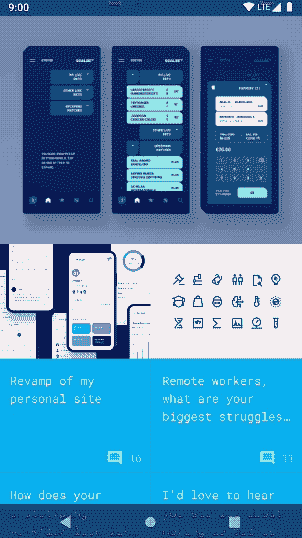
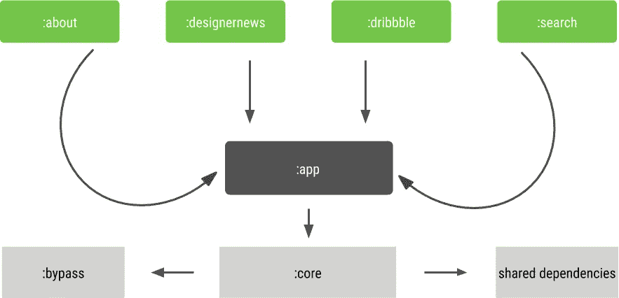
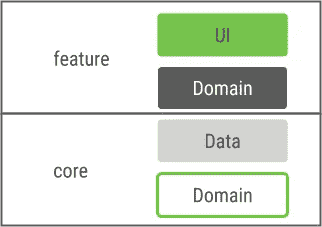
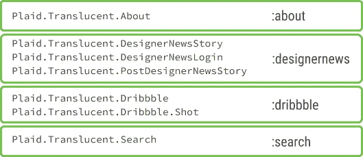

# 拼布格子——模块化的故事

> 原文：<https://medium.com/androiddevelopers/a-patchwork-plaid-monolith-to-modularized-app-60235d9f212e?source=collection_archive---------0----------------------->


Illustrated by [Virginia Poltrack](https://twitter.com/VPoltrack)

## *我们如何和为什么模块化格子花呢以及未来的发展*

*本文深入探讨了* [*拼接格子*](/@crafty/restitching-plaid-9ca5588d3b0a) *的模块化部分。*

在这篇文章中，我将介绍我们如何将 Plaid 从一个单一的通用应用程序重构为一个模块化的应用程序包。这些是我们实现的一些优势:

*   安装规模减少 60%以上
*   极大地提高了代码的安全性
*   动态交付的潜力，按需发货代码

在整个过程中，我们没有对用户体验做任何改变。

# 格子花呢一瞥



Navigating Plaid

Plaid 是一个具有令人愉快的 UI 的应用程序。它的主屏幕显示了几个来源的一系列新闻。
可以查看新闻条目的更多细节，从而进入单独的屏幕。
该应用还包含“搜索”功能和“关于”屏幕。基于这些现有的特性，我们选择了几个进行模块化。

新闻来源(Designer News 和 Dribbble)成为他们自己的动态功能模块。`about`和`search`功能也被模块化为动态功能。

[动态特性](https://developer.android.com/studio/projects/dynamic-delivery)允许在不直接将代码包含在基本 apk 中的情况下发布代码。在连续的步骤中，这允许按需下载功能。

# 盒子里是什么——格子花呢的构造

像大多数 Android 应用程序一样，Plaid 最初是作为一个通用 apk 构建的单个单片模块。安装大小不到 7 MB。然而，这些数据中的大部分在运行时从未真正使用过。

## 代码结构

从代码的角度来看，格子有清晰的包边界定义。但是，正如许多代码库所发生的那样，这些界限有时会被跨越，依赖性会悄悄进入。模块化迫使我们对这些界限更加严格，改善了分离。

## 本地图书馆

最大一块未使用的数据来自 [Bypass](https://github.com/Uncodin/bypass) ，这是一个我们用来以格子显示 markdown 的库。它包括用于多 CPU 架构的本地库，所有这些都以占用大约 4MB 的通用 apk 结束。应用捆绑包支持仅交付设备架构所需的库，将所需的大小减少到 1MB 左右。

## 可提取资源

许多应用程序使用栅格化资源。这些依赖于密度，通常占应用程序文件大小的很大一部分。应用程序可以极大地受益于配置 apk，其中每个显示密度都放在一个单独的 apk 中，允许设备定制安装，还可以大幅减少下载量和大小。

格子很大程度上依赖于[矢量 drawables](https://developer.android.com/guide/topics/graphics/vector-drawable-resources) 来显示图形资产。由于这些与密度无关，并且已经节省了大量文件大小，因此这里的数据节省对我们没有太大影响。

# 将一切缝合在一起

在模块化任务中，我们最初用`./gradlew bundle`替换了`./gradlew assemble`。Gradle 现在将生产一个 [Android 应用捆绑包](http://g.co/androidappbundle) (aab)，而不是生产一个 Android 包(apk)。使用动态特性 Gradle 插件需要一个 Android 应用捆绑包，我们将在后面介绍。

## Android 应用捆绑包

aab 生成许多更小的配置 apk，而不是单个 apk。然后，这些 apk 可以根据用户的设备进行定制，在交付期间和在磁盘上保存数据。App bundles 也是动态特性模块的先决条件。

配置 apk 由 Google Play 在 Android 应用捆绑包上传后生成。随着[应用捆绑包](http://g.co/androidappbundle)成为[开放规范](https://developer.android.com/guide/app-bundle#aab_format)和开源[工具可用](https://github.com/google/bundletool)，其他应用商店也可以实现这种交付机制。为了让谷歌 Play 商店生成并签署 apk，该应用程序还必须通过 Google Play 注册到[应用程序签名。](https://developer.android.com/studio/publish/app-signing)

## 利益

包装的这种变化为我们做了什么？

**Plaid 现在在设备上缩小了 60 %以上，相当于大约 4 MB 的数据。**

这意味着每个用户都有更多的空间来使用其他应用程序。
同样，由于文件大小的减少，下载时间也有所缩短。

没有一行代码需要修改就可以实现这种巨大的改进。

# 接近模块化

我们选择的模块化总体方法如下:

1.  将所有代码和资源移到一个核心模块中。
2.  识别可模块化的特性。
3.  将相关代码和资源移动到功能模块中。



green: dynamic features | dark grey: application module | light grey: libraries

上图显示了 Plaid 模块化的当前状态:

*   `:bypass`和外部`shared dependencies`包含在核心中
*   `:app`取决于`:core`
*   动态功能模块依赖于`:app`

## 应用模块

`:app`模块基本上是已经存在的`[com.android.application](https://developer.android.com/studio/build/)`，需要它来创建我们的应用捆绑包，并继续向我们的用户发送 Plaid。大多数用于运行 Plaid 的代码不必在这个模块中，可以移到其他地方。

## 格子呢的`core module`

为了开始我们的重构，我们将所有代码和资源转移到一个`[com.android.library](https://developer.android.com/studio/projects/android-library)`模块中。经过进一步的重构，我们的`:core`模块只包含在功能模块之间共享的代码和资源。这使得依赖关系的分离更加清晰。

## 外部依赖性

通过`:bypass`模块在核心中包含一个分叉的第三方依赖项。此外，使用 gradle 的`api`依赖关键字，所有其他 gradle 依赖项从`:app`移至`:core`。

*梯度依赖声明:api vs 实现*

通过利用`api`而不是`implementation`，依赖关系可以在整个应用中透明地共享。虽然使用`api`使我们的依赖关系易于维护，因为它们是在单个文件中声明的，而不是分布在多个`build.gradle`文件中，但这会降低构建速度。

因此，我们没有采用最初的方法，而是回归到`implementation`，这要求我们对依赖声明更加明确，但往往会使我们的增量构建更快。

[](https://github.com/nickbutcher/plaid/pull/556) [## 使用 keyboard surfer Pull Request # 556 nick butcher/plaid 的实现而不是 api

### Gradle 指出哪里需要东西，以及在应用捆绑包的哪里放置代码。这也能使增量…

github.com](https://github.com/nickbutcher/plaid/pull/556) 

## 动态功能模块

上面我提到了我们确定的可以重构到`[com.android.dynamic-feature](https://developer.android.com/studio/projects/dynamic-delivery)`模块中的特性。这些是:

```
:about
:designernews
:dribbble
:search
```

## *介绍 com . Android . dynamic-feature*

动态特征模块本质上是一个可从基础应用模块独立下载的梯度模块。它可以保存代码和资源，并包含依赖项，就像任何其他 gradle 模块一样。虽然我们还没有在格子中使用动态交付，但我们希望在未来进一步缩小初始下载大小。

# 伟大的功能洗牌

在将所有东西都移到`:core`之后，我们将“about”屏幕标记为具有最少相互依赖性的特性，因此我们将其重构到一个新的`:about`模块中。这包括活动、视图、仅由这一个特性使用的代码。此外，drawables、strings 和 transitions 等资源也被移到了新模块中。

我们为每个功能模块重复这些步骤，有时需要打破依赖关系。

最终，`:core`包含了大部分共享代码和 home feed 功能。由于 home feed 只显示在应用程序模块中，我们将相关代码和资源移回了`:app`。

## 进一步了解特征结构

编译后的代码可以打包。在将代码分成不同的编译单元之前，强烈建议将代码移动到功能一致的包中。幸运的是，我们不需要重组，因为格子已经很好地调整了功能。



feature and core modules with their respective architectural layers

正如我提到的，Plaid 的许多功能都是通过新闻来源提供的。其中的每一层都由远程和本地的**数据源、**域**和 **UI** 层组成。**

数据源既显示在主页输入中，也显示在特征模块本身的详细屏幕中。领域层统一在一个包中。这必须分成两部分:一部分可以在整个应用程序中共享，另一部分只能在一个功能中使用。

可重复使用的部分保存在`:core`库中，其他的都放在各自的功能模块中。数据层和大部分领域层至少与一个其他模块共享，并且都保存在核心中。

## 包装变更

我们还修改了包名，以反映新的模块结构。
仅与`:dribbble`功能相关的代码从`io.plaidapp`移至`io.plaidapp.dribbble`。这同样适用于各自新模块名称中的每个特性。

这意味着许多进口商品不得不改变。

模块化资源导致了一些问题，因为我们必须使用完全限定名来消除生成的`R`类的歧义。例如，导入特征局部布局的视图会导致调用`R.id.library_image`，而在同一文件中使用来自`:core`的可绘制视图会导致调用

```
io.plaidapp.core.R.drawable.avatar_placeholder
```

我们使用 Kotlin 的导入别名特性缓解了这一问题，该特性允许我们像这样导入 core 的`R`文件:

```
import io.plaidapp.core.R as coreR
```

这样就可以把通话地点缩短到

```
coreR.drawable.avatar_placeholder
```

这使得阅读代码比每次阅读完整的包名要简洁和灵活得多。

## 准备资源移动

与代码不同，资源没有包结构。这使得按特征排列它们变得更加困难。但是通过遵循代码中的一些约定，这也不是不可能的。

在 Plaid 中，文件被加上前缀以反映它们被使用的位置。例如，仅在`:dribbble`中使用的资源以`dribbble_`为前缀。

此外，包含多个模块的资源的文件(如 styles.xml)在结构上按模块分组，并且每个属性都有前缀。

举个例子:在一个单一的应用程序中，`strings.xml`保存了大部分使用过的字符串。在模块化的应用程序中，每个功能模块都有自己的字符串。
在模块化之前，当字符串按特性分组时，更容易分解文件。

遵循这样的惯例可以更快更容易地将资源转移到正确的地方。它还有助于避免编译错误和运行时崩溃。

# 一路上的挑战

为了使像这样的大型重构任务更易于管理，团队内部的良好沟通是非常重要的。交流计划中的变更，并一步一步地进行这些变更，有助于我们将合并冲突和阻塞变更保持在最小程度。

## 善意

本文前面的依赖图显示了动态特性模块知道 app 模块。另一方面，app 模块不能容易地从动态特性模块访问代码。但是它们包含必须在某个时候执行的代码。

如果应用程序对功能模块没有足够的了解来访问它们的代码，就无法通过它们的类名以`Intent(ACTION_VIEW, ActivityName::class.java)`的方式启动活动。
不过，开展活动还有多种其他方式。我们决定显式指定组件名。

为此，我们在 core 中创建了一个`AddressableActivity`接口。

使用这种方法，我们创建了一个统一活动启动意图创建的功能:

在其最简单的实现中，`AddressableActivity`只需要一个字符串形式的显式类名。纵观格子，每一个`Activity`都是通过这个机制发射的。有些包含额外的意图，也必须从应用程序的各个组件传递给活动。

您可以在这里的整个文件中看到我们是如何做到这一点的:

[](https://github.com/nickbutcher/plaid/blob/master/core/src/main/java/io/plaidapp/core/util/ActivityHelper.kt) [## AddressableActivity.kt

### 帮助者在模块化的世界里开始活动。

github.com](https://github.com/nickbutcher/plaid/blob/master/core/src/main/java/io/plaidapp/core/util/ActivityHelper.kt) 

## 造型问题

现在，每个动态功能模块都有单独的`AndroidManifests`，而不是整个应用只有一个`AndroidManifest`。
这些清单主要包含与它们的组件实例化相关的信息和一些关于它们的交付类型的信息，由`dist:`标签反映。
这意味着活动和服务必须在功能模块中声明，该模块还包含该组件的相关代码。

我们遇到了模块化我们的风格的问题；我们将仅由一个特性使用的样式提取到它们的相关模块中，但是它们通常使用隐式继承建立在`:core`样式之上。



Parts of Plaid’s style hierarchy

这些样式用于通过模块的`AndroidManifest`为相应的活动提供主题。

一旦我们完成了对它们的移动，我们就遇到了这样的编译时问题:

```
* What went wrong:Execution failed for task ‘:app:processDebugResources’.
> Android resource linking failed
~/plaid/app/build/intermediates/merged_manifests/debug/AndroidManifest.xml:177: AAPT:
error: resource style/Plaid.Translucent.About (aka io.plaidapp:style/Plaid.Translucent.About) not found.
error: failed processing manifest.
```

清单合并尝试将所有功能模块中的清单合并到应用程序的模块中。由于此时功能模块的`styles.xml`文件对应用模块不可用，所以失败。

我们通过在`:core`的`styles.xml`中为每个样式创建一个空声明来解决这个问题，如下所示:

```
<! — Placeholders. Implementations in feature modules. →<style name=”Plaid.Translucent.About” />
<style name=”Plaid.Translucent.DesignerNewsStory” />
<style name=”Plaid.Translucent.DesignerNewsLogin” />
<style name=”Plaid.Translucent.PostDesignerNewsStory” />
<style name=”Plaid.Translucent.Dribbble” />
<style name=”Plaid.Translucent.Dribbble.Shot” />
<style name=”Plaid.Translucent.Search” />
```

现在，清单合并在合并期间选择样式，即使样式的实际实现是通过功能模块的样式引入的。

避免这种情况的另一种方法是在核心模块中保留样式声明。但是这只有在所有引用的资源都在核心模块中时才有效。这就是我们决定采用上述方法的原因。

## 动态特性的仪器测试

随着模块化的发展，我们发现插装测试目前不能驻留在动态特性模块中，而是必须包含在应用程序模块中。我们将在下一篇关于我们测试工作的博客文章中对此进行详述。

# 接下来会发生什么？

## 动态代码加载

我们通过应用捆绑包使用动态交付，但在初始安装后，还没有通过 [Play 核心库](https://developer.android.com/guide/app-bundle/playcore)下载这些应用。例如，这将允许我们将默认未启用的新闻源(产品搜索)标记为仅在用户启用该源时安装。

## 添加更多新闻来源

在整个模块化过程中，我们牢记添加更多新闻来源的可能性。清晰地分离模块的工作以及按需交付模块的可能性使得这一点更加引人注目。

## 完成模块化

我们在模块化格子上做了很多进步。但仍有工作要做。产品搜索是一个新闻源，我们目前还没有将其放入动态功能模块中。此外，已经提取的特征模块的一些功能可以从核心中去除，并直接集成到相应的特征中。

# 那么，我们为什么决定模块化格子呢？

经历了这个过程，格子现在是一个高度模块化的 app。所有这些都不需要改变用户体验。在我们的日常开发中，我们确实从这项工作中获得了一些好处:

## 安装尺寸

现在，用户设备上的格子图案平均缩小了 60 %以上。
这样可以加快安装速度，节省宝贵的网络空间。

## 编译时间

一个没有缓存的干净的调试版本现在需要 32 秒而不是 48 秒。*
一直从大约 50 个任务增加到 250 多个任务。

这种时间节省主要是由于模块化增加了并行构建和编译避免。

此外，单个模块中的变化不需要重新编译每个模块，并使连续编译更快。

*作为参考，这些是我为之前的[和](https://github.com/nickbutcher/plaid/commit/9ae92ab39f631a75023b38c77a5cdcaa4b2489c5)计时之后的[构建的提交。](https://github.com/nickbutcher/plaid/tree/f7ab6499c0ae35ae063d7fbb155027443d458b3a)

## 可维护性

在整个过程中，我们已经理清了各种依赖关系，这使得代码更加清晰。此外，副作用也越来越少。我们的每个功能模块都可以单独工作，相互之间很少交互。这里的主要好处是，我们需要解决的合并冲突要少得多。

# 最后

我们将应用程序**缩小了 60%以上**，改进了代码结构，并将 Plaid 模块化为动态功能模块，这增加了按需交付的潜力。

在整个过程中，我们始终将应用程序保持在可以交付给用户的状态。您可以切换您的应用程序，立即发布 Android 应用程序捆绑包，并节省安装空间。模块化可能需要一些时间，但是值得一试(见上面的好处)，特别是考虑到动态交付。

**去看看** [**格子的源代码**](https://github.com/nickbutcher/plaid) **看看我们的变化和快乐模块化的全部程度！**