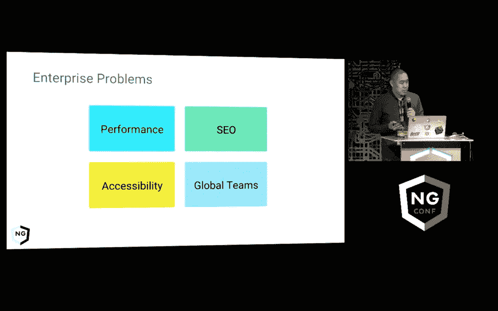

# 窥探 CapitalOne.com 背后的开源技术

> 原文：<https://medium.com/capital-one-tech/a-peek-into-the-open-source-technologies-behind-capitalone-com-80bae5ca9279?source=collection_archive---------2----------------------->

## 有没有想过为世界上访问量最大的银行网站选择技术时需要考虑哪些因素？

根据 Alexa.com 的[，CapitalOne.com 主页在美国最受欢迎的网站中排名第 49 位，在世界上排名第 253 位。为了维护和增强这个关键任务网站的功能，我们 Capital One 与开源社区合作，解决与成为高知名度网站相关的难以置信的技术挑战。](http://www.alexa.com/siteinfo/capitalone.com)

*在我的博客* *上阅读这篇* [*文章的其余部分。*](https://michikono.com/2016/09/21/a-peek-into-the-open-source-technologies-behind-capitalone-com/)