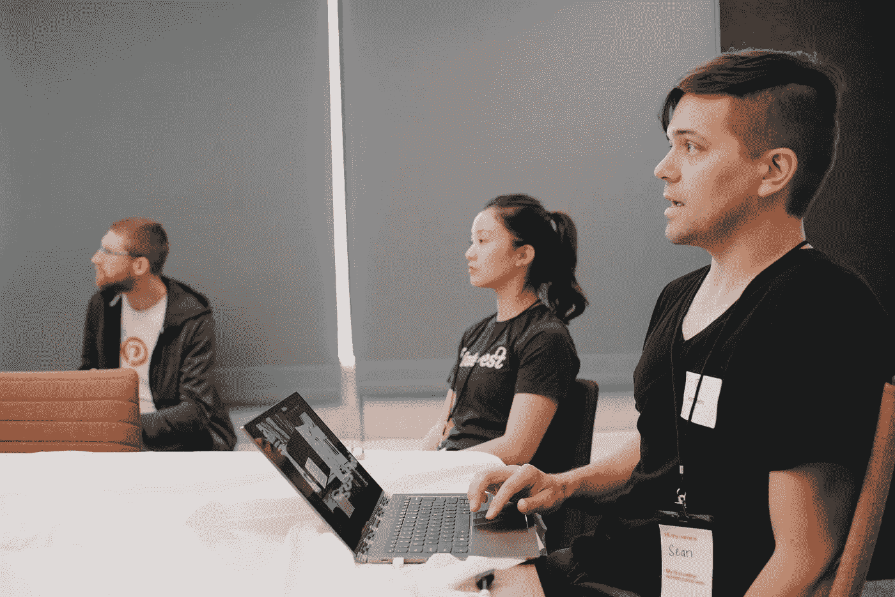
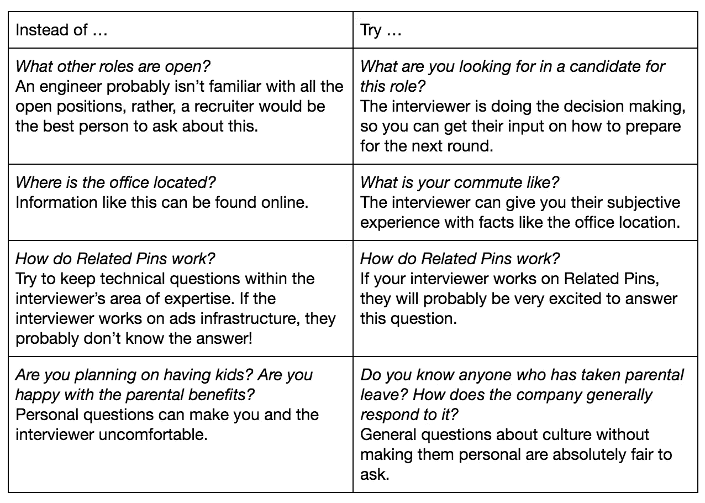

# Pinterest 技术面试工程指南

> 原文：<https://medium.com/pinterest-engineering/a-pinterest-engineering-guide-to-technical-interviews-1c2471c2d139?source=collection_archive---------0----------------------->

由 Shayda Rahgozar(招聘人员)、Nishant Roy(工程师)和 Indy Prentice(工程师)提供

技术面试是获得工程职位的关键因素。从准备到问正确的问题，对一次成功的面试都很重要。在本帖中，Pinterest 招聘和工程部门的员工分享了从头到尾赢得面试的技巧和诀窍。

## ***准备面试***

*沙伊达·拉戈扎，招募*

练习:面试本身不应该是你第一次听到和思考面试问题。在真正交易之前，练习从潜在问题到概念的一切。温习核心计算机科学、一般软件工程技能和大型系统设计。公司在不断更新他们的面试题库，但是你可以使用像 [Leetcode](https://leetcode.com/) 和[interview . io](https://interviewing.io/)这样的网站来找到很棒的练习题。别忘了在 GitHub[和 opensource.pinterest.com](https://github.com/pinterest/)上查看 Pinterest 开源项目等资源。

在 Pinterest，你通常可以在面试中用你喜欢的任何语言编写代码，尽管要做好灵活的准备，因为可能会有面试官根据团队和角色要求你使用特定语言的情况。当你完成练习题时，利用这一点，花些时间熟悉语言的细节。

**调查:**表现出对公司的兴趣和热情。如果您还不是该产品的常规用户，请花些时间了解您可能正在从事的工作。在访谈中分享任何产品难点或需要改进的地方，以及你如何参与帮助公司取得成功。

参考公司自己的渠道，感受最新的趋势、发布和技术。例如，查看这个博客以及[最近新闻](https://www.pinterest.com/malorie/pinterest-engineering-news/?eq=pinterest%20engineering%20news&etslf=5982)和我们的[实验室倡议](https://labs.pinterest.com/)以获得更多关于 Pinterest 工程团队的信息。

这不仅是你展示解决问题和编码技能的机会，也是向面试官展示你是他们愿意合作的人。

## 解决问题

工程师尼尚·罗伊

沟通:技术面试最重要的一个方面是你与面试官沟通的能力。不要急着直接开始写代码。相反，花些时间思考这个问题，大声说出你的想法。如果问题需要一些数据结构或系统设计，面试官可能希望在你真正开始之前有一个高层次的讨论。问一些澄清性的问题也是一个好主意，以确保你对问题的理解与面试官的一致。例如，浏览几个测试案例或绘制一些图表来说明问题，将有助于您准确理解所期望的内容，并且还将突出您沟通和计划工作的能力。

**关注细节**对于程序员来说至关重要，你的面试官会在编码面试中评估这一技能。通常，面试官不会提前给你*一个问题的所有*细节，比如某些限制，时间还是空间更重要，输入格式或有效性，系统规模等。一旦你确信你理解了问题，讨论细节会让面试官看到你在考虑如何写一个可以投入生产的解决方案。这也将帮助你更好地理解问题，并提出更强有力的解决方案。

**优化你的解决方案:**一旦你确信你理解了问题，在编写代码之前讨论解决方案的细节。从一个低效的解决方案开始，大声说出你的想法，这样你的面试官就能跟上你的思路。通过讨论空间和时间复杂性来解释为什么设计效率低下，并尝试找出任何瓶颈。此外，考虑在给定问题约束的情况下，还有多少空间可以优化。这样，你就向面试官展示了你能够想出一个简单的解决问题的方法，找出它的弱点，并找到改进的方法。

有几种方法可以识别优化:

*   尝试简化问题，看看如何优化基本版本，并将其应用于手头的问题。仔细检查你的设计，找出重复的、多余的工作，并考虑如何减少这些工作。
*   考虑哪种数据结构最适合这个问题，并尝试将它们集成到您的解决方案中。例如，映射为查找而优化，堆为排序而优化，等等。

再说一次，沟通是关键！只要你在大声思考，并提出澄清性或引导性的问题，面试官就更容易理解你的解决方案，甚至帮助你。一旦你和面试官对你设计的解决方案感到满意，就该开始写代码了。

时间管理:技术面试最大的挑战之一就是时间管理。虽然花时间设计完美的解决方案总是好的，但要确保你不会陷入没有时间实施的境地。记录时间，给自己至少一半的面试时间来实际编写和调试代码。实现一个简单的解决方案，并在剩余的时间内继续进行优化，通常比在试图实现一个最优解决方案的过程中耗尽时间要好。

**代码质量:**写好、干净的代码总是会赢得面试官的认可，不管你是在电脑上还是白板上写。良好的编码实践包括:

将可重用的代码段抽象成函数

*   编写有意义的变量名和函数名
*   添加输入检查和空检查

这既能让你更容易识别代码中潜在的错误，也能帮助面试官理解你的工作。

**假设:**做假设是完全可以接受的，*只要你解释清楚！期望你在给定的有限时间内记住一门语言的每一个细节或实现每一个通用的数据结构或算法是不合理的。除非组件的实现对解决问题至关重要，否则面试官通常会允许甚至期望你抽象出一些细节。然而，清楚地陈述和解释你的假设是很重要的。例如，不需要实现一个助手函数，你可以只设计方法签名，解释你将如何以及为什么使用它，然后继续。*

测试你的代码是软件开发中最重要的部分之一。关注好的实践和正确的、没有错误的解决方案，而不是你完成问题的速度。

*   花时间一行一行地重读你的代码，寻找任何明显的错误。
*   想出一些基本的测试用例，一次一行地单步调试你的代码。
*   记下每一行发生了什么。
*   记下关键变量值。
*   确保你得到了预期的答案。

最后，故意唱反调，试图打破你的解决方案，重点关注:

*   角落案例
*   意外的输入格式和类型
*   错误或异常处理、系统可靠性等。

你不必真的去实现甚至想出所有这些问题的解决方案，但是它会让你的面试官看到你在思考你的代码的局限性以及如何改进它。

技术面试不仅仅是编写解决方案。面试官寻找的另一个关键因素是他们如何作为队友与你共事。有时，需要一些帮助但在设计和开发过程中表现出很多优势的候选人可能会比那些自己很快找到正确解决方案但没有表现出计划工作或测试实现的倾向的候选人得到更高的评级。

你解决问题和编码的技能是你通过技术面试的门票。然而，编码问题并不是留下好印象的唯一方法。从你的介绍到你提出的问题都可以帮助你在面试中获得最大的收获。

## **问正确的问题**

*工程师印第·普伦蒂斯*

除了技术问题，大多数面试官会在最后留出时间让你问自己的问题。虽然这是另一个留下好印象的机会，但最重要的是你的问题得到了回答。

即使你觉得你的面试涵盖了你的问题，利用你的研究准备额外的问题来展示你的价值观和对公司的兴趣。这不仅向面试官表明你对这个机会是认真的，并且很想了解更多，也让你可以评估这家公司是否适合你。在面试前花些时间思考对你来说什么是重要的，比如团队多样性、工作/生活平衡、发挥影响力的机会、参与开源社区或与设计师合作。这是你评估与你谈话的公司是否符合要求的机会！

除了价值驱动的问题，你还可以问任何面试官很多一般性的问题，以获得关于公司的更多信息，并围绕这个话题展开对话。这些问题可以围绕你的研究或面试官的角色。

一些例子是:

*   对你来说，典型的一天是怎样的？
*   *关于你的工作，你最喜欢和最不喜欢的是什么？*
*   *你为什么选择加入，又为什么一直留了下来？*

为了充分利用你和面试官的时间，确保你问的问题最适合那个人。问题应在工程师的经验或专业领域内，并适合与陌生人讨论。

例如:

在面试结束时，你可能还有其他问题要问面试官。除非他们提供了你可以跟进的联系方式，否则最好不要让他们为难。相反，你可以通过招聘人员找出跟进的最佳方式。

虽然你的技术表现有助于确定你的候选资格，但面试寻找的不仅仅是那些技能组合的员工。在 Pinterest，我们寻找的不仅仅是优秀的工程师。我们的团队由对产品、技术挑战和对全面生活很重要的价值观感到兴奋的人组成。最终，我们要寻找的是那些会留在 Pinterest 并感到快乐的人。那些有一些理由想来这里的人，无论是产品还是技术挑战，都是最令人兴奋的。

利用你作为候选人的时间去寻找适合你的公司。充分利用面试的非技术方面可以确保你和公司是一个很好的匹配！

我们工程团队的空缺职位越来越多。如果你有兴趣了解更多关于在 Pinterest 工作的信息，请查看我们的[职业页面](https://careers.pinterest.com/careers/engineering)！