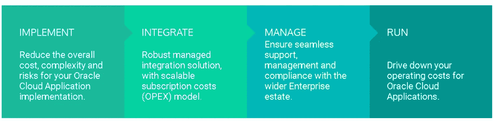
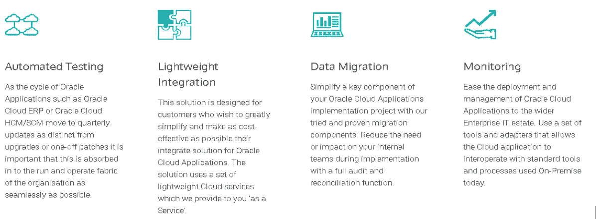

# 一个充满创新和学习的充满力量的地方

> 原文：<https://medium.com/version-1/a-power-packed-quarter-full-of-innovation-learning-33ab0d77b10d?source=collection_archive---------2----------------------->

今天标志着我在版本 1 的技术和创新团队的第一个季度的结束。我发现技术如何促进快速创新，让公司在竞争中保持领先地位，这很有意思。在版本 1 的技术和[创新实验室](https://www.version1.com/innovation/)中，没有什么是不可能的，在这里，我负责开发 [**最大化工具包**](https://www.version1.com/it-service/erp/maximise/)**，它可以加速和增强我们客户将传统 Oracle EBS 应用迁移到云的体验。**

****

**Photo by [Green Chameleon](https://unsplash.com/@craftedbygc?utm_source=medium&utm_medium=referral) on [Unsplash](https://unsplash.com?utm_source=medium&utm_medium=referral)**

**为新的开始干杯！**

**每一段旅程都必须结束才能有一个新的开始，我不得不告别我在 ERP 实践中的前 DBA 角色。第二天，我正式加入了技术和创新部，和我一起的还有一个了不起的技术型中小企业团队、喜欢找乐子的队友和一个乐观的经理。我很高兴开始我的 Oracle 云之旅，与才华横溢的人一起工作是蛋糕上的樱桃。对项目的简要介绍以及对一个健壮的、完全自动化的数据迁移解决方案进行改进的概念对我来说听起来像是一个不可能完成的任务，但是嘿！这是一个技术和创新团队，在这里一切皆有可能:d .带着所有的积极性和创造性，我和我的团队开始了我的旅程，为我们的客户开发一个完全健壮的解决方案，这些客户由于他们的遗留系统而难以采用云。**

****技术和创新团队的一天:****

**虽然在创新实验室工作听起来很棒，但这不是一个轻松的工作，因为日常活动中几乎没有重复。每一天都是独一无二的，挑战你内在的创造力，推动高效的解决方案，为我们的客户提供面向未来的解决方案。你可能会因为大量的错误和非常有限的材料而在互联网上搜索以获得一个直截了当的答案，我认为这种情况最终会让你以自己的方式获得一些创新。显然，我们需要我们的技术专家从他们的经验中学习，我很幸运被这样的专家所包围，他们在各种角色上都有超过 20 年的经验。当你与如此细致、经验丰富、创新、专业、有趣的人一起工作时，你会学到很多东西。我会称他们为极客，但这似乎有点过时了。如果你喜欢使用最新的工具和技术，并且在日常工作中没有重复，那么技术和创新团队可能就在你的街道上！**

****最大化 Oracle 应用:****

**现在，让我带您了解我们的 Maximise 平台，并通过加速 Oracle 云迁移来解决一个实际问题。在这种新常态下，企业正在远程运营，大多数公司都在努力牢牢把握数字化转型、云迁移和自动化等关键领域。这正是版本 1 中的技术和创新团队发挥作用的地方，他们帮助客户顺利地将 Oracle 应用程序迁移到 Oracle 云。Maximise 由端到端解决方案组成，通过利用 IaaS、PaaS 和 SaaS 产品，帮助客户实施 Oracle 云生态系统并集成其现有应用。**

****

**Maximise Process**

**一旦接受了云之旅，一个专业化的 ERP 专家团队可以帮助管理应用程序，并为继续 BAU 提供出色的支持。客户立即感受到的一个好处是降低了运营成本，并且不必管理旧式应用程序。**

**最大化的故事并没有到此为止，因为数据迁移只是我们伞式服务下的一项服务。简而言之，Maximise 是一套服务，旨在加速您的 Oracle 应用程序的 SaaS 实施，并优化您的应用程序在云中的持续管理。如果你对此感兴趣，请随时与我联系。**

****

**Maximise Services**

****团队福利:****

**技术和创新领域的职位有自己的一套津贴和奖金，这比财务收益更重要。您将获得使用尖端技术和解决客户在未来几年可能面临的实时问题的实践经验。与令人惊讶的技术人员一起工作的经历是非常出色的，因为你周围都是多年的经验。我曾有机会担任技术顾问、DBA 顾问、应用程序顾问和 OIC 开发人员，并有明确的行动导向经验来开发强大的数据迁移解决方案。我也能够在多个会议中提出我的意见；其中包括设计权威、解决方案架构师会议，并获得关于我对各个项目的方法的详细反馈。我在团队中的经历无疑让我每天都发挥出最佳水平，并有助于丰富我的职业生涯。**

**这只是对 Maximise Toolkit 和我目前为止在版本 1 技术和创新团队中的经验的一瞥。如果您想更全面地了解我们的技术和创新项目，请访问这里的，如果您对[最大化](https://www.version1.com/it-service/erp/maximise/)有任何疑问/想法/建议，请随时联系我们。**