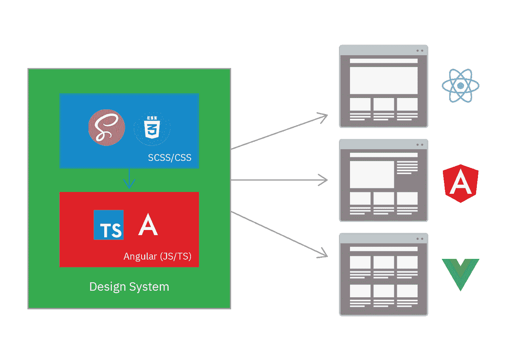

# 创建设计系统的实用指南

> 原文：<https://medium.com/compendium/a-practical-guide-to-creating-design-systems-with-7-tips-ff870c73ccff?source=collection_archive---------1----------------------->

什么是设计系统，你为什么需要它，如何用 Angular(或其他任何框架)创建它。

Photo by [Christopher Gower](https://unsplash.com/@cgower?utm_source=medium&utm_medium=referral) on [Unsplash](https://unsplash.com?utm_source=medium&utm_medium=referral)

# 什么是设计系统

设计系统是一个有点不固定的术语，对每个人和组织来说都有轻微的不同。这是一个实用指南，所以我们将重点放在设计系统的共同要素。它是字体、颜色、间距、位置、品牌、UX 和组件的唯一真实来源。它应该包含团队创建一致的应用程序所需的一切，该应用程序的外观和行为与公司/组织中的任何其他应用程序一样。它应该使创建新网站变得容易，而不必重新发明轮子。它应该是不含糊的和精确的，以防止误解。应该很好理解。

一个设计系统包含一个叫做组件库的东西。这是一系列可以在您的应用程序中使用的现成组件。这里有一个很好的例子，说明 material design 是一个以 Angular material、Vuetify 和 Material UI 为组件库的设计系统。

其他优秀设计系统的例子包括闪电设计系统(Salesforce)和碳设计系统(IBM)。

# 为什么你需要一个设计系统

设计系统是如何实现快速开发和创新，同时保持一致的用户体验和设计的问题的解决方案。

一家新公司通常从创建一个应用程序/网站开始。所有元素都是专门为那个应用程序创建的，这很好。为一个网站设计一个系统通常是浪费时间。然而，在某个时候，另一个团队开始制作一个新网站，然后第三个团队开始制作第三个网站。很快，您就有几个团队并行工作，开发具有不同需求的不同解决方案。截止日期很短，团队之间的知识共享没有得到优先考虑。这些网站开始看起来很相似，但慢慢地彼此渐行渐远，到了某个时候，你会发现同一个元素有几个版本，比如一个按钮。然后你的任务是创建一个新的网站，但你的基础是什么。任何事情都有几种版本，没有单一的真理来源。这是很多开发者的现实，也是基于我个人的经验。这可能是你决定开始研究设计系统的时候了。

# 如何创建设计系统和组件库

有几种方法可以创建设计系统和组件库。我的建议是一个由两部分组成的系统，一部分是 CSS 核心 T1，另一部分是 T2 组件库 T3。每一个都是独立的项目和 npm 包。

**单一来源的真相**

记住真理应该有一个**单一的**来源。这意味着不应复制相同的文档。把所有的 UI 和 UX 文档放在 Figma 或类似的地方是很诱人的，但是它应该放在 CSS 核心中。我的建议是将尽可能多的文档放在 CSS 核心中，并且只将组件的文档放在组件库中。Figma(或类似的)可能是讨论和原型制作的基础，但是最终的设计系统不应该包含在其中。

这给了我们两个部分 **CSS 核心**，和**组件库**，它们一起成为**设计系统**，被所有其他系统使用:

**文档**

文档包括从如何使用按钮，到按钮如何放置在网站上，以及如何用它来维护你的品牌形象。在你的组织中，每个创建应用程序的人都需要能够正确理解如何使用按钮和设计系统的其他部分。这包括实际例子和互动演示。

**CSS**

接下来的两部分是代码。仅仅用 CSS 就可以做很多事情，一些比较简单的设计系统完全是用 CSS。记住 CSS 的局限性是好的，因为它会阻止你在 javascript 中创建丑陋的工作区。另一个原因是 CSS 便宜，JS 贵。同样数量的 CSS 在浏览器上要比 JS 容易得多。这意味着你应该尽可能用 CSS 来创造。

我的建议是将 CSS 和 JS 部分和单独的项目分开，并单独发布。这将有助于保持关注点的分离，并增加模块化。这实际上会给你一个 CSS 核心和一个组件库。它还将允许较小的网站只使用 CSS 核心，而不必为组件库的额外捆绑大小付费。一些网站需要额外的性能。

**一个组件库**

组件库应该可以在任何框架中使用。这意味着我们必须编译成 web 组件。Angular 和 Vue(以及一些较小的框架)支持这一点，但 React 不完全支持。我的建议是有角度的，因为它有最多的特性可以帮助你创建一个组件库。其中一个是 schematics，它允许你写一个脚本，在新的角度项目中自动安装设计系统。另一个是 Angular CDK，它是一系列用于创建组件库的低级构建块，由 Angular 团队开发。

这种设置类似于 material design 如何利用 material.io 构建设计系统，material . io 是包含所有指南和独立组件库的 CSS 核心，例如 Angular material。

我在这篇博文的末尾附上了一个视频，让你开始建立一个新的角度项目。

# **结论**

创建一个好的设计系统很难，但这是你能做的最好的长期投资之一。随着组织的成长，开发越来越慢，越来越多的团队开始并行工作，这是解决这个问题的最有效的方法之一。也是设计漂移和用户体验不一致的最佳解决方案。

# **额外资源**

深入了解 web 组件

关于设置新角度项目的教程:

这篇博文是我在 2020 年维京海盗大会上演讲的更深入版本: