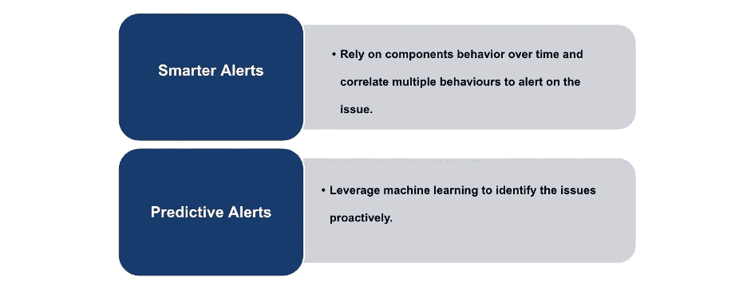

# 应对警觉疲劳的实用指南

> 原文：<https://medium.com/capital-one-tech/a-practical-guide-to-tackling-alert-fatigue-aaf3c487b31c?source=collection_archive---------1----------------------->

## 正确的提醒如何对抗疲劳并帮助你晚上睡得更好！

在努力为客户提供最卓越的不间断体验的同时，各公司正在引入多种方法来监控其应用。警报是监控任何应用程序或服务的一种方便有效的方式。它避免了手动跟踪所有关键应用程序指标的繁重工作，在技术和许多其他行业中很受欢迎。

然而，如果处理不当，这可能会导致*警觉疲劳*。警报疲劳最终会影响应用程序监控的目的，因此了解什么是警报疲劳以及如何应对警报疲劳是应用程序监控的一个重要部分。想象一下，当有太多的提醒而你不再关注它们时会发生什么？想象一下，一个医生忽略了一个警告，该警告表明给医院病人服用的某些药物存在负面的药物相互作用。或者想象一下，一个欺诈分析师忽略了一个表明公司及其客户遭受重大损失的警报。

***忽视关键警报会导致重大损失，有时是不可逆的。***

在软件工程中，警报疲劳经常被引用为指出客户影响问题的关键警报被待命资源忽略或错过的原因。在这篇博文中，我们将回顾警惕疲劳的基本概念。我们还将了解在软件应用程序上构建智能监控策略的几个简单步骤，这些策略有助于有效解决问题。

# 什么是警觉疲劳？

[警报疲劳，也称为警报疲劳](https://en.wikipedia.org/wiki/Alarm_fatigue)，是指当大量的警报使负责响应它们的人变得麻木，导致错过或忽略警报或延迟响应。

# 什么导致了警戒疲劳？

警报疲劳可能由以下任何原因引起:

*   低风险警报超过高风险警报。
*   忽略的警报超过了可操作的警报。
*   触发的警报不够清晰。
*   触发的警报之间没有关联。

# 警戒疲劳有什么影响？

警觉疲劳的影响因人而异，但有一些常见的经历:

# 解决警惕疲劳的 3 个步骤

不是屏幕上的每一个凸起或亮点都应该作为问题发出警报。建议仅针对*需要立即采取行动的问题*创建警报。当您考虑警报时，少就是多。下面是三个步骤，可以帮助有效地解决警报疲劳。

## 步骤 1 —选择 SLIs

战略性地选择对维护服务级别协议(SLA)或服务级别目标(SLO)至关重要的度量或服务级别指标(sli)。这是最关键的步骤之一，需要深思熟虑。

***注:*** *SLA 是服务提供商与客户之间关于服务可交付性的协议。SLO 指定了服务可靠性的目标水平。sli 是对服务特征的度量。SLI 直接衡量那些对客户体验影响最大的行为。*

## 步骤 2 —创建智能警报

通过遵循以下警报策略，针对所选指标创建警报:

**更智能的警报**

以下是实现更智能警报的几种方法:

以下是 [Datadog](https://www.datadoghq.com/) 监控工具中的变化率警报示例。当 EC2 实例的 CPU 利用率度量的百分比变化在过去五分钟内大于 50%时，它会触发警报。

下面是 Datadog 中的一个复合监视器示例，只有当消息队列长度超过阈值并且服务的正常运行时间大于 10 分钟时，才会触发该监视器。这排除了与服务重启期间消息队列长度临时增加相关的错误警报。

下面是一个示例 [New Relic](https://newrelic.com/) 时间序列查询，用于警告响应代码为 200 的 web 事务的中间值(第 50 个百分点)。

`SELECT percentile(duration,50) FROM Transaction WHERE appName = 'Storefront' and httpResponseCode = '200' and transactionType = 'Web'`

可以基于上述查询结果配置警报，以检查它是否满足所需的阈值。

**预测警报**

换个话题，让我们看看实施预测性警报的几种方法，这些方法有助于使用机器学习算法主动监控指标趋势和模式。

例如，异常检测可以帮助您发现某个工作日的 web 流量异常低的情况，即使相同级别的流量在周末也是正常的。或者考虑一个衡量稳步增长的网站登录次数的指标。因为数量每天都在增加，任何阈值都会很快过时，而异常检测可以在出现意外下降时向您发出警报，这可能表明登录系统存在问题。

*   **检测异常值的警报** — [异常值检测](https://en.wikipedia.org/wiki/Outlier)是一种算法功能，允许您检测特定组何时与其同行相比表现不同。例如，您可以检测到池中的一个 web 服务器正在处理异常数量的请求，或者在一个 AWS 区域中发生的用户登录超时比其他区域多得多。
*   **对预测行为的警告** — [预测](https://towardsdatascience.com/introduction-to-forecasting-in-data-science-676db9b55621)是一种算法特性，允许您预测指标未来的走向。它非常适合具有强烈趋势或重复模式的指标。例如，如果您的应用程序以更快的速度开始记录日志，预测可以在磁盘填满前两周向您发出警报，让您有足够的时间更新日志轮换策略。或者，您可以预测业务指标，如用户注册，以跟踪每月目标的进展。
*   **智能自动基线警报** —智能自动基线代表一种动态基线阈值方法，用于检测异常的参考阈值会随着时间的推移而变化。因此，如果指标的行为发生变化，阈值会在警报中自动调整。与静态阈值相比，它的主要优势在于您不必预先知道阈值就可以设置警报。您也不必为其行为随时间变化的指标手动调整多个静态阈值。智能自动基线警报有助于显著降低警报噪音。

智能警报和预测性警报策略可以有效地协同工作，但是当更智能的警报被很好地解决时，预测性警报将提供更大的价值。

## 步骤 3 —自动化

通过可自动化的标准补救步骤识别警报。用自动运行手册标记这些警报，以便系统在警报触发时进行自我修复。自愈系统避免了人工干预，从而减少了 [MTTA(平均确认时间)](https://www.atlassian.com/incident-management/kpis/common-metrics#:~:text=MTTA%20(mean%20time%20to%20acknowledge)%20is%20the%20average%20time%20it,and%20your%20alert%20system's%20effectiveness.)和 [MTTR(平均响应时间)](https://www.atlassian.com/incident-management/kpis/common-metrics#:~:text=MTTR%20(mean%20time%20to%20respond))。

除了上述步骤之外，还要定期对警报进行调整和优化，以确保警报始终是最新的。

# 结论

警报疲劳是一个严重的问题，它最终会破坏监控软件应用程序的目的。然而，通过遵循上面提到的几个简单步骤，即使不能完全避免，也可以显著减少疲劳。这有助于确保不间断的服务和满意的客户，以及我们的待命资源更好的睡眠。

*披露声明:2022 资本一。观点是作者个人的观点。除非本帖中另有说明，否则 Capital One 不隶属于所提及的任何公司，也不被这些公司认可。使用或展示的所有商标和其他知识产权是其各自所有者的财产。*

*最初发表于*[T5【https://www.capitalone.com】](https://www.capitalone.com/tech/software-engineering/what-is-alert-fatigue-3-steps-to-tackle-it/)*。*