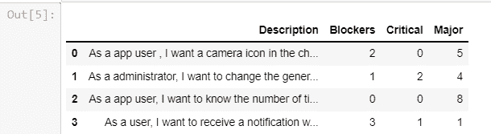
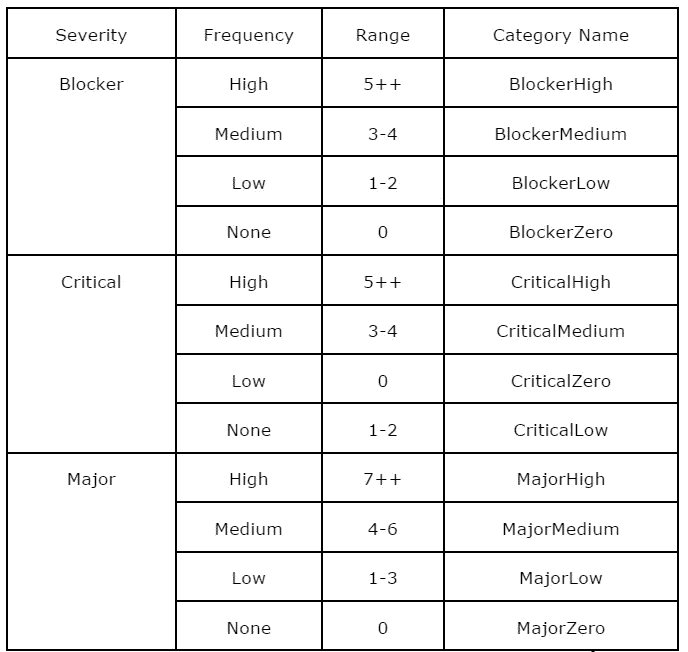
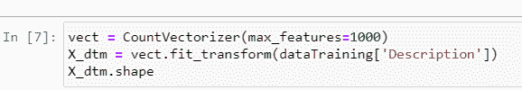
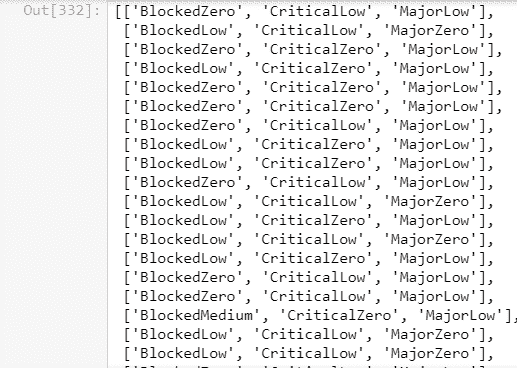
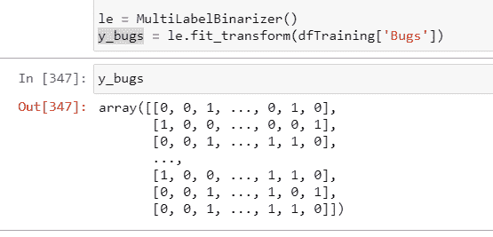
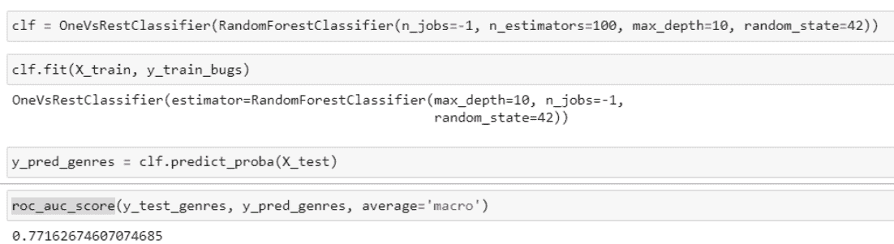
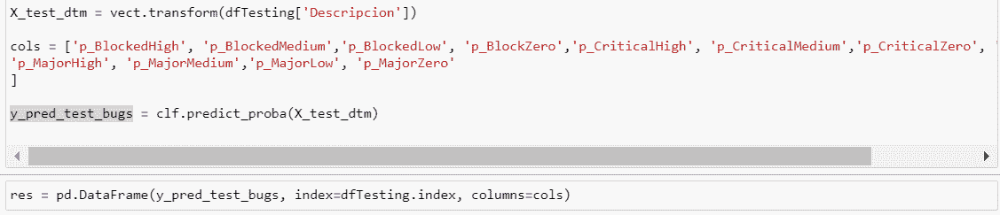
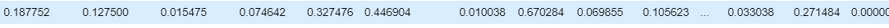

# bug 的预测模型，分析练习

> 原文：<https://medium.com/globant/a-predictive-model-of-bugs-an-exercise-in-analytics-3038f447d6c6?source=collection_archive---------0----------------------->

****技术经理 QE****

****

**几年前，项目进展顺利，直到达到 90%的执行，这与开发阶段的完成相一致，在剩余的 10%中，许多项目失去了控制，失败了，甚至可能破产。随着软件方法论开始包括最佳实践和经验教训，人们发现测试是在这 10%中执行的，当然，这是不够的，所以后来，建议是:“不做测试不要记录超过 70% -75%的进度”，但尽管如此，这最后的百分比仍然是一个摧毁一切的黑洞。潜在的原因是:测试显示了其他阶段的差距，例如定义或设计，因此，在最后阶段，进步后退，准备好的任务再次被执行。**

**幸运的是，今天我们知道在早期阶段包含测试是更好的，并且对于任何客观看待它的人来说，事实是，在生产环境中尽早开始测试过程的产品具有更好的质量，因为质量是从其概念开始的整个构建过程的结果，而不是我们可以在最后一英里打印的“东西”。**

**现在，他们能多早被引进？您能在什么确切的点上预见缺陷将被引入，以避免早期的重新测试和调整？确切的答案肯定还没有达成共识。然而，今天我们有多种多样的工具，允许我们去探索我们所看到的以外的东西，去改变范例，并且提出能够产生更好的软件质量的选项，同时在产品的持续交付中产生更多的效率。**

**这个博客试图成为一个小小的邀请，以不同的方式看待事物，也许扩展，以不同的方式探索信息，并得到分析的支持。收集和处理我们每天都会忘记的真实信息来帮助我们做决定，一如既往，根据真实信息做出的决定有很大的正确率。这是一个动手练习，在部署开始之前，使用分析来预测关于用户情景的错误。错误和质量并没有在测试阶段被引入，一个不完整的规范在导致错误的完全不同的解释中通常是多余的。**

**在我看来，任何在软件行业有丰富经验的人都可以应用所开发的练习。虽然你需要一些知识，但它们并不十分讲究或难以实现。几乎所有的课程都包含在不同平台的在线课程中。具体来说，需要具备 Python 的中级知识、高级数据设计建模和基本的神经网络理解。根据我的经验，有必要从通过课程理解理论开始，但正如所有事情一样，熟能生巧。**

****业务问题的定义****

**有许多方法来处理这种性质的问题，以创建预测模型，但是所选择的方法非常简单，并且来自从文本外推预测模型，其在上下文中用于从摘要预测例如一本书的文学类型。建议只基于对包含用户故事描述的文本的解释来预测错误的可能性:关键的、主要的和阻止的。当然，它可以包括更多与用户故事相关的信息，但是，为了快速实用，它仅限于描述。**

****了解可用信息****

**最重要的事情总是健壮、完整和有效的数据。幸运的是，用户故事库的数据库在互联网上比比皆是，尤其是在我更熟悉的吉拉，在这种情况下，不需要插件，甚至不需要测试。只有问题表是必需的，指定两种类型的问题是必要的:故事和 Bug。**

**使用的数据是以 SQL 格式下载的，包括数据库管理的所有表。在本练习中，使用 Microsoft SQL Server 读取 issues 表，然后将包含大约 35，000 条记录的表导出为 CSV 格式，以便在 Python 中将它作为数据集进行操作，下面将介绍一些不同的库。**

****数据准备****

**在执行预测模型之前，有必要给出它们的格式，请遵循以下步骤:**

1.  **将美国描述保存到数据集。有必要将问题的类型与描述它们的表格进行交叉，因为它们可以处理特定的 id。**
2.  **捕获数据集中的错误类型，这可以识别相关的 US。同样，有必要跨越发行类型。**
3.  **向 Stories 数据集中添加三列，以识别关键、主要或阻塞缺陷。**
4.  **对三个已定义的复杂性执行一个合并的缺陷计数，并将其存储在为它们创建的列中**

**在此过程之后，我们必须有一个数据集，如下所示:**

****

**在这种情况下，记录的数量急剧减少到 5850，其中包含故事类型的问题，这些问题报告了一个或多个关键的、主要的或阻止程序的错误。**

****造型****

**作为建模的一部分，制作等价表，目的是对错误进行分类:**

****

**我们必须将数据分成两组:一组用于训练，一组用于验证。训练集包含 80%的可用数据，剩余部分保留给验证集。**

**当我们想要通过文本创建预测模型时，有必要对文本进行标记，这意味着单词被转换为数值，并可用于算法，尤其是学习。这里使用了 Scikit-learn 的 CountVectorizerse，它包含一个高度灵活的文本特征表示。**

****

**我们将目标变量中的缺陷数量与上述类别统一起来:**

****

**然后，它将向量化为类别:**

****

**为了找到合适的模型，使用了以下 python 库:**

****

**AUC 代表 ROC-受试者操作特征低的区域，它试图通过比较每种分类的敏感性和特异性来评估模型预测的准确性。AUC 下的整个面积-曲线下的面积-形成了一个统计度量，它表示当观察到测试变量时，预测可能处于正确顺序的概率。ROC 分析支持关于单个 AUC、精确度/完整性(PR)曲线的推断，并提供比较两条 ROC 曲线的选项，这些曲线由独立组或成对受试者生成。**

**我们已经从文本中提出了三个预测使用的典型模型:**

****

**使用 SVM 的 Bagging 也被应用于具有校准参数的数据矢量化:max_df 等于 0.25，ngram_range 为(1，1)，AUC 结果为 0.783263。对于后者，使用 MPL(多层感知器)进行测试，应用 TdidfVectorizer 对具有校准参数的数据进行矢量化:max_df 等于 0.25，ngram_range 为(1，1)，结果，获得了 0.81309 的 AUC**

**所以我们选择的模型是后一种 MPL，实际上它有 81.3%的概率预测用户故事的缺陷。**

****验证****

**在选择了合适的模型后，我们用一些为此目的保留的数据进行了验证，这个案例说明了我们将收到什么信息来响应预测。**

****

**对于每个用户情景，我们都有可能出现每种类型的错误:**

****

**在这个例子中，用户场景有 18%的概率出现拦截器高错误，44%的概率出现关键的中等错误，27 %的概率出现主要的低错误。**

****结论****

**第一个诱惑是试图解释或合理化结果，以寻找具有最多 bug 的用户故事的特征。这种分析是可能的和有效的，但它使我们偏离了最初的目的:将这种分析委托给一个预测模型。以一本书为例，这是一个预测文本模型，类似于本练习中使用的模型。如果你阅读了每本书的摘要，你就可以确定这本书的类型。但是模型的建立并不是因为不可能以另一种方式知道结果，模型的建立是为了委托决策，最重要的是为了打开向用户交付价值的可能性。**

**这是一个大约花了 20 个小时的简短练习，其中包括调整信息和执行模型的时间。这是一个探索性的练习，缺乏在真实情况下的验证，当然，这将增加更多的价值，并有助于你的再培训。预测模型维护的基本活动之一是定期的再训练，它可以提取变化情况的调整。**

**然而，这个练习是一个简单的邀请，展示在测试过程中使用分析来使 bug 搜索更有效的无限可能性和优势。**

****参考文献****

1.  **使用计数矢量器从文本中提取特征，**库萨利·维尔马，2020，**[https://www . geeks forgeeks . org/using-count vectorizer-to-Extracting-Features-from-Text/](https://www.geeksforgeeks.org/using-countvectorizer-to-extracting-features-from-text/#:~:text=CountVectorizer%20is%20a%20great%20tool,occurs%20in%20the%20entire%20text.)**
2.  **Scikit-learn 0.24.2，预处理数据，2007–2020，Scikit-learn 开发人员(BSD 许可证)。[https://sci kit-learn . org/stable/modules/preprocessing . html #预处理](https://scikit-learn.org/stable/modules/preprocessing.html#preprocessing)**