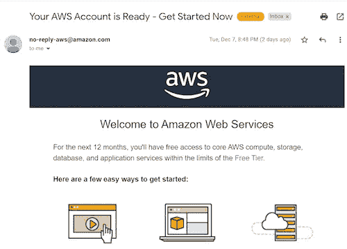

# 在 AWS 控制塔中创建帐户的编程方式。

> 原文：<https://medium.com/globant/a-programmatic-way-to-create-an-account-in-aws-control-tower-784486b8cd4a?source=collection_archive---------0----------------------->

# **简介**

WS 控制塔用于管理和协调不同组织单位中的多个帐户，但在单个根帐户下。对于许多公司来说，多帐户结构有助于满足每个应用程序团队或业务组的独特需求。您可以强制实施安全和计费配置，同时仍然给予每个团队对其帐户一定程度的自主权。

# **背景**

为拥有所有安全防护栏和配置的多个团队创建帐户是一项单调乏味的任务。可能会有人为失误。为了解决这些问题，自动化应运而生。有几种方法可以自动执行此帐户设置。

*   AWS CLI
*   AWS API
*   Terraform 的帐户工厂
*   通过亚马逊 Lex 聊天机器人进行帐户销售

本文的范围包括使用 AWS CLI 和 API 创建帐户。

# **先决条件**

*   AWS 控制塔设置应该可用。
*   AWS 控制塔帐户工厂模板应具有所需的 CIDR 和子网配置。
*   应该创建并激活 AWS 控制塔服务目录产品。
*   需要本地管理员用户的访问密钥和秘密密钥。

# **1- AWS CLI**

**后续步骤**

应安装 AWS CLI，以便使用 CLI 继续创建帐户。请参考[https://docs . AWS . Amazon . com/CLI/latest/user guide/getting-started-install . html](https://docs.aws.amazon.com/cli/latest/userguide/getting-started-install.html)进行安装。在 Linux 操作系统上遵循以下步骤。

*   使用访问密钥和密钥设置环境变量。


Setup AWS credentials

*   检索主帐户值并为管理 ARN 定义值。

*master acct = $(AWS STS get-caller-identity-query ' Account '-output text)*

*AdminArn = " arn:AWS:iam::$ { master acct }:role/service-role/AWSControlTowerStackSetRole "*


Get Master account and the Role ARN

检索先前指定的区域中的客户工厂产品的产品 ID。

*   *prod _ id = $(AWS service catalog search-products—filters full text search = ' AWS Control Tower Account Factory '—REGION $ AWS _ DEFAULT _ REGION—query " productview summaries[*]。product id”-输出文本)*


Get the service catalog product Id.

检索帐户工厂的预配工件。

*   *pa _ id = $(AWS service catalog describe-product-id＄prod _ id-REGION＄AWS _ DEFAULT _ REGION-query " ProvisioningArtifacts[-1])。id”-输出文本)*


Get the factory template Id

使用所需的参数创建一个 param.json 文件，如下图所示。


从 params.json 派生目录名和电子邮件 id。目录名可以是任何唯一的名称。它可以与帐户名相同。这里我们将前缀“CatalogFor”添加到帐户名中。

*   *导出目录名='CatalogFor'$(jq -r .[4].值 param.json)*
*   *导出 EmailId=$(jq -r .[0]。值 param.json)*


Setup Unique Id for the account provisioning.

编写命令以编程方式创建新帐户。

*   *AWS service catalog provision-product-product-id＄prod _ id-provisioning-artifact-id＄pa _ id-provisioned-product-name＄catalog name-provisioning-parameters file://param . JSON*


Create the account

# **2- AWS SDK API**

这是在 AWS 控制塔中创建帐户的另一种方法。下面是示例 API 请求。使用的版本是 AWS SDK for Java API 2.17.99。

更多详情，请参考 AWS [文档](https://docs.aws.amazon.com/servicecatalog/latest/dg/API_ProvisionProduct.html)。

```
*public void awsCreateAccount(){**Region region = Region.US_WEST_2;**AwsBasicCredentials.create(“”, “”);**AwsBasicCredentials awsBasicCreds = AwsBasicCredentials.create(“”, “”);**ServiceCatalogClient serviceCatalogClient = ServiceCatalogClient.builder()**.region(region)**.credentialsProvider(StaticCredentialsProvider.create(awsBasicCreds))**.build();**ProvisioningPreferences provisioningPreferences = ProvisioningPreferences.builder()**.stackSetAccounts(“”)**.build();**ProvisionProductRequest provisionProductRequest = ProvisionProductRequest.builder()**.productId(“prod-2au6asfsdfsfds”)**.provisioningArtifactId(“pa-dsfdsfdfsfs”)**.provisionedProductName(“CatalogFortest-Custom-Account”)**.provisioningParameters(ProvisioningParameter.builder()**.key(“SSOUserEmail”)**.value(“test@example.com”)**.build(),**ProvisioningParameter.builder()**.key(“SSOUserFirstName”)**.value(“test”)**.build()**, ProvisioningParameter.builder()**.key(“SSOUserLastName”)**.value(“test”)**.build()**, ProvisioningParameter.builder()**.key(“ManagedOrganizationalUnit”)**.value(“OU_Name (OU_ID)”)**.build()**, ProvisioningParameter.builder()**.key(“AccountName”)**.value(“test-Custom-Account”)**.build()**, ProvisioningParameter.builder()**.key(“AccountEmail”)**.value(“test@example.com”)**.build())**.build();**ProvisionProductResponse provisionProductResponse = serviceCatalogClient.provisionProduct(provisionProductRequest);**System.out.println(provisionProductResponse.toString());**}*
```

# **账户状态**

通过 AWS 控制塔管理员或 root 用户登录，在控制台中检查帐户创建的状态。状态应该是可用的。


一封电子邮件将发送到创建帐户时使用的注册电子邮件。



**访问 AWS 控制塔账户的步骤**

转到 AWS 管理控制台，单击登录进入以下页面。


确保您选择了 root 用户选项，然后输入 Root 用户的电子邮件地址并单击下一步按钮，您将看到安全检查窗口，以输入验证码并提交。


现在你会看到密码窗口，点击忘记密码，再次输入验证码并发送电子邮件。您将在 root 电子邮件中获得重置密码的链接。


现在更改密码并登录。


# **总结**

将使用所有强制护栏和 scp(服务控制策略)创建帐户。使用 AWS 控制塔无需额外付费。然而，当您设置 AWS 控制塔时，您将开始为设置您的着陆区和强制护栏而配置的 AWS 服务产生费用。虽然 AWS 组织和 AWS 单点登录(SSO)等一些 AWS 服务不收取额外费用，但您将根据您的使用情况，为诸如 [AWS 服务目录](https://aws.amazon.com/servicecatalog/pricing/)、 [AWS CloudTrail](https://aws.amazon.com/cloudtrail/pricing/) 、 [AWS 配置](https://aws.amazon.com/config/pricing/)、[亚马逊 CloudWatch](https://aws.amazon.com/cloudwatch/pricing/) 、[亚马逊简单通知服务](https://aws.amazon.com/sns/pricing/) (SNS)、[亚马逊简单存储服务](https://aws.amazon.com/s3/pricing/) (S3)和[亚马逊虚拟私有云](https://aws.amazon.com/vpc/pricing/) (VPC)等服务付费您只需为您使用的东西付费，就像您使用它一样。

# **参考文献**

[https://docs . AWS . Amazon . com/service catalog/latest/DG/API _ provision product . html](https://docs.aws.amazon.com/servicecatalog/latest/dg/API_ProvisionProduct.html)

[https://docs . AWS . Amazon . com/control tower/latest/user guide/automated-provisioning-walk through . html](https://docs.aws.amazon.com/controltower/latest/userguide/automated-provisioning-walkthrough.html)

[https://docs . AWS . Amazon . com/control tower/latest/user guide/account-factory . html](https://docs.aws.amazon.com/controltower/latest/userguide/account-factory.html)


Visit us at [https://www.globant.com/studio/cloud-ops](https://www.globant.com/studio/cloud-ops)