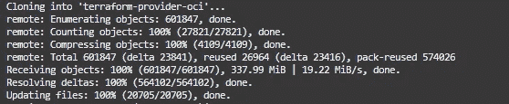
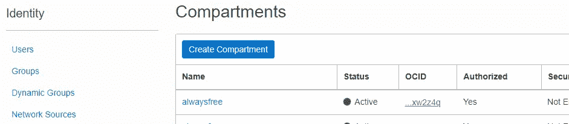
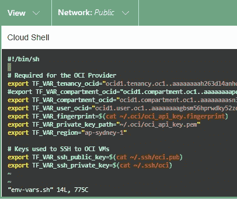
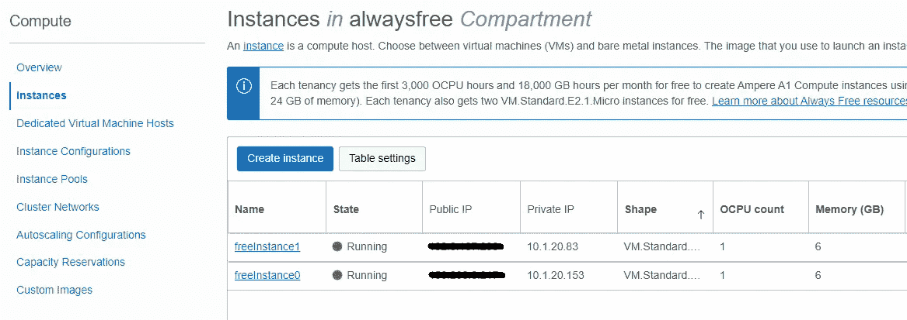
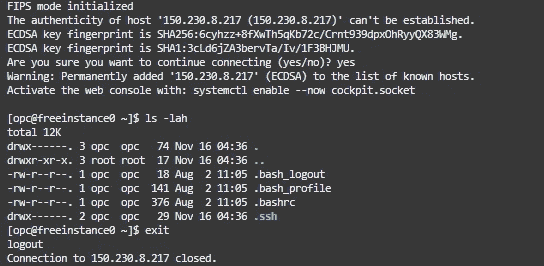
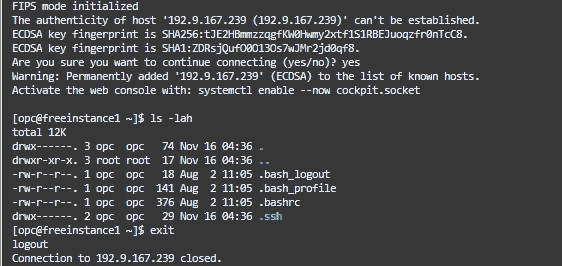
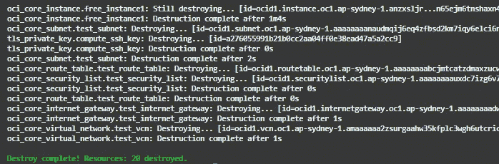

# 永远免费的快速入门

> 原文：<https://medium.com/oracledevs/a-quick-start-for-always-free-505e54410bb3?source=collection_archive---------0----------------------->


对于始终免费的云基础架构，从头开始会更快。为了帮助您，Oracle 提供了一些示例来帮助您入门！

[](https://github.com/oracle/terraform-provider-oci/tree/master/examples/always_free) [## terra form-provider-OCI/examples/always _ free at master Oracle/terra form-provider-OCI

### 这是一个 Terraform 配置，它在 Oracle 云基础架构上创建了始终免费的服务。地形…

github.com](https://github.com/oracle/terraform-provider-oci/tree/master/examples/always_free) 

首先，设置快速开始使用 Oracle cloud shell 的先决条件。

[](https://paulguerin.medium.com/quick-start-with-the-oracle-cloud-shell-82cc2d78d381) [## Oracle 云外壳快速入门

### 您已经有了 Oracle Cloud 帐户，所以您的任务清单上有一些来自 Oracle Github 的官方示例…

paulguerin.medium.com](https://paulguerin.medium.com/quick-start-with-the-oracle-cloud-shell-82cc2d78d381) 

一旦先决条件完成，我们就可以为总是空闲的资源创建一个区间了。

## 创建一个隔间

从命令行使用 Terraform 创建一个隔离专区，专门用于总是免费的资源。为此，我们需要创建一个目录:

```
mkdir tf-alwaysfree
cd tf-alwaysfree
```

接下来，创建名为 compartment.tf 的文件。

```
vim compartment.tf
```

该文件将包含要创建的新隔离专区的配置详细信息。我们将创建一个名为“alwaysfree”的隔离专区，它将是根隔离专区的子隔离专区。

```
resource "oci_identity_compartment" "tf-compartment" {
  # this compartment_id is the root compartment
  compartment_id = "ocid1.tenancy.oc1..<etc>"
  description = "Compartment for Always Free resources."
  name = "alwaysfree"
}
```

这种情况下的隔离专区 id 是根隔离专区。那么 name 变量将定义新隔离专区的名称。

现在，我们准备执行基础设施编排来创建新的隔离专区。

```
terraform init
terraform plan
terraform apply
```

*注意—创建后，在控制台中浏览资源时，您可能无法从列表中选择隔离专区。要在控制台中查看隔离专区，请尝试从控制台注销，然后再次登录。*

## 创造永远免费的资源

永远免费的配置是 GitHub 中 terraform-provider-oci 存储库的一部分。克隆存储库以开始。

```
git clone https://github.com/oracle/terraform-provider-oci.git
```



现在将目录改为 always_free。

```
cd ~/terraform-provider-oci/examples/always_free
```

main.tf 文件具有 Terraform 配置，可以创建始终空闲的资源。首先，注释掉 main.tf 中的下面一行，以避免使用 Terraform 时出现错误。

```
key_algorithm = 'ECDSA'
```

只需要注释掉它，就像这样:

```
#key_algorithm = 'ECDSA'
```

此外，因为我们想要使用刚刚创建的名为 alwaysfree 的隔离专区，所以我们需要确定隔离专区的 OCID。车厢 OCID 可从控制台的 Identity 菜单中获得。



一旦我们知道了隔离专区的 OCID，就可以编辑~/env-vars.sh 文件，并将 TF_VAR_compartment_ocid 更改为正确的隔离专区。

```
vim ~/env-vars.sh
```



您可能也需要根据正确的代码来设置区域。以下网站中定义了正确的代码:

[https://docs . Oracle . com/en-us/iaas/Content/General/Concepts/regions . htm # top](https://docs.oracle.com/en-us/iaas/Content/General/Concepts/regions.htm#top)

现在将环境变量设置为 Terraform 的先决条件:

```
source ~/env-vars.sh
env | grep TF
```

现在，您可以再次使用 Terraform 编排基础设施了:

```
terraform init
terraform plan
terraform apply
```

## 你得到了什么

您获得的免费资源非常丰富，包括:

*   带子网的 VCN。
*   虚拟机。
*   自治数据库。


在登录虚拟机之前，您需要从控制台获取公共 IP。它们在计算菜单下。



现在，使用快速入门指南中创建的 SSH 密钥登录。

```
# login to freeinstance0
ssh -i ~/.ssh/oci opc@150.230.8.217
```



```
# login to freeinstance1
ssh -i ~/.ssh/oci opc@192.9.167.239
```



然后当你完成时，你可以指示 Terraform 销毁你的免费资源。

```
terraform destroy
```



如果你对 Oracle 开发人员在他们的自然环境中发生的事情感到好奇，请加入我们的公共休闲频道！我们不介意成为你的鱼缸🐠

*Paul Guerin 出席了一些世界领先的甲骨文会议，包括甲骨文 2013 年世界开放大会。自 2015 年以来，他的工作一直是 IOUG 最佳实践技巧小册子以及 AUSOUG、Oracle Technology Network、Quest 和 Oracle Developers (Medium)出版物的主题。2019 年，他被授予 My Oracle 支持社区最有价值贡献者。他将继续参与 Oracle ACE 计划。*