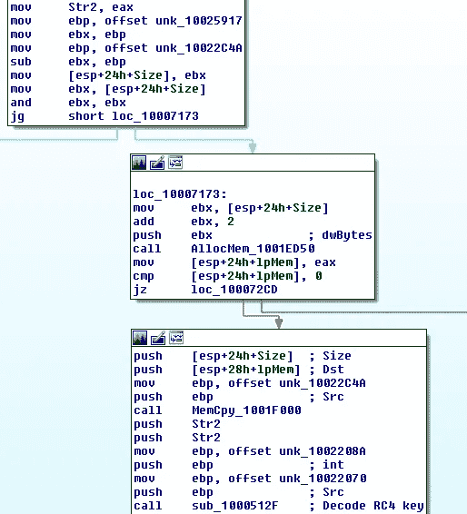
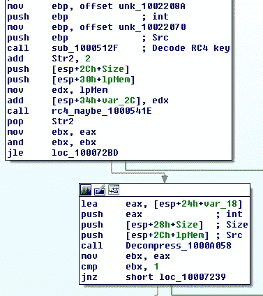
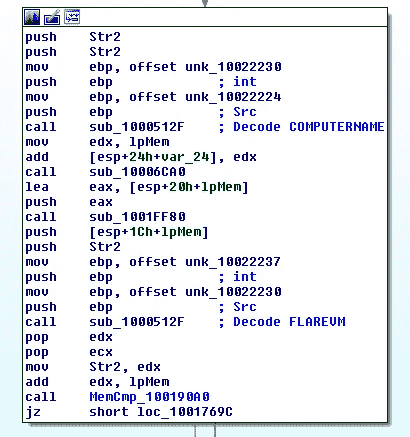
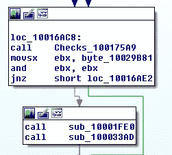

# 重新审视 TerraLoader Dropper DLL

> 原文：<https://medium.com/walmartglobaltech/a-re-look-at-the-terraloader-dropper-dll-e5947ad6e244?source=collection_archive---------0----------------------->


对 TerraLoader 负责的恶意软件作者，在参与者和客户之间的分歧发生在地下论坛市场后，被认为是 BadBullzVenom[4]，似乎一直在愉快地更新他们的交付系统，再次被称为 TerraLoader。Twitter 用户@Arkbird_SOLG [1，5]使用@malz_intel 发现的样本在网上发布了一份出色的报告。该报告做得很好，所以这主要是我在分析了报告[2]中的上述示例后的逆向工程笔记的附录，其中我主要关注将构建和交付通常称为“more_eggs”的 javascript 后门的 DLL。

# 初始概述

这只是对 DLL 部分的一个快速概述，正如前面提到的，它已经包含在以前的研究中[1]。

Scriptlet:

```
MD5:    f93fdcf5856feb254a26547dc8c2b671
SHA1:   1c038a86b337cf72663da5b6780d34ba0fb1c0c9
SHA256:  000a5e63109b3c653d63d84d03fe474242b987bfadda9aeaa200653fd2155a31
```

Scriptlet 解码出一个 doc 文件和一个 DLL，DOC 文件看起来会分散 DLL 加载的注意力。

```
Doc: 11e54f594949a4c7f13e85b4ac2cbd555200ac34e6d61b58a71fbcfccc0497cd
DLL: fb55b26b8edee2431b35d0e28df5f223510a15344ede400a2f5c04a0d45e6b77
```

# 字符串编码更新

字符串编码现在有点不同，dropper DLL 部分总是利用简单的基于 XOR 的例程来生成自己的字符串编码密钥，同时还利用各种辅助例程来使用找到的密钥(XOR、AES、RC4)。作者已经开始使用 RC4 来破坏字符串编码键，这使得整个过程需要更长的时间，但也有作为睡眠程序的额外好处。

该示例获取三段数据:加密数据、起始 RC4 密钥字符串和将被解密以检查是否找到正确密钥的数据。

加密数据:

```
b8e0ce81bcd3023bf5e2b37d3e1c801d99bd3f7f408c87b7923673d7840797a024f78d62552de17aba3d10c4
```

启动 RC4 键:

```
SouXRE
```

解密数据:

```
b92fe2de81d94d05b0431c545221cfbc23ad2f47a9279a20498948b9d4b3ffdf4b22669a1eace7a3b14862d2
```

粗化例程的工作原理是简单地使用一个从 0 开始的迭代器，将整数值转换为一个字符串，将其附加到起始密钥，解密加密的数据，并检查输出是否与解密的数据匹配。如果不匹配，迭代器递增，过程重新开始，直到找到匹配。

如果你了解加密算法是如何工作的，那么从静态逆向工程的角度来看，你可以看到其中的一个缺陷，我们实际上可以恢复足够的密钥流数据来解码板上的大多数字符串，而不需要暴力破解密钥。

```
encoded_data ^ decoded_data = partial RC4 XOR Keystream
```

利用这一知识，我们可以恢复 RC4 异或密钥流的一部分:

```
01cf2c5f3d0a4f3e45a1af296c3d4fa1ba101038e9ab1d97dbbf3b6e50b4687f6fd5ebf84b8106d90b757216
```

使用这些数据，我们可以从样本中解码出大部分字符串，这些字符串都与之前列出的字符串一致，恶意软件基本上是为了构建 more_eggs 后门程序，以便放入磁盘并引爆。

供参考的部分字符串:

```
%APPDATA%
/B /e:jsCript
msxsl.exe
CED1712A510453BEE1F83F8AE7
a2service.exe
schtasks.exe
 /Create /TN
UserInitMprLogonScript
PROCESSOR_IDENTIFIER
.ComputerName +
COMPUTERNAME
FLAREVM
USERNAME
Notepad
```

# 数据编码更新

正如前面提到的博客作者所提到的，这种新的后门实际上是通过在密钥中添加基于计算机的信息进行编码而被丢弃的，这使得恢复后门更加困难，除非您知道它被丢弃的系统的计算机名称和处理器信息。

我们可以在上面显示“PROCESSOR_IDENTIFIER”和“COMPUTERNAME”的部分字符串中看到这一点的证据。“ComputerName +”，后门上的部分包装程序将使用它来解码后门。如果放弃者 DLL 负责这段代码，那么后门程序一定存在于 DLL 的某个地方:



在上面的屏幕截图中，我们可以看到一个大的数据块已经计算了大小，分配了内存，复制到新的内存中，然后字符串“CED1712A510453BEE1F83F8AE7”被解密。紧接着，调用 RC4 例程:



在调用了 RC4(因为这张照片是我在绘制样本时拍摄的，所以被标记为“RC4 _ 也许”)之后，调用了一个板载 DEFLATE 例程。让我们看看解码的是什么:

```
>>> key = 'CED1712A510453BEE1F83F8AE7'
>>> from Crypto.Cipher import ARC4
>>> rc4 = ARC4.new(key)
>>> t = rc4.decrypt(data)
>>> import zlib
>>> t[:50]
'\xed}kw#7\xae\xe0g\xe7\x9c\xfc\x87\x8a\xee\x9d\xb44\xed\x96\xeb\xa1g\x94\xce\xac^N\xf7\xa6\x1f\xbe\xb6;\x99\x99v\x8fW\x96\xcav\xa5\xa5*\xa5T\xb6\xe5v'
>>> t2 = zlib.decompress(t,-15)
>>> t2[:100]
'var BV = "6.6b";\r\nvar Gate = "https://d27qdop2sa027t.cloudfront.net/spmar/d9264";\r\nvar hit_each = 10'
```

在示例的后面，我们还可以恢复 MSXSL EXE 文件的解码:

```
>>> key = 'CED1712A510453BEE1F83F8AE7'
>>> from Crypto.Cipher import ARC4
>>> rc4 = ARC4.new(key)
>>> t = rc4.decrypt(data1)
>>> import zlib
>>> t2 = zlib.decompress(t,-15)
>>> t2[:100]
'MZ\x90\x00\x03\x00\x00\x00\x04\x00\x00\x00\xff\xff\x00\x00\xb8\x00\x00\x00\x00\x00\x00\x00@\x00\x00\x00\x00\x00\x00\x00\x00\x00\x00\x00\x00\x00\x00\x00\x00\x00\x00\x00\x00\x00\x00\x00\x00\x00\x00\x00\x00\x00\x00\x00\x00\x00\x00\x00\xd8\x00\x00\x00\x0e\x1f\xba\x0e\x00\xb4\t\xcd!\xb8\x01L\xcd!This program cannot be'
```

也是用于任务调度的 XML 的一部分:

```
<?xml version="1.0" encoding="UTF-16"?>
<Task version="1.2" ae lg" href="http://schemas.microsoft.com/windows/2004/02/mit/task" rel="noopener ugc nofollow" target="_blank">http://schemas.microsoft.com/windows/2004/02/mit/task">
  <RegistrationInfo>
    <Author>SYSTEM</Author>
  </RegistrationInfo>
  <Triggers>
    <BootTrigger>
      <Enabled>true</Enabled>
    </BootTrigger>
  </Triggers>
  <Principals>
    <Principal id="Author">
      <UserId>S-1-5-18</UserId>
      <RunLevel>HighestAvailable</RunLevel>
    </Principal>
  </Principals>
  <Settings>
    <MultipleInstancesPolicy>IgnoreNew</MultipleInstancesPolicy>
    <DisallowStartIfOnBatteries>false</DisallowStartIfOnBatteries>
    <StopIfGoingOnBatteries>false</StopIfGoingOnBatteries>
    <AllowHardTerminate>true</AllowHardTerminate>
    <StartWhenAvailable>true</StartWhenAvailable>
    <RunOnlyIfNetworkAvailable>false</RunOnlyIfNetworkAvailable>
    <IdleSettings>
      <StopOnIdleEnd>false</StopOnIdleEnd>
      <RestartOnIdle>false</RestartOnIdle>
    </IdleSettings>
    <AllowStartOnDemand>true</AllowStartOnDemand>
    <Enabled>true</Enabled>
    <Hidden>false</Hidden>
    <RunOnlyIfIdle>false</RunOnlyIfIdle>
    <WakeToRun>true</WakeToRun>
    <ExecutionTimeLimit>PT0S</ExecutionTimeLimit>
    <Priority>7</Priority>
  </Settings>
  <Actions Context="Author">
    <Exec>
      <Command>cscripT</Command>
   <Arguments>
```

其中一个字符串也很突出，因为我不记得在“FLAREVM”之前在这些样本中见过它。FlareVM 是 FireEye 发布的一个恶意软件分析创建系统，它允许快速创建一个用于恶意软件分析的虚拟机[3]，并且下载程序似乎正在检查计算机名称是否为 FLAREVM:



我还没有验证样本是否会感染失败，因为我仍然在静态映射更新的样本的过程中，但这个检查功能确实会在后门被解码之前发生:



参考

1.  [https://twitter.com/Arkbird_SOLG/status/1375945806474317831](https://twitter.com/Arkbird_SOLG/status/1375945806474317831)
2.  [https://app . any . run/tasks/b1d3a 533-912 b-4fe 9-86cc-69 D4 BDA 40453/](https://app.any.run/tasks/b1d3a533-912b-4fe9-86cc-69d4bda40453/)
3.  [https://www . fire eye . com/blog/threat-research/2017/07/flare-VM-the-windows-malware . html](https://www.fireeye.com/blog/threat-research/2017/07/flare-vm-the-windows-malware.html)
4.  [https://malpedia.caad.fkie.fraunhofer.de/actor/venom_spider](https://malpedia.caad.fkie.fraunhofer.de/actor/venom_spider)
5.  [https://github . com/strange realintel/CyberThreatIntel/blob/master/Additional % 20 analysis/terra loader/2021-03-25/analysis . MD](https://github.com/StrangerealIntel/CyberThreatIntel/blob/master/Additional%20Analysis/Terraloader/2021-03-25/Analysis.md)