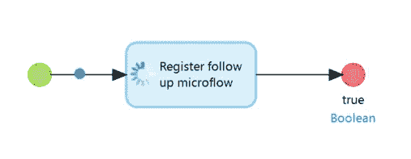
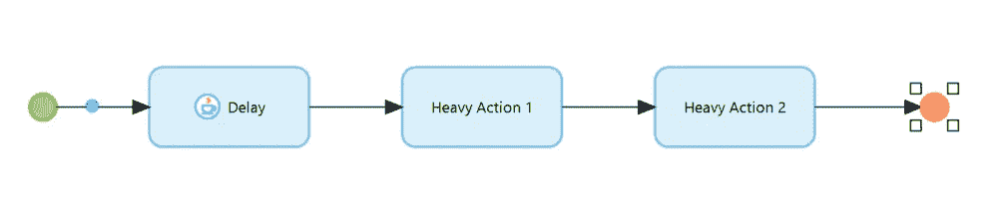

# Mendix 中真正的创业后微流？——门迪克斯和我

> 原文：<https://medium.com/mendix/a-real-after-startup-microflow-in-mendix-mendix-and-me-4feb4fe0a98?source=collection_archive---------1----------------------->

当您构建一个 Mendix 应用程序时，在启动应用程序时，您会想做很多事情。初始化服务、启动进程队列、更新 MxModelReflection 和许多其他动作通常在 AfterStartup 微流中执行。这当然有很多好处。您可以确保执行这些操作，可以确保在应用程序可用时完成这些操作，并且可以在这些操作之一失败时阻止应用程序启动。

除了这些明显的优点，不幸的是也有一些缺点。

*   Mendix AfterStartup 微流实际上是 DuringStartup 微流，因为它在应用程序启动期间运行，而不是之后。
*   如果您在其中执行运行时间较长的操作，应用程序的启动会花费很长时间。对于特别长的操作，甚至会发生应用程序由于超时而根本不启动的情况。
*   无法调试 AfterStartup 微流，因为 Mendix 调试器仅在启动后才处于活动状态。

有一种相处方式，没有这些缺点，不是很好吗？是的。如果你可以不具备某些优势，那么这样做也很容易。

# AfterAfterStartup 微流🙂

在易于使用的 AppStore 模块的帮助下，有可能有一个仅在“真正的”启动后微流完成时才开始的微流。

您将失去在出现问题时中断应用程序启动的可能性。因此，您应该注意在您的微流程中集成适当的错误处理。此外，您也不能确保一旦应用程序可用，所有操作都已完成。在许多情况下，这是不必要的。例如，ProcessQueue 不关心它是否在应用程序启动几秒钟后开始工作。它仍将照常运行所有进程。

需要的 AppStore 模块可以在[这里](https://appstore.home.mendix.com/link/app/111476/)找到。它包含一个 Java 动作，该动作允许在一个微流中注册另一个微流，该动作仅在调用微流级联完成时执行。这个“后续微流”然后在一个单独的系统上下文中运行。因此不再有任何到调用微流的连接。您还可以确保调用微流的事务已经完成。因此，任何数据库更改都已经发生。

使用这个工具，可以在正常的 AfterStartup 微流中注册另一个微流，当 AfterStartup 微流结束时，它在自己的上下文中运行。独立的 AfterAfterStartup 微流。

整个事情看起来就像这样:

这个 AfterStartup 微流很快终止，应用程序很快可用。注册的 AfterAfterStartup 微流现在执行所有计算密集型操作。

当然也可以选择混合形式。例如，您可以选择在正常的 AfterStartup 中中断应用程序的启动，并将其他操作外包给 AfterAfterStartup。

# 调试器

如果你严格按照说明去做，你会发现有一个承诺没有兑现。AfterAfterStartup 微流仍然无法调试。调试器将在 AfterStartup 微流之后的某个时间启动，但通常不会立即可用。如果您仍然想让 AfterAfterStartup 微流可调试，您可以使用一个技巧。

如果您让微流在开始时等待 1-2 秒(例如，使用此处显示的 [CommunityCommons](https://appstore.home.mendix.com/link/app/170/) 中的延迟函数)，您可以从以下操作中使用调试器(在本例中为重操作 1)。

祝你试用愉快。一如既往，我们非常欢迎您的反馈。

*原文于 2020 年 10 月 20 日* [*以德语发表 https://mendixamme . de*](https://mendixandme.de/index.php/2020/10/20/ein-echter-after-startup-microflow-in-mendix/)*。*

*-来自出版商*

*如果你喜欢这篇文章，你可以在我们的* [*媒体页面*](https://medium.com/mendix) *或者我们自己的* [*社区博客网站*](https://developers.mendix.com/community-blog/) *找到更多喜欢的。*

有兴趣加入我们的社区吗？你可以加入我们的 slack 社区 [*这里*](https://join.slack.com/t/mendixcommunity/shared_invite/zt-hwhwkcxu-~59ywyjqHlUHXmrw5heqpQ) *或者对于那些想要更多参与的人，看看加入我们的聚会* [*这里*](https://developers.mendix.com/meetups/#meetupsNearYou)