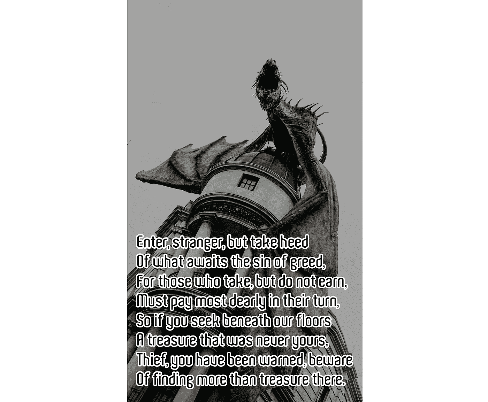

# Riddikulus 数据集

> 原文：<https://medium.com/google-developer-experts/a-riddikulus-dataset-fb68f9044e33?source=collection_archive---------5----------------------->

## 为初学者建立一个哈利波特数据集

想法:用户画了一只动物&被分类到他们的霍格沃茨房子里。

**TL:DR；** [此处有数据集](https://www.kaggle.com/gantlaborde/riddikulus)，请投上一票。这篇博文就是这个故事和[示例](https://aisortinghat.com/)站点。

霍格沃茨的四所房子都有一种与之相关的动物。因此，当用户画一只动物时，人工智能就变成了一顶分院帽。

*   狮子队去格兰芬多
*   斯莱特林的蛇
*   乌鸦队呼叫拉文克劳队
*   獾队对赫奇帕奇队

我不需要数据完美。《哈利·波特》分类的部分乐趣在于偶尔的惊喜。然而，处理完全的随机性是很无聊的——如果不是没用的话。如果我能得到一个数据集，其中每个房子的绘图都有大约 80%的准确性，这对初学者来说可能是一个非常有趣的数据集！

为了训练人工智能对图纸进行分类，你需要一些图纸。当然，我可以画几百次獾，但那不是数据集。幸运的是，谷歌不久前进行了一项人工智能绘画实验，数百万玩家贡献了 345 个类别的数百万涂鸦。虽然我们只想要几个类别，但我们可以从 MNIST 那里获取一页，然后创建一个符合我们需求的修改过的子集。

This is the Google Dataset

当然，谷歌的图纸没有完美地覆盖我们需要的动物，但这没关系。如果你查看可用的类别，有一大组动物接近家养动物，足以进行一个糟糕的比较。也就是说，画一只鸟对一只乌鸦来说已经足够好了，而且看起来一点也不像獾，对吗？

数据集有各种我不需要的东西，比如计时数据和绘制顺序。这是一个非常酷的数据集，但我只需要动物的图画，谢谢。

# 选择图纸

所以子类别的最初选择是:

*   格兰芬多:狮子，老虎
*   斯莱特林:蛇，蜗牛
*   拉文克劳:鸟，猫头鹰，鹦鹉
*   赫奇帕奇:老鼠，浣熊，松鼠

乍一看，赫奇帕奇被冷落了(经典的赫奇帕奇)，因为没有官方的“獾”类别，但以我的经验来看，一个班级成为异类是可以的。

然而，在对谷歌数据进行了一些检查后，鼠标是不可行的。太多的图画都是电脑鼠标。

所以赫奇帕奇取消了老鼠这个类别。

除了拉文克劳，每个人都有两个可能的课程，每个课程大约有 10，000 幅画。

从眼角的余光，我注意到一些非常整洁的小头骨。所以为什么不加入食死徒呢！？他们可以和斯莱特林结合，或者干脆成为他们自己的班级。

现在我们有 10 个类来帮助我们把图画分类到四个房子里。

Honestly, I can’t identify a few of these drawings and I’m a human!

另一件很酷的事情是，有一个简化的数据集，其中的时间信息已经被剥离，图像已经使用“[Ramer–Douglas–peu cker](https://karthaus.nl/rdp/)算法进行了简化。我现在拥有了我需要的一切！

so fancy!

你可能会有一个问题“你应该把数据集的类分成 10 类，还是应该把像*蛇*和*蜗牛*这样的房子组合在一起？”这是一个好问题，让我们检查数据集的可行性。

# 检查生存能力

有希望的是，这些类在训练模型达到 80%的可行程度上是显著不同的。

一种快速的检查方法是使用 SNE 霸王龙。t-分布式随机邻居嵌入(t-SNE)，这是一种在嵌入空间中评估视觉数据特征的奇特方法。欢迎来到非线性降维的世界，[点击这里查看本教程](https://github.com/oreillymedia/t-SNE-tutorial)。如果最后一句听起来像是哈利波特咒语，不要担心，这很简单。健康的 SNE 霸王龙应该是漂亮而独立的集群。数字被有意地保持视觉上的不同，应该作为一个非常集群的 t-SNE。

这是 t-SNE 从 0 到 9 的数字图像:

我非常怀疑我们会得到任何像数字集群这样的东西，但它值得一看。

不幸的是，谷歌提供的数据是矢量形式的。这使得加载到张量中进行评估有点令人头疼。幸运的是，有人将所有的图像转换成 28x28 的栅格化图像，这使得它们可以立即使用。

我有点怀疑 28x28 像素对于非标准化的绘图有多大用处。然而，让 SNE 霸王龙来决定吧。我们的 28x 28t-SNE:

[t-SNE](https://github.com/oreillymedia/t-SNE-tutorial) attempt

首先，像*骷髅头*这样的组合是独立的，它们看起来棒极了。另外，*鹦鹉*和*猫头鹰*离得很近，但这不成问题，因为它们住在同一栋房子里。

看起来有问题的分组是顶部的集群。*松鼠*和*蛇*几乎叠在一起。还有，在*蛇*和*蜗牛*之间似乎还有不少其他职业。

看来我对达到至少 80%准确率的低期望可能相当高。我不介意一些惊喜，但是画一条蛇然后被扔进赫奇帕奇有点让人担心。

***我们放弃了吗？***

> “重要的是，邓布利多说，战斗，再战斗，继续战斗，因为只有这样才能阻止邪恶。”—《哈利·波特与混血王子》

# 28x28 训练

那么 28x28 的数据表现如何呢？我设计了一个小模型，看看我能期待什么样的性能。出乎意料的是，我居然考了 81%！！！！

该模型非常简单，在 TensorFlow.js 中只有 400KB。它由三个卷积和池层组成，后跟一个由 128 个节点组成的隐藏层。JavaScript 代码短小精悍。

我们刚刚得到了一个完美的数据集！？我们应该拿着这个走吗？

嗯……也许 80%的要求还不够。也许我们应该提高我们的目标？也许我们可以提高 90%?我们变得贪婪了吗？

The Gringotts Warning Poem

# 改进数据集—想法

困扰我的一个问题是，我只有一张 28x28 的矢量图。用于分类的经典 28x28 对数字非常有用，但对绘图来说却微不足道。我想看看这个问题是否会持续到更大的图像。这意味着我必须自己将矢量转换成光栅图像。

其次，有些画是…我该怎么委婉地说呢？…有点超出天赋和理智。

If you say so.

这意味着我们可以对数据进行一些清理，希望得到一个可以训练的像样的数据集。

## 尝试 1:矢量的更大栅格化

我想把这些图像栅格化成 256x256 像素的版本。即使这不是用于训练模型的最终尺寸，这也是一个更大的尺寸，用户可以根据需要缩小。第二，清理后的矢量集已经被归一化以适应 256x256，所以不需要调整大小。

我用一个名为 [**ndjsonTosvg**](https://pypi.org/project/ndjsonTosvg/) 的命令将数据呈现给 svg，然后用一个名为 [**svgexport**](https://www.npmjs.com/package/svgexport) 的命令行工具将这些结果 SVG 转换成 jpg。整个过程在 2019 年的 MacBook Pro 上运行了大约 20 个小时(没有 M1 芯片)。

一旦制作了更大的 256x256 图像，我马上就遇到了内存不足的问题。我可以用一个[图像数据生成器](https://keras.io/api/preprocessing/image/#imagedatagenerator-class)来解决这个问题。然而，这大大降低了数据集对于初学者的实用性，初学者可能试图用更简单的设置和更低的 RAM 来处理数据集。

不管怎样，我绕过了内存限制，通过将 256x256 的图像缩小到 128x128 的大小来证明我的概念，这些图像几乎不适合我的可用内存。

缩小尺寸导致了一些线路的严重恶化，但这不是我必须担心的事情，因为图像仍然清晰可辨。

是时候在 128x128 版本的图像上训练相同的模型了！让我们看到一些成功！我用相同的历元数训练相同的模型，然后…

***nooooooo！*** 精度丝毫不让步。如果有什么不同的话，那就是它倒下了。那么是什么原因呢？很明显，我可以从数据中剔除。看看训练数据上那个 99.84%的 acc！

因此，我在模型中加入了剔除和标准化，试图修复过度拟合的问题。它做了*没有*的工作。所以我猜图像的大小不是问题。

如果你认为你可以做得更好，你可以在这里抓取 256x256 的图片。

## 尝试 2:删除差的图像

SNE 霸王龙让我感到困扰的一件事是，它认为鸟看起来像蛇。经过审查，有一个明显的罪魁祸首。经典的日落鸟！

Not bad for Pictionary players, though

这实际上可能是问题的来源。我发现了各种不恰当的数据。

在一次清理数据之后，我看到了一些明显的分离。

## 那么清洁是如何导致准确性的呢？

我的验证数据准确率高达 90%!我认为这对初学者来说是一个完美的数据集，非常有趣！您可以使用该数据集进行训练、教学和共享。

希望这将是一个伟大的工具，人们学习图像识别的基础！嘿，如果它能识别我糟糕的画，我知道它能处理你的:

别忘了画一个头骨😜。我知道你可能有问题，或者你有兴趣进一步挖掘，所以这里有链接给你！

**分享网址:**

 [## 用人工智能将你的可怕图画分类到他们的霍格沃茨房子里

### TensorFlow.js 可以让 AI 看到你的画，然后把它们整理成哈利波特霍格沃茨的房子。享受和学习…

aisortinghat.com](https://aisortinghat.com/) 

**获取数据(如果您有账户，请向上投票)**

 [## Riddikulus

### 一个创造性的 28x28 数据集，适合喜欢哈利波特的初学者

www.kaggle.com](https://www.kaggle.com/gantlaborde/riddikulus/) 

**跟我学怎么用 TensorFlow.js 建网站:**

***有兴趣学习如何用 TensorFlow.js 将 AI 和机器学习带入 web？***

JavaScript 让你创建前端网站，可以直接在浏览器上利用人工智能的力量。用这本书从头学起。

[在亚马逊上预订你的副本](https://amzn.to/3dR3vpY)

最后，

我在北美各地的 TensorFlow 讲了这个故事的一个变种。点击此处查看视频:

# 向使这一切成为可能的人们致敬

感谢谷歌团队开源了 QuickDraw 数据，并让我出现在 TF Everywhere 中。

感谢哈利波特粉丝无处不在，其乐无穷。

特别感谢扎伊德·阿利亚费，他一直是我的灵感和教育资源。

阿里·沙基巴和 T2·斯蒂芬·汤普森创造了对载体到 JPG 的转换至关重要的转换库。

一如既往地，感谢[无限红](https://infinite.red/)的优秀员工，他们让每个人都变得有创造力和开放。最佳咨询公司 eva！

Gant Laborde 是 [Infinite Red](http://infinite.red/) 的共同所有者和首席创新官，出版作家，兼职教授，全球公共演说家，以及培训中的疯狂科学家。鼓掌/追随/ [发推特](https://twitter.com/GantLaborde)或者在会议上拜访他[。](http://gantlaborde.com/)