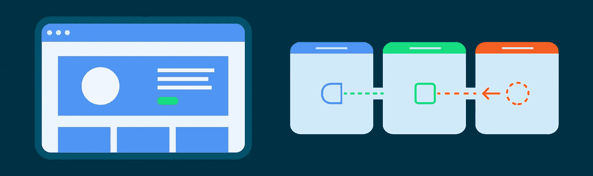
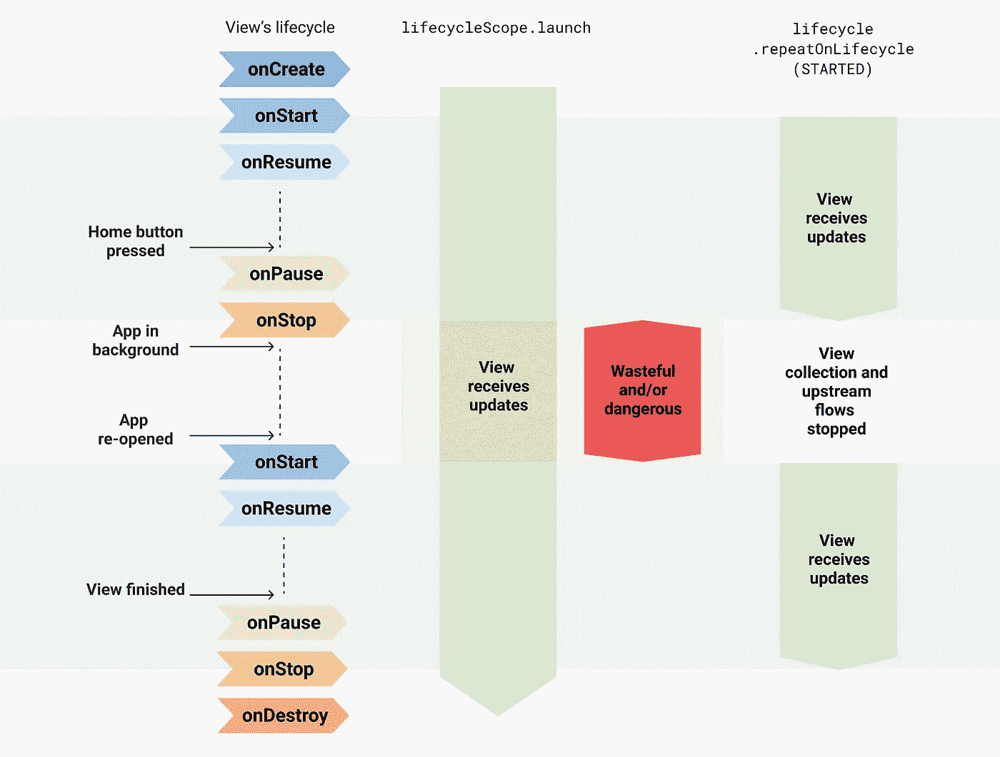

# 从 Android 用户界面收集流量的更安全方式

> 原文：<https://medium.com/androiddevelopers/a-safer-way-to-collect-flows-from-android-uis-23080b1f8bda?source=collection_archive---------0----------------------->

在 Android 应用中， [Kotlin 流](https://developer.android.com/kotlin/flow)通常从 UI 层收集，以在屏幕上显示数据更新。但是，您希望收集这些流，确保在视图转到后台时，您没有做不必要的工作，没有浪费资源(CPU 和内存)或泄漏数据。

在本文中，您将了解到`Lifecycle.repeatOnLifecycle`和`Flow.flowWithLifecycle`API 如何保护您不浪费资源，以及为什么它们是 UI 层中用于流收集的良好默认设置。

# 浪费资源

建议从应用层次的较低层公开`Flow<T>` API，而不考虑流生成器实现细节。但是，您也应该安全地收集它们。

由[通道](https://kotlinlang.org/docs/channels.html)支持或使用带有`[buffer](https://kotlin.github.io/kotlinx.coroutines/kotlinx-coroutines-core/kotlinx.coroutines.flow/buffer.html)`、`[conflate](https://kotlin.github.io/kotlinx.coroutines/kotlinx-coroutines-core/kotlinx.coroutines.flow/conflate.html)`、`[flowOn](https://kotlin.github.io/kotlinx.coroutines/kotlinx-coroutines-core/kotlinx.coroutines.flow/flow-on.html)`或`[shareIn](https://kotlin.github.io/kotlinx.coroutines/kotlinx-coroutines-core/kotlinx.coroutines.flow/share-in.html)`等缓冲区的操作符的冷流**使用一些现有的 API(如`[CoroutineScope.launch](https://kotlin.github.io/kotlinx.coroutines/kotlinx-coroutines-core/kotlinx.coroutines/launch.html)`、`[Flow<T>.launchIn](https://kotlin.github.io/kotlinx.coroutines/kotlinx-coroutines-core/kotlinx.coroutines.flow/launch-in.html)`或`[LifecycleCoroutineScope.launchWhenX](https://developer.android.com/reference/kotlin/androidx/lifecycle/LifecycleCoroutineScope)`)来收集**是不安全的，除非您在活动转到后台时手动取消启动协程的`Job`。这些 API 将使底层流生产者保持活动，同时在后台将项目发送到缓冲区，从而浪费资源。

> 注意:**冷**流是一种在新订户收集时按需执行生产者代码块的流。

例如，考虑这个使用`[callbackFlow](https://kotlin.github.io/kotlinx.coroutines/kotlinx-coroutines-core/kotlinx.coroutines.flow/callback-flow.html)`发出位置更新的流程:

> 注意:在内部，`*callbackFlow*`使用一个[通道](https://kotlinlang.org/docs/reference/coroutines/channels.html)，它在概念上与阻塞[队列](https://en.wikipedia.org/wiki/Queue_(abstract_data_type))非常相似，默认容量为 64 个元素。

使用前面提到的任何 API 从 UI 层收集这个流可以保持流的发出位置，即使视图没有在 UI 中显示它们！请参见下面的示例:

暂停协程的执行。新的位置不被处理，但是`callbackFlow`制作人仍然继续发送位置。使用`lifecycleScope.launch`或`launchIn`API 甚至更危险，因为即使在后台，视图也会不断消耗位置！这可能会使您的应用程序崩溃。

要用这些 API 解决这个问题，您需要在视图转到后台取消`callbackFlow`时手动取消收集，以避免位置提供者发送项目和浪费资源。例如，您可以执行如下操作:

这是一个很好的解决方案，但这是样板，朋友们！如果有一个关于 Android 开发者的普遍真理，那就是我们绝对厌恶编写样板代码。不必编写样板代码的最大好处之一是代码越少，出错的机会就越少！

# 生命周期.重复生命周期

既然我们都在同一页上，知道问题在哪里，是时候想出一个解决方案了。解决方案需要 1)简单，2)友好或易于记忆/理解，更重要的是 3)安全！它应该适用于所有用例，不管流程实现细节如何。

事不宜迟，你应该使用的 API 是 [*生命周期-运行时-ktx*](https://developer.android.com/jetpack/androidx/releases/lifecycle) 库中可用的`**Lifecycle.repeatOnLifecycle**`。

> 注意:这些 API 可以在`*androidx.lifecycle:lifecycle-runtime-ktx:2.4.0*`库或更高版本中获得。

看一下下面的代码:

`repeatOnLifecycle`是一个 suspend 函数，它以一个`[Lifecycle.State](https://developer.android.com/reference/android/arch/lifecycle/Lifecycle.State)`作为参数，用于**自动创建并启动一个新的协程**，当生命周期到达那个`state`时，将块传递给它，当生命周期低于`state`时，**取消正在执行该块的协程**。

这避免了任何样板代码，因为当不再需要协同程序时，取消协同程序的相关代码是由`repeatOnLifecycle`自动完成的。正如您所猜测的，建议在活动的`onCreate`或片段的`onViewCreated`方法中调用这个 API，以避免意外的行为。请参见下面使用片段的示例:

**重要:**片段应该*总是*使用`viewLifecycleOwner`来触发 UI 更新。然而，对于有时可能没有`View`的`DialogFragment`来说，情况并非如此。对于`DialogFragment` s，可以使用`lifecycleOwner`。

> 注意:这些 API 可以在`*androidx.lifecycle:lifecycle-runtime-ktx:2.4.0*`库或更高版本中获得。

## 引擎盖下！

`repeatOnLifecycle`挂起调用的协程，当生命周期移入和移出目标`state`时，在一个*新的*协程中重新启动该块，当 `**Lifecycle**` **被破坏**时，**恢复调用的协程。最后一点非常重要:调用`repeatOnLifecycle`的协程不会恢复执行，直到生命周期被破坏。**

# 视觉图

回到起点，直接从以`lifecycleScope.launch`开始的协程中收集`locationFlow`是危险的，因为即使视图在后台，收集也会继续进行。

`repeatOnLifecycle`防止您浪费资源和应用崩溃，因为当生命周期移入和移出目标状态时，它会停止和重新启动流收集。

Difference between using and not using the repeatOnLifecycle API

# Flow.flowWithLifecycle

当您只有一个流要收集时，您也可以使用`Flow.flowWithLifecycle`操作符。这个 API 使用底层的`repeatOnLifecycle` API，当`Lifecycle`移入和移出目标状态时，发出项目并取消底层的生产者。

> 注意:这个 API 名称以`Flow.flowOn(CoroutineContext)`操作符为先例，因为`Flow.flowWithLifecycle`改变了用于收集上游流量的`CoroutineContext`，同时保持下游不受影响。此外，与`flowOn`类似，`Flow.flowWithLifecycle`增加了一个缓冲，以防消费者跟不上生产者。这是因为它的实现使用了一个`callbackFlow`。

# 配置基础生成器

即使您使用这些 API，也要小心那些即使没有人收集也可能浪费资源的*热*流！它们有一些有效的用例，但是请记住这一点，并在需要时记录下来。让底层的流生产者在后台活动，即使浪费资源，对某些用例来说也是有益的:您可以立即获得新的数据，而不是*追赶*并暂时显示陈旧的数据。**根据用例，决定生产者是否需要总是活动的**。

`MutableStateFlow`和`MutableSharedFlow`API 公开了一个`subscriptionCount`字段，当`subscriptionCount`为零时，您可以使用该字段来停止底层生产者。默认情况下，只要保存流实例的对象在内存中，它们就会使生成器保持活动状态。尽管这有一些有效的用例，例如，使用`StateFlow`从 ViewModel 向 UI 公开一个`UiState`。没关系！这个用例要求 ViewModel 总是向视图提供最新的 UI 状态。

类似地，`[Flow.stateIn](https://kotlin.github.io/kotlinx.coroutines/kotlinx-coroutines-core/kotlinx.coroutines.flow/state-in.html)`和`[Flow.shareIn](https://kotlin.github.io/kotlinx.coroutines/kotlinx-coroutines-core/kotlinx.coroutines.flow/share-in.html)`操作符可以通过[共享启动策略](https://kotlin.github.io/kotlinx.coroutines/kotlinx-coroutines-core/kotlinx.coroutines.flow/-sharing-started/index.html)进行配置。`[WhileSubscribed()](https://kotlin.github.io/kotlinx.coroutines/kotlinx-coroutines-core/kotlinx.coroutines.flow/-sharing-started/-while-subscribed.html)`会在没有主动观察者的时候停止底层生产者！相反，`[Eagerly](https://kotlin.github.io/kotlinx.coroutines/kotlinx-coroutines-core/kotlinx.coroutines.flow/-sharing-started/-eagerly.html)`或`[Lazily](https://kotlin.github.io/kotlinx.coroutines/kotlinx-coroutines-core/kotlinx.coroutines.flow/-sharing-started/-lazily.html)`将保持底层生产者活动，只要他们使用的`CoroutineScope`是活动的。

> 注意:本文中显示的 API 是从 UI 收集流的一个很好的默认设置，无论流实现细节如何，都应该使用这些 API。这些 API 做了它们需要做的事情:如果 UI 在屏幕上不可见，就停止收集。它是否应该总是活动的取决于流实现。

# Jetpack Compose 中的安全流收集

如果您正在使用 Jetpack Compose 构建一个 Android 应用程序，使用`collectAsStateWithLifecycle` API 从您的 UI 中以生命周期感知的方式收集流。

`collectAsStateWithLifecycle`是一个可组合的函数，它从流中收集值，并以生命周期感知的方式将最新的值表示为 Compose `[State](https://developer.android.com/reference/kotlin/androidx/compose/runtime/State)`。每次出现新的流发射时，这个`State`对象的值都会更新。这会导致组合中每个`State.value`用法的重组。

默认情况下，`collectAsStateWithLifecycle`使用`[Lifecycle.State.STARTED](https://developer.android.com/reference/android/arch/lifecycle/Lifecycle.State#started)`来开始和停止从流中收集值。当生命周期移入和移出目标状态时，会发生这种情况。这个生命周期状态可以在`minActiveState`参数中配置。

下面的代码片段展示了这个 API 的作用:

有关更多信息，请查看 Jetpack Compose 博客文章中的[安全消费流。](/androiddevelopers/consuming-flows-safely-in-jetpack-compose-cde014d0d5a3)

 [## 在 Jetpack Compose 中安全地使用流

### 以生命周期感知的方式收集流量是 Android 上收集流量的推荐方式。使用…

medium.com](/androiddevelopers/consuming-flows-safely-in-jetpack-compose-cde014d0d5a3) 

# 与 LiveData 的比较

您可能已经注意到这个 API 的行为类似于`[LiveData](https://developer.android.com/topic/libraries/architecture/livedata)`，这是真的！`LiveData`知道生命周期，它的重启行为使它非常适合从用户界面观察数据流。对于`Lifecycle.repeatOnLifecycle`和`Flow.flowWithLifecycle`API 也是如此！

在 *Kotlin 专用的*应用中，使用这些 API 收集流是对`LiveData`的自然替代。如果您使用这些 API 进行流收集，`LiveData`并不会比协程和流提供任何好处。此外，流量更加灵活，因为它们可以从任何`Dispatcher`收集，并且可以通过所有[操作器](https://kotlin.github.io/kotlinx.coroutines/kotlinx-coroutines-core/kotlinx.coroutines.flow/-flow/)供电。与`LiveData`相反，它只有有限的可用操作符，其值总是从 UI 线程中观察到的。

## 数据绑定中的状态流支持

换句话说，您可能使用`LiveData`的原因之一是因为它受数据绑定的支持。嗯，`[StateFlow](https://developer.android.com/kotlin/flow/stateflow-and-sharedflow)`也是！关于数据绑定中`StateFlow`支持的更多信息，[查看官方文档](https://developer.android.com/topic/libraries/data-binding/observability#stateflow)。

使用`Lifecycle.repeatOnLifecycle`或`Flow.flowWithLifecycle`API 安全地从 Android 的 UI 层收集流。