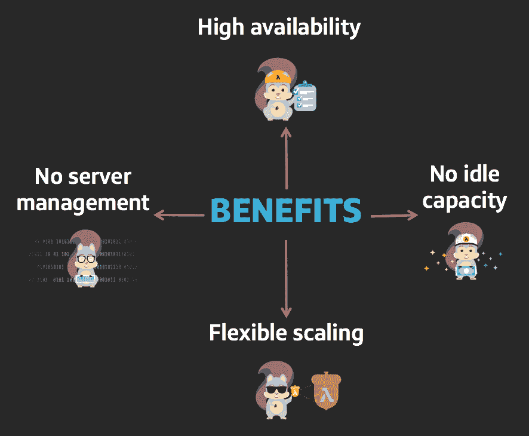
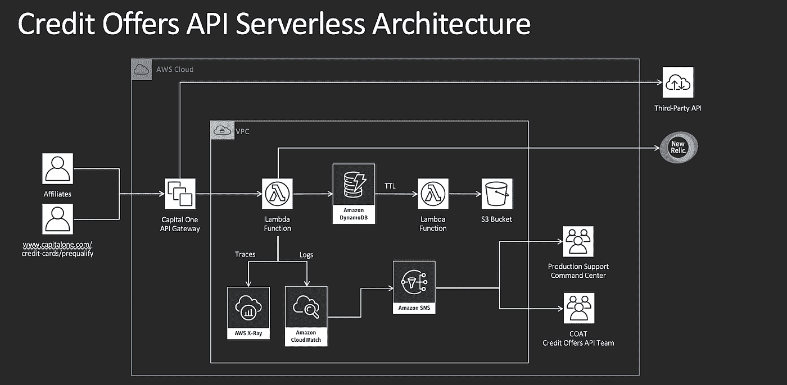
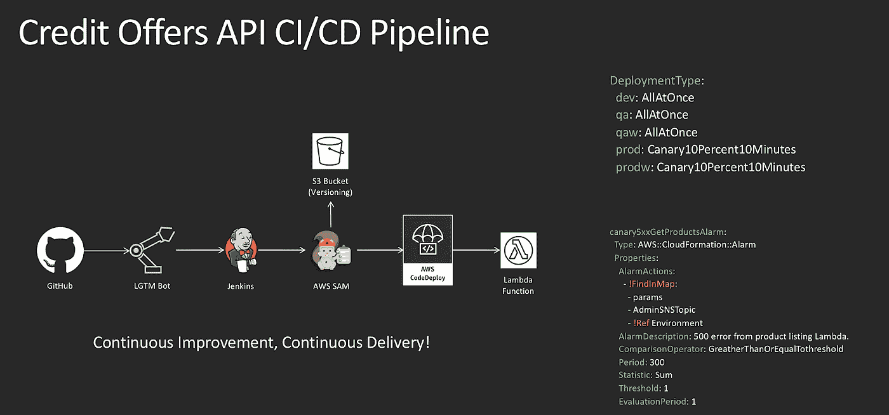

# 无服务器的旅行

> 原文：<https://medium.com/capital-one-tech/a-serverless-and-go-journey-credit-offers-api-74ef1f9fde7f?source=collection_archive---------0----------------------->

## Capital One Credit 提供的 API 的演变

作为一家技术驱动的金融公司，我们在 Capital One 的最大目标之一是利用技术轻松、快速、直接地与客户互动。潜在 Capital One 客户与我们合作的一个重要方式是通过我们的附属渠道。像 [Credit Sesame](https://developer.capitalone.com/case-studies/CreditOffersAPI-CreditSesame/) 、[CreditCards.com](https://developer.capitalone.com/case-studies/CreditOffersAPI-CreditCards/)和 [Bankrate](https://developer.capitalone.com/case-studies/Bankrate-Case-Study/) 这样的附属合作伙伴与 Capital One 有着特殊的合作关系，他们在那里展示可用的信用卡选项，并引导潜在客户使用适合他们的信用卡。对于我们的附属合作伙伴，这是通过[信用优惠 API](https://developer.capitalone.com/products/credit-offers/homepage/) 完成的。我们认为这有助于人们做出更明智的信用卡选择。我们也喜欢认为这展示了我们对技术的尖端应用。

# 什么是信贷优惠 API？

它是如何工作的？Credit Offers API 公开了 Capital One 信用卡优惠的完整列表，我们的附属合作伙伴可以向他们的客户显示这些信息，以及奖励信息和产品评论等详细信息。它有一个资格预审功能，可以个性化卡产品，为客户匹配合适的卡(不影响他们的信用评分！).它还有一个很好的预填功能，提供完整的预填申请，使申请 Capital One 信用卡成为一种流畅的体验。

2015 年构建 1.0 版本时，Credit Offers 是用 Java 构建的。API 的当前版本 3.0 已经过重新构建，因此它是完全无服务器的，并且是用 Go 编写的。这是两项非常酷的技术，结合起来是展示我们信用卡产品的快速而有力的方式。

# 为什么要去？

在 2016 年中期，我们在 API 中添加了一个额外的端点，该端点将确认已向客户显示了报价。Go 在 Capital One 开始获得巨大的、令人印象深刻的发展势头，根据我的团队进行的概念验证，我们看到了相对于 Java 的巨大性能提升。这些结果很清楚，所以我们决定将其用于这个新的终点。

当时，没有一个团队成员知道 Go，但是不到一个月，每个人都在编写 Go，我们也在构建端点。它的灵活性、易用性以及 Go 背后真正酷的概念(Go 如何处理本机并发、垃圾收集，当然还有安全+速度。)帮助我们在构建过程中参与进来。还有，谁能打败那个可爱的吉祥物！

在 Go 中重写 Credit Offers API 的整个过程比预期的要简单得多。作为技术负责人，我是最后一个批准一段代码何时合并并准备发布的人。所以我不得不更深入地研究 Go，不仅要理解代码，还要理解业务逻辑。更令人满意的一个惊喜是，将业务逻辑与 Go 这样的简单语言混合在一起意味着很容易进入这个角色，并且不会成为发布的瓶颈。

我们想探索的下一项技术是无服务器技术。根据定义，Go 既快又简单，这也是你定义 lambda 的方式。事实上，我们不想没有 go 就没有服务器。这就把我们带到了…

# 为什么没有服务器？

在另一轮分析中，我们意识到我们的用例非常适合无服务器方法。我去年参加了 AWS re:Invent，主要关注无服务器会话，并对 Credit Offers API 如何与无服务器协同工作有了一些想法。2018 年 1 月初[lambda 对 Go 的支持一发布](https://aws.amazon.com/blogs/compute/announcing-go-support-for-aws-lambda/)，我们就开始进行迁移，开始分析工具，开始将代码封装在 lambda 中，并添加额外的警报，这样我们就可以完全不用服务器了。我们在今年 10 月初完成了这次迁移。

我们被无服务器吸引是因为它的四个主要支柱的结合:

由于代销商渠道和信用提供 API 的方式会影响我们的合作伙伴和潜在客户，因此能够在不中断服务的情况下无缝扩展我们的 API 非常重要。无服务器化不仅让我们摆脱了服务器，还让我们变得更快、更有弹性。最大的“胜利”之一是，我们的开发人员不需要停下来担心基础设施，可以将更多的时间用于创建和交付与业务相关的功能。

在这张图片中，你可以看到建筑是多么简单。我们如何与[亚马逊 CloudWatch](https://aws.amazon.com/cloudwatch/) 集成来监控系统的健康状况。我们选择 DynamoDB 是因为它的转义能力和灵活的模式；对于长期储存，我们使用 S3 桶。我们还使用亚马逊的社交网络在出现问题时发出警报。你还可以看到我们如何整合外部监控系统— [新遗迹](https://newrelic.com/)。

同样，lambda 听起来很简单，但我们确实有一些复杂的过程，包括调用外部 API，这是资格预审流程的一部分。Go goroutines 和 lambda 是天作之合。

我们无服务器解决方案的另一个关键部分是我们如何进行部署。canary 部署允许我们部署任何 lambda 更新(版本控制)的 5%,设置特定的 Canary 部署警报，并且如果某些东西失败了，在没有任何干预的情况下自动回滚。在第一个 5%发布成功后，我们计算出我们想要测试多长时间，并从那里开始增量发布 lambda 的新版本。金丝雀的部署对我们来说非常强大。正如我提到的，我们依赖于我们的分支机构，随着我们的规模和增长，我们的新版本不能下降。通过对金丝雀部署使用可靠的管道，他们不会。

# 从我们的无服务器和移动之旅中吸取的经验教训

那么，我们从这场无服务器的旅行中学到了什么呢？

## **#1 无服务器并不意味着你失去控制。**

恰恰相反，你有更多的控制权。是的，扩展是无缝的，性能更好，但有限制，你必须检查它们。你不能只是抛出数十亿个请求，而没有意识到如果你计划不当，它可能会对你的服务造成破坏。为了弥补这一点，您可以扩展到不同的区域、不同的可用性区域，并计划扩展您的应用程序。

## **#2 测试是根本。**

社区最关心的问题之一是如何测试 lambda，因为 lambda 依赖于一个事件？嗯，我们实际上探索了 SAM local——它是进行本地测试的无服务器应用程序模型。在开发人员的笔记本电脑上，他们可以模拟事件并全面测试 lambda。

## **#3 关注您的数据和数据库。**

根据您的使用情况、您需要保留什么数据、您需要保留多长时间等等，无服务器数据库有几种选择。在我们的例子中，直接的选择是选择一个数据库，这个数据库为我们提供了这个 API 所需的灵活性和功能。

## **#4 保持简单。**

Lambdas 不应该是一大段代码。正确确定你的功能——保持简单的是/否。

## **#5 启用分布式跟踪。**

我们用的是 AWS X 射线。对于 AWS 环境来说，这是一个很自然的选择，它可以让您全面了解系统的性能。不仅仅是 lambdas，还有数据库、53 号公路、网关等等。您可以通过 X 射线获得应用程序的每个接触点，包括其他微服务。

## **#6 在设计无服务器管道时，要考虑金丝雀部署。**

经过良好测试的增量部署使我们的 API 更具弹性。通过使用 canary 部署，我们可以 24x7 全天候发布，不会对我们的分支机构造成服务中断。

## **#7 微服务思维模式。**

在设计您的解决方案时，尽量使其简单，确定内外的依赖关系，并且不要离开白板，直到您可以在您的生态系统中创建一个平滑的耦合。最后，完全控制你的事件源。

# 结果

我们看到了无服务器在性能提升、成本节约和团队速度方面取得的巨大成果。从 lambda 收到请求到它回复的时间，70%的性能提升是相当可观的。更令人印象深刻的是我们在成本方面的巨大成就——通过消除 EC2、ELB 和 RDS 节省了 90%。作为技术负责人，我们没有花时间修补、修复和维护服务器，团队速度提高了 30%,现在我们可以花时间创新、创造和扩展业务需求。

既然 API 是 100%无服务器的，我们就有了一个坚实的路线图来说明我们还想用这项技术做什么。我们希望整合 [AWS CodeBuild](https://aws.amazon.com/codebuild/) 来为多个构建流程创建一个简单的管道，我们希望使用 [AWS Step Functions](https://aws.amazon.com/step-functions/) 来添加更好的重试机制，我们希望将 [ELK](https://www.elastic.co/elk-stack) 整合到我们的日志记录中，这样我们就可以为我们的解决方案添加一些业务仪表盘。但是我们将在另一篇文章中讨论这个问题。

# 相关:

*   [金融科技和信贷服务的交集](/capital-one-tech/the-intersection-of-fintech-and-credit-offers-1c1d935d1ef4)
*   [信用优惠 WordPress 插件](/capital-one-tech/credit-offers-api-open-source-wordpress-plugin-761665ca7f2)
*   [Go 编程语言常见问题解答](https://golang.org/doc/faq)
*   [使用 Lambda 函数时的最佳实践](https://docs.aws.amazon.com/lambda/latest/dg/best-practices.html)
*   [通过做不好来做好:用 Go 第 1 部分写不好的代码](/capital-one-tech/doing-well-by-doing-bad-writing-bad-code-with-go-part-1-2dbb96ce079a)

*披露声明:这些观点仅代表作者个人观点。除非本帖中另有说明，否则 Capital One 不属于所提及的任何公司，也不被其认可。使用或展示的所有商标和其他知识产权都是其各自所有者的所有权。本文为 2018 首都一。*