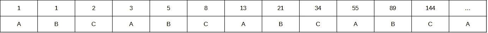

# 算法分析的简短介绍

> 原文：<https://medium.com/globant/a-short-an-simple-introduction-to-algorithm-profiling-26176f5ce0f3?source=collection_archive---------0----------------------->


在本文中，我们将了解概要分析的概念，并将看到一个 Python 示例，展示如何将低效的算法转换为高效的算法。最后，我们将思考软件开发过程中涉及的不同角色如何影响应用程序的性能。

# 简而言之，什么是剖析？

形式定义表明*剖析是一种动态程序分析的形式，例如，测量程序的空间(内存)或时间复杂度，特定指令的使用，或者函数调用的频率和持续时间。最常见的是，分析信息有助于程序优化。*

可以在源代码级别或可执行对象级别检测分析，有多种技术可以做到这一点，例如基于事件的、统计的、检测的和模拟的方法。我们现在将看到一种特殊的方法来利用它，而不是假装完全覆盖它。

# 挑战:变形算法

让我们用一个由[项目 Euler](https://projecteuler.net/problem=2) 提出的问题来说明概要分析的一个可能的应用:

> 斐波纳契数列中的每一个新项都是通过将前两项相加而生成的。从 1 和 2 开始，前 10 项将是:
> 
> 1, 2, 3, 5, 8, 13, 21, 34, 55, 89, …
> 
> 考虑斐波纳契数列中数值不超过四百万的项，找出偶数项的总和

好的。可以说，这种问题并不是你在日常生活中会经常发现的。但这是一个有趣的挑战，无论你是程序员(创建最有效的算法)还是测试员(设计适当的测试用例来评估算法的效率)。我们继续。

斐波那契的继承具有递归性；因此，对于一个程序员来说，在第一个实例中这样做似乎是合理的。以下代码(用 Python 3 编写)为这个问题提供了正确的结果:

```
''' COMMENT: This function calculates the Fibonacci value for an integer number. As can be seen, if input parameter is 0, return value is 0; if input value is 1, return value is 1 (both trivial cases). For any integer greater than 1, result will be the sum of values returned by the fibonacci function called two times (recursively) using the two immediate preceding numbers '''def fibonacci(x): if x == 0: return 0 --- trivial case if x == 1: return 1 --- trivial case return fibonacci(x-1) + fibonacci(x-2) --- double recursive call''' COMMENT: This function implements a while cycle that will analyze for each integer number (starting in 1) the corresponding fibonacci value and then will check if this result is even'''def mainFunction(): fibSum = 0 fibValue = 0 index = 1 while fibValue < 40000000:   ---- while cycle from 1 to 40000000 fibValue = fibonacci(index) ---- calculate fibonacci value if fibValue % 2 == 0:    ---- check if result value is even fibSum += fibValue     ---- accumulate value index += 1 print(fibSum)''' COMMENT: This section calls mainFunction explained above '''if __name__ = "__main__": mainFunction()
```

正如我们所看到的，函数“fibonacci”使用双重递归，因此要计算特定索引的 Fibonacci 值，需要为其两个前置值中的每一个调用相同的函数，依此类推……此外，对每个值执行“mod”操作，以计算它是否是偶数。

为了评估这个算法的性能，我们将从命令行使用名为“cProfile”的 Python 库对它进行分析。

*$ python-m cProfile even Fibonacci . py*

我们将获得这样的输出:


首先，我们获得时间，在我的计算机(处理器 2.6 GHz，16MB RAM)中是 14.848 秒，如 cProfile 生成的摘要报告所示:

*48315601 个函数调用(39 个原语调用)耗时 14.848 秒*

现在让我们看看输出中的第三个条目，以获得更多的详细信息:

*n 调用总时间百分比累计时间百分比文件名:行号(函数)*

…

*48315596/34 14.848 0.000 14.848 0.437 even Fibonacci . py:2(Fibonacci)*

…

可以看出，大部分处理时间和最大数量的调用发生在递归函数“fibonacci”上，它被调用了 48，000，000 次！我们在斜线后面看到的数字 34 指的是原始调用，即那些没有被递归引入的调用。

# 我们能帮助它做得更好吗？

剖析库向我们揭示了我们代码中的一个大弱点。因此，是时候跳出框框，寻找更有效的方法了。让我们通过仔细研究斐波那契数列的行为来更深入地分析这个问题。



我们可以观察到，有一种模式表明，在两个奇数(A，B)之后是一个**偶数** (C)，接下来的两个**奇数**可以通过将前面的每个奇数加到最后一个偶数上来获得，依此类推……因此，我们可以用这种非递归方式重新编写代码。

```
''' COMMENT: This reformulated function doesn't use any kind of recursion'''def mainFunction(): limit = 40000000 sum = 0 a = 1 b = 1 c = a+b while c < limit: sum+=c         --- accumulate result a = b+c          --- calculate first next odd b = c+a          --- calculate second next odd c = a+b          --- calculate the even print(sum)''' COMMENT: This section calls mainFunction explained above '''if __name__ = "__main__": mainFunction()
```

这样我们就消除了递归，除此之外，我们不再检查每个值是否都是偶数。当对这个新代码进行概要分析时，我们会得到这样的结果:


正如我们所看到的，我们已经将呼叫数量从数百万减少到 5 个，处理时间从 14 秒以上减少到几乎为零。

# 总结一下(但这还没有结束……)

*   如果你是一个开发者，剖析当然可以帮助你开发更好的算法。通过对属于你的类和组件的函数进行单独的分析，你会发现你的代码中的弱点和需要改进的地方，并且会减少 QA 团队“开发”的数量
*   如果您是一名功能性 QA，您当然可以通过设计使用不同值的测试用例，并根据您提供的输入参数检查性能如何提高或降低，来帮助检测由低效算法产生的潜在性能问题。如果极限值不是 400 万而是 800 万，你想一想我们的例子的递归版本需要多长时间？或者更大？(*)
*   如果您是一名负载和性能测试人员，前面的几点同样适用于您。这表明，很多时候性能问题并不一定与并发性和作用于应用程序的工作负载有关，而是可以通过应用单一测试来检测。根本原因并不总是与基础设施/架构相关，推荐的解决方案也不总是“更多 RAM、更多处理器、更多服务器”。如果您能够利用一个好的 APM，使您能够在代码级别进行概要分析，请不要犹豫使用它。

(*)可怕的是，处理时间跃升至 180 秒，呼叫次数超过 5.35 亿次！