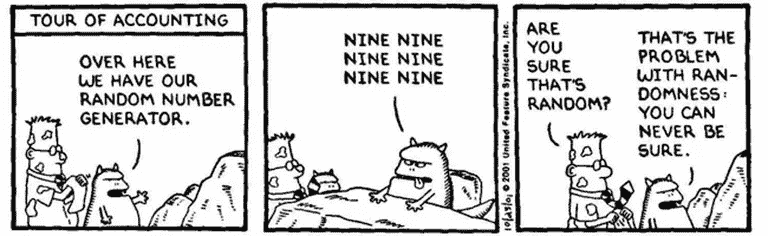
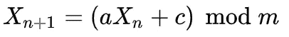

# 随机性短篇小说(一)

> 原文：<https://medium.com/google-developer-experts/a-short-story-of-randomness-i-17ca0718ae52?source=collection_archive---------3----------------------->

我一直对上面的漫画很着迷。关于随机性和决定论的讨论既是一个实践问题，也是一个哲学问题。它们被用于各种各样的应用中:从显而易见的密码学、游戏或赌博到不太明显的政治或艺术。

我们如何确定一个数字是随机的？观察这个过程是否会激发我们产生随机数的努力，就像观察一只猫在一个装有衰变放射性原子的盒子里一样？尽管生成随机数可能很复杂，但我们可以提供一个简单的方法来生成它们。

当我作为组织者参加聚会或会议时，我喜欢在会议结束时练习一个简单的游戏，它是与观众一起开发一个脚本，随机选择一个有资格获得礼物的参与者(一个杯子、一件 t 恤等……通常由主办组织提供的任何礼品)。参与者的列表通常在一个. CSV 文件中，并且来自 Java world live-coding 这可能是一个令人生畏的任务:打开流，关闭它们…该死，我自己甚至害怕在舞台上尝试这个。然而，在 Kotlin 中，解决方案相当简单:

(猜测如何指定路径的部分除外，第一次尝试不可能猜对)。

在玩这个小游戏时，参与者的名字经常会出现两次，所以我们开玩笑地表示怀疑这个过程是否真的是随机的，或者随机算法已经被调整为有利于某个人，让他/她带着所有的赃物回家。在 stage 上开发一个能够提供随机数的算法可能比使用 *java.util.Random* 需要更多的时间。但是，我们可以在 stage 事件之前深入了解一下，了解一下随机性是如何在 Java 中实现的。

[OpenJDK](https://hg.openjdk.java.net/jdk8/jdk8/jdk/file/tip/src/share/classes/java/util/Random.java) 提供了 *java.util.Random* 的开源代码，看看它的工作原理还是挺有意思的。它使用了一个 48 位 LCG 生成器，基于唐纳德·克努特的《计算机编程的艺术》一章。LCG 生成器使用类似于下面的公式:

LCG generation formula

让我们来看看这个公式中的每个组成部分:

*   *Xn* 是我们的首发种子，应该够不可预测了。例如，它可以是自我们的系统启动以来经过的时间量，或者是当前使用的 RAM 量，或者是当前日期的 XOR。
*   *a* 是乘数——随机选择
*   *c* 是随机选择的增量
*   m 是我们用来执行模运算的数字——固定的和随机选择的

先前值的选择可能会影响输出的质量或随机性，因此我们可以进入兔子洞，增加这些选定值的熵(通过使它们也随机或使用更复杂的过程来生成它们)。事实上，Java 从 rand48 生成上述参数，因此它们是随机的，这对于大多数用途来说是可以接受的。

以下代码摘录是一个线性同余生成器在 Kotlin 中的实现:

LCG 速度快，适合大多数计算机使用。需要最少的内存，它可以快速执行。然而，它的用途并不打算用于每个领域(例如，加密应用程序应该使用安全的伪随机数发生器来生成 salt 和密钥)。

# 摘要

自早期计算时代以来，大多数随机生成器都使用了上述机制的某种变体。然而，它的用法并不适用于所有系统。在接下来的文章中，我们将看到哪些系统应该使用不同的随机数生成器，以及目前有哪些算法可用于此。

我在我的[推特账户](https://twitter.com/eenriquelopez)上写下我对软件工程和生活的想法。如果你喜欢这篇文章或者它对你有帮助，请随意分享，👏和/或发表评论。这是给业余作家加油的货币。