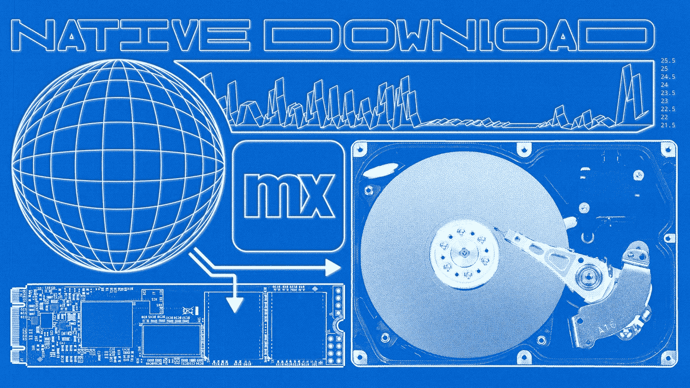
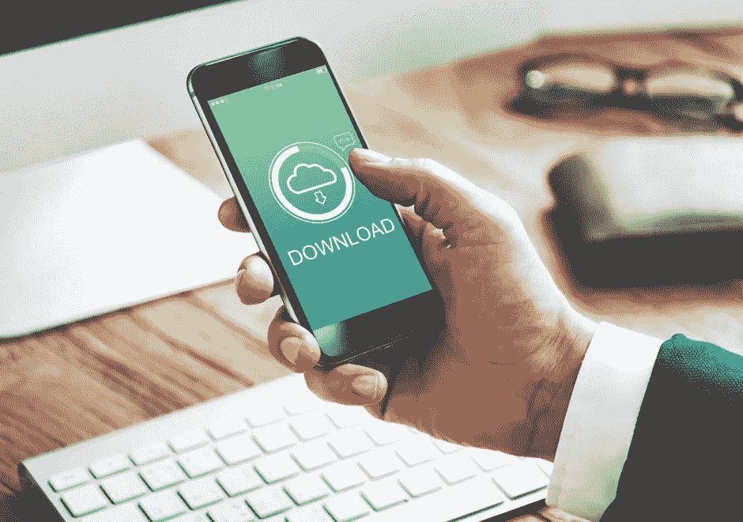
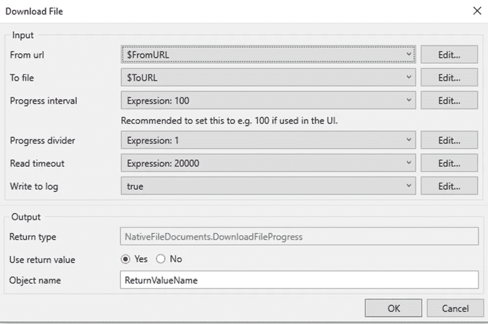
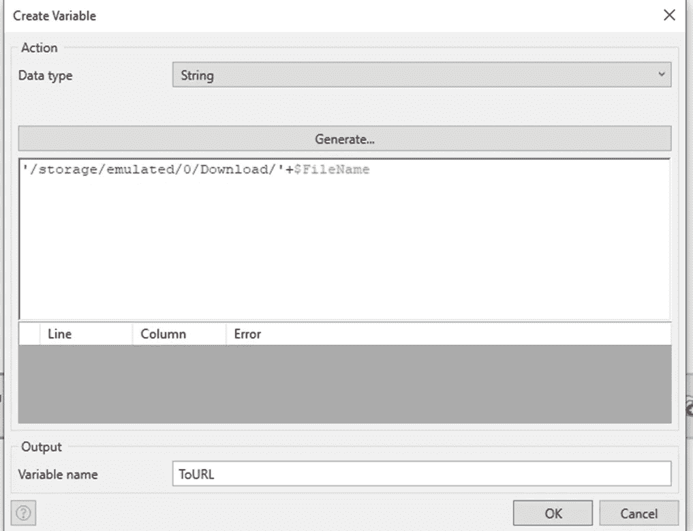

# 如何在 Mendix 原生移动应用中下载文件文档

> 原文：<https://medium.com/mendix/a-simple-and-effective-way-to-implement-a-download-feature-in-native-application-94d3696b447c?source=collection_archive---------5----------------------->



How to download file documents in a Native Mobile Application

# 我在 Mendix 论坛上看到过很多帖子，都是关于如何在原生移动应用中下载文件的。目前，在本地文件文档模块中有一个 JavaScript 动作可以轻松实现这一点。这个模块非常好，所以我想知道为什么人们没有意识到他们的问题的解决方案已经存在。这就是我决定写这篇博客的原因；这样我就可以向你们展示这有多简单。

在原生移动应用程序中下载文件是一个很好的功能，也是许多应用程序的预期功能。然而，不知道本地移动和响应应用类型之间存在的差异可能会使它看起来比实际上更大的挑战。在 Native 中下载文件几乎和在 web 上下载一样简单，但是在 Native 中，需要考虑一种替代方法。

在这篇博客中，我将详细解释实现这一点所需的关键步骤。



Download File in Native

# **先决条件:**

**原生文件文档** —从 Studio Pro 中的 Mendix Marketplace 下载模块。(【https://marketplace.mendix.com/link/component/114252】)。

## 在我们开始之前，先说明一下建筑

响应式和原生移动导航配置文件之间的一个关键区别是**响应式应用程序是服务器端的，而原生移动导航运行在客户端设备上。**

这意味着当响应应用程序请求文件时，我们可以确定文件存储在服务器的数据库中。当本地移动应用程序请求某个文件时，我们必须首先确保客户端可以访问该文件，或者该文件直接存储在移动设备数据库中(通过同步和同步到设备操作很容易实现)。

# **怎么做:**

使用模块中可用的'**下载文件** ' **JavaScript 操作**在本地移动应用程序中下载文件。



Inputs for Javascript action

一些不熟悉本地移动应用开发的人可能想知道为什么我们需要“来自 URL”以及从哪里获取它。让我们看看这些参数是什么意思。

1. **From URL** :必须下载文件的 URL。

2.**到文件**:文件必须下载到的路径。

3.**进度间隔**:如果在 UI 中使用，设置为 100。

4.**读取超时**:以毫秒为单位指定读取超时。

5.**写入日志**:如果必须记录，将该输入设置为真，否则为假。

# 我们从哪里得到“来自 URL”？

幸运的是，原生文件文档模块提供了另一个定制动作的解决方案: **getFileDocumentUrl** 。

**实现 getFileDocumentUrl 的步骤**

*   使用**同步动作**，确保你想要的文件在你手机应用的本地数据库中。
*   同步完成后，使用 getFileDocumentUrl 获取设备存储中文件的路径。

> **NB！确保在调用 JS 操作之前对文件进行空检查。**
> 
> **如果文件不在设备上(HasContents = false)** 使用获取 fileDocument 实体的子微流，然后使用微流中可用的[**syncto device**](https://docs.mendix.com/refguide/synchronize-to-device/)**action**将文件推送到客户端(原生移动应用)

## **对于“至文件”，我们可以使用什么文件路径？**

文件必须下载到的路径。

您可以选择将其发送到您选择的不同文件，但最简单的用例是**将其发送到设备的下载文件夹**。

为此，我们可以使用以下文件路径:

```
‘/storage/emulated/0/Download/’+$FileName
```



如上所示，设置下载文件的路径和文件名。

## 结论

现在，您可以在任何 Mendix 本地移动应用程序中下载文件。事实证明，在原生应用程序中下载文件的过程非常容易实现，同时也非常有效。该方法可用作基础，并可根据应用程序的用例进行更改。我很高兴与我们的 Mendix 社区分享这一点，我希望这将对您未来的开发项目有用。

编码快乐！

特别感谢市场模块的创建者 Marcel Groeneweg。

## 阅读更多

 [## 图像和文件

### 描述 Mendix Studio 中的图像和文件小部件。

docs.mendix.com](https://docs.mendix.com/studio/page-editor-widgets-images-and-files/)  [## 同时发生

### 此活动只能用于在离线优先应用程序(本机或离线 PWA 应用程序)中运行的 Nanoflows。1…

docs.mendix.com](https://docs.mendix.com/refguide/synchronize/) 

*来自发布者-*

如果你喜欢这篇文章，你可以在我们的 [*中页*](https://medium.com/mendix) *找到更多喜欢的。对于精彩的视频和直播会话，您可以前往*[*MxLive*](https://www.mendix.com/live/)*或我们的社区*[*Youtube PAG*](https://www.youtube.com/c/MendixCommunity/community)*e .*

*对于希望入门的创客，您可以注册一个* [*免费账户*](https://signup.mendix.com/link/signup/?source=direct) *，并通过我们的* [*学院*](https://academy.mendix.com/link/home) *获得即时学习。*

*有兴趣加入我们的社区吗？加入我们的* [*松弛社区频道*](https://join.slack.com/t/mendixcommunity/shared_invite/zt-hwhwkcxu-~59ywyjqHlUHXmrw5heqpQ) *。*