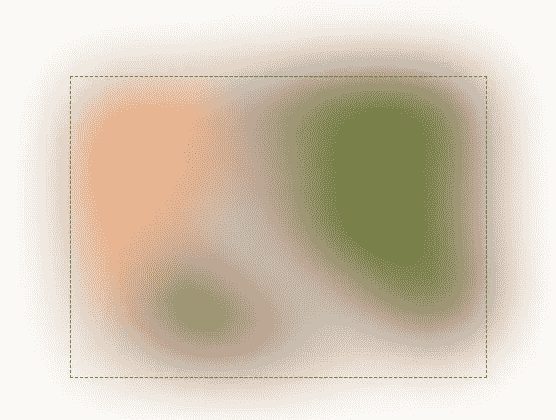
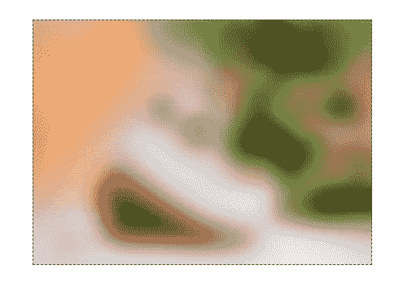

# 一种简单的实时视频高斯模糊技术似乎确实有效。

> 原文：<https://medium.com/quick-code/a-simple-technique-for-real-time-video-gaussian-blurs-that-did-seem-to-work-42b2c6bb9989?source=collection_archive---------3----------------------->

我有时会遇到这样的情况，用户提供的视频需要在网页中进行高斯模糊，动态地使用用户给定的半径(类似于[投影仪](https://projector.com/)所做的，不过它使用了 WebGL 2。)

然而，我对 WebGL 不太熟悉，我在 WebGL 中为此目的所做的尝试失败了(这将在后面讨论)。

因此，在经历了这么多的尝试和错误之后，我最终选择了 2D 的好东西。但是让我列举一些我做过的尝试。

[](https://developer.mozilla.org/en-US/docs/Web/API/CanvasRenderingContext2D) [## canvasrenderingcontext 2d-Web API | MDN

### CanvasRenderingContext2D 接口是 Canvas API 的一部分，它为绘图提供了 2D 渲染上下文…

developer.mozilla.org](https://developer.mozilla.org/en-US/docs/Web/API/CanvasRenderingContext2D) 

## CSS 过滤器

我的第一次尝试是用`blur()` CSS 过滤器直接设计`video`的样式。

```
<video
    src={userProvidedSource}
    style={{
        filter: `blur(${userProvidedBlur}px)`
    }}
/>
```

然而，渲染将是不正确的。最边缘的像素将变得半透明，并溢出视频边界。



Simulated rendering. This is what CSS filters do.

## CSS 背景-过滤器

当我第一次遇到这个问题时，CSS 属性似乎是一个完美的解决方案。

```
<div class="video-box">
    <video src={userProvidedSource} class="video-box__video" />
    <div
        class="video-box__backdrop"
        style={{
            backdropFilter: `blur(${userProvidedBlur}px)`
        }}
    />
</div>
```



Simulated rendering. Seems perfect at first glance.

但是，当模糊半径变大时，渲染结果可能会出错。


Unblurred image is revealed below the backdrop, though I don’t quite know why.

## 2D 画布，第一次尝试

幸运的是，`CanvasRenderingContext2D.filter`属性同时支持 CSS 和 SVG 过滤器。

[](https://developer.mozilla.org/en-US/docs/Web/API/CanvasRenderingContext2D/filter) [## canvasrenderingcontext 2d . filter-Web API | MDN

### 画布 2D API 的 canvasrenderingcontext 2d . filter 属性提供了诸如模糊和…

developer.mozilla.org](https://developer.mozilla.org/en-US/docs/Web/API/CanvasRenderingContext2D/filter) 

因此，在画布上绘制整个视频似乎是值得的，在画布上应用了滤镜。

```
canvas.width = w;
canvas.height = h;
/** @type{CanvasRenderingContext2D} */
const context = canvas.getContext('2d');
context.save();
context.filter = `blur(${userProvidedBlur}px)`;
context.drawImage(video,
    0, 0, video.videoWidth, video.videoHeight,
    0, 0, w, h
);
context.restore();
```

不幸的是，使用这种方法，最边缘的像素仍然是半透明的。

A demonstration of semi-transparent pixels drawn with canvas.

## 2D-帆布，第二次尝试

所以我先画出最边缘的像素，然后将画布溢出的容器设置为隐藏。

```
const r = userProvidedBlur * 2; // to cover the transparent pixels
context.filter = `blur(${userProvidedBlur}px)`;
// draw the corners
// draw the sides
// draw the video in the center
```

渲染看起来几乎是正确的，但是当重复调用时，很多时间会浪费在`drawImage()`调用上，这使得它不适合实时视频渲染。根据这篇文章中的[，即使最快的高斯模糊实现也具有与模糊形状的面积成比例的不可约的时间×空间复杂度组合。即使最大程度地并行化，这也可以转化为 O(max(width，height，blurRadius))时间。](http://blog.ivank.net/fastest-gaussian-blur.html)

所以在模糊的画布中重复调用`drawImage()`可能意味着对画布上绘制的像素进行不必要的重复访问，这可能是我遇到的性能问题的基础。

## WebGL，尝试失败

这让我想到了 WebGL 渲染。不幸的是，我对 WebGL 知之甚少，不知道——也还不知道——如何在 WebGL 代码中实现上述算法，所以我不必要地在每次调用片段着色器时多次访问纹理。

```
// the code below doesn't work
// for severe perf problemsprecision mediump float;
uniform sampler2D img;
uniform vec2 texSize;
uniform float boxSize;
uniform float center;
uniform vec2 dir;
uniform bool flip;void main() {
    vec4 ret=vec4(.0);
    vec2 px=dir*vec2(1.,1.)/texSize;
    vec2 coord=gl_FragCoord.xy/texSize.xy;
    float comp=boxSize-.1;
    if(flip){ coord.y=1.-coord.y; }
    float fi=.0;
    for(int i=0;i<200;i++){
        float offset=fi-center;
        vec2 curCoord=coord+px*offset;
        ret+=texture2D(img, curCoord);
        fi+=1.;
        if(fi>=comp){ gl_FragColor = vec4(ret.rgb/boxSize,1); return; }
    }
    gl_FragColor = ret;
}
```

后来我放弃了。

## 屏幕外的画布

所以我回到了优化我之前的 2D-画布方法。

我将边缘像素和视频本身绘制到屏幕外画布的渲染上下文中，最后将其绘制到模糊的画布上。

[](https://developer.mozilla.org/en-US/docs/Web/API/OffscreenCanvas) [## 屏幕外画布-Web API | MDN

### OffscreenCanvas 接口提供了一个可以在屏幕外呈现的画布。它在窗口和中均可用…

developer.mozilla.org](https://developer.mozilla.org/en-US/docs/Web/API/OffscreenCanvas) 

剪切和模糊之前的样子。

Blur once, run on every Chromium-based browser

当在视频帧渲染的`requestAnimationFrame()`回调中被调用时，性能也比我之前的 2D-画布方法有所提高，尽管离完美的 60 fps 还有一段距离。

## 警告

然而，这种方法在非基于 Chromium 的浏览器上效果不佳，比如 Firefox。Firefox 默认不支持`OffscreenCanvas` API，即使手动启用，它也不支持 2d 渲染上下文。

使用`HTMLCanvasElement`可以进行多种填充，但性能仍然不佳，产生的帧速率约为 2 fps。我不太清楚哪里出了问题。

无论性能提升有多小，都很难实现。