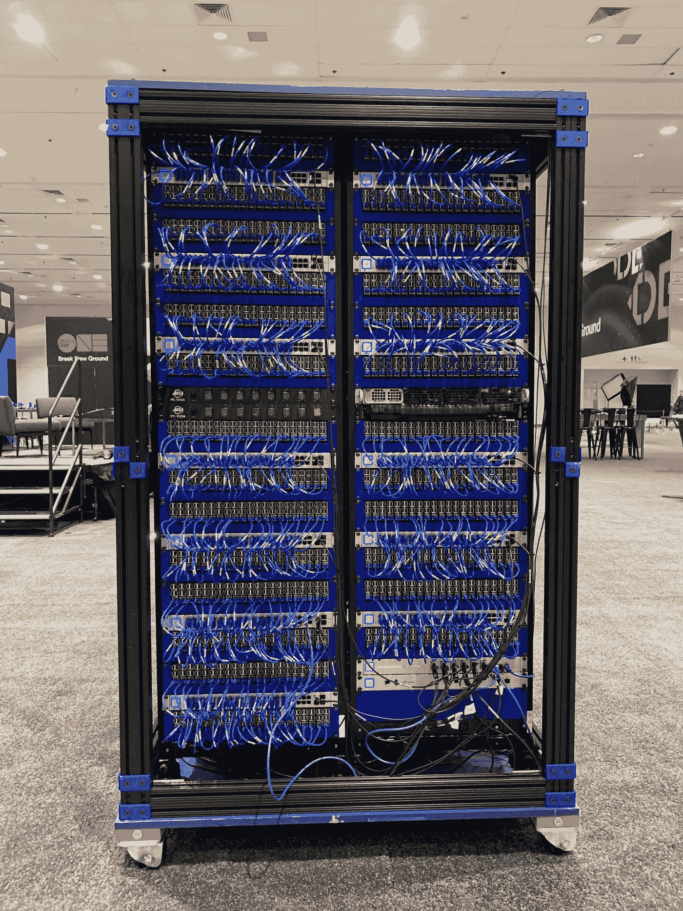
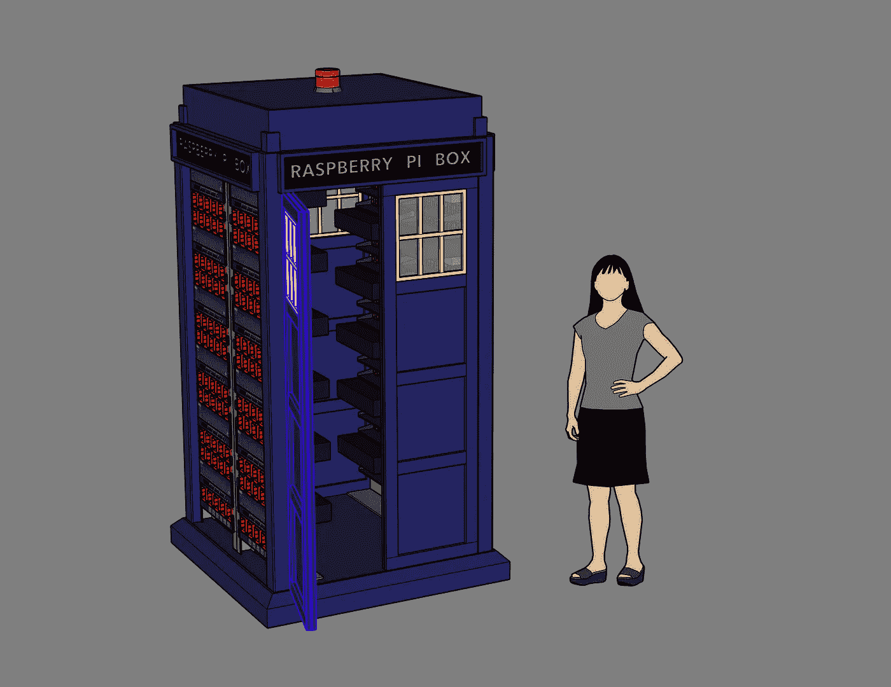

# 世界上最大的树莓群落(据我们所知)的时间历史

> 原文：<https://medium.com/oracledevs/a-temporal-history-of-the-worlds-largest-raspberry-pi-cluster-that-we-know-of-4e4b1e214bdd?source=collection_archive---------0----------------------->

克里斯·本森

如果你愿意，你可以在 GitHub [这里](https://github.com/chrisbensen/chris-blogs/blob/main/%CF%80Cluster/History/PiClusterHistory.md)阅读这篇博文。

树莓派超级计算机最初是为 2019 年 10 月的开放世界打造的。我们在四个服务器机架中有 1050 个 Raspberry Pi 3b+，配置在一个大的方形盒子中，让人想起在某个英国电视连续剧中流行的英国警察盒子。快进到今天，Pi 集群，“Raspberry Pi 超级计算机(Pi 集群)”被送到电子垃圾，一些部件被剥离，休眠了 2 年，然后在今年 5 月找到了它，在我的车库里进行了彻底的检修。

The Raspberry Pi Super Computer at Open World San Francisco 2019

# 暂时的历史

## 2018

2018 年初，来自甲骨文瑞士公司的一小群热情的售前工程师在 Hackzurich hackathon 上展示了他们的 12 节点 Raspberry Pi 集群，模拟了一个具有 3 个可用性域的甲骨文云数据中心。它运行一个全面运行的 Kubernetes 集群，并可以演示节点和可用性域故障转移。Gerald Venzl 在[建造世界上最大的树莓派集群](https://blogs.oracle.com/developers/post/building-the-worlds-largest-raspberry-pi-cluster)中写道。快进到 10 月份的 2018 年开放世界:Stephen Chin 和 Gerald Venzl 向我介绍了这个集群以及做许多小项目的概念，这些小项目可以聚集在一起，成为一个真正的大项目。杰拉尔德认为 1000 便士很酷。我告诉他“这是一个可怕的数字。你需要 1024”。杰拉尔德和斯蒂芬脸上露出了灿烂的笑容，圆周率的种子就这样种下了。在接下来的几个月里，Jasper Potts 和我集思广益，开始制作零件的电子表格，我联系了我们的供应商，以获得所有零件的报价。

## 2019

这个想法在整个公司传播开来，并得到了我们展示技术的所有团队领导的支持。购买批准开始发生。我去买了一个实验室，因为我们需要很多空间。我们需要一个实验室来容纳我们建造的其他体验，比如子弹时间或逃生室，所以这是必要的。我为它配备了烙铁、示波器、3D 打印机、4 条腿的桌子，以及真正的创客空间所需的一切。我们考虑过使用 Pi 计算模块——也有一些非常酷的 4-Pi 板——但 250 块太贵了。我们考虑过定制板，但那会花太多时间。那时我们决定使用任何人都能买到的现成硬件，只使用普通的树莓派 3B+。Pi 4 还没有上市。在我拥有我的实验室之前，Pi 于 2019 年 2 月到达，并存储在其他实验室中，直到 6 月开发者营销黑客实验室最终开放。

在二月和四月之间，我做了很多旅行来支持现有的体验，订购零件。集思广益，研究如何建立这个集群。贾斯珀·波茨和我几乎每天都要交谈，试图确保我们拥有我们需要的每一个可能的部分，确保项目的每一部分都是可能的，并制定应急计划以防事情不顺利。此时的四个问题是:

1.动力
2。联网
3。SD 卡
4。软件
5。它会是什么样子

我终于找到了一个 60 端口的 USB 电源，订购了一个来测试。很有效，所以我订了 30 个。有备份总是好的。在对带有标准家庭路由器和网关的 8 Pi 集群进行了一些初始网络测试后，我们意识到标准家庭网络是行不通的。如果我们构建了许多小型 Pi 群集，那么所有路由器和网关都存在成本问题，当群集作为一个整体出现时，每个群集将在树形配置中成为几次“群集的群集”,其中每个节点要么是单个 Pi，要么是一个小型群集。它必须是群集的群集，或者是“可重新配置的”。无论您使用哪种方式，配置和维护它都需要大量的工作。但是当超过 255 台设备成为一个集群时，我们不得不选择 B 类，这时就需要大量的网络设备。

5 月份，我和斯蒂芬·陈坐下来讨论了一系列问题。我们解决了电力问题，至少对 Pi 来说是这样。我们必须为整个集群重新寻址。我们选择了无处不在的网络。它是最便宜的网络硬件，拥有我们需要的所有功能。我们决定不订购 SD 卡，尝试网络启动。这以后会回来咬我们，但是每个 Pi 的 SD 卡会花费太多时间和 16，000 美元。网络引导可以解决很多问题，但是我稍后会深入探讨这个问题。为这样的东西编写软件是具有挑战性的，人们获得博士学位并花费整个职业生涯来开发可以跨多线程或计算模块拆分的算法。我们决定引入 GLUON 的 Johan Vos 和 José Pereda，并将其作为一个 Java 社区项目来做。他们带来了杰瑞特·格伦瓦德和其他几个我甚至不知道他们在工作的人。

拼图的最后一块是它看起来会是什么样子。我已经开始制作原型并研究容纳 Pi 的不同方法，但如果我按照我在互联网上看到的典型密度，它看起来会是大约 8-12 个服务器机架。我坐下来，拿着一打 Pi，几个无处不在的开关，把它们安装在一个小的服务器机架上。然后，我拿着不同配置的 Pi，一个挨着一个。在 1U，他们必须全部平放——我只能放 4 个进去。但是如果我把它们垂直放进去，它会是一个 2U 的，但是可以堆叠更多的东西。

在餐厅的餐桌上，我们一边喝咖啡——然后吃午饭——一边讨论把它放进一个带座位的旧 VAX 或克雷 CS6400。人们可以从下面走过的彩虹拱门。我们甚至想到了一棵树，圆周率就像水果一样长在树上。我给他看了一些原型作品。我们意识到物流需要一个盒子。我们算了一下，觉得可以把它全部塞进 4 个机架。也许吧。会很紧张。但是如果可以的话，电话亭会很酷。超人有一个很酷的电话亭。也许是一辆红色的英国车。或者……一个蓝色的英国警察岗亭。我们俩都带着一丝微笑开始做一些渲染、幻灯片和更多的原型制作。但是 Jasper Potts 渲染是我们开始使用的。

First Rendering of Pi Cluster

我试图通过将至少 20 个 Pi 塞进 2U 来获得最高的密度。问题是这给我们留下了大约 50 个额外的圆周率，所以它不合适。这有点像火箭方程式:Pi 越大，需要的基础设施就越多，因此空间和电力也就越大。起初，我 3D 打印了一个巨大的打印件，Pi 滑入到位，并与另一个打印件固定在一起。不幸的是，我的打印机不能打印那么大的一整架，即使能打印，也要花 24 小时。我尝试了很多东西。这时候我有了一个想法，用一个 18”1”x1/2”的 80/20 片，末端铣掉 16.35 毫米，然后在末端敲孔，打印 21 个 Pi 球和两端，这就是解决方案。在这一点上，我应该回顾一下，我们*确实*为所有 Pi 考虑了 POE。我们对此进行了尝试，但是 POE hat 是互斥的，因为它需要对网络引导进行一些固件更改，然后所有交换机都必须具有所有 POE 端口。我很难找到超过 16 端口的 POE 交换机，而且密度只有我们所能获得的一半。

6 月，所有东西都被转移到了开发者营销黑客实验室，布莱恩·卡特(Blaine Carter)等几个人飞过来帮忙搭建。我决定带上我的相机和三脚架，记录下正在发生的事情，除了确保相机指向大致的方向之外，几乎不注意相机。这个视频后来在 2020 年 3 月 14 日成为 Pi 集群视频。世界上最大的树莓派集群(据我们所知):

我确实记录了一些选择的时刻。在这个时候，我发现了 Casey Neistat，并认为他的视频很有趣。

我试图记录我所经历的每一件事，很清楚事后记录几乎是不可能的。以下是那个时代描述球童以及他们如何成为球童的博客。

*   [超大树莓 Pi 集群第 1 部分](http://chrisbensen.blogspot.com/2019/06/very-large-raspberry-pi-cluster-part-i.html)
*   [超大树莓 Pi 集群第二部](http://chrisbensen.blogspot.com/2019/06/very-large-raspberry-pi-cluster-part-ii.html)
*   [超大树莓 Pi 集群第 3 部分](http://chrisbensen.blogspot.com/2019/06/very-large-raspberry-pi-cluster-part-iii.html)
*   [超大树莓 Pi 集群第 4 部分](http://chrisbensen.blogspot.com/2019/07/very-large-raspberry-pi-cluster-part-iv.html)
*   [超大树莓 Pi 集群第 5 部分](http://chrisbensen.blogspot.com/2019/07/very-large-raspberry-pi-cluster-part-v.html)
*   [超大树莓 Pi 集群第 6 部分](http://chrisbensen.blogspot.com/2019/07/very-large-raspberry-pi-cluster-part-vi.html)
*   [3D 打印零件](https://www.thingiverse.com/thing:3958586)

在这个项目中，我开始在 Twitter 上发帖。我在午夜回家的路上拍摄了这段视频，在等待电梯门打开时，以及在走向我的汽车时，用手机上的 iMovie 编辑了这段视频。当我走到我的车前时，我已经把它寄出去了。

我在积极招募新人。我们仍有许多未知，但其中最大的一个是它将需要的时间。如果一件事需要 1 分钟，而你有 1000 件，那么这就超过了 16 个小时。布莱恩·卡特和我正忙着打印 1000 个球童，末端支架，以及我们需要的所有定制的东西，这些都是从 12 台*3D 打印机上定制的。在*优化后，支架花费了 45 分钟。有几个月的 3D 打印，但我们必须确保它们是完美的。3D 打印非常神奇，可以在短时间内打印出一个凭空出现的东西，但如果你需要 1000 个，那就要花很长时间了。约兰德·普瓦里耶认识一些硅谷 42 号的学生，他们过来开始帮忙。我给他们买了披萨主动提出指导他们。他们第二天带着朋友回来了。有些学生可能会改变，但一个核心小组日复一日地出现了，我今天仍然和他们是朋友。我们建立了装配线，用于从包装中取出 Pi，将它们排成一行以安装到 caddies 中，然后将它们组装到 2U 机架的 21 Pi 中。我们最终得到了 50 个 2U 球童。实际上，计划是构建两个 84 Pi 的迷你集群，所以我们又做了 9 个，总共 59 个。一个是多余的，但结果我们需要这个。稍后我会解释。

慢慢地，π星团成形了。打印机全天候运行。我开始每周工作 7 天，每天至少 15 个小时。它并不健康，但每个从事这项工作的人都玩得很开心。伟大的人。我确保我们总是有食物和很酷的玩具——这就是一个工程师除了睡一小会儿以外所需要的。学生们学到了很多东西，他们很聪明，所以事情都做好了。

并行任务之一是软件，对于任何软件项目，你都需要一个好的操作系统。这个想法已经提交给了 Wim Coekaerts 和 Oracle Linux 团队，他们完全同意为 Pi 集群提供 Oracle Linux 7 的定制版本。我的一个好朋友罗伊·费格(Roy Feague)闲来无事，正在享受网络启动 Pi 的挑战。Pi 是为网络引导设计的，但是我们发现固件有一个错误。当 Pi 启动与 DHCP 服务器通信以获取 IP 地址时，它不会进行正确的租用、释放和绑定。它更新 IP，但就此打住。所以多个 Pi 得到同一个 IP。因此，我们必须获得每个 Pi 的 MAC 地址，并将其硬编码到 dhcpd.conf 中。仅使用 DHCP 来获得静态 IP 地址似乎有些倒退，但现在已经有了。Roy 从 Ubuntu 和 Raspbian 开始，所以我们可以使用所有 Pi 共享的 NFS 挂载，并使用覆盖文件系统，这样它们就不会进行写回。这里有一篇关于 [Raspberry Pi PXE 引导的好文章——在没有 SD 卡](https://linuxhit.com/raspberry-pi-pxe-boot-netbooting-a-pi-4-without-an-sd-card/)的情况下网络引导 Pi 4，这在当时并不存在。网络引导过程是这样工作的:

1.  打开 Pi 电源，NIC 固件发送 DHCP 请求
2.  DHCP 服务器以租约和服务器选项作为响应
3.  Pi 配置网络并请求引导文件
4.  服务器通过 TFTP 向客户端发送文件
5.  Pi 引导内核和引导映像，然后完成操作系统引导。

Oracle Linux 团队让 Oracle Linux 7 与一个 8 Pi 的小型集群一起工作，我们将集群的其余部分集合在一起，因此我们测试了引导，但我们必须一次引导 42 Pi。这就是 Ubuntu 倒下的地方。Oracle Linux 7 经过调整，运行良好。不完美——即使到今天，Oracle Linux 9 也不能完美运行。我们认为这是因为网络故障或 Pi 固件故障。大多数时候，当我们启动 42 个 Pi 时，它们都会启动。但是偶尔只有 37 个会启动，甚至更少。该过程是关闭并重试。

现在是 2019 年 10 月初，Pi 集群几乎全部组装完毕，操作系统基本正常工作，我们可以启动大部分 Pi，是时候将集群运往 Moscone 参加 2019 年旧金山开放世界大会了。该集群的设计是螺栓胶合板，它将成为板条箱。安装在上面的脚轮不适合滚动，所以我们用了托盘千斤顶。我们实际上不得不从货梯上拆下一个栏杆才能把它放进去，但我们把它放在卡车上，并在适当的位置安装了 GoPro，这样我们就可以获得运输视频。结果是电池没电了——我没有设置定时拍摄。我不太喜欢单按钮界面。

在《开放世界》中，我们设置好了它，安装了 Java 社区项目，并设法启动了 980 Pi。Pi 集群首次亮相的第二天，包括[汤姆的硬件](https://www.tomshardware.com/news/oracle-raspberry-pi-supercomputer,40412.html)和 [Slashdot](https://developers.slashdot.org/story/19/09/21/0334244/oracles-new-supercomputer-has-1060-raspberry-pis) 在内的 42 家新闻媒体都在报道这个集群。有几个随机 Pi 无法启动，还有一个我够不到的 42 位的 bank 已经被拔掉了。但是温度太高，不能让它长时间开着。我们有 7 个大粉丝，并有一些专家来给我们提供他们对冷却的意见，但共同的反应是“嗯，它可能会工作…”。上半部分做到了。下半部分，尤其是服务器下面的部分，阻碍了空气的流动，导致 Pi 过热。

在开放世界之后，Pi 集群回到开发者营销黑客实验室进行升级和修复，并进行环球旅行。它要去伦敦、米兰、柏林和纽约。但在与这些地方的活动团队交谈后，早期的要求——200 安培的电源和双门——很难满足。我们转了一圈又一圈。最后，我决定建立我计划的 84 个 Pi 迷你集群中的一个，并在 2019 年 12 月 20 日，它在 2020 年 1 月运往迪拜开放世界。

这是 84 树莓派迷你集群的[零件清单。](http://chrisbensen.blogspot.com/2020/11/parts-list-for-raspberry-pi-mini-super.html)

## 2020

2020 年 2 月，我在伦敦开放世界上遇到了这个集群，我运行的不是 Java 社区项目，而是 SETI@home。

这是疫情的开始，所有未来的活动都被取消，大量的内部洗牌随之而来。一个大洗牌是一切都变得虚拟化。我意识到我有很多构建 Pi 集群的视频片段，Pi 日就要到了，所以我花了几天时间编辑了一个视频，试图讲述一个有趣的故事。结果是这个病毒式的视频，这在很大程度上要感谢吉姆·格里桑奇奥。

在这一点上，我提出了几个其他的虚拟体验。最引人注目的是[受乐高启发的赛车](https://github.com/chrisbensen/eff-uno-racer)，它开启了甲骨文和红牛的合作伙伴关系。

作为内部洗牌的一部分，关闭了开发者营销黑客实验室。我们将工具和物品转移到其他实验室和其他可能的存储选项。我把我的实验室转移到 Oracle 实验室，作为他们的一个实验室，并把 Pi 集群留在那里，上面写着:不要扔垃圾。我们在清理实验室的同一周发生了圣克鲁斯火灾，我接到电话说 Pi 集群在电子垃圾中。实验室被清理后，他们把所有没钉牢的东西都清理了。我开车进入办公室，将 Pi 群集推回实验室，但几个交换机、两个 Pi 2U 机架和一个 60 端口 USB 电源已被移除。我对此无能为力——或者其他一些被扔进电子垃圾的写着“节约”的东西。毕竟，在火灾疏散后的几个星期里，我一直住在行李箱里。但是圆周率星团就这样又持续了一年半。幸运的是，它有两个较小的 84 Pi 迷你集群。2020 年 11 月，我在我的车库里录制了一个构建第二个 84π迷你星团的视频，并把它发布到 YouTube 上。

## 2022

Pi 集群在对话中出现过几次，但是由于它的未知状态和没有物理会议，它被尘封了。最终，在 2022 年 2 月，对话变得严肃起来。这是 Pi 集群来我家拜访我和我的家人的时候，它已经在家里呆了 6 个月了。

如果你对其他帖子感兴趣，我创建了一个博客帖子，包括所有与 Pi 集群相关的帖子[这里](http://chrisbensen.blogspot.com/2020/11/all-raspberry-pi-super-computer-posts.html)。它已经过时了，但是它包括了到 2020 年的一切。