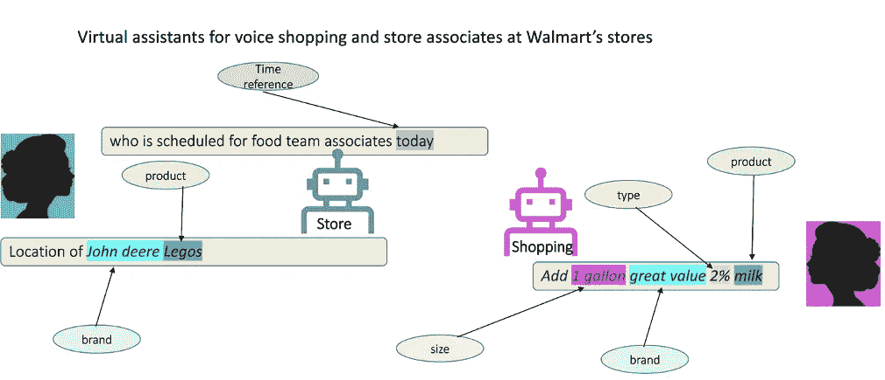
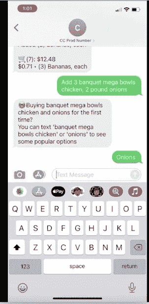
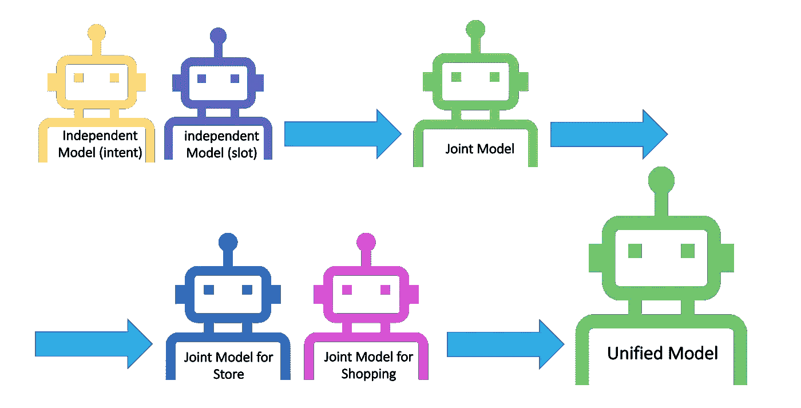
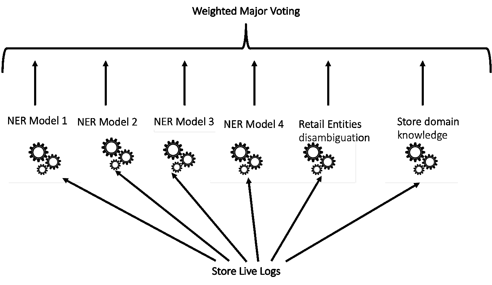

# 支持沃尔玛多个虚拟助理的统一多任务模型

> 原文：<https://medium.com/walmartglobaltech/a-unified-multi-task-model-for-supporting-multiple-virtual-assistants-in-walmart-2b077c2c96e?source=collection_archive---------6----------------------->

**简介:**

面向任务的对话系统旨在帮助用户通过自然语言以口头或书面形式完成日常任务。近年来，虚拟助手的广泛使用也刺激了创新应用的发展，如自动化客户服务和购物。沃尔玛已经开发了几个虚拟助手来支持许多领域的客户，例如通过语音和文本渠道为消费者提供的[杂货店购物](/walmartglobaltech/joint-intent-classification-and-entity-recognition-for-conversational-commerce-35bf69195176)，客户关怀，以及为商店员工提供的 [askSam](https://corporate.walmart.com/newsroom/2020/07/29/helping-associates-succeed-at-work-while-elevating-customer-service-safety) 。虚拟助理需要自然语言理解(NLU)模型来识别用户的意图，并提取在话语中表达的相关槽(实体)、意图分类和槽填充任务。在这篇博客中，我们将讨论如何统一不同领域的虚拟助理模型:语音购物和商店店员。由于这些模型在实体和意图上共享一些共性，因此统一它们导致维护成本的降低，对于意图分类和槽填充的联合任务，统一模型的通用性和性能的改进。

**沃尔玛虚拟助理**

Virtual assistants for the shopping domain and store associates at Walmart’s stores

沃尔玛从 2018 年开始通过[谷歌助手](https://corporate.walmart.com/newsroom/2019/04/02/want-walmart-to-help-you-grocery-shop-with-our-new-voice-capabilities-just-say-the-word)和 [Siri](https://corporate.walmart.com/newsroom/2019/04/02/want-walmart-to-help-you-grocery-shop-with-our-new-voice-capabilities-just-say-the-word) 平台(购物域)支持[语音购物](/walmartglobaltech/joint-intent-classification-and-entity-recognition-for-conversational-commerce-35bf69195176)。例如，沃尔玛的客户可以将*产品*添加到他们的购物车，搜索*产品*和*品牌*的细化，安排提货或送货，或者使用语音购物助手编辑他们的购物车。购物助理应区分意图(例如，*添加到购物车*、*结账*、*搜索细化*等)。用户及其相关实体(例如*产品、品牌、类型、时间参考*等)。)的意图。

Walmart’s shopping assistant for Text-to-shop

沃尔玛还为[商店员工](https://corporate.walmart.com/newsroom/2020/07/29/helping-associates-succeed-at-work-while-elevating-customer-service-safety)开发了人工智能助手(askSam *app* ),这样他们就可以从使用其功能和更好地服务顾客中受益。例如，他们可以要求虚拟商店助理查找商品的位置，检查商品的库存状态，并检索商店中各部门及其同事的时间表。虚拟商店助理( *askSam app* )使用机器学习和深度学习模型的集合来识别话语中表达的意图和位置。

**意图分类和槽填充**

意图分类是预测意图标签的分类问题，而槽填充是用槽标签序列标记输入单词序列的序列标记任务。训练独立的意图分类和槽填充模型导致模型性能恶化，这是由于缺乏共享的表示和单独模型的一般化。最近，提出了几种用于意图分类和槽填充的联合学习方法，以利用两个任务之间的依赖性，并提高独立模型的性能[13]。我们还观察到，与购物领域的独立模型(意图分类和序列标记任务)相比，联合学习模型在零售实体和意图分类任务上取得了更好的性能。

**为每个领域开发一个特定的模型:**

已经为特定领域开发了单独的模型。但是维护单个模型是困难的，因为它们可能需要频繁地单独训练。此外，它们还存在泛化问题，因为它们只关注一个特定的领域和数据。虚拟助理的模型在不同领域可能具有大量的对话模式重叠，例如电子商务购物中的*产品*和*品牌*检测或者商店中*产品*的定位。因此，统一它们可以提高它们的性能。此外，助手的一个常见问题是依赖大量带注释的训练数据。在为多个领域训练统一模型的思想的激励下，聚合每个助手的数据，并通过在不同助手之间共享可以相互加强的知识来解决数据的缺乏。

The unified model

**多任务学习**

多个相关任务一起学习，以提高每个任务的绩效[1]。多任务学习在多个任务之间共享信息。这项技术已经被证明在不同的领域是有效的，比如视觉[2]，医学[3]，自然语言处理[4]。通过在相关任务之间共享表示，模型可以更好地概括目标任务[14]。多任务学习可以通过引入归纳偏差来帮助改进模型，归纳偏差会导致模型更喜欢某些特征表示而不是其他特征表示。归纳偏差是由相关任务提供的，这使得模型更倾向于解释一个以上任务的表征。因此，它导致了一个更好的通用模型[14，15]。

**语音购物和店员助理的统一模型**

我们希望为购物和 askSam 域建立一个统一的模型。统一模型的精度应该与单个模型相当。统一模型应该在意图分类和槽填充任务上具有相似的性能。统一的模型需要在商店中或通过语音购物渠道可能出现的所有场景中保持稳健。然而，为不同的领域建立一个统一的模型可能会带来一些挑战。因此，正确理解这些领域至关重要:

1.  店员在商场日常活动中使用的词汇在语音购物中并不常见(例如，“*推车时间表*”、“*今天谁在熟食店*(商场的一个部门)”、“*迈克明天的时间表*”或“*接店员时间表*)。

2.在 askSam 领域和语音购物渠道的不同上下文中，可能会使用类似的词语。例如，商店员工可能会提到“*今天谁结账*”、“*卡车交付时间表是什么*”或“ *John Deere 排班*”，而我们的客户通过语音购物渠道可能会提到“*结账我的购物车？*、*安排我今天的送货时间*、*明天的提货时间*、*添加* *约翰迪尔乐高*

这些助手在他们的特定领域有他们自己的技能。但它们也有一些零售特定实体的共性(例如，在电子商务购物或商店中检测*产品*和*品牌*)。通过利用模板和句法数据生成来准备现有模型的训练数据。因为这两种模型都缺乏在看不见的短语中正确识别人和时间实体的能力，特别是在店内实时日志中。句法数据生成不足以提高模型的“*人物*和“*时间*”识别能力。由于语言的有限组成性，仅通过使用句法数据生成来生成*人员调度意图*的代表性集合是不切实际的。因此，商店实时日志被过滤以准备一组代表性的*人员调度*日志。存储实时日志提供有用的训练实例，以覆盖来自不同国家和种族的人名。商店实时日志被注释并附加到购物模型的现有训练数据中。

我们决定统一这两个模型的训练数据，并通过使用包括 *person* 和 *time* 实体的商店实时日志来增加其训练。因此，统一模型可以支持这两个领域，并使用这两个领域的训练数据的协同作用来提高统一模型的泛化能力。因为对于商店实时日志没有可用的标记工作。我们需要建立一个管道来自动标记存储实时日志。

**注释商店实时日志的挑战:**

1.  *人名*、常用*品牌、*、*产品*之间存在歧义。这种歧义可以使用话语的上下文来解决。现成的 NER(命名实体识别)模型将“J *ohn Deere* ”检测为话语“J *ohn Deere Legos* ”中的一个人，但是通过在上下文中考虑 *Legos* 。“ *John Deere* ”应被视为商店型号的*品牌*。但是，话语“*John Deere scheduling*”中的“ *John Deere* ”应通过考虑话语上下文中的“ *scheduling* ”来检测为商店模型中的人员实体。
2.  商店员工可能会说多种语言，他们的名字可能是欧洲人、美国人、西班牙人、亚洲人、中东人等。商店模型应该根据话语的上下文将所有这些名字检测为“ *person* ”。
3.  沃尔玛员工在日常活动中会在商店使用一些缩写和常用表达(商店领域知识)，但现成的 NER 模型会将它们视为命名实体。因此，这些模型的输出必须针对沃尔玛的用例进行修正。
4.  现成的 NER 模型利用大写作为其模型识别命名实体的信号，特别是对于“*人*”和“*地点*”提及*。“John 住在芝加哥*”但是由于自动语音识别(ASR)错误，大写信息在语音通道中并不完美。

Weighted major voting on labeling functions

为了解决统一模型的训练数据中*人物*和*时间*识别的不足，我们利用几个最先进的多语言 NER 模型【10，11，12】作为标记功能来检测*人物*和*时间*实体的店内实时日志。商店实时日志上的 NER 模型的输出通过利用商店领域知识被纠正，该知识专门用于错误地将它们分类为命名实体的商店通用表达式。我们还开发了标记功能，通过检查商店日志的上下文和使用商店领域知识来消除零售实体和命名实体的歧义。最后，我们应用基于标注函数的加权主投票来自动标注商店实时日志。我们利用几种基于商店领域知识的试探法来过滤掉与人和时间实体不相关的实时日志。通过应用加权主投票，我们在标注商店实时日志方面取得了优于浮潜[9]的结果。scorp 是一种弱监督方法，它结合了多种监督资源来注释数据。然而，由于它要求数据点是独立的，所以在序列标记任务上，通气管不能很好地工作。

**结果:**

与购物模式相比，统一模式在零售实体中具有**竞争力。该统一模型在*人物*和*时间*识别上比现有的使用带注释的商店实时日志的模型具有更科学的性能。存储的实时日志还导致**更好地概括**联合模型的意图分类。与没有商店实时日志(与购物渠道无关)的原始购物模型相比，统一模型在意图分类上的性能略有提高。在不同的意向支持上，它在意向分类上比购物模型平均高出 5%。这种改进是由于统一模型的概化特征表示使用了来自不同领域的数据，而不仅仅是购物领域。最近的工作表明，利用外部训练数据可以提高意图分类性能。改进的概括是由于在用于意图分类的联合模型中更概括的特征表示。**

**统一模型的好处:**

1.  统一模型不需要频繁地为每个域单独重新训练。

2.常见命名实体(如*产品、品牌、时间参考*等。)将在购物模型和商店模型的训练数据之间共享。

3.模型的维护成本大大降低。数据科学团队可以通过定期更新来维护一个统一的模型，而不是为每个业务需求维护几十个单独的模型。

4.通过对一个模型进行统一培训，而不是对两个单独的模型进行培训，GPU 成本得以降低。

5.神经语言模型是数据饥渴的，通过增加训练数据量来提高它们的性能。数据和领域知识在两个领域中都得到了利用(购物和询问 Sam)。

**总结**

该统一模型通过利用商店实时日志来提高购物模型的意图分类的性能，并且该模型已经在购物和商店数据的实时日志的基准上显示出有希望的结果。该模型通过整合多个领域的训练数据(例如，商店实时日志与语音购物无关)来学习一组更健壮的特征并实现更好的概括。使用商店实时日志，统一模型在*人*和*时间*识别上具有明显更好的性能。模型的维护成本和培训成本大幅降低。

# **致谢**

感谢沃尔玛全球技术对话人工智能团队和 [Komal Dhuri](https://medium.com/u/5feb13f035d) 准备自动标记管道来注释实时日志。

**参考文献:**

[1]丰富的卡鲁阿纳。1993.多任务学习:归纳偏差的知识基础来源。在 ICML，第 41-48 页。

[2]张远、里贾纳·巴兹莱和托米·亚科拉。2017.面向领域适应的方面增强对抗网络。TACL，5:515–528。

[3]斯特芬·比克尔、亚斯米娜·博戈耶斯卡、托马斯·朗高尔和托拜厄斯·舍费尔。2008.HIV 治疗筛选的多任务学习。在 ICML，第 56-63 页。

[4]范兴、埃米利奥·蒙蒂、兰伯特·马蒂亚斯和马库斯·德雷耶。2017.神经语义分析的迁移学习。在 ACL-RepL4NLP 中，第 48–56 页。

[5] Gokhan Tur、Dilek Hakkani-Tur 和 Larry Heck。2010.at is 还有什么需要理解的？在 SLT 车间，第 19-24 页。

[6]希瓦·彭蒂亚拉、·刘和马库斯·德雷耶，2019 年，多任务学习与任务、小组和宇宙特征学习，载于美国 ACL，第 820-830 页

[7][https://corporate . Walmart . com/news room/2020/07/29/helping-associates-success-in-work-while-lifting-customer-service-safety](https://corporate.walmart.com/newsroom/2020/07/29/helping-associates-succeed-at-work-while-elevating-customer-service-safety)

[8][https://venturebeat . com/2021/05/22/whats-next-machine-learning-in-scale-through-unified-modeling/](https://venturebeat.com/2021/05/22/whats-next-machine-learning-at-scale-through-unified-modeling/)

【9】[https://www.snorkel.org/](https://www.snorkel.org/)

[10] Stefan Schweter 和 Alan Akbik，2020，FLERT:命名实体识别的文档级特征

[https://spacy.io/api/entityrecognizer/](https://spacy.io/api/entityrecognizer/)

[12]齐，彭，张，，张，，Bolton，Jason，Manning，Christopher D. 2020 Stanza:用于 ACL 中多种人类语言的 Python 自然语言处理工具包:系统演示，第 101-108 页

[13]陈、钱、朱卓、。"用于联合意图分类和缝隙填充的 Bert . "(2019).

[https://ruder.io/multi-task/index.html#motivation](https://ruder.io/multi-task/index.html#motivation)

[15] Hashimoto，k .，Xiong，c .，Tsuruoka，y .，& Socher，R. (2016)。一个联合多任务模型:为多个 NLP 任务生长一个神经网络。arXiv 预印本 arXiv:1611.01587。

[16]肯德尔，a .，加尔，y .，&西波拉，R. (2017 年)。使用不确定性衡量场景几何和语义损失的多任务学习。

[17]刘，谢，高，何，谢，邓，李，杜国光，王，李玉英(2015).用于语义分类和信息检索的多任务深度神经网络表示学习。Naacl-2015，912–921

[18]于，江，(2016)。基于辅助任务的跨领域情感分类句子嵌入学习。2016 自然语言处理经验方法会议论文集(EMNLP2016)，236–246。

[19] Rei，M. (2017 年)。用于序列标记的半监督多任务学习。在 ACL 2017 中

[20]s .本-戴维和 r .舒勒(2003 年)。利用任务相关性进行多任务学习。学习理论和核心机器，567–580